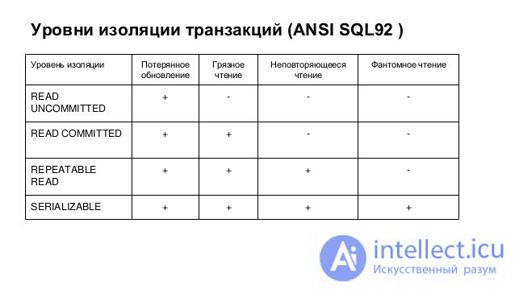

***

   

TCL. Проблемы транзакций. Уровни изоляции
=========================================

В рамках сегодняшней статьи мы закончим знакомство с темой транзакций на уровне СУБД (но еще неоднократно к ней вернемся при работе с БД через Java-приложение), рассмотрев подробнее тему **уровней изоляции** транзакций - степеней независимости нескольких параллельных транзакций друг от друга.

В зависимости от этих уровней транзакция будет определять, с какими данными она может работать - например, может ли использовать записи, добавленные в рамках другой - еще не закоммиченной - транзакции и пр.

В зависимости от уровня транзакции будут актуальны различного рода аномалии данных - **проблемы транзакций**. Чем менее транзакция изолирована, тем больше таких проблем будет актуально.

Кроме того, есть и обратная зависимость - чем менее транзакция изолирована, тем большая производительность будет у параллельных - работающих одновременно - транзакций.

Таким образом, выбирая уровень изоляции транзакции, мы выбираем оптимальный для нас сценарий между быстрым исполнением с возможными ошибками в данных и медленным, но безопасным применением транзакций (вплоть до выполнения их условно-последовательно, вместо одновременного выполнения).

  

### Уровни изоляции и проблемы транзакций

Прежде чем приступить к подробному разбору, поделюсь статьей на эту тему, которая мне нравится. В первую очередь, за качественные примеры (к ним мы будем обращаться далее): [ссылка](https://habr.com/ru/companies/infopulse/articles/261097/)

К сожалению, в статье используется MS SQL, а не PostgreSQL, поэтому отдельные элементы синтаксиса могут быть не знакомы. Но, на мой взгляд, интуитивно понятны. В крайнем случае, станут понятны через несколько уроков, после знакомства с PL/SQL.

Кроме того, показательно может являться следующая таблица:



Плюсами помечены проблемы, которые решаются (не актуальны) указанным уровнем изоляции, минусами - те, которые могут возникнуть при заданном уровне изоляции.

Разберем эту таблицу подробнее.

  

#### Потерянное обновление

Проблема **потерянного обновления** (**lost update**) теоретически может возникнуть, когда несколько транзакций пытаются одновременно обновить одно и то же значение. В итоге каждая из них смотрит на изначальное значение в таблице, игнорируя изменения, которые вносят параллельные транзакции. По итогу коммита последней транзакции оказывается, что применилось только ее изменение, а все остальные были проигнорированы. Или, вернее сказать, “затерты” последней транзакцией.

В статье по ссылке выше приведены две возможные интерпретации этой проблемы.

Наиболее простая - когда нет понятия переменной, которая сохранит в себе изначальное значение, решается первым же уровнем изоляции - **_READ UNCOMMITTED_**. При котором, как следует из названия, запросы в рамках транзакций будут видеть изменения, которые сделаны еще не закоммиченными транзакциями. А значит, могут быть откачены в любой момент.

Вторая интерпретация не является классической (хотя бы потому что недостижима средствами обычного SQL), но с ней вполне можно столкнуться на практике. Поэтому подсвечу, что решается она, начиная с уровня **_REPEATABLE READ_**. О нем - немного ниже.

  

#### Грязное чтение

**Грязное чтение** (**dirty read**) заключается в чтении (получении в результате запроса) данных, измененных незакоммиченной транзакцией, которая впоследсвтии откатится.

Таким образом, изменения, производимые нашей транзакцией будут сделаны над данными, которые могут быть не согласованы (принцип согласованности применяется к целой транзакции, а не к случайно взятому набору данных в процессе ее применения), а кроме того - сами эти изменения могут быть откачены.

Решение очевидно - не использовать незакоммиченные изменения => использовать только закоммиченные. Отсюда следует и уровень изоляции - **_READ COMMITTED_**.

> Здесь, как часто бывает с БД, все достаточно просто и логично на декларативном уровне. При этом СУБД инкапсулирует в себе все внутренние процессы блокировок строк и целых таблиц, которые и обеспечивают необходимый уровень изоляции. И они же понижают производительность запросов при повышении уровня изоляции. Некоторым из вас, вероятно, в будущем придется нырнуть в эту тему глубже, решая deadlock’и на уровне БД, исследуя проблемы долгого выполнения транзакционных запросов и пр. Но это, безусловно, не является уровне компетенций джуниора. Кроме того, здесь начинает играть роль специфика различных СУБД. Поэтому в рамках текущего курса погружаться во внутренние механики СУБД не будем, оставаясь на декларативном уровне взаимодействия.

Важно понимать, что у любой СУБД есть уровень изоляции транзакций по умолчанию. Для PostgreSQL (и многих других) уровнем изоляции по умолчанию является именно _READ COMMITTED_.

Кроме того, PostgreSQL хоть и допускает уровень изоляции _READ UNCOMMITTED_ синтаксически, де-факто такой уровень изоляции в pg отсутствует и поведение будет идентично _READ COMMITTED_.

  

#### Неповторяющееся чтение

Проблема **неповторяющегося чтения** (**non-repeatable read**) касается разных по по числу строк выборок при нескольких чтениях в рамках одной транзакции в силу того, что другая транзакция изменила заданные строки между двумя операциями чтения в рассматриваемой транзакции. Решение состоит в том, чтобы блокировать для других транзакций строки, которые уже были считаны какой-то транзакцией. Такую блокировку обеспечивает изоляция уровня _REPEATABLE READ_. При нем другие транзакции будут вынуждены ожидать фиксации (коммита или ролбэка) заданной транзакции, прежде чем смогут применить операцию обновления для строк, которые _REPEATABLE READ_\-транзакция прочла.

Такой уровень изоляции уже ощутимо сказывается на производительности, поэтому использовать его без необходимости может быть слишком расточительно.

  

#### Фантомное чтение

**Фантомное чтение** (оно же - **чтение фантомов** или **phantom reads**) описывает ситуацию, при которой в рамках транзакции несколько выборок по одним и тем же критериям возвращают разное число строк. Происходит это потому что другие транзакции удаляют/добавляют записи, подходящие под критерии выборки в первой транзакции, или же изменяют значения в столбцах, по которым происходит фильтрация.

Решение данной проблемы подразумевает, что блокировать нужно не конкретные записи (это не спасет от добавления новых подходящих строк), а целые диапазоны, которые попадают в выборку рассматриваемой транзакции. Такого рода блокировка предоставляется в рамках уровня изоляции **_SERIALIZABLE_**, который является наивысшим уровнем изоляции БД.

Важно понимать, что когда речь идет о проблемах транзакций, дело не просто в отличающихся результатах выборок по SELECT’ам. Данные аномалии могут приводить к тому, что в рамках различных UPDATE-запросов (или иных запросов на изменение данных) могут появляться записи, которые не должны были измениться или же те, которые должны были изменяться каждым UPDATE-запросом, но в силу возникших проблем были изменены лишь частью из них. Такие ситуации могут привести данные к несогласованному (в широком смысле) состоянию, что является серьезной угрозой для всей системы.

Завершая тему фантомного чтения, документация PostgreSQL утверждает, что в рамках этой СУБД оно невозможно уже на уровне _REPEATABLE READ_.

  

### Аномалия сериализации

Кроме описанных стандартных проблем транзакций, иногда выделяют еще одну (чаще вместо потерянного обновления) - **аномалия сериализации** (**serialization anomaly**). Описание у нее достаточно абстрактное (и, строго говоря, может подойти под любую из вышеописанных в той или иной степени): несоответствие результата применения нескольких параллельных транзакций ни одному из возможных результатов при последовательном (в любом возможном порядке) применении этих же транзакций.

Документация PostgreSQL регламентирует, что эта проблема решается лишь уровнем изоляции _SERIALIZABLE_. Но в случае с другими СУБД стоит рассматривать как саму проблему, так и решающий ее уровень изоляции в рамках конкретной СУБД. Как минимум потому что разные СУБД могут подразумевать фактически разные аномалии под этим термином.

  

### Синтаксис

Разобравшись с проблемами транзакций, стоит рассмотреть, как именно установить уровень изоляции при работе с SQL (на примере Postgres). По сути, ничего сложного в этом нет. Например:

```java
begin transaction isolation level repeatable read;
-- тело транзакции
commit;
```

_То есть вместо BEGIN_ указывается выражение

_BEGIN TRANSACTION ISOLATION LEVEL %уровень изоляции%_

Также указать уровень изоляции можно отдельным запросом внутри транзакции:

```java
begin;
set transaction isolation level repeatable read;
-- тело транзакции
commit;
```

Также в рамках этого выражения можно указать режим записи для транзакции (**_READ ONLY_** или **_READ WRITE_**), что позволяет СУБД делать дополнительные оптимизации. Но эту тему предлагаю разобрать самостоятельно, если есть желание - она определенно не является обязательной на данном этапе.

  

На сегодня все!


Если что-то непонятно или не получается – welcome в комменты к посту или в лс:)

Канал: [https://t.me/ViamSupervadetVadens](https://t.me/ViamSupervadetVadens)

Мой тг: [https://t.me/ironicMotherfucker](https://t.me/ironicMotherfucker)

_Дорогу осилит идущий!_