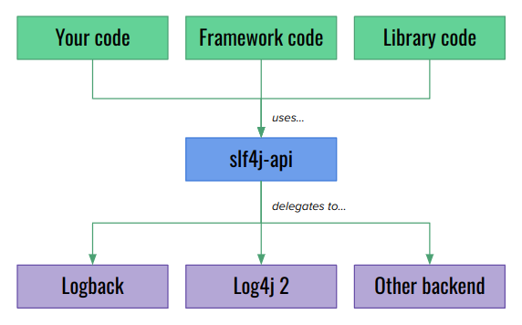
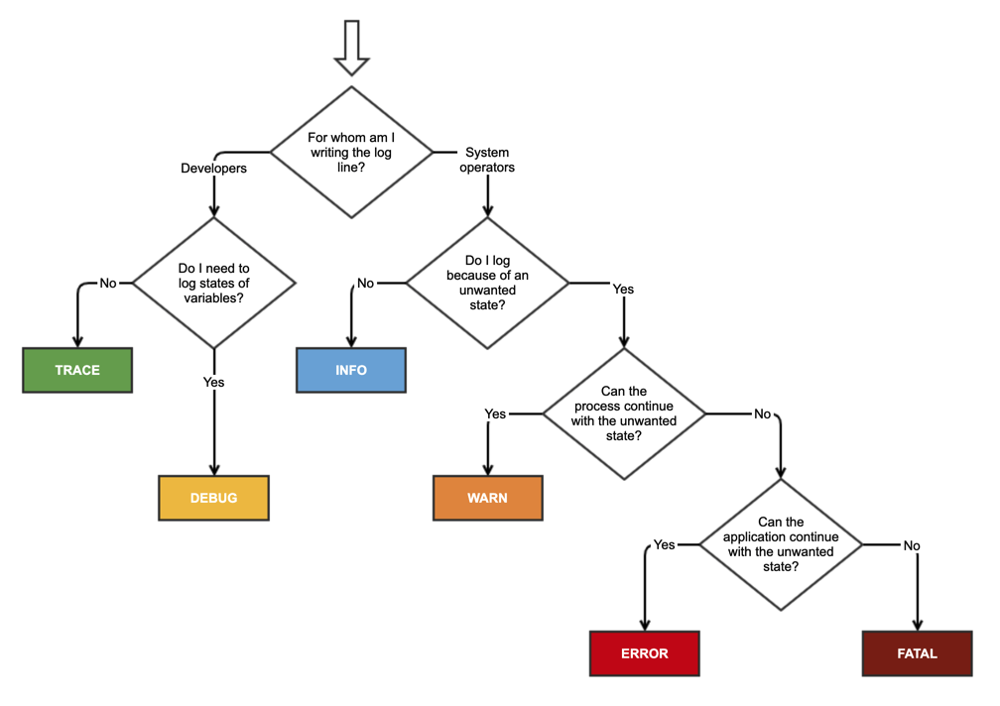
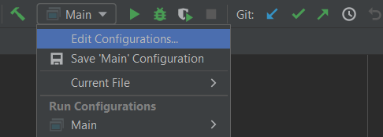
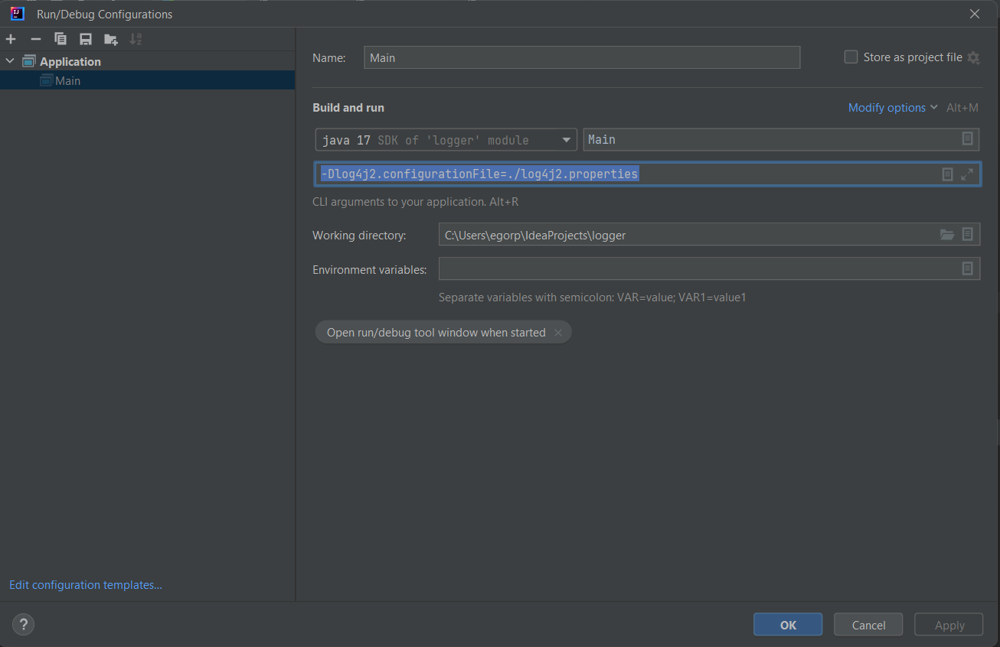

***

   

Logger. Подключение Logger'а
============================

В рамках сегодняшней статьи познакомимся с понятием **логгеров**, а также попробуем подключить внешнюю библиотеку-логгер в своем проекте.

  

### Логгеры

Логгер - инструмент, который записывает события, происходящие в рамках жизнедеятельности программы.

События могут быть как информационные (начало или завершение обработки определенного процесса, иные штатные сообщения), так и содержать информацию о возникающих ошибках (исключение или срабатывание сценария обработки ошибки).

Также может быть различным место записи логов: консоль, файл, таблица в БД или даже отправка по почте.

Библиотека-логгер, в данном случае, снимает с разработчика необходимость написания функциональности подобного журналирования, предоставляя гибкий и отлаженный инструмент (если мы говорим о популярных библиотеках) с широкой и настраиваемой функциональностью.

На самом деле, в Java есть встроенный логгер, доступный без внешних библиотек. Его классы расположены в пакете _java.util.logging_. Но по ряду исторических причин он не популярен и вместо него используются иные решения.

  

### Спецификация

Поскольку библиотек-логгеров несколько, в свое время была разработана стандартная спецификация (или, вернее сказать, верхнеуровневый интерфейс) для логгеров в Java - **SLF4J** (_Simple Logging Facade for Java_).

Все популярные на данный момент реализации логгеров соблюдают этот стандарт, что позволяет не изучать публичное API каждого логгера по отдельности и достаточно легко сменить логгер на иной при необходимости.

Кроме того, наличие общего интерфейса позволяет не переживать о том, что в различных подключенных в проект библиотеках могут использоваться разные реализации логгеров.

Ниже представлена схема, демонстрирующая это (и заодно обозначающая два наиболее популярных на данный момент логгера):



К слову, логгер из _java.util.logging_ тоже соответствует интерфейсу SLF4J.

  

### Уровни логирования

Поскольку логгеры соответствуют общему стандарту, мы можем рассмотреть уровни логирования в них, не углубляясь в специфику конкретной реализации.

**Уровень логирования** - степень важности (или критичности) конкретного сообщения в рамках системы. Наличие таких уровней позволяет определить, какие сообщения требуется записывать, а какие - игнорировать в рамках конкретного запуска системы, конкретного окружения или по иным признакам.

Вполне очевидно, что ряд сообщений в логе могут быть направлены на отладку системы и полезны для разработчика на уровне тестового запуска системы (локально или на отдельном тестовом окружении) и нет смысла тратить ресурсы на их запись при запуске системы для реального использования.

При этом различные сообщения об ошибках есть смысл логировать на любом окружении - иначе не сохранится информации о возникновении этих ошибок.

Итак, стандартные уровни логирования в рамках SLF4J и шпаргалка по определению уровня конкретного сообщения:



На практике, безусловно, далеко не все используют все 6 уровней логирования, зачастую оставляя только _INFO_, _WARN_ и _ERROR_ или даже _INFO_ и _ERROR_.

Пользуясь логгером, не забывайте, что логирование тоже требует ресурсов, особенно, если логгер работает синхронно (ведь почти любой ресурс потребует синхронизации для записи в него). Конечно, есть и асинхронные реализации, они не будут блокировать конкретный поток и конкретный бизнес-процесс, но все равно потребуют процессорного времени для своей работы.

  

### Подключение логгера в проект

> Код примера вместе с комментариями и уже выкачанными JAR-файлами логгера можно найти здесь: [https://github.com/KFalcon2022/logger-sample](https://github.com/KFalcon2022/logger-sample)

Здесь же мы разберем процесс добавления библиотеки в проект. Со спецификой логгера, но большая часть описанных шагов применима к большинству иных библиотек.

  

#### Поиск и добавление JAR

Первое, что нам необходимо сделать - найти JAR-файлы интересующей нас библиотеки. Мы будем подключать логгер **log4j2**.

На сайте разработчика можно скачать архив с последними актуальными версиями JAR’ников: [https://logging.apache.org/log4j/2.x/download.html](https://logging.apache.org/log4j/2.x/download.html)

По той же ссылке ([продублирую с якорем](https://logging.apache.org/log4j/2.x/download.html#using-log4j-on-your-classpath)) можно увидеть пометку, что для **_CLASSPATH_**\* необходимо использовать два JAR-файла: _log4j-api-{version}.jar_ и _log4j-core-{version}.jar_.

> \* **CLASSPATH** \- переменная окружения (возможно, вы помните другую подобную переменную - **JAVA\_HOME**), которая хранит список путей к JAR-файлам. Именно в файлах по этим путям JVM будет искать интересующие ее классы, если не найдет их в стандартной библиотеке. Перебор JAR’ников будет происходить в порядке, заданном в списке.

Итак, для удобства директорию, где будут лежать все библиотеки. Я ее создал в рамках проекта, но логичнее это делать вне его - ведь одни и те же библиотеки могут быть нужны разнм проектам. Логично хранить все это богатство в одном месте. Так в моем примере появляется директория _lib_.

  

#### Настройка CLASSPATH и индексации в IDEA

Далее необязательный пункт, но он сделает вашу работу комфортнее:

_IDEA_\->_Ваш проект_\->**_File_**\->**_Project Structure_**\->**_Modules_**\->**_Dependensies_**

Здесь можно добавить (на “**+**”) пути к библиотекам.

Во-первых, это автоматически добавит их в _CLASSPATH_ при запуске проекта (альтернатива**(!)** - прописывать _CLASSPATH_ при запуске приложения через консоль или в настройках запуска в IDEA). Во-вторых, позволит IDEA проиндексировать добавленные библиотеки и использовать их при автодополнении кода (и просто перестать ругаться на “незнакомые” классы в коде).

  

#### Конфигурация логгера

Теперь библиотека добавлена в проект. Но нужно сконфигурировать сам логгер - сказать, что, как и куда ему писать.

log4j2 предоставляет несколько вариантов для конфигурации: XML, JSON, YAML или properties файлы или же программно в Java (в нескольких вариациях).

Как правило, используются варианты с файлами конфигурации - с ними легче работать, особенно, когда приложение может быть развернуто в нескольких окружениях с разными параметрами.

Я выбрал properties-файл - на мой взгляд, этот формат легче всего читать новичкам. Но в дальнейшем рекомендую использовать XML или YAML конфигурацию. Оба эти формата вам придется изучить хотя бы на базовом уровне. К счастью, это происходит легко и непринужденно в процессе работы.

С конфигурацией могут возникнуть проблемы. С одной стороны, есть исчерпывающая документация: [https://logging.apache.org/log4j/2.x/manual/configuration.html](https://logging.apache.org/log4j/2.x/manual/configuration.html)

С другой стороны, изучать ее для базового примера - жестковато. Поэтому приложу легко гуглящийся пример конфигурации с выводом в консоль: [пример](https://howtodoinjava.com/log4j2/log4j2-properties-example/#3-configuring-log4j2-properties-for-console-logging). В рамках версии для GitHub я ее еще немного упростил. В реальном проекте это может быть не лучшей идеей, но для примера сойдет.

> К слову, там же можно найти и конфигурацию для записи в файлы. При этом будет использоваться не один жестко прописанный файл (что может сделать логирование бессмысленным, если файл станет слишком большим - его будет крайне проблематично читать), а с настройкой переноса записи в новый файл при достижении определенного размера у предыдущего и правилами именования этих файлов.  
> Ссылка: [тык](https://howtodoinjava.com/log4j2/log4j2-properties-example/#4-configuring-log4j2-properties-for-rolling-files)

Как правило, используется несколько ресурсов логирования одновременно: консоль, _RollingFile_ (то, что описано выше) и, опционально, какие-то дополнительные варианты записи.

Файл конфигурации обычно размещается в ресурсах проекта.

  

#### Создание объекта логгера в классе

Итак. Библиотеки подключены, конфигурация есть. Осталось написать код, использующий логгер.

Если вы посмотрите в пример, увидите такую запись:

```java
private final static Logger log = LogManager.getLogger(Main.class);
```

Это создание объекта логгера для конкретного класса, название клсса - _Main_ выступит именем этого логгера. В целом, можно сделать и один объект на приложение или не привязывать к классу, параметром можно передать и строковый литерал - т.е. можно и в рамках одного класса использовать несколько объектов логгера.

Но плюс такого подхода выше в том, что имя логгера можно прописать в сообщении лога (в паттере из примера - _%logger{36}_). Таким образом указывая прямо в логе из какого класса было отправлено сообщение.

Также вы можете увидеть методы логгера - нас сейчас интересуют только методы с названиями, идентичными уровням логирования. Именно они позволяют прописать лог с определенным уровнем. И именно от выбора метода (и минимального уровня логирования в конфиге) будет зависеть запишется ваше сообщение (в нашем случае - в консоль) или будет проигнорировано.

Собственно, кажется, что все есть. Код написан, конфиг подложен, библиотеки подключены. Но если вы запустите приложение на данном этапе - скорее всего, увидите только сообщения с уровнем логирования _ERROR_ и _FATAL_. И с форматом сообщения, отличным от описанного в паттерне.

  

#### Настройка окружения

Дело в том, что log4j2 не знает о нашем конфиге. И поэтому использует конфигурацию по умолчанию.

Указать ему, какой файл использовать в качестве конфигурации, мы можем с помощью системной переменной “_log4j2.configurationFile_”.

Можно это сделать программно через _System.setProperty()_, что неудобно - это не гибко, ведь жестко фиксируется на уровне кода. Да и записывать объект логгера в константу не получится - ведь нам необходимо, чтобы конфиг применился до того, как будет создан объект логгера.

Хорошая новость в том, что можно указать системную переменную на этапе запуска приложения. В IDEA можно открыть конфигурацию запуска и внести нужные изменения через GUI.

Альтернатива - запускать через консоль и прописывать параметры в ней же (не забываем там же прописывать _CLASSPATH_).

Демонстрация для IDEA:



  



Флаг **_\-D_** у команды java означает установку с системного параметра в формате _<name>=<value>_.

После применения этих параметров запуск должен пройти в штатном режиме.

Поздравляю, вы подключили логгер в проект!

  

### Заключение

Вероятно, у вас должен был сформироваться один простой вопрос: а откуда взять всю эту информацию, особенно касающуюся специфики конкретной библиотеки - название системных переменных, классов для использования и пр.

Ответов может быть несколько:

*   **Документация**. Обычно наиболее исчерпывающий, если вам нужно подключить, сконфигурировать и начать использовать новую библиотеку или фреймворк. Если повезет - будет дружелюбная дока с примерами приложений, удобный гайдом и прочим. Если повезет меньше - будет подробная, но неудобная для быстрого сайта документация. Если совсем не повезло - будет readme на GitHub’е библиотеки или исследование ее исходного кода. Это об официальных источниках информации;
*   **Различные туториалы и статьи**. Видео от индусов на ютуб, [Baeldung](https://www.baeldung.com/) и прочие авторские статьи - ваши лучшие друзья. Скорее всего, будет утрировано, в сравнении с документацией, но намного быстрее. А уже после запуска по туториалу можно искать в документации нужные инструменты для кастомизации под ваши нужды;
*   [**Stackoverflow**](https://stackoverflow.com/), Jira разработчков библиотеки, Issues проекта на GitHub и другие форумы и открытые площадки. Чаще всего подходит для решения конкретных проблем и ошибок с библиотекой.

Как правило, эти три пункта закрывают проблему подключения и настройки любой популярной библиотеки.

На случай же непопулярной или неподдерживаемой, но очень-очень нужной - не убирайте далеко икону для молитв и лопату для раскапывания исходного кода. И то, и другое вам еще пригодится. Благо, это достаточно редкий сценарий.

  

С теорией на сегодня все!


Переходим к практике:

### Задача

Выполните подключение Log4j2 в рамках собственного проекта.

  

Если что-то непонятно или не получается – welcome в комменты к посту или в лс:)

Канал: [https://t.me/ViamSupervadetVadens](https://t.me/ViamSupervadetVadens)

Мой тг: [https://t.me/ironicMotherfucker](https://t.me/ironicMotherfucker)

_Дорогу осилит идущий!_