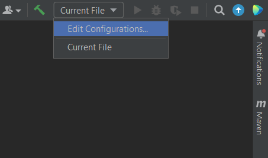
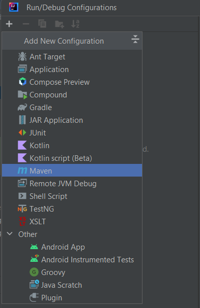
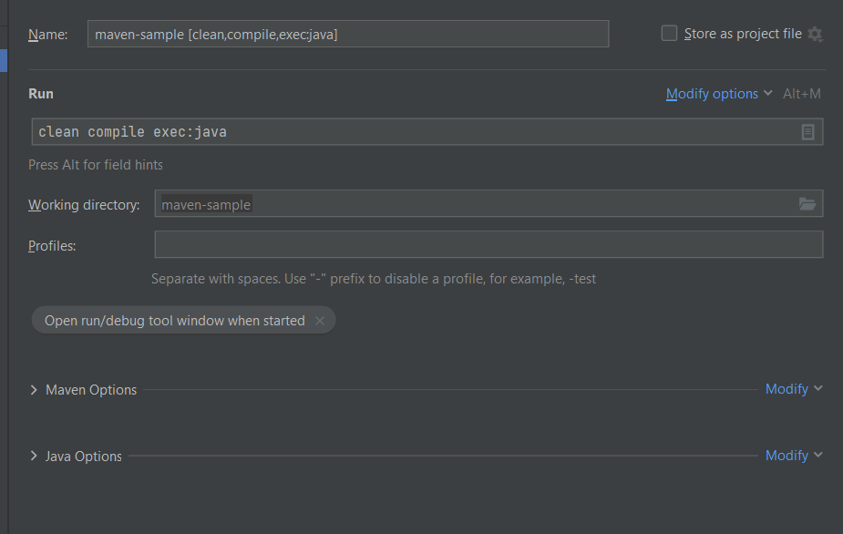

***

   

Maven. Структура проекта. POM
=============================

Сегодня мы начнем работу с первой из рассматриваемых систем сборок - Maven. Знакомиться с ней будем на примере простого проекта, оперируя, в основном, функциональностью, предоставляемой IDEA.

Стоит понимать, что Maven сам по себе предоставляет консольный интерфейс и красивый GUI в среде разработки - лишь репрезентация консольных функций. И иногда графического интерфейса не хватает или он может быть неудобен в отдельных случаях. Но в наших задачах мы вряд ли это встретим.

Пример простейшего проекта с подключенным логгером можно посмотреть по [ссылке](https://github.com/KFalcon2022/maven-sample). В статье будут периодические отсылки на него.

  

### Структура проекта

Создадим простой maven-проект. В самом базовом варианте для этого в IDEA достаточно выбрать Maven в качестве системы сборки при создании нового проекта. В результате будет создан проект со следующей структурой:


Стандартная структура Maven-проекта

Разберемся, что есть что.

**Project home** - корневая директория проекта. В нашем случае это _maven-sample_.

В этой директории можно найти несколько других папок и файл - **_pom.xml_**. С файлом разберемся в следующем разделе, а пока сосредоточимся на папках.

**_src_** \- папка, в которой лежат исходники проекта - сам исходный код, файлы конфигураций библиотек и прочее, что нужно проекту для запуска и работы приложения или тестов. В целом, ничего принципиально нового здесь нет.

Внутри можно заметить еще две папки с одинаковым содержимым:

*   **_main_**. Все то, что нужно самому проекту для компиляции и запуска. Если взять за пример проект [practical-tasks](https://github.com/KFalcon2022/practical-tasks) и перевести на Maven, все его содержимое окажется именно в папке _main_: пакеты и классы - в папке **_java_**, а файлы (для практики о I/O и SQL-скрипты) - в папке **_resources_**.

> Если же за пример возьмем [logger-sample](https://github.com/KFalcon2022/logger-sample) - в **resources** попал бы файл **log4j2.properties**. Возможно, это было не очевидно из прошлого примера.

*   **_test_**. Здесь логика схожа. Папка _java_ будет содержать классы с тестами - юнит-тестами, интеграционными - не важно. А в _resources_ будут лежать конфигурации и файлы, необходимые для тестов.  
    В целом, с юнит-тестированием мы будем знакомиться чуть позже. Там же разберем наполнение директории _test_ более подробно.

**_target_**. При создании проекта эта директория отсутствует (и обычно не добавляется в git-репозиторий). Она появится после выполнения какой-либо задачи. Ее содержимое может отличаться - в зависимости от того, какую задачу выполняли. Если не вдаваться в детали - именно в этой директории можно найти скомпилированные классы и/или jar-файл, сформированный на базе проекта**\***.

> \* Пока мы не знакомы с основной терминологией, буду стараться использовать обтекаемые формулировки. Постепенно разберем, как все обстоит на самом деле.

Полагаю, на этом этапе все достаточно просто. Поэтому переходим к сердцу и мозгу maven-проекта - _pom.xml_ (он же помник). Но сначала небольшое отступление.

  

### Формат XML

Прежде чем углубимся в логическое наполнение помника, разберемся с используемым расширением - с ним вы будете сталкиваться регулярно в различных контекстах.

**XML** (_eXtensible Markup Language_) является языком разметки на основе тегов. Если вы знакомы с HTML - основные принципы те же. Но в отличии от HTML, набор тегов не фиксирован языком.

**Тег** \- основная структурная единица данного языка вида

```java
<sthTag>
  some information
</sthTag>
```

Представляющая собой:

1.  Имя тега, заключенное в угловые скобки - открывающий тег;
2.  Какую-то информацию (текст или другие теги) - содержимое тега. Так же может быть пустым;
3.  Слэш + имя тега в угловых скобках.

> **!NB**: Также есть упрощенный формат записи тегов, подходящий, если тег не имеет внутреннего содержимого и является своего рода меткой:  
> **<sthMarker/>**  
> Для наших целей пока не актуально, но не удивляйтесь, если встретите.  

Подобный формат записи позволяет построить древовидную структуру файла, где содержимых одних тегов могут выступать другие теги. Это позволяет описывать достаточно сложные сущности с большим уровнем вложенности. Можно провести аналогию с объектами, где один объект содержит другие объекты, которые могут содержать третьи объекты или примитивные типы.

Такой подход достаточно удобен для описания различных конфигураций, что и стало причиной его использования в Maven.

Кроме этого, теги могут содержать **атрибуты** \- поля с данными внутри угловых скобок открывающего тега - как правило, они содержат дополнительную информацию, относящуюся к конкретно этому использованию тега. Атрибутов у одного тега может быть несколько, но их состав определяется конкретным тегом**\***.

Пример использования тега с атрибутами:

```java
<sthTag attribute1="some data" attribute2="22">
  some information
</sthTag>
```

> \* Строго говоря, это не так. В рамках XML мы можем использовать любые теги и давать им любые атрибуты. И то, и другое ограничено лишь нашей фантазией и синтаксическими ограничениями XML. Но практика использования подразумевает, что наш файл будет использоваться для получения определенных данных, как Maven использует **pom.xml** для получения конфигурации приложения. Соответственно, набор тегов ограничен конкретным потребителем файла и ожидает строго определенные теги и атрибуты.  
> Конечно, в файл можно дописать что угодно, но это не имеет смысла. Более того, скорее всего, такой файл парсер признает невалидным, потому что будет опираться на используемые пространства имен, содержащие допустимые теги. Этот момент подсвечен в комментариях внутри **pom.xml** нашего примера.  

Так же отмечу несколько базовых моментов при работе с XML:

*   Тег обязательно должен быть закрыт. Незакрытый тег означает невалидный файл.
*   Тег, открытый вторым, не может быть закрыт после тега, открытого первым:

Валидная запись:

```java
<tag1>
  <tag2>
    <tag3>value 1</tag3>
    <tag3>value 2</tag3>
    <tag4>value 3</tag4>
  </tag2>
</tag1>
```

Невалидная запись:

```java
<tag1>
  <tag2>
    <tag3>value 1</tag3>
    <tag3>value 2</tag3>
    <tag4>value 3</tag4>
  </tag1>
</tag2>
```

Пример выше наглядно демонстрирует, что табуляция облегчает отслеживание незакрытых тегов. Невалидный вариант смотрится неестественно.

Заодно предлагаю обратить внимание на еще один факт: теги, содержащие текстовую информацию, допустимо записывать в одну строку. Для тегов, содержащих другие теги, такой подход будет некорректным

Конечно, это далеко не исчерпывающая информация для комфортной работы с XML, но для первого знакомства ее будет достаточно. Теперь можем перейти к содержимому pom.xml

  

### pom.xml

**POM** \- аббревиатура от Project Object Model.

_pom.xml_, как можно догадаться, является ключевым файлом конфигурации для Maven. Именно в нем описываются параметры проекта, его зависимости, указываются используемые плагины, настройки сборки и многое другое.

На самом деле, pom-файлов в проекте может быть несколько. Как правило, существует корневой pom-файл (мы его видели на схеме выше), а также pom-файлы у каждого модуля. Мы рассмотрим этот аспект немного подробнее в процессе знакомства с модульной структурой. Схема выше демонстрирует одномодульный проект, поэтому и pom-файл в ней лишь один.

Полные перечень тегов для _pom.xml_ можно найти в документации: [https://maven.apache.org/pom.html](https://maven.apache.org/pom.html)

Там, безусловно, очень много информации, но рекомендую хотя бы пройти по верхнеуровневым заголовкам, чтобы понимать, какого рода информацию может содержать этот файл. В дальнейшем можно будет изучать информацию по конкретным тегам по мере необходимости.

На данном этапе мы не можем полноценно понять, что лежит в файле примера - пока у нас слишком мало знаний об инструментах системы сборки. Но можем рассмотреть хотя бы верхнеуровневые блоки, чтобы понять, какого рода информация в них хранится. Предлагаю изучить комментарии в файле: [ссылка](https://github.com/KFalcon2022/maven-sample/blob/master/pom.xml)

По итогу все достаточно просто (если не обращать внимания на монструозный уровень вложенности отдельных конструкций). Подчеркнем основные моменты:

1.  Указываем метаинформацию о файле. По сути, это относится к XML, предоставляя информацию для парсера, а не напрямую к _pom.xml_. Похожую строчку вы увидите почти в любом xml-файле;
2.  Указываем информацию для процессора помника. По сути - допустимые теги, а также правила валидации и обработки содержимого, но уже именно для Maven;
3.  Описываем базовую информацию о нашем проекте - название, версия, требуемая версия JDK;
4.  Указываем интересующие нас зависимости. В нашем случае - логгер;
5.  Добавляем плагин, позволяющий запустить приложение и даем указания для него - задаем точку входа (класс _Main_).

Более детально будем разбираться в дальнейших уроках. Нам предстоит плотно познакомиться с терминологией и инструментами Maven, чтобы понять, что именно мы написали в нашем помнике.

  

### Запуск приложения

Чтобы убедиться, что пример рабочий, нужно его запустить. Для этого нам нужно скомпилировать проект и запустить его.

По сути, для мавена это выглядит как команда:

```java
mvn clean compile exec:java
```

Используя ее мы:

1.  Очищаем результаты предыдущей сборки, если таковая была;
2.  Компилируем исходники проекта;
3.  Запускаем проект.

Само собой, в следующих уроках мы разберемся, что есть что в данной команде.

Поскольку мы ориентированы на работу через GUI IDEA, рассмотрим, как это можно сделать в данном случае.

До этого мы запускали проекты, по сути, командой _java_, которая скрывалась под знакомым нам зеленым треугольником.

Теперь пришло время самим сказать, что этому зеленому треугольнику нужно делать:



Открываем Run/Debug Configurations

  



Добавляем новую конфигурацию для Maven

  



Указываем интересующую нас команду

Так как конфигурацию мы задаем для Maven - нет необходимости указывать _mvn_ (это и есть запуск инструмента Maven в консоли).

После этого применяем изменения и наслаждаемся правильной работой зеленого треугольника!

  

С теорией на сегодня все!


В качестве практики предлагаю попытаться сконфигурировать и запустить мавен-проект, который был разобран в рамках статьи.

  

Если что-то непонятно или не получается – welcome в комменты к посту или в лс:)

Канал: [https://t.me/ViamSupervadetVadens](https://t.me/ViamSupervadetVadens)

Мой тг: [https://t.me/ironicMotherfucker](https://t.me/ironicMotherfucker)

_Дорогу осилит идущий!_