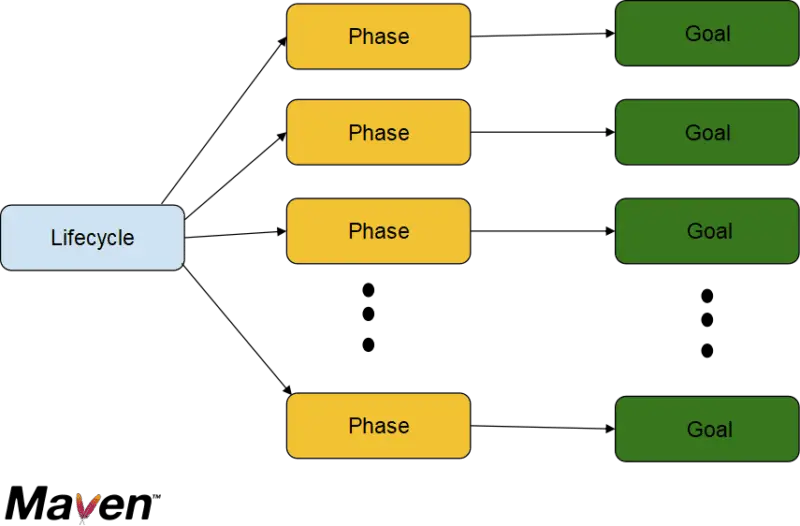
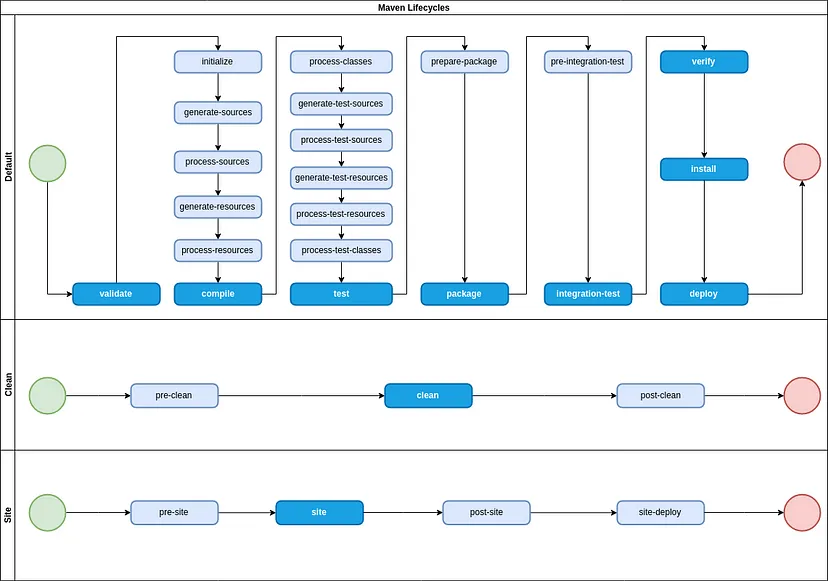
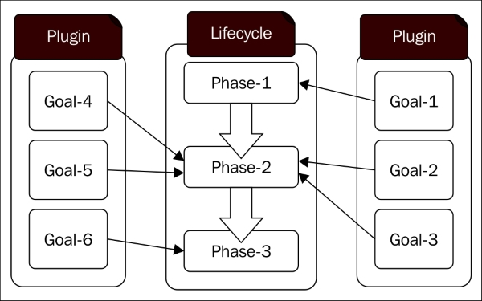

***

   

Maven. Жизненный цикл. Плагины
==============================

В рамках данной статьи мы познакомимся с основными инструментами Maven, которые и позволяют как произвести сборку проекта, так и кастомизировать ее под наши нужды.

Параллельно мы познакомимся с терминологией, которую использует Maven в разрезе процесса сборки.

Для наглядности будем опираться на схему ниже:



  

Также рекомендую ознакомиться с вебинаром на эту тему - он даст базовое представление о понятиях, которые разбираются ниже: [ссылка](https://t.me/ViamSupervadetVadens/174)

  

### Жизненные циклы сборки

**Lifecycle** (он же **жизненный цикл** \[сборки\]) - ключевое понятие в Maven. Оно обобщает процесс сборки как таковой и подразумевает под собой последовательное выполнение **фаз** сборки.

Maven предоставляет три жизненных цикла: **_clean_**, **_default_** и **_site_**. Скорее всего, ваше основное взаимодействие с Maven будет сосредоточено на первых двух.

_clean_ \- жизненный цикл, имеющий вспомогательное значение. Он необходим для очистки проекта от результатов предыдущей сборки: скомпилированных классов, собранного из них JAR (или иного архива) и/или иных других файлов, которые появились в результате предыдущей сборки. Как правило, _clean_ используют перед каждым запуском стандартного жизненного цикла\*.

Если вернетесь к прошлому уроку - увидите, что мы тоже использовали _clean_ в команде на запуск проекта.

> \* На самом деле, обращение происходит не к жизненному циклу **clean**, а к одноименной фазе, которая входит в этот цикл. Подробнее о фазах - в следующем пункте.  
> Сами жизненные циклы не фигурируют в команде для запуска Maven ([**mvn**](https://maven.apache.org/run.html)) вообще. Они лишь предоставляют удобную абстракцию, инкапсулирующую в себя фазы и их порядок.

_default_ - жизненный цикл, который и понимают под сборкой проекта, если не сказано иное. Именно в его задачи входит компиляция исходного кода, запуск тестов, упаковка в архив и прочее. Составные части этого жизненного цикла мы разберем ниже.

Прежде чем перейдем к следующему пункту, рассмотрим схему. Она детально описывает составные элементы каждого из трех стандартных жизненных циклов:



  

### Фазы сборки

**Phase** (**фаза** \[сборки\], **этап**) - составная часть жизненного цикла, инкапсулирующая в себе определенный этап сборки проекта. На схеме выше фазы обозначены прямоугольниками.

Фазу можно рассматривать как контрольную точку внутри lifecycle. Т.е. мы можем выполнить жизненный цикл не полностью, а до определенной фазы. Так, в предыдущем уроке мы выполняли стандартный цикл до фазы _compile_ (включительно). На схеме выше вы можете увидеть, что эта фаза находится достаточно близко к началу цикла.

Важно понимать, что выполнение конкретной фазы подразумевает, что все фазы до нее уже выполнены. Поэтому команда _mvn compile_ де-факто приведет к запуску всех фаз стандартного цикла от _validate_ до _compile_ включительно.

Также на схеме выше вы можете заметить, что обозначенные фазы имеют различный окрас. Так, стандартный цикл сборки Maven состоит из 23 (на схеме две пропущены) фаз. Каждая из фаз выполняет свои задачи (углубимся в это в следующем пункте). Но при решении типовых задач обычно нет смысла в запуске сборки до фазы _pre-integration-test_, например. Более того, некоторые фазы может быть опасно выполнять, не выполняя следующих за ними - например, потому что эти фазы запускают другие программы, которые останавливаются в следующей фазе. Вызов такой фазы без следующей может привести к зависанию программ или потреблению ресурсов системы на их обеспечение, когда они уже не будут необходимы.

Поэтому синим цветом отдельно выделены ключевые фазы, с которыми обычно и взаимодействует разработчик при использовании Maven. Именно их мы и разберем чуть подробнее:

*   **_validate_**. Призван проводить анализ проекта на корректность и наличие всей необходимой информации. Не имеет поведения по умолчанию, т.е. де-факто ничего не делает, если в _pom.xml_ не указано иного;
*   **_compile_**. Компилирует проект. Учитывая, что эта фаза подразумевает выполнение еще 5 других, не считая валидации, сюда можно отнести генерацию всевозможных ресурсов, в т.ч. кода, их копирование (в директорию _target_) и, непосредственно, компиляцию (это делает именно сама фаза _compile_). Скомпилированные классы (файлы типа _.class_) сохраняются в директории (_target/classes_);
*   **_test_**. Фазы между _compile_ и _test_ делают примерно то же, что и фазы между _validate_ и _compile_, но для исходного кода тестов и их ресурсов (тестовые конфигурации, данные и пр.)\*. Сама же фаза _test_ запускает тесты, если они есть. Подробнее о тестах поговорим в следующем разделе курса;

> \* Если фаза compile в рамках стандартной структуры maven-проекта сосредоточена на директории **main**, то фаза **test** \- на директории **test**.

*   **_package_**. Упаковка скомпилированного кода в архив. JAR (по умолчанию), WAR или любой другой\*, в зависимости от конфигурации фазы;

> \* Дальше - просто JAR.

*   **_verify_**. Между фазами _package_ и _verify_ существует несколько фаз, направленных на интеграционное тестирование. Его мы тезисно затронем в следующем разделе курса, пока лишь отмечу, что оно может требовать наличия уже упакованного проекта. По умолчанию эти фазы ничего не делают.  
    Сама фаза _verify_ имеет примерно то же назначение, что и _validate_, но по отношению к результату упаковки проекта JAR. Также не имеет поведения по умолчанию;
*   **_install_**. добавление JAR\* в локальный maven-репозиторий. Это позволит использовать данный JAR в других maven-проектах на том же компьютере, подключая его как зависимость;

> \* На данном этапе правильнее говорить не о JAR, а об артефакте, но знакомство с этим термином отложим до следующего урока, на понимание сути фазы это не повлияет.

*   **_deploy_**. отправка JAR в удаленный репозиторий. Это позволит использовать данный JAR в других проектах каждому, кто имеет доступ к репозиторию. Если адрес удаленного репозитория не указан в конфигурации - фаза (и сборка) завершится с ошибкой.

> Последние две фазы, в данном случае, имеют некоторые параллели с системами контроля версий. Так, **install** чем-то напоминает **git commit** (добавление изменений в локальный репозиторий), а **deploy** \- **git push**, т.е. отправку изменений в удаленный репозиторий.

  

Теперь, когда понятно назначение основных фаз стандартного жизненного цикла, разберемся, что делают различные фазы _clean_:

*   **_pre-clean_**. Запускает процессы, которые должны быть выполнены до очистки проекта. Не имеет поведения по умолчанию;
*   **_clean_**. Непосредственно очищает проект. Стандартное поведение - удаляет директорию _target_ вместе со всем содержимым;
*   **_post-clean_**. Запускает процессы, необходимые для завершения очистки проекта. Не имеет поведения по умолчанию.

Итак. Мы разобрали основные фазы двух интересующих нас жизненных циклов. Но _как можно их кастомизировать? Как, например, изменить поведение по умолчанию? И как вообще понять, каким это поведение по умолчанию будет?_

Ответы на эти вопросы разберем в следующем пункте.

  

### Плагины и цели

Жизненные циклы и фазы, которые мы разобрали выше - та верхнеуровневая обертка Maven, которая и предоставляет единый процесс сборки, неизменяющийся от проекта к проекту. Но по сути - это лишь контракт, который не имеет собственной функциональности. Это хорошо заметно по фазам сборки, не имеющим стандартного поведения.

В свою очередь, реальные действия, которые будут выполняться в рамках конкретной фазы, зависят от того, какие **плагины** и **цели** указаны для этой фазы. А также дополнительная конфигурация, которые указывают параметры (а иногда - и поведение) уже для конкретных целей.

Разберемся с определениями:

**Plugin** (**плагин**) - компонент, предоставляющий решение одной или нескольких задач.

**Goal** (**цель**, чаще - **гол**) - составная часть плагина, решающая конкретную задачу. Плагин может содержать в себе несколько целей.

Фазы же могут содержать одну или несколько целей из одного или нескольких плагинов. Или не содержать целей вообще. В последнем случае фаза не будет ничего делать и Maven просто пропустит ее в процессе сборки.

По умолчанию, какие-то фазы уже имеют привязанные к ним цели из стандартных плагинов Maven, какие-то - нет. Последние были дополнительно выделены в предыдущем пункте.

Схема, визуализирующая отношение целей, плагинов, фаз и жизненных циклов:



  

Гибкость конфигурации сборки в Maven зиждется именно на том, что мы можем в стандартизированных фазах указать любые цели, в соответствии с нуждами нашего проекта. И если жизненные циклы и их фазы статичны в рамках Maven, то плагины (с реализованными внутри целями) создаются по мере необходимости.

Так, наравне со стандартными плагинами, которые предоставляет Maven, существуют и другие - разрабатываемые компаниями для общего пользования (скажем, в прошлом уроке мы использовали плагин [_exec-maven-plugin_](https://www.mojohaus.org/exec-maven-plugin/), разработанный компанией MojoHaus) или же разрабатываемые командами под внутренние нужды в рамках конкретного проекта или группы проектов.

При этом стоит понимать, что задачи, решаемые конкретными целями могут выходить за пределы задач, решаемых жизненными циклами.

Рассмотрим все тот же использованный нами плагин _exec-maven-plugin_ и его цель _java_. Данная цель запускает Java-приложение. По сути, это поведение выходит не только за пределы стандартного жизненного цикла, оно выходит за пределы ожидаемой от системы сборки функциональности. Тем не менее, такая цель существует и может быть выполнена в Maven.

  

#### Запуск фаз и целей

В рамках прошлого урока мы уже познакомились с консольной командой _mvn_, которая и запускает сборку проекта. Для своего приложения мы использовали команду вида

```java
mvn clean compile exec:java
```

Теперь постараемся понять, что же на самом деле написано в этой команде:

*   _clean_. Запуск фазы _clean_ в жизненном цикле _clean_. Очищаем результаты предыдущей сборки;
*   _compile_. Запуск фазы _compile_ в стандартном жизненном цикле. Выполняем фазы от _validate_ до _compile_ включительно, получая на выходе скомпилированные исходники нашего приложения;
*   _exec:java_. Запускает цель _java_ из плагина _exec-maven-plugin_. Обратите внимание, в команде не используется имя плагина целиком - лишь некий псевдоним. Данный псевдоним формируется автоматически, исходя из названия плагина по следующему правилу (первый абзац): [ссылка](https://maven.apache.org/guides/introduction/introduction-to-plugin-prefix-mapping.html#specifying-a-plugins-prefix).  
    Таким образом, вычленить псевдоним для незнакомого правила достаточно просто.

Итак. Получается, с помощью команды _mvn_, мы можем указать цепочку из фаз и целей, которые выполняются в порядке, указанном в команде. При этом:

*   Фазы указываются по названию, а цели - как _pluginAlias:goalName;_
*   Ограничений на порядок применения целей и фаз нет. Т.е. возможны ситуации, когда команда содержит цепочки _фаза-цель-фаза_, _фаза-фаза_, _цель-фаза-цель-цель_ и любые другие.  
    Но помните, запуск фазы означает запуск всех фаз жизненного цикла до указанного (включительно), а запуск цели (даже если он идентичен по выполняемым операциям конкретной фазе) - выполнит лишь конкретную цель.

> **!NB**: Теоретически, вы можете встретить и форму записи без использования алиаса для плагина. Выглядела бы она примерно так:  
> **org.codehaus.mojo:exec-maven-plugin:3.1.0:java**  
> Если обобщить: **groupId:artifactId:version:goalName**  

  

#### Конфигурация

Мы разобрались с теорией и понятиями, поняли, как запускать уже сконфигурированный maven-проект. Осталось самое важное: разобраться, как сконфигурировать фазы в своем собственном проекте.

Полагаю, очевидно, что подобная конфигурация описывается в _pom.xml_.

Внутри _pom.xml_ нас будет интересовать тег _<build>_.

Именно внутри этого тега мы можем описать конфигурацию сборки проекта. Именно здесь мы можем определить (или переопределить) пути к исходникам и ресурсам проекта, какие плагины и для чего использовать и некоторые другие вещи.

В данном случае нас интересует именно секция для работы с плагинами. Она обозначается тегом _<plugins>_, внутри которой можно подключать и описывать использование конкретных плагинов с помощью тега _<plugin>_:

```java
<project>
  …
  <build>
    <plugins>
      <plugin>
        … <!-- Описание использования конкретного плагина -->
      </plugin>
    </plugins>
  </build>
</project>
```

  

Внутри тега _<plugin>_ нам необходимо декларировать:

*   Какой плагин мы хотим подключить. Для этого необходимо указать _groupId_, _artifactId_ и _version_ интересующего нас плагина:

```java
<plugin>
  <groupId>org.codehaus.mojo</groupId>
  <artifactId>exec-maven-plugin</artifactId>
  <version>3.1.0</version>
</plugin>
```

  

*   Блок конфигурации, если он необходим. Содержится внутри тега _<configuration>_.  
    Внутри может быть практически любой набор тегов, который зависит от конкретного плагина. Определяет набор параметров, необходимый для работы плагина.  
    Например, в нашем случае таким параметром была точка входа в программу (класс с _main()_). В зависимости от фаз, где планируется вызывать цели плагина и назначения самого плагина, ожидаемые им параметры конфигурации могут сильно различаться:

```java
<plugin>
  …
  <configuration>
    …// <!-- Параметры конфигурации плагина -->
  </configuration>
</plugin>
```

По сути, этого достаточно, если цели плагина не нужно привязывать к конкретным фазам, указывать специфические конфигурации отдельным целям и прочие тонкие настройки.

  

Если же нам, например, необходимо привязать цель к конкретной фазе, необходимо добавить блок _<executions>_, который будет содержать конкретные “выполнения” - _<execution>_. Содержимое рассмотрим на примере:

```java
<plugin>
  …
  <executions>
    <execution>
      <phase>compile</phase> <!-- Если цель имеет привязку к нужной 
                             фазе по умолчанию - можно опустить -->
      <goals> <!--  Цели, с указанием названий привязываемых целей 
              внутри -->
        <goal>goleName1</goal>
        <goal>goleName2</goal>
      </goals>
      <configuration>
        … <!-- Дополнительные настройки выполнения -->
      </configuration>
    </execution>
    <execution>
      …
    </execution>
  </executions>
</plugin>
```

Такой набор информации в _pom.xml_ позволит подключить плагин, настроить его и, если необходимо, привязать конкретные цели плагина к нужным фазам. Что, по сути, покрывает 90% типовых задач, связанных с подключением и использованием сторонних плагинов.

  

Также подчеркну несколько моментов:

*   Если фаза содержит несколько целей из различных плагинов, цели внутри фазы будут выполняться в том порядке, в котором плагины указаны внутри _pom.xml_;
*   У цели может быть прописана фаза, к которой она относится по умолчанию. Это можно узнать в документации конкретного плагина. Если фаза указана - ее можно не прописывать в конфигурации - маппинг произойдет автоматически. Если не указана или вы хотите использовать эту цель в иной фазе - это необходимо прописать явно;
*   Познакомиться со стандартными целями фаз можно здесь: [ссылка](https://maven.apache.org/guides/introduction/introduction-to-the-lifecycle.html#built-in-lifecycle-bindings). Отсутствие фазы в списке означает отсутствие поведения по умолчанию.

В заключение отмечу, что взаимодействие с плагинами в рамках большинства проектов заключается в подключении плагинов для стандартных популярных библиотек и фреймворков. Вследствие чего найти информацию по подключению достаточно легко.

Если же вам пришлось подключать что-то более специфическое - всегда стоит изучить документацию по конкретному плагину, чтобы узнать особенности его конфигурации и применения.

В более глобальном смысле, обращение к документации - хорошая привычка в любой ситуации, когда приходится работать с чем-то нестандартным.

  

На сегодня все!

На данном этапе не вижу смысла давать серьезную практику - лучше получить ее при работе со следующими разделами, когда использование конкретных инструментов будет иметь понятные причины, нежели пытаться подключать сейчас плагины в вакууме.

В рамках закрепления материала предлагаю попытаться доработать [пример](https://github.com/KFalcon2022/maven-sample) из предыдущего [урока](/Maven-Struktura-proekta-POM-10-28): добавить exec:java в фазу install, обеспечив автоматический запуск приложения при добавлении артефакта в локальный репозиторий.


Если что-то непонятно или не получается – welcome в комменты к посту или в лс:)

Канал: [https://t.me/ViamSupervadetVadens](https://t.me/ViamSupervadetVadens)

Мой тг: [https://t.me/ironicMotherfucker](https://t.me/ironicMotherfucker)

_Дорогу осилит идущий!_