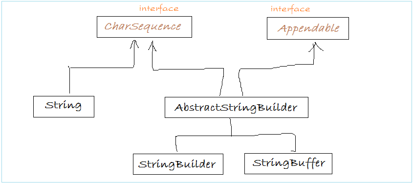

***

   

Классы для работ со строками
============================

В рамках этого урока мы разберемся с тем, какие строковое типы существуют в Java. Разберем плюсы и минусы каждого из них, включая известный нам тип _String_.

Для начала посмотрим на упрощенную иерархию строковых классов:



  

#### Интерфейс CharSequence

Все строковые типы в Java реализуют интерфейс _CharSequence_. Его иногда можно увидеть в качестве параметра методов, принимающих строку в любом виде. Такие методы, в том числе, позволяют совмещать работу с разными реализациями строк, например, конкатенировать их.

Данный интерфейс содержит ряд методов, которые реализует каждый из наследников. Рассмотрим те из них, которые могут быть полезны нам:

*   _charAt()_. Метод, принимающий индекс (порядковый номер) символа в строке (считая с нулевого) и возвращающий символ, находящийся под этим индексом;
*   _isEmpty()_. _Boolean_\-метод, возвращающий _true_, если строка пустая;
*   _length()_. Метод, возвращающий длину (количество символов) строки.

Также на этом этапе стоит отметить, что любая из рассматриваемых реализации строковых типов содержит внутри себя массив символов. Вся остальная надстройка - поля и методы, предназначенные для оптимизации работы с исходным массивом символов. Понимание этого очевидного, казалось бы, факта, многим помогает избавиться от магического мышления в отношении строковых типов.

  

#### StringBuilder и StringBuffer

Оба эти класса являются наследником абстрактного класса _AbstractStringBuilder_, именно в нем объявлены все публичные методы этих классов.

Особенностью этих реализаций является то, что они, в отличии от _String_, изменяемы. Соответственно конкатенация строк с использованием _StringBuilder_ и _StringBuffer_ будет дешевле за счет того, что при каждой конкатенации не нужно создавать новый объект.

Отличительной особенностью _StringBuffer_ является потокобезопасность. Это означает, что он гарантирует корректную работу в многопоточной среде, в том числе ситуации, когда с объектом _StringBuffer_ работают несколько потоков одновременно.

_StringBuilder_ не гарантирует потокобезопасности, но за счет этого работает быстрее.

Методы, которые нас интересуют (методы _CharSequence_ также доступны) в этих классах:

*   _append()_. Перегружен под разные типы данных. Аналогичен оператору «+» для строк — добавляет переданный параметр в конец строки;
*   _insert()_. Перегружен под разные типы данных. В большинстве реализаций, первый параметр — смещение (индекс элемента), второй — данные, которые надо вставить в подстроку. Пример:

```java
StringBuilder stringBuilder = new StringBuilder("000"); //"000"
stringBuilder.insert(1, "111"); //"011100"
```

*   _compareTo()_. Сравнивает строки посимвольно (условно, в алфавитном порядке, на самом деле - по кодам каждого символа). Если параметр, переданный в метод, меньше строки, для которой метод был вызван — вернет отрицательное число, если больше — положительное. Если строки равны — вернет 0 (ноль). Как правило, этот и подобные ему методы используются для различных сортировок;
*   _delete()_. Принимает два параметра типа _int_ — _start_ и _end_. Удаляет из строки элементы с индекса _start_ по индекс _end_ (не включительно);
*   _deleteCharAt()_. Принимает параметром индекс элемента. Удаляет его из строки;
*   _replace()_. Если метод _delete()_ удаляет элементы по указанному диапазону индексов, то _replace()_ заменяет подстроку, ограниченную индаксами другой подстрокой — переданной в качестве параметра в метод;
*   _reverse()_. Разворачивает строку: _"123" → "321"_.

Указанные классы содержат и другие методы, но они вряд ли пригодятся нам на практике. Однако при желании всегда можно обратиться к документации на [https://docs.oracle.com/](https://docs.oracle.com/) или в IDEA, открыв соответствующие классы.

  

#### String

С классом _String_ мы знакомы давно и, время от времени, узнаем о нем что-то новое.

Напомним, что _String_ — неизменяем, а значит, при каждом изменении строки вынужден создавать новый объект. Таким образом, операции, изменяющие исходную строку в _String_ будут дороже, чем в _StringBuilder_.

Из плюсов — у _String_ есть пул строк, который позволяет переиспользовать строковые литералы. Но об этом ниже.

Пока предлагаю ознакомиться с теми методами _String_, которые потенциально могут быть нам полезны. Поскольку _String_ — основной класс для работы со строками, методов будет много:

*   _static join()_. Позволяет объединять несколько строк в одну, расставляя между ними подстроки-разделители (разделитель передается как один из параметров). Имеет перегруженную реализацию, которая также позволяет установить в результирующей строке префикс и суффикс — подстроки в начало и конец результирующей строки одновременно;
*   _static valueOf()_. Возвращает строковое представление переданного параметра. С примитивными типами, полагаю, понятно. Для _null_ вернет _"null"_ (именно как строку), для объекта — вызовет _toString()_ и вернет его результат. Именно этот метод используется внутри _System.out.print()_;
*   _static format()_. Метод форматирования строк с использованием спецификаторов. Сигнатура такая же, как в известном нам _System.out.printf()_. Принцип действия тоже совпадает, только вместо вывода результирующей строки на консоль, она будет возвращена из метода. В Java 15 появился не статический метод с той же функциональностью: _formatted()_. Он более удобен в использовании;
*   _split()_. Принимает в качестве параметра разделитель. Возвращает массив строк, получившийся в результате разделения изначальной строки по переданному разделителю. Разделителем можно выступать как обычная строка, так и **регулярное выражение**. С механизмом регулярных выражений (**regex**, он же **regexp**) мы познакомимся в одном из ближайших уроков;
*   _toLowerCase()_. Приводит все символы строки к нижнему регистру (не буквенные символы остаются без изменений);
*   _toUpperCase()_. Приводит все символы строки к верхнему регистру (не буквенные символы остаются без изменений);
*   _compareTo()_. По логике работы аналогичен этому же методу в _StringBuilder_;
*   _compareToIgnoreCase()_. Полагаю, название говорит само за себя. Сравнивает строки, игнорируя регистр символов (_"hi".compareToIgnoreCase("HI") == 0_);
*   _contains()_. Проверяет, содержит ли исходная строка подстроку, переданную в качестве параметра;
*   _intern()_. Добавляет строку в пул строк, если она там отсутствует. Если уже существует — возвращает ссылку на эквивалентную строку из пула;
*   _isBlank()_. Проверяет, является ли строка пустой. В отличии _от isEmpty()_ (он также доступен), _isBlank()_ посчитает пустой и строку, состоящую только из пробелов;
*   _matches()_. Проверяет, соответствует ли исходная строка переданному регулярному выражению;
*   _replace()_. Заменяет все символы, аналогичные переданному как первый параметр на символы, аналогичные второму: _"haha".replace('h', 'b').equals("baba")_. Также есть перегруженный метод, принимающий в качестве параметров строки;
*   _replaceAll()_. Аналогичен _replace()_ со строковыми параметрами. Но первым параметром можно передать регулярное выражение;
*   _substring()_. Возвращает подстроку по указанным в параметре индексам (или от указанного индекса до конца строки). Если у вас стоит JDK 6 или более ранние версии — рекомендую использовать с осторожностью, этот метод приводит к утечками памяти. В более поздних версиях проблема была исправлена;
*   _toCharArray()_. Представляет строку как массив символов, из которых она состоит. Порядок символов сохраняется;
*   _strip()_. Обрезает пробелы в начале и конце строки;
*   _trim()_. Похож на _strip()_. Только пробелом считает любой символ, с кодом <= 20.

Используя методы, изменяющие строку — помните, что эти методы вернут новый объект строки:

```java
String str = " haha ";
str.trim();
System.out.println(str); //" haha "
-----------------------------------
String str = " haha ";
str = str.trim();
System.out.println(str); //"haha"
```

Также советую пока не особо обращать внимание на упоминание регулярных выражений. Но рекомендую вернуться к текущей статье, когда мы разберемся с ними. Это произойдет уже совсем скоро:)

  

#### Пул строк

Объекты _String_ можно создать двумя способами: через литерал (_String str = "sthStr"_) и через конструктор (_String str = new String("sthStr")_).

Первый способ использует **пул строк** (**String pool**) — область кучи, которая хранит существующие строковые литералы. Если такой литерал уже есть в пуле, будет взят он. Если нет — новый литерал будет добавлен в пул.

Второй же способ создаст новый объект _String_, даже если строка с таким значением уже есть в пуле. Но строку можно явно добавить в пул, вызвав для нее метод _intern()_.

Пул строк — важный механизм, позволяющий использовать _String_ намного более эффективно. Создание строк через конструктор — сомнительная практика, ее выгоды не очевидны. Не рекомендую использовать этот подход, поскольку он избыточен с точки зрения памяти.

  

С теорией на сегодня все!


  

Переходим к практике:

#### Задача 1:

Реализуйте задачу [https://github.com/KFalcon2022/practical-tasks/blob/master/src/com/walking/lesson6\_methods/Task3.java](https://github.com/KFalcon2022/practical-tasks/blob/master/src/com/walking/lesson6_methods/Task3.java)

используя StringBuilder или StringBuffer. Объясните свой выбор.

  

#### Задача 2:

Реализуйте программу, принимающую с клавиатуры строку, содержащую слова, разделенные пробелом. Выведите в консоль количество уникальных слов в строке. Учтите, что строка может начинаться с пробела.

Для упрощения допустим, что в строке не могут использоваться символы, отличные от пробела или русских/английский букв. Помните, что слово может быть введено в разных регистрах.

  

Если что-то непонятно или не получается – welcome в комменты к посту или в лс:)

Канал: [https://t.me/+relA0-qlUYAxZjI6](https://t.me/+relA0-qlUYAxZjI6)

Мой тг: [https://t.me/ironicMotherfucker](https://t.me/ironicMotherfucker)

_Дорогу осилит идущий!_