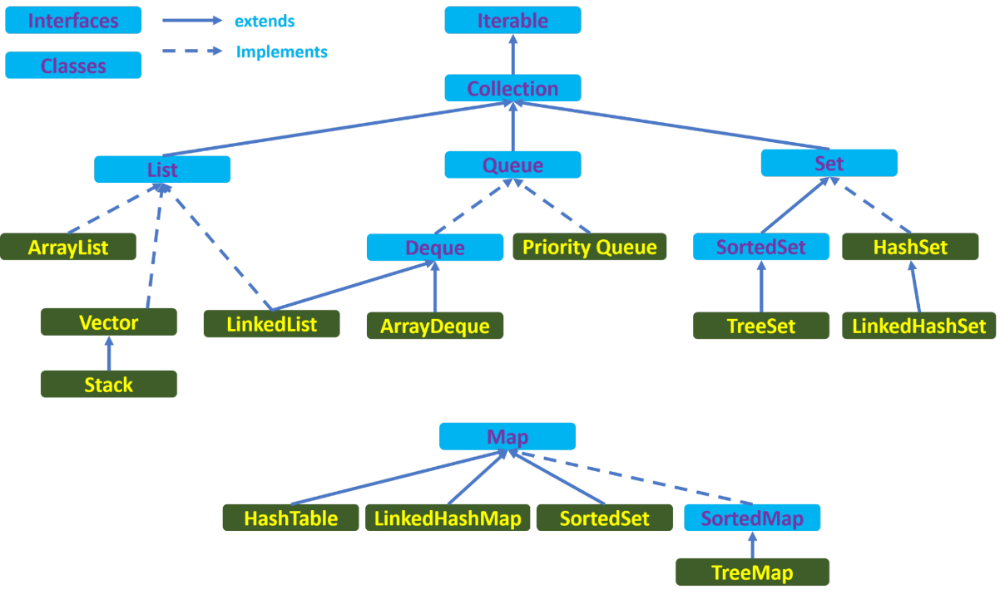

***

   

Collections Framework
=====================

#### Первое знакомство с коллекциями

Сегодня мы начинаем разбор достаточно большой темы коллекций в Java и познакомимся с основными иерархиями коллекций, разберем их актуальность, классифицируем по нескольким признакам и поверхностно затронем отличия коллекций разных типов.

Для того, чтобы изучение этой темы было комфортным, убедитесь, что вы знакомы с:

*   Базовым синтаксисом Java;
*   Принципами ООП;
*   Основными **структурами данных**: **массив**, **стек**, **очередь**, **дерево** (рекомендую поверхностно ознакомиться самостоятельно, но разбор незнакомых структур будет параллельно с уроками, где они могут потребоваться);
*   Методы _Object_;
*   Generics;
*   Абстрактные классы и интерфейсы.

Итак, что же такое коллекция в терминах Java?

**Коллекция** – хранилище данных определенного типа, с возможностью оптимального способа расположения и обработки своих элементов в зависимости от поставленных задач.

Стоит отметить, что любая коллекция представляет собой параметризованный тип.

Основные интерфейсы и реализации коллекций лежат в пакете _java.util_. В узком смысле именно эти классы и составляют **Java Collections Framework**. В широком смысле к Collections Framework относят всех наследников от основных интерфейсов коллекций (о них ниже).

  

#### Массивы и коллекции

Первая информация однозначно вызывает ассоциации с массивами. Постараемся понять, в чем заключаются основные отличия:

*   Коллекции работают на большем уровне абстракции. А значит берут на себя базовые операции расширения, наполнения, сортировки и поиска. Но при этом в основе ряда коллекций лежит массив;
*   Различные реализации коллекций имеют различные особенности и предназначены для конкретных манипуляций, что позволяет работать с данными более оптимально при выборе подходящей коллекции;
*   Коллекции имеют **потокобезопасные** реализации. Использование массива в **многопоточной** среде – риск получить непредсказуемое поведение;
*   В отличии от массива, коллекции не могут хранить примитивные типы – Generic’и не умеют работать с примитивами.

  

#### Иерархии коллекций

С точки зрения иерархии классов в рамках **Collections Framework** нас будут интересовать интерфейсы _Iterable<T>_ (особенно его наследник _Collection<T>_) и _Map<K, V>_.

Рассмотрим иерархии этих интерфейсов, используя рисунок ниже (голубые – интерфейсы, зеленые - классы):

Что стоит отметить:

*   3 наследника _Collection_ – 3 разных типа коллекций: _List_, _Queue_, _Set_;
*   _Map_ – не наследник _Collection_, но четвертый тип коллекций в Collection Framework;
*   Каждый тип имеет массу реализаций, на рисунке отмечены основные из них;
*   _Map_ не является наследником _Collection_, потому что имеет иную параметризацию: он параметризуется двумя типами – _K (key)_ и _V(value)_. Остальные коллекции содержат в себе данные лишь одного типа.

Теперь обозначим характерные особенности каждого из типов коллекций. Помните, что конечные реализации могут расширять несколько интерфейсов. Например, _LinkedList_ реализует как поведение списка (_List_), так и одного из наследников очереди (_Queue_).

Отличительные особенности разных типов коллекций:

*   _List_ – доступ к элементам по индексу. Обычно элементы добавляют в конец списка и индекс присваивается в порядке добавления, но есть возможность вставки элемента с явным указанием его индекса;
*   _Queue_ – реализует хранение элементов по принципу _FIFO_ (_first-in-first-out_): первый вошел – первый вышел;
*   _Set_ – характеризуется тем, что хранит лишь уникальные элементы (помните о необходимости переопределения _equals()_ и _hashcode()_ при использовании этого типа коллекций);
*   _Map_ – позволяет хранить элементы в виде **ассоциативного массива** (пар «**ключ-значение**»). Т.е. мы всегда сможем получить доступ к объекту, если знаем его ключ. Ключи должны быть уникальны.

Возможно, сейчас вопросов все еще больше, чем ответов. Не стоит бояться, мы разберем каждый из типов подробно в рамках следующих уроков.

  

#### Классификация коллекций по потокобезопасности

**Потокобезопасность** – концепция, гарантирующая исправность и предсказуемость поведения кода в многопоточной среде. Намного подробнее этот термин будет разбираться в теме многопоточности.

Исходя из критерия потокобезопасности, мы можем классифицировать коллекции следующим образом:

*   Не потокобезопасные коллекции. Все основные реализации коллекций. В дальнейших уроках будут приведены примеры для каждого из типов;
*   Потокобезопасные коллекции (**legacy**). Коллекции из пакета _java.util_, гарантирующие потокобезопасность. Характерны тем, что крайне медленны из-за неоптимальной реализации потокобезопасности. Считаются устаревшими и не рекомендуются к использованию;
*   Потокобезопасные коллекции (_java.util.concurrent_). «Современные» потокобезопасные коллекции. Лежат в пакете _java.util.concurrent_. Реализованы более оптимально, чем legacy-коллекции, именно они используются, если предполагается, что код будет использоваться в многопоточном режиме.

  

Умение правильно выбирать коллекцию, исходя из потребностей, и использовать ее оптимально – крайне важный навык Java-разработчика. Для этого, в том числе, стоит представлять основы внутреннего устройства конкретных реализаций и учитывать, какие структуры данных лежат в основе той или иной коллекции.

  

На сегодня все!

  

Если что-то непонятно или не получается – welcome в комменты к посту или в лс:)

Канал: [https://t.me/+relA0-qlUYAxZjI6](https://t.me/+relA0-qlUYAxZjI6)

Мой тг: [https://t.me/ironicMotherfucker](https://t.me/ironicMotherfucker)

_Дорогу осилит идущий!_