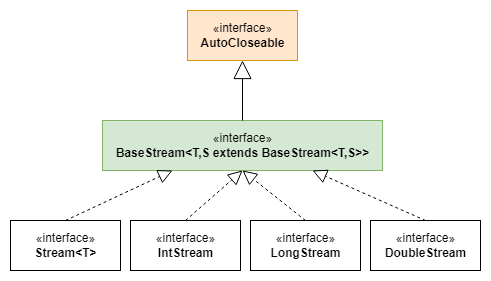

***

   

Stream API. Stream’ы примитивов
===============================

Мы уже достаточно подробно познакомились с основным интерфейсом Stream API – _Stream_. Выяснили, какие возможности он предоставляет. В текущем уроке мы рассмотрим, какую функциональность могут предложить его близкие родственники – Stream’ы для примитивных типов: _IntStream_, _LongStream_ и _DoubleStream_.

Напомню, что все 4 интерфейса являются наследником _BaseStream_, а значит, имеют ряд общих методов. Но большинство методов, схожих по сигнатуре (обычно – с одинаковым названием, но разными параметрами) в Stream и его примитивных братьях не наследуются от общего предка. Таким образом, они могут иметь серьезные отличия в наборе параметров и быть по-разному изменены в новых версиях Java. Последнее крайне маловероятно, но возможно.



Иерархия основных интерфейсов Stream API

Чтобы понимать, чего ждать от новых интерфейсов, постараемся разобраться, почему они вообще существуют.

Начнем с того, чем является интерфейс _Stream_. Его можно рассматривать как инструмент для обработки однотипных данных ссылочных типов. В данном случае, ключевым будет слово «ссылочных». Если бы не желание дать лакончичное название, данный интерфейс назывался бы, вероятно, _ReferenceStream_. Единственный класс, реализующий _Stream_ – _ReferencePipeline_ – намекает, что это недалеко от истины.

Подобная реализация удобна для абсолютного большинства задач – она предоставляет возможность использовать generic'и, гибко подходить к преобразованию стрима из элементов типа _A_ в стрим элементов типа _B_, использовать внутри конкретной операции все возможности класса, объекты которого обрабатываются в рамках этой операции… В общем, лучшее, что могло случиться с Java за последнее десятилетие.

Но другое множество задач – преимущественно, вычислительных, не требуют сложных преобразований над элементами. Зато требуют удобных инструментов для вычислений – сложение или расчет среднего, например. Более того, для таких задач даже не нужны объекты – достаточно примитивных типов. А как вы помните, дженерики (и _Stream_ – не исключение) не могут быть параметризованы примитивом.

Отсюда следует два пункта:

· Использование _Stream_ неудобно для простых вычислительных задач – оно предполагает использование _reduce()_, который является достаточно многословным. И если для операции расчета суммы элементов он еще будет понятным, то рассчитывать через _reduce()_ среднее значение – задача нетривиальная;

· Работа с числовыми значениями через объекты зачастую избыточна. Это имеет смысл при высоких требованиях к точности вычислений и, следовательно, использовании подходящих классов – _BigDecimal_, например. Использование для вычислительных задач врапперов вроде _Integer_ и _Double_ – лишние затраты на память и работу GC (garbage collector). А не использовать объекты мы не можем – generic не предполагает работу с примитивами.

Отсюда следует актуальность стримов примитивов для основных числовых типов – _int_, _double_ и _long_, поскольку они:

1\. Оставляют плюсы обработки через Stream API и большинство операций, доступных для _Stream_;  
2\. Экономят память (и время, потому что не забивают хип => не приводят к запуску gc), в сравнении с использованием классов-врапперов;  
3\. Дают дополнительные операции, потому что тип обрабатываемых значений известен и понятны допустимые операции над ним. Сюда относятся как терминальные операции, которых нет у _Stream_, так и другие возможности, как _range()_ у _IntStream_ и _LongStream_.

Теперь, когда актуальность стримов примитивов понятна, разберемся с их возможностями. Здесь не будет полного перечисления операций, поскольку большинство из них идентично операциям _Stream_, с поправкой на тип значения. Зато мы сможем уделить больше внимания уделить новым для нас методам.

### Методы-источники

Здесь для нас нет ничего нового: мы познакомились с методами _range()_ и _rangeClosed()_ у _IntStream_ и _LongStream_ в рамках урока «[Stream API. Способы создания Stream'а](/Stream-API-Sposoby-sozdaniya-Streama-02-26)».

### Промежуточные операции

Большинство промежуточных операций идентичны операциям _Stream_. Однако есть отличия. Обратим на них внимание.

#### mapToObj()

Идентичен операции _map()_ у _Stream_ – преобразует элемент текущего стрима в элемент другого типа. В свою очередь операция _IntStream_._map()_ всегда будет принимать и возвращать элемент типа _int_, т.е. подходит только для преобразований в рамках одного типа:

```java
IntStream.of(1, 2, 3)
  .mapToObj(String::valueOf)
  .toList(); //{"1", "2", "3"}

IntStream.of(1, 2, 3)
  .map(i -> ++i)
  .forEach(System.out::print); // 234
```

По аналогии будет работать _map()_ у _LongStream_ и _DoubleStream_.

#### boxed()

Метод, который превращает стрим примитивов в обычный _Stream_, с использованием классов-врапперов. По сути, следующие два примера идентичны:

```java
IntStream.of(1, 2, 3)
  .mapToObj(i -> i)      // Stream<Integer>
  …

IntStream.of(1, 2, 3)
  .boxed()               // Stream<Integer>
  …
```

В обоих случаях текущие значения будут превращены в соответствующие объекты врапперов, используя механизм автоупаковки (autoboxing).

Данная операция существует для всех трех стримов примитивов.

> **!NB**: обратите внимание, **IntStream**, **LongStream**, **DoubleStream** – стримы примитивных типов. Соответственно, элементами этих стримов не могут быть **null**. Это особенно важно при преобразовании **Stream** \-> **IntStream** и подобных. Наличие **null**\-элементов в оригинальном стриме приведет к исключению.

#### asDoubleStream(), asLongStream()

_IntStream_ и _LongStream_ имеют операцию для преобразования стримов в аналогичные по набору элементов DoubleStream’ы. Следующие два примера можно считать идентичными:

```java
IntStream.of(1, 2, 3)
  .mapToDouble(i -> i) // DoubleStream
  …

IntStream.of(1, 2, 3)
  .asDoubleStream ()   // DoubleStream
  …
```

Также _IntStream_ предлагает операцию преобразования в _LongStream_ \- _asLongStream()_. Опять же, рассмотрим два идентичных примера:

```java
IntStream.of(1, 2, 3)
  .mapToLong (i -> i)   // LongStream
  …

IntStream.of(1, 2, 3)
  .asLongStream()       // LongStream
  …
```

В свою очередь, операции, требующие явного приведения (из-за потери точности/данных), возможны только с помощью методов _mapToInt(), mapToLong()_:

```java
DoubleStream.of(1, 2)
  .mapToLong(i -> (long) i)   // LongStream
  …

LongStream.of(1, 2)
  .mapToInt(i -> (int) i)     // IntStream
  …
```

На этом разбор промежуточных операций у стримов примитивных типов можно считать завершенным. Остальные операции подобны таковым у _Stream_ и не требуют особого внимания.

### Терминальные операции

Именно ради них стримы примитивных типов и существуют. Если при промежуточных операциях иногда возникает ощущение искусственности и избыточности, то терминальные вполне гармоничны.

#### OptionalInt, OptionalLong, OptionalDouble

Разбор терминальных операций мы начнем не с методов, а с возвращаемых типов. Операции, предполагающие возврат значения, как аналогичные _Stream_ – там они вернули бы _Optional_, так и характерные только для стримов примитивов, возвращают некий аналог _Optional_ – _OptionalInt_, _OptionalLong_, _OptionalDouble_ (в зависимости от типа стрима и конкретной операции).

Использование таких типов вполне логично – ведь стрим примитивов может оказаться пустым и не содержать значений. При этом использовать обычный _Optional_ разработчики языка, видимо, посчитали некорректным – он может работать только со ссылочными типами и неизбежно приведет к использованию враппера.

Класс _OptionalInt_ и ему подобные, в целом, очень похож на привычный нам _Optional_. Они имеют те же терминальные операции, что и ссылочный собрат: _ifPresent()_, _orElse()_, _orElseThrow()_ и др.

Единственное отличие в наборе терминальных операций – метод _get()_ заменен на _getAsInt()_ у _OptionalInt_, _getAsLong()_ и _getAsDouble()_ (для _OptionalLong_ и _OptionalDouble_ соответственно).

А вот с промежуточными операциями все интереснее: их просто нет. Как нет привычных _map()_, _flatMap()_ и прочих операций, которые есть у _Optional_, так и нет возможности преобразовать условный _OptionalInt_ в _Optional_. Хотя последнее было бы логично, по аналогии с возможностью преобразования _IntStream_ → _Stream_.

Таким образом, при внешнем сходстве, классы _OptionalInt_, _OptionalLong_, _OptionalDouble_ не предоставляют возможность построения функциональной цепочки и, по сути, не являются монадой. Это лишь контейнер соответствующих примитивов, которые позволяют обработать ситуации, когда стрим примитивов оказался пустым.

Рассмотренные классы актуальны для аналога таких операций как _findFirst()_, _findAny()_, _reduce()_ (без начального значения), _min()_ и _max()_.

К слову, последние две операции не требуют использования _Comparator_ в стримах примитивов – это логично, но не всем очевидно.

Теперь можем приступить к разбору терминальных операций. Как и в случае с промежуточными, аналоги операций _Stream_ будут опущены.

#### sum()

Возвращает сумму элементов Stream’а. Возвращаемый тип – _int_, _long_ или _double_, в зависимости от типа самого стрима.

Обратите внимание: сумма даже пустого Stream’а будет 0 (ноль).

#### average()

Данная операция возвращает среднее значение элементов, обернутое в _OptionalDouble_. Возвращаемый тип не зависит от типа стрима, ведь среднее значение целых чисел вполне может быть дробным.

#### summaryStatistics()

Достаточно интересный метод, возвращающий, в зависимости от типа Stream’а, _IntSummaryStatistics_, _LongSummaryStatistics_ или _DoubleSummaryStatistics_.

Данные классы содержат информацию о числе элементов, которые были в стриме, их сумму, минимальное и максимальное значения. Имеют геттеры для этой информации, а также метод расчета среднего значения и немного иной функциональности – добавлению нового значения в статистику или объединению двух статистик.

По сути, данный метод можно рассматривать как обобщение для методов _min()_, _max()_, _sum()_, _average()_ и _count()_ в ситуации, когда недостаточно одной терминальной операции.

### В качестве заключения

Стримы примитивов – не самый популярный инструмент Stream API. Но он прост и крайне удобен для ряда вычислительных задач и является неотъемлемой частью стримов.

Кроме того, стоит помнить, что использование классов-врапперов – удобно, но дорого, в сравнении и использованием примитивов. И если на маленьких объемах данных это незаметно, при обработке больших массивов информации это может ощутимо сказываться на производительности всей системы.

С теорией на сегодня все!

Урок все еще теоретический. В качестве практики рекомендую обратить внимание на книгу, предложенную одним из подписчиков: _Анджел Леонард_ – _Java. Решение практических задач_.  
В ней содержатся задачи по различным темам, включая и Stream API.  


Если что-то непонятно или не получается – welcome в комменты к посту или в лс:)

Канал: [https://t.me/+relA0-qlUYAxZjI6](https://t.me/+relA0-qlUYAxZjI6)

Мой тг: [https://t.me/ironicMotherfucker](https://t.me/ironicMotherfucker)

_Дорогу осилит идущий!_