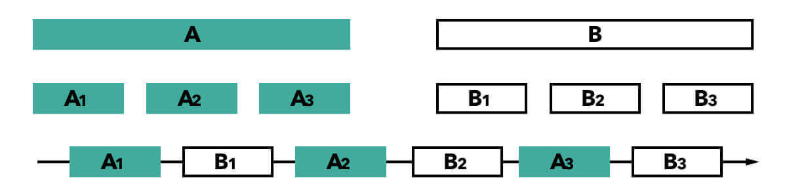

***

   

Многопоточность. Введение
=========================

Сегодняшняя статья открывает следующий раздел курса – «**Многопоточность**». В ее рамках мы постараемся определиться с терминами, разобраться с тем, что такое многопоточность и для чего она нужна.

Но прежде, чем начнем, несколько ремарок.

Многопоточность – сложное и обширное направление, со своей терминологией, проблематикой и подходами к реализации. Даже в рамках Java, она является одной из самых тяжелых и не очевидных тем для среднего разработчика.

Хорошая новость заключается в том, что от стажеров, джуниоров и, в большинстве случаев, мидлов никто не ждет глубоких знаний в данной теме. Вторая хорошая новость – средний Java-разработчик в современных реалиях редко работает с многопоточностью напрямую (даже по меркам Java), вне фасадов, предлагаемых фреймворками, и прочих высокоуровневых абстракций, призванных скрыть многопоточность от программиста в наиболее типовых задачах.

Неприятная новость в том, что доступных материалов для новичков по многопоточности не так много, как по большинству других базовых тем, вроде языкового синтаксиса, коллекций или работы с вебом и базами данных. По крайней мере, если мы не говорим об «академическом» материале, который редко бывает реальным источником информации, если вы не студент профильного ВУЗа.

Поэтому своей задачей в рамках данного раздела я вижу:

· Познакомить с задачами, решаемыми многопоточностью;

· Плавно погрузить в терминологию данного раздела;

· Познакомить с проблемами многопоточности;

· Познакомить с синтаксисом и характерными для Java нюансами реализации (сюда отнесем и знакомство с [**JMM**](https://ru.wikipedia.org/wiki/%D0%9C%D0%BE%D0%B4%D0%B5%D0%BB%D1%8C_%D0%BF%D0%B0%D0%BC%D1%8F%D1%82%D0%B8_Java));

· И, наконец, поверхностно познакомить с базовыми вспомогательными инструментами, которые Java предоставляет «из коробки». Речь, преимущественно, о знакомстве с _java.util.concurrent_.

Таким образом, данный раздел должен получиться менее углубленным и подробным, чем раздел по Stream API, но, тем не менее, дать больший набор знаний (или, хотя бы, информации), чем имеющийся у среднего джуна.

Главное помнить, что это все – лишь верхушка айсберга и знания, как и навыки использования, в теме многопоточности придется углублять на протяжении всей карьеры.

#### Актуальность многопоточности. Что это и зачем?

Многопоточностью в широком смысле называют (что не совсем корректно) любое исполнение программы, которое НЕ получается представить как набор инструкций (кода), выполняемого подряд.

Достаточно запутанное объяснение, которое, в добавок, плохо отражает суть.

Действительно, под многопоточностью обычно подразумевается выполнение кода какой-либо программы параллельно (или псевдопараллельно), когда отдельные подзадачи исполняются «одновременно» в глазах пользователя.

Ниже постараемся разобраться подробнее, что может скрываться под таким широким определением. А пока – рассмотрим несколько примеров категорий задач, которые решаются «многопоточностью» в широком смысле. Иначе, боюсь, может быть непонятно, о чем вообще идет речь:

· Реализация конкретной задачи в несколько «потоков». Например, о подобном неоднократно упоминалось в Stream API. Более общий пример – наполнение массива заданного размера случайными числами. Мы можем сделать это в одном потоке – пройдясь циклом по всему массиву. Но для больших массивов это будет слишком долго. Поэтому мы можем запустить несколько потоков выполнения, каждый из которых будет параллельно (с оговорками) заполнять свою часть массива. Пример за пределами Java – 10 рабочих создадут 10 одинаковых деталей быстрее, чем один рабочий. В случае с многопоточностью, каждый рабочий – отдельный поток;

· «Вспомогательные» действия. Скажем, обрабатывая регистрацию, вы хотите оповестить пользователя по email о том, что его аккаунт создан. Вам не обязательно делать это «синхронно», прерывая остальную логику регистрации. Более того, для регистрации пользователя его оповещение по email вообще не нужно. Но это важно для пользователя. Поэтому выполнение задачи «оповестить пользователя» можно вызвать в другом потоке выполнения, который запустится в определенный момент обработки основной задачи, но его результаты ни на что не повлияют в рамках основной задачи.

· Фоновые задачи. Скажем, вы хотите, чтобы ваша программа параллельно «наполняла массив» (подставьте любую задачу, которая ваша программа решает) и, например, писала в консоль текущее время каждые 10 секунд (или выполняла любую другую функцию в фоне, не связанную с основной). В таком случае, ваша программа будет решать разные задачи, но делать это будет условно одновременно;

· Множественный доступ. В наших реалиях чуть ли не самое главное. Возможность нескольких пользователей одновременно работать с вашей программой. Это не так актуально для десктопных приложений без серверной части. Зато критически важно для любого серверного приложения. А мы, все-таки, целим в backend-разработчики.

Полагаю, для начала хватит. Теперь разберем, что может скрываться на самом деле под непонятным термином «многопоточность».

### Асинхронность

Данная концепция заключается в вызове определенного действия (функции) без ожидания ее результата. В более широком смысле **асинхронность** декларирует возможность выполнения нескольких операций одновременно, без возникновения блокировки (невозможности выполнения одной операции без выполнения/результата выполнения другой).

Разберем утрированный пример:

```java
void sthMethod(SthObj sthObj) {
  sthObj.doSth();
  sthObj.doSth2();
  sthObj.doSthAsync();
  sthObj.doSth3();
}
```

Рассмотрим некий метод, который что-то делает. Пусть в него передается параметром объект типа _SthObj_.

Итак, первой строкой рассматриваемого метода будет вызов

```java
sthObj.doSth();
```

До тех пор, пока метод _doSth()_ не будет обработан, следующая строка не будет достигнута. Аналогичная ситуация произойдет и с _doSth2()_ – пока этот метод не будет выполнен, к следующей строке в _sthMethod()_ мы не приступим. На данном этапе все должно быть понятно.

Но далее вызывается метод _doSthAsync()_. На данном этапе опустим реализацию асинхронных вызовов, сосредоточимся на самой концепции. Данный метод должен будет сделать что-то **асинхронно**. Таким образом, программа не будет ждать, пока логика метода _doSthAsync()_ полностью выполнится. Она сразу перейдет к выполнению _doSth3()_. При этом завершение выполнения метода _doSthAcync()_ может произойти даже после завершения обработки метода _sthMethod()_, в котором _doSthAcync()_ и был вызван.

Безусловно, асинхронный вызов, как правило, легко опознать. За счет характерной синтаксической конструкции, использования общеизвестной функции или по другим параметрам. Нюансы будут зависеть от конкретного языка программирования или даже фреймворка.

Асинхронность является достаточно абстрактной концепцией, внутри которой могут быть различные реализации этого механизма. В целом, она является частным случаем **конкурентности**, о которой мы поговорим ниже.

Скорее всего, понятие асинхронности вам знакомо, если вы когда-нибудь изучали JavaScript.

### Многопроцессорность

**Многопроцессорность** (**Multiprocessing**) – концепция использования двух и более процессоров в рамках одной системы.

Чтобы не вдаваться в нюансы терминологии, под процессором будем в данном случае считать «ядро процессора». Полагаю, большинство из вас имеют многоядерные процессоры. Физическое ядро или логическое – в данном случае не играет роли.

Как вы понимаете, в отличии от концепции асинхронности, многопроцессорность является механизмом, плотно связанным с «железом».

В целом, многопроцессорность нас интересует преимущественно в рамках теоретического базиса, поэтому не будем углубляться, отметим лишь несколько ключевых особенностей:

1\. Многопроцессорность оперирует понятием **процесса** – экземпляра программы (набора программных инструкций), которому выделяются ресурсы процессора для выполнения. Важная особенность процесса – он является автономным. У него своя память, он оперирует своими переменными (если мы опустимся на уровень кода программы) и данными. Обмен данными между двумя процессами – достаточно сложная задача, при этом на уровне оперативной памяти каждый процесс, как правило, будет хранить свою копию данных;

2\. В контексте работы с компьютером для рядового пользователя очевидным примером служит запуск и одновременное выполнение двух разных программ. Каждая программа будет представлять собой самостоятельный процесс, эти программы даже не будут знать друг о друге, тем более, о том, что выполняются одновременно.

Если обратимся к примерам в начале статьи – на реализацию с помощью многопроцессорности мог бы претендовать пример с множественным доступом. При условии, что все данные хранятся во внешнем источнике – скажем, базе данных, а пользователи не взаимодействуют друг с другом.

На практике, множественный доступ как таковой обычно реализуется без использования многопроцессорности, по целому ряду причин. Многопроцессорная система будет подразумевать умение системы выделять и распределять задачи между разными процессорами. Как можно понять из описания выше, такие задачи должны быть автономны и не иметь разделяемых ресурсов с другими задачами данной системы.

### Многопоточность

Наконец, мы добрались до многопоточности в узком смысле.

**Многопоточность** (**Multithreading**) – механизм, позволяющий реализовывать несколько «потоков» в рамках одного процесса, их параллельное выполнение и взаимодействие.

Таким образом, если процесс – абстракция уровня процессора и имеет дискретные характеристики (например, выделенное ему процессорное время), то поток – абстракция уровня операционной системы (в реалиях Java – уровня JVM), и это именно те потоки выполнения, о которых упоминалось раньше. Также вы можете встретить обозначение «**Thread**», **тред** (**трэд**) (калька от английского термина) и «**нить**» (дословный перевод того же термина).

> **!NB**: В русском языке под термином «поток» в контексте программирования могут иметь ввиду и **Thread**, и **Stream** (I/O Stream). В случае с Java, добавляется еще и **Stream** в контексте Stream API. Старайтесь обозначать, что имеете ввиду в конкретной дискуссии, статье или конкретном вопросе. Этим вы облегчите жизнь и себе, и окружающим.

Именно этой многопоточности и будет посвящен текущий раздел.

В отличии от процесса, поток не имеет своей памяти (своего адресного пространства, если быть точным). В контексте памяти JVM у каждого потока есть свой стек, но куча общая для всех потоков приложения.

Таким образом, разные потоки могут работать с одними и теми же объектами, что является большим плюсом при распараллеливании задачи. Но также становится причиной множества проблем, связанных с доступом к таким общим (разделяемым) объектам (ресурсам). Именно из-за этого существуют потокобезопасные коллекции и множество иных инструментов, с которыми мы будем знакомиться в рамках текущего раздела, параллельно изучая проблематику и концептуальные подходы для решения возникающих проблем.

### Конкурентность и параллелизм

Кроме уже озвученных выше терминов, в контексте многопоточности можно услышать еще о двух: **конкурентности** и **параллелизме**.

> **!NB**: **Конкурентность** – не от условно-русского конкурент, а от английского **concurrent** – **одновременный**. С конкуренцией тоже можно провести аналогии, но их корректность будет под вопросом.

Параллелизм, в общем случае, описывает концепцию одновременной обработки нескольких задач (вычислений). **Параллельные вычисления** – отдельная дисциплина, которую мы не затрагиваем в рамках курса. На данном этапе нас интересует несколько иное.

Из-за особенностей перевода, в русскоязычной среде есть путаница между понятием конкурентности и параллелизма. Оба термина описывают одновременное выполнение различных вычислений, но параллелизм (можно встретить термин «**истинный параллелизм**») описывает одновременное выполнение нескольких процессов.

Конкурентность же – говорит о логически (в рамках внутренней логики программы) одновременном выполнении и концентрируется на представлении отдельных задач (подзадач) как независимых процессов (потоков, если говорим о многопоточности). В контексте конкурентности, вычисления могут производиться как параллельно (используя многопроцессорность), так и в однопроцессорной среде, где одновременность выполнения достигается быстрым переключением между разными задачами (потоками). Последнее также называется **мнимым параллелизмом** или **псевдопараллелизмом**.

Таким образом, параллелизм (истинный параллелизм) направлен на экономию времени вычислений и возможен исключительно в многопроцессорной среде.


Схематичная демонстрация истинного параллелизма, когда две задачи обрабатываются одновременно двумя процессорами

Конкурентность направлена на организацию вычислений с использованием отдельных процессов. При этом может быть как достигнут истинный параллелизм, так и нет. В однопроцессорной среде достижим только мнимый параллелизм.



Схематичная демонстрация псевдопараллелизма, когда две задачи обрабатываются "одновременно" одним процессором

Многопоточность в этой иерархии – частный случай конкурентности. Также частным случаем конкурентности является асинхронность и ряд других подходов, которые мы не будем затрагивать в рамках раздела.

### В качестве итога

Многопоточность – действительно сложная тема. Как из-за сложности восприятия – нашему мозгу тяжело моделировать и держать в голове одновременно происходящие события и их возможное влияние друг на друга, так и из-за множества уровней абстракции вокруг реализации одновременного выполнения задач в рамках компьютерных систем.

Отдельная проблема русскоязычного сообщества – нюансы терминологии, вносящие дополнительную путаницу.

Однако любой путь начинается с первых шагов. Надеюсь, я смогу помочь сделать эти шаги вам.

С теорией на сегодня все!

Урок ознакомительный, но практика будет уже в следующем:)


Если что-то непонятно или не получается – welcome в комменты к посту или в лс:)

Канал: [https://t.me/+relA0-qlUYAxZjI6](https://t.me/+relA0-qlUYAxZjI6)

Мой тг: [https://t.me/ironicMotherfucker](https://t.me/ironicMotherfucker)

_Дорогу осилит идущий!_