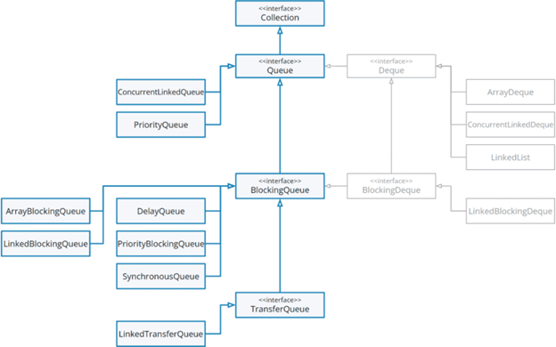

***

   

Многопоточность. java.util.concurrent. Блокирующие и неблокирующие очереди
==========================================================================

Сегодня мы завершим знакомство с потокобезопасными коллекциями, рассмотрев, какие реализации _Queue_ присутствуют в _java.util.concurrent_.

### Неблокирующие очереди

Начнем мы с **неблокирующих очередей** – во-первых, их область применения более очевидна, во-вторых, их просто меньше.

В многопоточной среде достаточно очевидным становится то, что очереди применяются, в первую очередь, для задач вида «**издатель-подписчик**» (**Producer-Consumer**, [тык](https://ru.wikipedia.org/wiki/%D0%98%D0%B7%D0%B4%D0%B0%D1%82%D0%B5%D0%BB%D1%8C_%E2%80%94_%D0%BF%D0%BE%D0%B4%D0%BF%D0%B8%D1%81%D1%87%D0%B8%D0%BA) – ссылка на вики). В остальных случаях можно натянуть сову на глобус и привести задачу к виду «издатель-подписчик».

Суть заключается в том, что при использовании очередей чаще всего возникают ситуации, когда одни потоки (издатели) помещают элементы в очередь, а другие (подписчики) – считывают и обрабатывают их. И в данном случае речь может идти о любой сфере применения: от ориентированной на доменную логику (примерами могут служить _Задачи 1_ и _2_ в практике), до внутренних механизмов (например, пулов потоков, с которыми мы скоро познакомимся, отчасти – _Задача 3_ в практике).

Переходя к различию между блокирующими и неблокирующими очередями, все достаточно прозрачно: **блокирующие очереди** могут блокировать поток, добавляющий данные в коллекцию и/или, поток читающий из коллекции в некоторых случаях – коллекция заполнена, коллекция пуста, передача данных не ожидается в данный момент и пр. Неблокирующие очереди не имеют подобной функциональности, оставаясь просто потокобезопасными имплементациями _Queue_.

#### Реализации

Для потокобезопасных неблокирующих очередей НЕ выделены отдельные интерфейсы (по аналогии с _ConcurrentMap_ для _Map_). Возможно, потому что самих реализаций всего две:

1\. _ConcurrentLinkedQueue_. Обычная очередь на базе односвязного списка. Но потокобезопасная. Работает на базе уже упомянутого в нескольких статьях CAS (Compare-And-Swap);

2\. _ConcurrentLinkedDeque_. Потокобезопасный неблокирующий дек. Иными словами, двусвязный список. За счет необходимости поддерживать двунаправленную связность, в среднем менее производителен, чем _ConcurrentLinkedQueue_. В целом, с трудом могу представить сценарий, при котором в многопоточной среде нужен именно дек => запись и чтение с двух концов. Поэтому, вероятно, основные сценарии использования сводятся к взаимодействию с коллекцией как со стеком или другой структурой, работающей по принципу LIFO.

Как видите, в случае с неблокирующими очередями рассказывать особо не о чем. Единственное, рекомендую обратить внимание на ссылку: [https://java-online.ru/concurrent.xhtml](https://java-online.ru/concurrent.xhtml)

По ней можно найти неплохую шпаргалку по _java.util.concurrent,_ в т.ч. и по рассматриваемой теме. На мой взгляд, именно в качестве краткой шпаргалки – вообще лучшее, что можно найти в русскоязычном сегменте.

### Блокирующие очереди

У блокирующих очередей существует своя небольшая иерархия, поэтому сначала предлагаю рассмотреть визуализацию:

В данном случае, нас интересуют интерфейсы _BlockingQueue_, _BlockingDeque_, _TransferQueue_ и их реализации.

#### BlockingQueue и имплементации

Главная особенность блокирующих очередей, кроме, собственно, блокировок – они являются ограниченными по числу элементов (в общем случае). Ограничение может выглядеть по-разному, но тем не менее: размер блокирующей очереди обычно регламентируется при ее создании.

Кроме того, _BlockingQueue_ добавляет несколько методов к уже известным нам и определенным в _Queue_:

· **_put(E e)_**. Вставляет элемент в очередь. Если она заблокирована на вставку (заполнена) – будет ждать возможности вставки. Классические _add()_ и _offer()_ бросят исключение (_add()_) или вернут _false_ (_offer()_), если вставка невозможна;

· **_offer(E e, long timeout, TimeUnit unit)_**. Полагаю, вы уже догадались. Пытается вставить элемент в течении определенного периода времени и возвращает _true_, если это удалось, или _false_ – если нет;

· **_take()_**. Достает первый элемент в очереди, если очередь пуста – ждет появления элемента и берет его. Привычный нам _poll()_ в случае пустой очереди вернет _null_;

· **_poll(long timeout, TimeUnit unit)_**. Пытается получить элемент в течении заданного периода времени. Если элемент так и не появится – возвращает _null_;

· **_remainingCapacity()_**. Возвращает число элементов, которые можно добавить в очередь до ее наполнения. Иными словами, возвращает результат выражения «_capacity - size_»;

· **_drainTo()_**. Перемещает элементы очереди в коллекцию, переданную параметром. Операция не до конца предсказуема в ряде случаев, но позволяет экстренно вычистить элементы очереди, если это необходимо. Существует также перегруженная реализация, которая ограничивает число выгружаемых элементов отдельным параметром (оставшиеся элементы останутся в очереди).

  

Переходим к реализациям:

1\. **_ArrayBlockingQueue_**. Блокирующая очередь на базе массива. При создании, в конструкторе можно указать параметр _fair_ – справедливость предоставления доступа. Нюансы ровно те же, что и в других механизмах с fair/unfair доступом. Операции чтения и записи блокируются одним Lock’ом;

2\. **_LinkedBlockingQueue_**. Блокирующая очередь на базе, неожиданно, очереди (реализована как односвязный список с сохранением ссылки на голову и хвост). Является более быстрым (в общем случае) аналогом _ArrayBlockingQueue_. Операции чтения и записи блокируются разными локами. Учитывая, что в общем случае нет общего ресурса в виде массива – это логично. Имеет конструктор без параметров – в таком случае размер очереди будет равен _Integer.MAX\_VALUE_. Не поддерживает fair/unfair;

3\. **_PriorityBlockingQueue_**. Потокобезопасный блокирующий аналог (читай, обертка) известной нам _PriorityQueue_. Требуется либо определения Comparator’а, либо _Comparable_\-тип для элементов. Размер по умолчанию – 11. Специфична тем, что всегда доступна на запись. Поэтому, строго говоря, не является блокирующей в полном смысле, а также не является ограниченной по размеру и имеет функцию расширения;

4\. **_SynchronousQueue_**. Интересная реализация «одноэлементной» очереди. По сути, не позволяет писать, пока предыдущий элемент не считан. Также не позволит читать, пока очередь пуста. Поддерживает fair/unfair предоставление доступа. В этой реализации идеально все, кроме того, что она не является очередью в полном смысле этого слова, ведь ее реальный размер всегда будет 0 (нуль) или 1 (при этом _size()_ всегда возвращает 0 (нуль) и _isEmpty()_ всегда _true_);

5\. **_DelayQueue_**. Специфическая реализация очереди для элементов, реализующих интерфейс _Delayed_. Позволит извлечь элемент из очереди только через время задержки, определенное для данного элемента (_Delayed#getDelay()_). Подходит для использования в разного рода таймерах.

  

Как вы можете заметить, для ряда имплементаций есть определенная специфика, которая ограничивает и их область применения. В широком смысле, очередями «общего назначения» можно считать только _ArrayBlockingQueue_ и _LinkedBlockingQueue_. Причем в отсутствие требований к памяти и необходимости справедливого предоставления доступа, использование _ArrayBlockingQueue_ выглядит не слишком привлекательным.

Классической областью применения для блокирующих очередей можно считать задачу _Producer-Consumer_, когда применение неблокирующих очередей вызывает опасения (например, из-за интенсивной записи может закончиться место в heap’е и мы хотим получить гарантии, что данные будут своевременно читаться и обрабатываться). Кроме того, широкий спектр возможностей открывается, если параметризовать блокирующую очередь функциональным интерфейсом (обычно _Runnable_, _Callable_ или их наследники). В таком случае в очередь можно добавлять выполнение определенных задач, что позволяет использовать такие очереди для пулов потоков или других механизмов, определяющих параллельное/асинхронное выполнение различных задач с б**_о_**льшим контролем за ресурсами, чем при прямом создании потоков.

#### BlockingDeque

Интерфейс блокирующего дека, наследник _BlockingQueue_. Также наследует _Deque_. Как и _BlockingQueue_, имеет ряд специфичных методов. Разбирать их подробно не вижу смысла, поскольку они представляют из себя аналоги методов _BlockingQueue_ с классическими для деков постфиксами **_\*First_** и **_\*Last_** для обозначения конца дека, к которому применяются.

Имеет одну реализацию _LinkedBlockingDeque_, представляющую собой двусвязный список, работа которого синхронизируется локом.

Область применения в общем случае остается загадкой. Вероятно, полезна для узких задач. Источник по ссылке выше предлагает рассматривать _BlockingDeque_ для решения различных рекурсивных задач/сложных задач на перебор. Это имеет смысл, но такой спектр задач весьма специфичен.

#### TransferQueue

Мы уже познакомились с специфической блокирующей очередью – _SynchronousQueue_, чье назначение сводится к передаче объекта между потоками. _TransferQueue_ предоставляет более гибкий интерфейс для таких операций. Имеет единственного наследника в лице _LinkedTransferQueue_.

Данный интерфейс является наследником _BlockingQueue_ и, соответственно, имеет все методы блокирующей очереди. В их рамках _TransferQueue_ будет работать как обычная блокирующая очередь. Однако существует и ряд методов, определенных в _TransferQueue_, обеспечивающих синхронную передачу объектов:

· **_tryTransfer(E e)_**. Если есть ожидающая операция чтения (т.е. очередь пуста) – кладет объект в очередь и возвращает _true_. Иначе – _false_. Существует также перегруженный метод, позволяющий указать период времени, в течении которого требуется пытаться «передать» элемент;

· **_transfer(E e)_**. Передает элемент в очередь, если есть ожидающая операция чтения. Если таковой нет – ждет, пока она появится и тогда передает. Если в процессе ожидания поток будет прерван – выбросит _InterruptedException_;

· **_hasWaitingConsumer()_**. Возвращает _true_, если есть ожидающие операции чтения. Иначе – _false_;

· **_getWaitingConsumerCount()_**. Возвращает количество ожидающих операций чтения.

  

Механизм _TransferQueue_ является очень необычным при первом знакомстве. К сожалению, также он является не очень очевидным. Предлагаю рассмотреть пример по ссылке, который позволит внести ясность в особенности работы метода _transfer()_:

[https://java-online.ru/concurrent-queue-block.xhtml#linkedTQ](https://java-online.ru/concurrent-queue-block.xhtml#linkedTQ)

По сути, данный механизм позволяет передать объект в другой поток, дождаться его получения (читай, старта обработки), а потом продолжить дальнейшую работу с объектом, если это необходимо.

С теорией на сегодня все!

Переходим к практике:

### Задача 1

Используя [Задачу из урока 40](/Queue-i-variacii-na-temu-CHast-II-Implementacii-v-Java-01-19#%D0%97%D0%B0%D0%B4%D0%B0%D1%87%D0%B0:), реализуйте сервис заданий, позволяющий добавлять и получать задания. Процесс добавления и получения задач должен быть потокобезопасен.

### Задача 2

Реализуйте [Задачу 1 из урока 62](/Metody-Object-dlya-mnogopotochnosti-04-01#%D0%97%D0%B0%D0%B4%D0%B0%D1%87%D0%B0-1:) без использования _wait()_ и _notify()_/_notifyAll()_.

### Задача 3 (\*)

Развейте [Задачу 1 из текущего урока](#%D0%97%D0%B0%D0%B4%D0%B0%D1%87%D0%B0-1).

Заданиями должно выступать выведение случайно сгенерированного числа (пределы определите самостоятельно) в консоль, а потом усыпления потока-исполнителя на указанное число секунд. Задания должны генерироваться безостановочно (можно ограничить емкость хранилища заданий), обрабатывать их должно не более 4 потоков одновременно.

По сути, корректным решением данной задачи является эмуляция работы пула потоков в его наивной реализации. С пулами потоков, предоставляемыми Java, мы познакомимся в ближайших уроках.

  

Если что-то непонятно или не получается – welcome в комменты к посту или в лс:)

Канал: [https://t.me/ViamSupervadetVadens](https://t.me/ViamSupervadetVadens)

Мой тг: [https://t.me/ironicMotherfucker](https://t.me/ironicMotherfucker)

_Дорогу осилит идущий!_