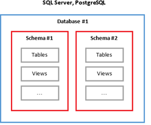
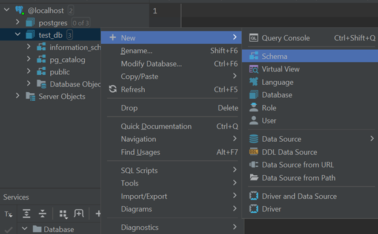

***

   

Реляционные базы данных. Схемы
==============================

Сегодня мы продолжим цепочку теоретических уроков по БД. Осталось потерпеть немного и вернется практика:)

Поговорим о том, где в базе данных лежат таблицы. Спойлер: между БД и таблицами есть логическая прослойка.

Полагаю, вы уже догадались, что таковой прослойкой выступает **схема** (**schema**). Таким образом, мы можем представить примерно такую структуру данных для конкретного сервера БД:

· СУБД (например, PostgreSQL). На сервере может быть множество независимых баз данных (одну мы создали в прошлом урока). Характерно то, что базы данных в рамках сервера друг о друге ничего структурная единица, которой оперирует сервер. У конкретной базы данных мы можем настроить, например, права доступа для различных юзеров и ролей СУБД – например, дать read-only доступ, позволяющий просматривать данные, но не позволяющий писать/изменять данные. Или еще более гибкие права. Мы не затрагиваем это в курсе – это редко нужно на практике разработчику, но стоит знать, что подобные механизмы существуют;

· Схема (Schema). Структурная единица внутри базы данных. В отличии от БД на одном сервере сервере, схемы в одной базе данных «знают» друг о друге. Так, таблица из одной схемы может иметь отношения (связи) с таблицей из другой схемы. Так же, как и в случае с БД, для схемы можно определить собственные права доступа. Так, например, можно создать пользователя, который в рамках БД будет видеть все данные, но право записи будет иметь только для одной из схем. Иногда такие ограничения могут иметь смысл. Подробнее о схемах поговорим ниже;

· Таблица (Table). Более мелкая структурная единица внутри БД. Таблицы, как и ряд других сущностей БД (представления, функции и пр.), лежат на уровне схем. Опять же, на уровне таблицы доступно разграничение доступа.

Для визуализации описанной структуры, предлагаю ознакомиться с картинкой ниже:



Получается, что на одном сервере может существовать несколько БД, в каждой из которых будет несколько схем. А в каждой схеме – множество таблиц.

Казалось бы, актуальность сущности «БД» понятна на интуитивном уровне: как минимум, логично разделение «одно приложение – одна БД». С таблицами тоже просто: одна сущность приложения – одна таблица. Зачем же нужны схемы?

В целом, часть ответов тоже лежит на поверхности:

1\. Как уже было сказано, на уровне схемы можно управлять доступом к данным. В случае, когда база данных насчитывает сотни таблиц, которые можно разбить на логические группы по уровню доступа/ролям, имеющим доступы к каждой группе – логично дать возможность эти группы объединять для удобства управления доступами. Схема как раз и является такой группой;

2\. Развивая идею логической группировки таблиц (и других сущностей БД), работать в рамках схемы удобнее. В данном случае, смысл ровно тот же, что и в иерархии директорий на компьютере. Хранить много таблиц в одной схеме (директории) не очень удобно – затрудняется поиск нужной таблицы, могут совпадать имена разных таблиц (см. след пункт). С небольшими схемами работать проще – как правило, это упрощает понимание зоны ответственности хранимых сущностей (по этой же логике в java удобнее работать с классами, разделенными на пакеты);

3\. Пространство имен. В больших системах может быть множество сущностей (и таблиц), которые относятся к различным частям системы, но имеют одинаковое название. Особенно общие сущности вроде «_клиент_» в БД банка – для разных департаментов могут быть свои представления «_клиента_» с совершенно различными атрибутами. Получается, либо для каждого независимого департамента нужно придумывать уникальное имя таблицы для обозначения клиента, либо использовать схемы: имя таблицы должны быть уникально лишь на уровне схемы, а не на уровне всей БД. Как, например, и в Java название класса должно быть уникально лишь в разрезе одного пакета. Во втором случае у нас может быть несколько таблиц «_клиент_», но каждая будет лежать в собственной схеме.

Полагаю, на этом концепцию можно считать понятной. Предлагаю рассмотреть более практическую сторону вопроса. Как и ранее, рассмотрение темы будет происходить в контексте PostgreSQL.

> **!NB**: Сказанное ниже с незначительными правками относится к любой реляционной БД, не только к PostgreSQL.

При создании БД автоматически создается несколько схем. Часть (например, _pg\_catalog_) имеют служебное значение. Но также в БД создается схема под нужды пользователя: _public_. Внутри этой схемы можно размещать свои таблицы и другие сущности БД. Ее можно считать схемой по умолчанию.

Последний пункт имеет практическое значение – в дальнейшем мы столкнемся с тем, что для созданной нами схемы обращение к таблице описывается как _%имя схемы%.%имя таблицы%_, а для таблиц и сущностей в public имя схемы указывать не обязательно. Т.е. обращение к таблице будет выглядеть как _%имя таблицы%_.

Для наглядности:

*   _custom\_schema.customer_ – обращение к таблице _customer_, лежащей в схеме _custom\_schema_;
*   _customer_ – обращение к таблице customer в схеме _public_. Эквивалентно _public.customer_.

Практика применения схем может зависеть от проекта. Так, например, может опускаться использование схем вообще – все, что можно, будет добавляться в _public_. Со временем единственная схема может стать раздутой и не слишком комфортной для работы, если проект крупный. Если же система небольшая – это может быть вполне допустимым сценарием.

Альтернативным подходом можно считать разделение по принципу функциональной ответственности – скажем, в отдельную схему можно вынести таблицы пользователей приложения и ролевую модель, а также создавать свою схему для каждого условно-независимого раздела. Например, в рамках социальной сети могли бы существовать схемы «аккаунт», «мессенджер», «тех. поддержка» и другие. При таком подходе схема _public_ может использовать для служебных таблиц уровня приложения – таблиц, необходимых для поддержки БД системы, но не являющиеся отражением доменных сущностей системы. Например, таблицы для инструментов миграций. С самими инструментами мы познакомимся в отдельном разделе.

Скорее всего, существуют и другие признаки, по которым могут выделяться схемы в БД. Однако мне с ними сталкиваться не приходилось.

> **\*** Умышленно опустим вариант, когда разделение происходит на основании модели прав доступа. Чаще всего, это, в той или иной степени, перекликается с разделением по функциям системы.

### Создание и удаление схем в PostgreSQL

Здесь все просто и достаточно похоже на создание и удаление БД. Через консольное приложение создать схему можно так:

```java
CREATE SCHEMA test_schema;
```

Удалить:

```java
DROP SCHEMA test_schema;
```

Через GUI (для IDEA и DataGrip):

**_ПКМ по БД_** -> **_New_** \-> **_Scheme_**



В появившемся окне указываем имя схемы и нажимаем **OK**.

Удаление можно реализовать по схожему пути, или же просто выбрать схемы и нажать клавишу _delete_:)

На сегодня все!

Урок теоретический, но рекомендую не отставать и выполнять примеры, которые даются. Это понадобится, когда будем создавать БД для практики по следующим урокам.


Если что-то непонятно или не получается – welcome в комменты к посту или в лс:)

Канал: [https://t.me/ViamSupervadetVadens](https://t.me/ViamSupervadetVadens)

Мой тг: [https://t.me/ironicMotherfucker](https://t.me/ironicMotherfucker)

_Дорогу осилит идущий!_