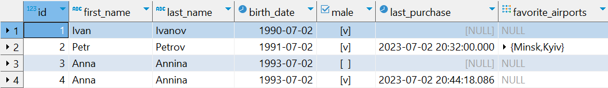

***

   

DML. Команда SELECT
===================

Сегодняшняя статья (а более глобально – минимум, пять ближайших статей) будет посвящен тому, какие инструменты SQL предлагает для чтения данных из таблиц, их фильтрации, сортировки, группировки и объединения.

Непосредственно в этом уроке мы разберем синтаксис оператора, позволяющего «выбрать» что-то «откуда-то». Нюансы с фильтрациями и сортировками оставим для будущих статей.

Итак, уже, полагаю, понятно, что оператор для получения выборки называется «**_SELECT_**». Он позволяет получить указанный в запросе литерал или результат указанного в запросе выражения (результаты выборки представлены для консольного клиента, чтобы не загромождать статью скриншотами):

**Пример 1**:

```java
select 1;
```

Результат:

```java
?column?
----------
  1
(1 row)
```

  

**Пример 2**:

```java
select 2 * 2;
```

Результат:

```java
?column?
----------
  4
(1 row)
```

  

**Пример 3**:

```java
select 2 * 2 as result;
```

Результат:

```java
result
----------
  4
(1 row)
```

  

**Пример 4**:

```java
select 2 * 2 product, 2 + 2 as sum;
```

Результат:

```java
 product | sum
---------+-----
       4 |  4
(1 row)
```

  

Кроме того, мы можем получать информацию из таблицы:

**Пример 5**:

```java
select * from passenger;
```

Результат:

```java
 id | first_name | last_name | birth_date | male |      last_purchase       | favorite_airports
----+------------+-----------+------------+------+----------------------------+-------------------
 1 | Ivan      | Ivanov   | 1990-07-02 | t   |                           |
 2 | Petr      | Petrov   | 1991-07-02 | t   | 2023-07-02 20:32:00       | {Minsk,Kyiv}
3 | Anna      | Annina   | 1993-07-02 | f   |                           |
 4 | Anna      | Annina   | 1993-07-02 | t   | 2023-07-02 20:44:18.086893 |
(4 rows) 
```

Отображение оставляет желать лучшего, но таковы суровые реалии жизни консольщиков. При использовании графического интерфейса все намного удобнее:



  

**Пример 6**:

```java
select id, birth_date from passenger;
```

Результат:

```java
 id | birth_date
----+------------
  1 | 1990-07-02
  2 | 1991-07-02
  3 | 1993-07-02
  4 | 1993-07-02
(4 rows)

```

Кроме того, при использовании _SELECT_ доступно использование различных **функций**, как предоставляемых СУБД, так и самописных (о них – сильно позже):

  

**Пример 7**:

```java
select id, concat(first_name, ' ', last_name) as name from passenger;
```

Результат:

```java
 id |   name
----+-------------
  1 | Ivan Ivanov
  2 | Petr Petrov
  3 | Anna Annina
  4 | Anna Annina
(4 rows)
```

  

Предлагаю разобрать каждый из примеров выше.

  

#### select 1;

Полагаю, достаточно очевидный запрос: мы пытаемся получить единицу, ее и получаем.

#### select 2 \* 2;

Здесь немного сложнее. Мы запрашиваем «_2×2_» и получаем результат этого выражения. Достаточно понятно интуитивно, но подчеркну: выражения после _SELECT_ выполняются. Вызов функции тоже считается выражением

#### select 2 \* 2 as result;

Отличие от предыдущего запроса заключается в том, что мы предоставляем «**псевдоним**» (**алиас**, alias) для результата выражения. Точнее, даем название колонки в результирующей таблице (результатом _SELECT_ всегда является таблица). В ряде случаев, например, когда мы получаем данные из таблицы, колонка может именоваться автоматически. Но когда колонка состоит из результатов выражений, имя колонки может определяться как «_?column?_» или как названием вызванной функции (уберите «_as name_» в последнем примере и запустите запрос).

Так или иначе, зачастую необходимо корректное название для колонки. Это может понадобится как при интерпретации результатов запроса в коде приложения (например, чтобы превратить (**смаппить**, от _to map_ – отображать) полученные записи в Java-объекты), так и в рамках самого SQL, если необходимо обрабатывать результаты запроса (например, в другом запросе).

Кроме того, остается и информационная функция названия – очевидно, что осознанное имя дает больше информации, чем сгенерированное SQL (за исключением выборки из одной таблицы без каких-либо преобразований данных).

Итак, оператор _AS_ позволяет присвоить колонке псевдоним, который мы считаем нужным. Помните, что слова в SQL принято разбивать символом «\_», а регистр не играет значения.

Также стоит отметить, что в postgres _AS_ не является обязательным оператором для указания псевдонима колонки в _SELECT_**\***, т.е. его можно опустить. Использовать его на практике или нет – дело ваше. На мой взгляд, он может быть удобен, если описание колонки представляет собой сложное выражение, чтобы подчеркнуть границы этого выражения. В остальных случаях я предпочитаю его опускать. Так, наш пример можно упростить до:

```java
select 2 * 2 result;
```

> **\*** У оператора **AS** есть и другие области применения, где использовать его обязательно.

#### select 2 \* 2 as product, 2 + 2 as sum;

В целом, пример похож на предыдущий, но его результатом является таблица с двумя колонками (произведением и суммой). Таким образом, число колонок в результирующей таблице определяется числом выражений, разделенных между собой запятой. На самом деле, это не всегда верно и колонок может быть больше, чем «_число запятых + 1_» сразу по нескольким причинам. Но можете быть уверены: в результирующей таблице колонок будет НЕ МЕНЕЕ, чем «_число запятых + 1_».

#### select \* from passenger;

Теперь переходим к основному назначению _SELECT_ – получению данных «откуда-то».

Источником данных может выступать таблица, представление (мы с ними еще познакомимся), другой запрос и т.д. Так или иначе, для обращения к источнику данных необходимо использовать оператор «**_FROM_**».

«**_\*_**» в данном случае означает, что мы запрашиваем все колонки из источника в их естественном порядке.

Таким образом, данный запрос можно интерпретировать как «_ВЫБРАТЬ (_**_select_**_) данные по ВСЕМ (_**_\*_**_) колонкам ИЗ (_**_from_**_) таблицы ПАССАЖИРЫ (_**_passenger_**_)_».

#### select id, birth\_date from passenger;

Данный запрос похож на предыдущий, но делает выборку не по всем колонкам, а только по указанным.

В целом, использование \* – достаточно спорная идея по ряду концептуальных и технических причин. Но это более лаконично и удобно на первых этапах. А также в ряде рутинных операций в дальнейшем.

Так или иначе, мы может выбирать из таблиц конкретные колонки, также можем указать порядок следования колонок (не обязательно тот, который представлен в таблице) или даже сделать выборку одной и той же колонки несколько раз в рамках запроса:

```java
select birth_date, id, id from passenger;
```

И, как и в запросах выше, мы можем давать колонкам свои псевдонимы, используя _AS_ или опуская его.

#### select id, concat(first\_name, ' ', last\_name) as name from passenger;

Данный пример демонстрирует работу функции конкатенации для строк, склеивая для каждой из выбранных записей (строк таблицы) значение _first\_name_, литерала « » (пробел) и _last\_name_. Таким образом, в выборку попадают не обособленные колонки, а объединенное имя пассажира. Также самой колонке присваивается псевдоним «name». Имя по умолчанию было бы «_concat_» – по названию использованной функции.

> Обратите внимание, что оператор «_+_» в SQL не предназначен для конкатенации строк (в отличии от Java).

С теорией на сегодня все!

Уже в следующем уроке мы познакомимся с инструментом, позволяющим фильтровать записи при выборке из таблиц, получая лишь те, которые подходят по заданные критерии. Пока же рекомендую освоить функциональность самого _SELECT_.


Переходим к практике:

### Задача 1

Получите список имен, фамилий и дат рождений всех пассажиров.

### Задача 2

Получите список любимых аэропортов по каждому пассажиру.

### Задача 3

Получите первый из любимых аэропортов по каждому пассажиру.

Массивы в SQL нумеруются с 1. Синтаксис для получения элементов массива не отличается от Java

  

Если что-то непонятно или не получается – welcome в комменты к посту или в лс:)

Канал: [https://t.me/ViamSupervadetVadens](https://t.me/ViamSupervadetVadens)

Мой тг: [https://t.me/ironicMotherfucker](https://t.me/ironicMotherfucker)

_Дорогу осилит идущий!_