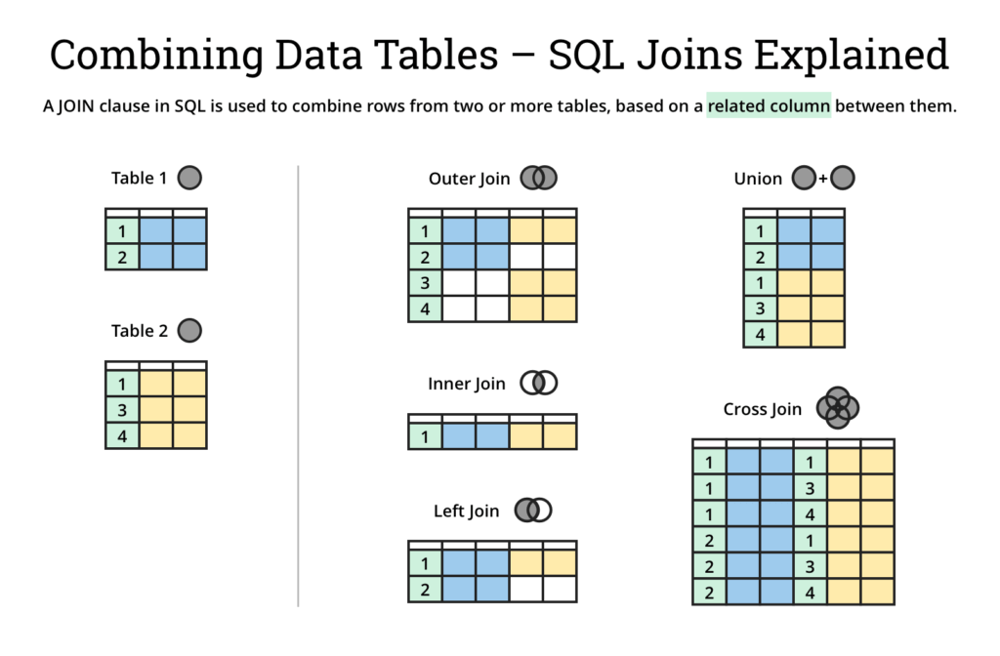

***

   

DML. JOIN
=========

В сегодняшней статье разберемся, каким образом можно связать две таблицы в рамках одного SELECT-запроса.

Для этого нам понадобится таблица, которая будет представлять связанную сущность. Пусть это будет сущность “_билет_”.

Создадим саму таблицу. Подробно познакомимся с синтаксисом в ближайшие пару уроков, пока - просто копируем и выполняем запрос ниже:

```java
create table ticket (
  id                     bigserial,
  departure_airport      varchar(100),
  arrival_airport        varchar(100),
  departure_date         timestamp,
  arrival_date           timestamp,
  purchase_date          timestamp,
  passenger_id           bigint
);
```

Вы можете заметить поле _passenger\_id_ в таблице выше. Оно необходимо для обеспечения связи с таблицей пассажиров на уровне данных. Логично предположить, что у одного пассажира может быть несколько билетов, поэтому закладываем связь M2O (или O2M, если смотреть со стороны таблицы _passenger_).

Наполнить данную таблицу можете на свой вкус, но следите, чтобы в колонку _passenger\_id_ попадали только значения, существующие в _passenger\_id_ \- мы еще не познакомились с конструкцией, которая позволяет делать такую валидацию автоматически.

Теперь, подготовив таблицу и данные в ней, можем приступить к изучению способов связывания таблиц.

  

### Оператор JOIN

Основным способом связывания таблиц в SQL является оператор **_JOIN_**. Он используется вместе с дополнительными операторами: **_ON_**, **_USING_**, **_NATURAL_**. Чтобы избежать каши, в рамках статьи мы будем разбирать только вариант с первым вспомогательным оператором - _ON_.

Оставшиеся два являются синтаксическим сахаром, позволяющим описывать способ связывания более лаконично, но имеют свои особенности, не привнося при этом никаких новых возможностей. Желающие могут ознакомиться самостоятельно (по ссылке - русскоязычная документация по _JOIN_, может быть полезна для закрепления материала в целом): [_ссылка_](https://postgrespro.ru/docs/postgresql/9.6/queries-table-expressions#:~:text=7.2.1.1.%20%D0%A1%D0%BE%D0%B5%D0%B4%D0%B8%D0%BD%D1%91%D0%BD%D0%BD%D1%8B%D0%B5%20%D1%82%D0%B0%D0%B1%D0%BB%D0%B8%D1%86%D1%8B)

Простейший запрос с помощью _JOIN_ в нашем случае может выглядеть так:

```java
select * from passenger p
join ticket t on p.id = t.passenger_id;
```

После _ON_ располагается условие связывания - оно подобно WHERE-условиям. Записи считаются связанными, если JOIN-условие вернет для них _true_. В большинстве случаев такое условие является проверкой равенства колонок, обеспечивающих связь (в нашем случае - _p.id_ и _t.passenger\_id_). Но иногда могут встречаться и дополнительные условия (как правило, связанные с фильтрацией выборки, но указанные в JOIN-, а не в WHERE-условиях).

Запрос выше вернет информацию по всем пассажирам и его билетам. Для каждого пассажира с _N_ билетов, в итоговой выборке будет _N_ строк. Т.е. если билетов у пассажира нет - в итоговую выборку он не попадет.

Теперь, когда перед глазами есть пример, разберемся в видах JOIN’ов - они определяются с помощью дополнительных модификаторов и определяют, как именно будет формироваться итоговая выборка.

  

### INNER JOIN

Вид JOIN’а, который используется в запросе выше. INNER является не обязательным модификатором и его можно опустить. С ним запрос выше выглядел бы так:

```java
select * from passenger p
inner join ticket t on p.id = t.passenger_id;
```

Результаты запроса идентичны результатам в примере выше.

На мой взгляд, в документации очень удачно описано, как формируется выборка по различным видам JOIN’ов, поэтому ниже буду прибегать к выдержкам оттуда.

Итак, _INNER JOIN_:

> Для каждой строки **R1** из **T1** (в нашем случае - **passenger**) в результирующей таблице содержится строка для каждой строки в **T2** (**ticket**), удовлетворяющей условию соединения с **R1**.

Таким образом, в выборку попадет только пересекающееся подмножество:


  

В силу того, что _INNER_ не является обязательным модификатором, можно считать _INNER JOIN_ - JOIN’ом по умолчанию.

  

### LEFT OUTER JOIN

Этот тип JOIN’а обеспечивает наличие всех строк из левой таблицы. Если есть подходящие связанные строки в правой - они будут добавлены (поведение как в _INNER JOIN_). Строкам левой таблицы, которым не найдено соответствие в правой таблице, будет соответствовать по одной строк в результирующей выборке (вместо значений из правой таблицы будут подставлены NULL'ы):

```java
select * from passenger p
left outer join ticket t on p.id = t.passenger_id;
```

При этом модификатор _OUTER_ является опциональным, его можно опустить:

```java
select * from passenger p
left join ticket t on p.id = t.passenger_id;
```

Описание из документации:

> Сначала выполняется внутреннее соединение (**INNER JOIN**). Затем в результат добавляются все строки из **T1**, которым не соответствуют никакие строки в **T2**, а вместо значений столбцов **T2** вставляются **NULL**. Таким образом, в результирующей таблице всегда будет минимум одна строка для каждой строки из **T1**.

Визуализация:


  

### RIGHT OUTER JOIN

Данный вид JOIN’а зеркален предыдущему (_OUTER_, опять же, опционален):

```java
select * from passenger p
right join ticket t on p.id = t.passenger_id;
```

Такой запрос вернет все билеты, если какому-то из них не будет соответствовать пассажира - колонки, ему соответствующие, будут заполнены NULL’ами.

Если опустить в выборке порядок колонок по умолчанию, подобный запрос можно описать с помощью _LEFT JOIN_ лишь поменяв таблицы местами:

```java
select * from ticket t
left join passenger p on p.id = t.passenger_id;
```

Описание из документации:

> Сначала выполняется внутреннее соединение (**INNER JOIN**). Затем в результат добавляются все строки из **T2**, которым не соответствуют никакие строки в **T1**, а вместо значений столбцов **T1** вставляются **NULL**. Это соединение является обратным к левому (**LEFT JOIN**): в результирующей таблице всегда будет минимум одна строка для каждой строки из **T2**.

Визуализация:


  

  

### FULL OUTER JOIN

_FULL JOIN_ (_OUTER_ \- опционален) позволяет получить из двух таблиц пересекающиеся записи (как в _INNER JOIN_), а также записи каждой из таблиц, для которых не нашлось записей в связанных таблицах (колонки связанных таблиц будут заполнены NULL’ами):

```java
select * from passenger p
full join ticket t on p.id = t.passenger_id;
```

Для этого вида JOIN’ов порядок таблиц (первая и вторая или же левая и правая) не имеют значения по очевидным причинам. Как, впрочем, и для _INNER JOIN_.

  

Для наглядности, запрос выше можно также представить как UNION-запрос с _LEFT JOIN_ и _RIGHT JOIN_. Результирующая выборка будет идентичной**\***:

```java
select * from passenger p
left join ticket t on p.id = t.passenger_id
union
select * from passenger p
right join ticket t on p.id = t.passenger_id;
```

> **\***При кратно худшей производительности. В реальных задачах так извращаться не стоит.

Описание из документации:

> Сначала выполняется внутреннее соединение. Затем в результат добавляются все строки из **T1**, которым не соответствуют никакие строки в **T2**, а вместо значений столбцов **T2** вставляются **NULL**. И наконец, в результат включаются все строки из **T2**, которым не соответствуют никакие строки в **T1**, а вместо значений столбцов **T1** вставляются **NULL**.

Визуализация:


  

  

### CROSS JOIN

Особняком от остальных видов _JOIN_ стоит _CROSS JOIN_.

Результатом связи таблиц через _CROSS JOIN_ является декартово произведение всех записей - иными словами, каждой записи из _таблицы1_ будет соответствовать _N_ записей из _таблицы2_, где _N_ - число записей в _таблице2_.

Еще проще: это связь всех со всеми.

По понятным причинам, в _ON_ и последующих условиях такой вид связи не нуждается.

Пример:

```java
select * from passenger p
cross join ticket t;
```

В силу специфики подобного запроса, он является достаточно дорогостоящим. Благо, необходимость в таком виде соединения, как правило, не возникает.

Описание из документации:

> Соединенную таблицу образуют все возможные сочетания строк из **T1** и **T2** (т. е. их декартово произведение), а набор ее столбцов объединяет в себе столбцы **T1** со следующими за ними столбцами **T2**. Если таблицы содержат **N** и **M** строк, соединенная таблица будет содержать **N \* M** строк.

  

### Несколько JOIN’ов и другое

Зачастую при работе с БД требуется в одном запросе связать более, чем две таблице - как в формате _таблица1-таблица2 + таблица2-таблица3_ (классический сценарий для M2M, явного или неявного), так и в формате _таблица1-таблица2 + таблица1-таблица3_ - в общем-то, любая выборка, где условия требуют получения информации/фильтрации/сортировки из трех и более таблиц одновременно.

Ничего сложного в таких запросах нет, но рассмотрим пример на базе абстрактных таблиц (в нашей текущей осознанный запрос с несколькими JOIN’ами построить проблематично):

```java
select * from table1 t1
join table2 t2 on t2.id = t1.t2_id
join table3 t3 on t3.id = t2.t3_id;
```

Виды JOIN’ов могут быть любыми, в т.ч. разными от таблицы к таблице.

  

Кроме того, можно делать JOIN не только для обычной таблиц, но и для подзапроса:

```java
select * from table1 t1
join (select * from table2) t2 on t2.id = t1.t2_id;
```

Вы могли обратить внимание, что в этом уроке повсеместно используются алиасы в примерах запросов. Они не всегда обязательны, но рекомендую их использовать, чтобы не возникало конфликтов с одинаковыми колонками в нескольких таблицах и просто для повышения читабельности запроса - далеко не всегда можно вспомнить к какой таблице какая колонка относится.

  

Бонус. Порядок блоков в рамках SELECT-запроса с учетом JOIN:

```java
select count(*), p.male from passenger p
left join ticket t on p.id = t.passenger_id
where p.last_purchase is not null
group by p.male
having count(*)> 1
order by p.male
limit 1 offset 0;
```

Также прилагаю картинку с визуализацией видов JOIN’ов (и, бонусом _UNION_). Она не идеальна, но может выступить небольшой шпаргалкой:



  

С теорией на сегодня все!


Переходим к практике:

### Задача 1

Посчитайте число билетов, сгруппировав их по фамилиям пассажиров. Отобразите только те группы, где число билетов больше 3.

  

### Задача 2

Найдите наиболее популярный аэропорт прибытия для каждой из фамилий пассажиров.

  

Если что-то непонятно или не получается – welcome в комменты к посту или в лс:)

Канал: [https://t.me/ViamSupervadetVadens](https://t.me/ViamSupervadetVadens)

Мой тг: [https://t.me/ironicMotherfucker](https://t.me/ironicMotherfucker)

_Дорогу осилит идущий!_