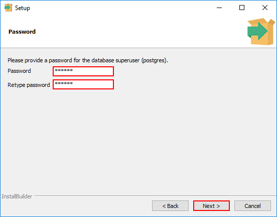
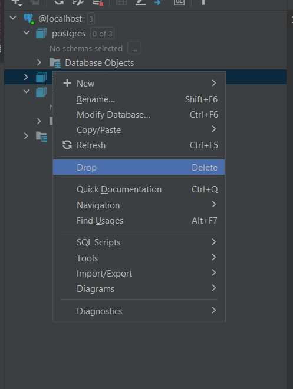

# Установка PostgreSQL. PgAdmin и инструменты визуализации БД. Создание и удаление БД

Итак, в прошлом уроке мы постарались разобраться в том, что такое база данных, зачем нужны БД и как их можно
классифицировать.

В рамках текущей статьи мы начнем знакомство с одной из наиболее популярных реляционных СУБД **PostgreSQL** (он же *
*postgres**, он же **pg**).

C ней вы, вероятнее всего, часто будете сталкиваться в рамках коммерческих проектов – PostgreSQL, наверно, самая
популярная реляционная БД в Java-мира, по крайней мере, современной его части.

Итак. Данный урок будет разбит на несколько частей, каждая из них достаточно проста:

1. Установка СУБД;

2. Краткое знакомство с инструментами, обеспечивающими более комфортное взаимодействие с СУБД, нежели консоль. Она тоже
   хороша, но не во всем:)

3. Создание и удаление баз данных – в данном случае под БД подразумевается конкретное хранилище данных, а не СУБД.

### Установка PostgreSQL

В зависимости от операционной системы компьютера и ваших навыков способ установки может отличаться:

1. ***MacOS*** *и* ***Linux***: любые установщики на ваш вкус – тот же apt без проблем поймет, что вам нужно. Но можно и
   [скачать сборку](https://www.enterprisedb.com/downloads/postgres-postgresql-downloads) самостоятельно.

2. ***Windows***. Здесь тоже [скачиваем сборку](https://www.enterprisedb.com/downloads/postgres-postgresql-downloads)
   под свою систему (рекомендую качать самую свежую версию, но в рамках курса это вряд ли будет иметь значение).

3. Вне зависимости от платформы, можно развернуть Postgres в ***докере***. Вероятно, в одном из уроков вне основных
   разделов мы познакомимся с Docker в рамках курса, в т.ч. рассмотрим, как можно запустить в нем PostgreSQL. Пока же
   это остается уделом тех, кто уже умеет. В целом, я рекомендую именно этот способ, если он не вызывает затруднений.

Ниже вкратце разберемся с установкой PostgreSQL для Windows.

После скачивания установочного файла его достаточно запустить с правами администратора.

Вероятно, вам встретит примерно такое окно:


Нам точно нужен PostgreSQL Server и Command Line Tools. pgAdmin 4 – опционально, в рамках следующего пункта мы его
вкратце затронем, по итогам решите самостоятельно, собираетесь ли его использовать. Stack Builder в рамках курса не
пригодится, но он может понадобиться для pgAdmin.

Далее вам будет предложено выбрать директорию установки – полагаю, тут ничего сложного.

После потребуется задать пароль для пользователя СУБД по умолчанию:



Почему-то забывать пароль от postgres – фетиш многих новичков, поэтому рекомендую максимально простые варианты.
Обычно – «*postgres*», «*root*», «*1*». До тех пор, пока вы работаете с СУБД в учебных целях – этого достаточно. Если
забудете пароль – восстановление будет большой проблемой.

Далее будет предложено выбрать порт, по которому будет доступен postgres в рамках ***localhost***. По умолчанию
используется 5432. Если вы не понимаете, что написано в предыдущем предложении – не изменяйте это значение. Если
понимаете – ставьте любой свободный, если 5432 по каким-то причинам занят.

После этого останется выбрать локаль. Рекомендую оставить стандартную, но если с английским все плохо – можете выбрать
на свой вкус. Русская тоже доступна.

Далее прокликиваем установку и бинго – вы установили свою первую СУБД!

### Интерфейсы для работы с БД. Инструменты визуализации БД. PgAdmin

Установив СУБД, мы можем работать с ней: создавать и удалять базы данных, работать с сущностями в рамках созданных баз
данных и многое другое.

Но чтобы делать хоть что-то из перечисленного, требуется некий инструмент, интерфейс, который позволит взаимодействовать
с СУБД.

PostgreSQL предлагает два варианта: консольной приложение и приложение с GUI (графическим интерфейсом).

#### psql

Первый – консольный – вариант носит гордое имя **psql** и найти его можно в директории установки Postgres (которая была
выбрана при установке):

              %выбранная\_директория%/%версия\_pg%/bin.

В случае с Windows, по умолчанию будет что-то вроде

                C:\\Program Files\\PostgreSQL\\15\\bin

Внутри (для Windows) будет доступна утилита ***psql.exe***

Обращаться к ней рекомендую через cmd\*:

```
> cd "C:\\Program Files\\PostgreSQL\\15\\bin"
> psql.exe -U postgres
```

Вам будет предложено ввести пароль (указанный при установке). Поздравляю, вы внутри!

> * *Я не вижу смысла расписывать подробно для пользователей Linux или MacOS, уверен, вы знакомы с основами работы с*
     *терминалом.*

В следующем пункте рассмотрим, как через консольное приложение создавать/удалять БД. Взаимодействие с самой базой данных
будем рассматривать в следующих уроках.

#### Графический интерфейс

Однако консольный интерфейс – не самый дружелюбный вариант. Он хорош в определенных ситуациях, но работать через него на
постоянной основе не очень удобно.

Работая с СУБД, мы, как правило, работаем с массивами информации – как касающимися структуры БД – БД, схемы, таблицы и
пр., так и массивами данных – записями в таблицах. Для комфортной работы со всем описанным созданы программы, которые мы
рассмотрим ниже.


<center>Пример внешнего вида DataGrip - с ним мы познакомимся чуть ниже</center>

Большинство СУБД предлагают собственные программы с GUI. В случае с PostgreSQL – **pgAdmin**. Версия по умолчанию
зависит от версии PostgreSQL, если вы устанавливали последнюю – **pgAdmin 4**.

Я не рекомендую привязываться к нему, но считаю нужным упомянуть о его существовании. Если после прочтения урока решите
работать с ним – на метаните можно найти несколько [вводных
уроков](https://metanit.com/sql/postgresql/1.2.php).

Проблема у pgAdmin ровно одна (ладно, не одна, но не суть): он подходит только для PostgreSQL.

Зачастую на проектах может использоваться несколько СУБД, или же у разработчика может быть несколько проектов с разными
СУБД. Почти каждая из них будет готова предоставить свое решение для визуализации взаимодействия. Но каждая из них
занимает место, имеет различия интерфейса и особенности в работе. Держать целый зоопарк для более-менее однотипных
взаимодействий не очень комфортно, поэтому существует ряд программ, предоставляющих возможностью одновременно работать с
различными СУБД. Часть из них являются платными, часть – нет.

Ниже представлены несколько вариантов, составляющих мой личный топ. В целом, вы можете найти любую другую, особенно,
если нет возможности работать через одну из первых двух:

1. ***Intellij IDEA Ultimate***. Да, идея предоставляет инструмент для работы с БД, что достаточно удобно. Если есть
   возможность использовать ее – отлично;

2. ***DataGrip***. Решение от разработчика IDEA – JetBrains, но направленное исключительно на работу с БД. К сожалению,
   тоже является платным продуктом. Функционально и по интерфейсу мало чем отличается от IDEA. Если будет необходимость
   прилагать скриншоты – я буду использовать именно этот продукт;

3. ***DBeaver***. Имеет бесплатную версию. Вероятно, наиболее популярный из бесплатных вариантов.

#### DataGrip

Рассмотрим подключение к Postgres с помощью DataGrip (для других двух вариантов все практически идентично).

При запуске программы нам будет предложено создать проект. Достаточно просто указать название.

После этого станет доступна рабочая область, внешне напоминающая IDEA. Слева (или справа) будет доступна вкладка 
«**Database Explorer**»:


По нажатию на «**+**» будет предложен выпадающий список. Нас интересует **Data Source -> PostgreSQL**.


При нажатии появится окно, предлагающая указать параметры подключения. В нашем случае:

- **Host**: *localhost*;

- **Port**: *5432* – который был указан при установке СУБД;

- **User**: *postgres*

- **Password** – который был указан при установке СУБД;

- **Database** – по умолчанию заполнено как «postgres», в нашем случае – оставляем пустым.


Нажимаем **OK** и во вкладке **Database Explorer** видим примерно следующее:


Поздравляю, вы вновь внутри!

### Создание и удаление БД

Данный пункт достаточно короткий.

Через psql создать БД можно командой:

`create database %имя бд%;`

Например:

`create database test\_db;`

После этого psql должен сообщить: **CREATE DATABASE**

Удаление не сильно сложнее:

`drop database test\_db;`

Ответ psql: **DROP DATABASE**

Через графический интерфейс все примерно также, но кнопочками:
**\*ПКМ по созданному datasource’у\* – New -> Database**


В результате появится окно, в котором будет предложено ввести имя БД и ряд других параметров. На данном этапе нам
достаточно имени. Внизу будет написан сформированный SQL-запрос – аналог того, что мы делали через psql:


Удаление происходит по схожему принципу:
**\*ПКМ по удаляемой БД\* -> Drop -> OK** (во всплывающем окне)



Вы удалили БД, вы великолепны!

На сегодня все!

Как видите, на данном этапе нет ничего сложного. По сути, сегодня был
аналог [Урока 0](https://github.com/KFalcon2022/lessons/blob/master/lessons/environment/0/Set%20up%20environment.md),
только для БД:)


Если что-то непонятно или не получается – welcome в комменты к посту или в лс:)

Канал: https://t.me/ViamSupervadetVadens

Мой тг: https://t.me/ironicMotherfucker

***Дорогу осилит идущий!***