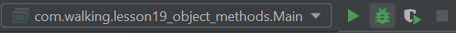
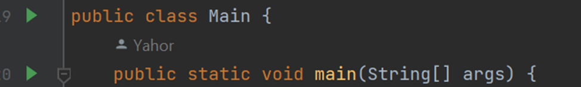
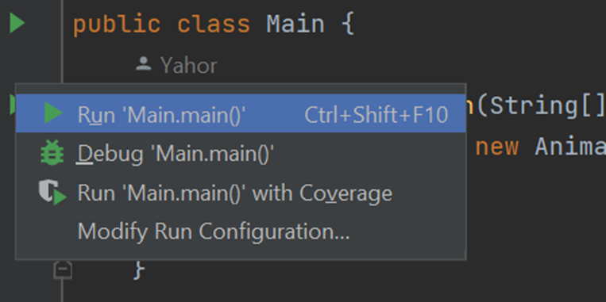
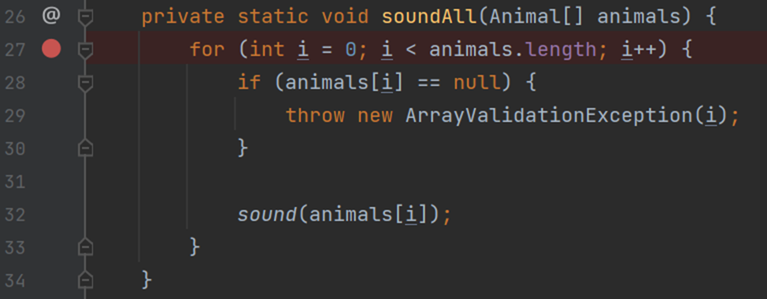
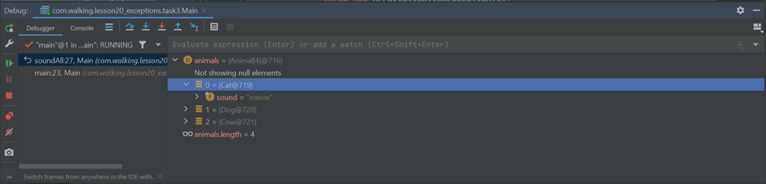

# Отладка кода. Debugger

Очень часто в задачах, даже учебных, возникают ситуации, когда поведение программы или отдельных участков кода
непонятно. В таких случаях может помочь **построчная отладка кода** через **дебаггер**.

**Debugger** – программа для автоматизации процесса отладки кода.

В рамках этого урока мы познакомимся с дебаггером в IDEA.

Оговорюсь, что «**дебажить**» можно не только программы, запускаемые непосредственно на устройстве, но, например, и код
на **удаленном сервере** (при условии наличия дебаггера на оном). Но это выходит за рамки текущего курса.

Итак, как же запустить дебаггер?

<u>Способ 1:</u>

В правом верхнем углу IDEA есть панель запуска программы:

Зеленый треугольник – запуск программы без дебаггера. Следующий за ним (выделен, похож на зеленого жука) – запуск
программы в режиме дебага.

<u>Способ 2:</u>

В классе, содержащем метод *main()* (или в классах с тестами, но сейчас не об этом) напротив самого метода *main()* и
объявления класса, содержащего этот метод, есть зеленый треугольник. Клик по нему приведет к появлению выпадающего
списка, по содержанию схожего с панелью запуска:

Нас, опять же, интересует пункт «Debug» с символом зеленого жука.

Кроме того, для запуска (как обычного, так и в режиме дебага) можно использовать шорткаты. Они могут зависеть от
пользовательских настроек и **операционной системы** (**ОС**) устройства, посмотреть их можно в настройках: *File ->
Settings -> Keymap*.

Однако сам по себе запуск в режиме дебага не позволит нам отладить программу. Нам надо указать дебаггеру, какое место в
коде мы хотим отладить. Для этого существует механизм **точек останова** – **breakpoint**’ов (на профессиональном
сленге – **бряка, бряки**).

Установить breakpoint можно щелчком мыши справа от номера строчки:

При этом в месте клика появится один из трех символов:

1. *Серый круг с косой линией внутри* (похоже на дорожный знак «стоянка запрещена»): бряка никогда не будет достигнута;
2. *Красный ромб* (при установке точки останова на объявлении метода): дебаггер приостановит программу в первой строчке
   вызванного метода, когда оная будет достигнута;
3. *Красный кружок* (см. скриншот выше): точка останова установлена, программа будет приостановлена, если исполнение
   кода дойдет до этой строки.

При запуске программы красный кружок может оказаться помечен галочкой, что означает, что в ходе выполнения программы
есть вероятность достигнуть этой строки. Либо же может превратиться в серый круг, что означает, что эта точка останова
достигнута не будет.

Убрать точку останова можно просто кликнув по ее иконке (кругу или др.)

При достижении breakpoint’а программа приостановит выполнение. Внизу откроется вкладка «*Debug*», которая будет
содержать данные о значениях доступных переменных, информацию о потоках и ряд другой информации, описывающей состояние
программы в момент достижения конкретной строки кода:

В панели слева можно увидеть ряд кнопок, позволяющих (сверху вниз):

1. Перезапустить программу;
2. Изменить конфигурацию (на данном этапе не актуально);
3. Продолжить выполнение программы после точки останова (она будет приостановлена на следующей бряке, если такая есть).
   Шорткат для этой кнопки – **F9**;
4. Приостановить выполнение программы. Программа будет приостановлена в строке кода, исполняемой в данный момент, как
   если бы в выполняемом месте стоял breakpoint. Кнопка доступна только если программа не приостановлена прямо сейчас.
   Достаточно специфичная функциональность, вряд ли она понадобится нам в обозримом будущем. Впрочем, она иногда
   помогает отловить бесконечный цикл или рекурсивные вызовы;
5. Прервать выполнение программы;
6. Посмотреть все установленные breakpoint’ы (два наложенных круга). Советую посмотреть более подробно, в открывающемся
   окне есть и другие интересные возможности, например – приостановка программы при возникновении любого исключения и
   просто удобные инструменты управления точками останова;
7. Временно отключить работу точек останова (не удалить, а именно приостановить до момента, когда они снова
   понадобятся).

В верхней части вкладки также есть несколько кнопок (советую запомнить эквивалентные им шорткаты, это сделает работу с
дебаггером более комфортной). Слева направо:

1. Перейти к текущей точке останова. На случай, если вы закопались в код и не помните, где ваша программа остановилась.
   На самом деле, одна из самых бесполезных кнопок:)
2. Перейти к следующей строке (**F8**);
3. «Нырнуть» в метод, вызываемый в активной строке (**F7**). IDEA позволит вам выбрать конкретный метод, если в строке
   несколько различных вызовов (например, параметром метода служит результат другого метода: *doSth(doSthOther())*);
4. Принудительно «нырнуть» в метод. Как правило, достаточно предыдущей кнопки, данная функия может быть актуальна только
   если у IDEA нет исходного кода метода, в который вы пытаетесь войти. Тогда идея попытается **декомпилировать** код
   класса, в который вы пытаетесь зайти дебаггером. Это может быть актуально при работе с какими-либо сторонними
   библиотеками. Шорткат – **alt+shift+F7**, возможно зависит от ОС;
5. «Вынырнуть» из метода. Может быть полезно, если вы слишком часто до этого жали на F7 и забрались глубже, чем
   следовало. Шорткат – **shift+F8**;
6. Перейти к курсору. Не самая популярная функция. Работает также, как и возобновление работы программы до следующей
   бряки (F9). Программа будет приостановлена на следующей точке останова или в месте нахождения курсора (в зависимости
   от того, до чего программа пройдет раньше). Шорткат – **alt+F9**;
7. *Evaluate expression*. Открывает модальное окно, в котором можно запустить какой-либо код. Он будет исполнен с учетом
   текущих значений переменных. К слову, при построчной отладке вы можете напрямую обращаться к приватным полям
   объектов.

Также на вкладке дебага вы можете увидеть стектрейс, приведший вас в текущую строчку. На скриншоте выше – *метод
soundAll(), 27 строка класса Main*. Был вызван в *методе main(), 23 строке класса Main*. Кликом по строке стектрейса вы
можете перейти в нее и увидеть состояние программы – значения доступных переменных – на момент вызова метода, в котором
дебаггер находится сейчас.

Возвращаясь к самому правому блоку на вкладке (с доступными переменными и их значениями), стоит также отметить, что
можно запустить выполнение какого-либо выражения (одной строчки кода, результат которой не *void*). Такое выражение
можно написать в строке ввода (*Evaluate expression (Enter)…*) и даже добавить это выражение к рассчитываемым
постоянно (*«+» с очками* в правой части строки ввода). В таком случае дебаггер будет пытаться дать актуальный результат
выражения для каждой строки, в которой вы приостановили выполнение программы.

Теперь, когда мы познакомились с основными возможностями дебаггера (по крайней мере, не касаясь дебага многопоточных
программ), ненадолго вернемся к установке breakpoint’ов.

Если кликнуть по бряке (по красному кругу, например) правой кнопкой мыши, можно увидеть настройки текущей точки
останова. В целом, они доступны и в менеджере точек останова (два наложенных кружка в левой панели вкладки Debug). Но
нас интересует одна возможность, которую удобнее применять сразу при установке breakpoint’a: мы можем прописать условие
его срабатывания. Обычно таким условием является определенное значение переменной или переменных. Например, устанавливая
breakpoint внутри цикла, мы хотим, чтобы он отработал только тогда, когда переменная (пусть будет i) равна 10. В таком
случае программа будет пропускать все прохождения точки останова, в которых i != 5. Условие описывается условным
выражением в Java. Т.е. доступны операторы сравнения, операторы логических И, ИЛИ и пр.

Безусловно, эта информация не обязательна, но без нее процесс дебага, особенно циклов или рекурсивных алгоритмов
становится очень монотонным процессом, где всегда есть шанс пропустить остановку программы именно в тех условиях,
которые нам нужны:)

### В качестве вывода

Дебаггер достаточно прост в базовом использовании (на уровне шорткатов F7-F8-F9), но нужен в работе практически
ежедневно. Именно поэтому стоит научиться работать с ним эффективно, используя по максимуму ту дополнительную
функциональность, которую он предлагает. Это сэкономит вам много времени и нервов. В рамках этой статьи я постарался
разобрать лишь основные и наиболее полезные возможности. Безусловно, их актуальность получится осознать в полной мере
лишь с опытом. Однако рекомендую всегда задумываться над тем, как упростить рутинные операции при дебаге. В большинстве
случаев можно найти функционал, который автоматизирует часть процесса и сделает его за вас. Возможно, сэкономит
несколько часов или даже больше.

Искренне надеюсь, что в текущей статьи вы нашли что-то новое и полезное для себя.

С теорией на сегодня все!

Урок ознакомительный, поэтому сегодня без практических заданий. Но советую самостоятельно подебажить свои старые
программы, особенно те, где было много ветвлений логики или циклов. Попробуйте на практике возможности, рассмотренные в
статье.

Если что-то непонятно или не получается – welcome в комменты к посту или в лс:)

Канал: https://t.me/ViamSupervadetVadens

Мой тг: https://t.me/ironicMotherfucker

***Дорогу осилит идущий!***