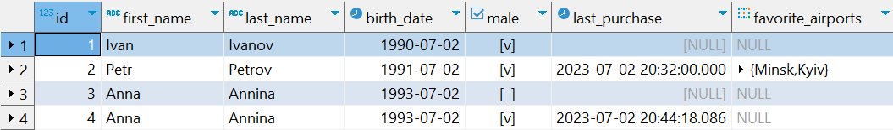

# DML. Команда SELECT

Сегодняшняя статья (а более глобально – минимум, пять ближайших статей) будет посвящен тому, какие инструменты SQL
предлагает для чтения данных из таблиц, их фильтрации, сортировки, группировки и объединения.

Непосредственно в этом уроке мы разберем синтаксис оператора, позволяющего «выбрать» что-то «откуда-то». Нюансы с
фильтрациями и сортировками оставим для будущих статей.

Итак, уже, полагаю, понятно, что оператор для получения выборки называется «`SELECT`». Он позволяет получить указанный
в запросе литерал или результат указанного в запросе выражения (результаты выборки представлены для консольного
клиента, чтобы не загромождать статью скриншотами):

**Пример 1**:

```sql
select 1;
```

Результат:

```
?column?
----------
  1
(1 row)
```

**Пример 2**:

```sql
select 2 * 2;
```

Результат:

```
?column?
----------
  4
(1 row)
```

**Пример 3**:

```sql
select 2 * 2 as result;
```

Результат:

```
result
----------
  4
(1 row)
```

**Пример 4**:

```sql
select 2 * 2 product, 2 + 2 as sum;
```

Результат:

```
 product | sum
---------+-----
       4 |  4
(1 row)
```

Кроме того, мы можем получать информацию из таблицы:

**Пример 5**:

```sql
select * from passenger;
```

Результат:

```
 id | first_name | last_name | birth_date | male |      last_purchase       | favorite_airports
----+------------+-----------+------------+------+----------------------------+-------------------
 1 | Ivan      | Ivanov   | 1990-07-02 | t   |                           |
 2 | Petr      | Petrov   | 1991-07-02 | t   | 2023-07-02 20:32:00       | {Minsk,Kyiv}
3 | Anna      | Annina   | 1993-07-02 | f   |                           |
 4 | Anna      | Annina   | 1993-07-02 | t   | 2023-07-02 20:44:18.086893 |
(4 rows)
```

Отображение оставляет желать лучшего, но таковы суровые реалии жизни консольщиков. При использовании графического
интерфейса все намного удобнее:



**Пример 6**:

```sql
select id, birth_date from passenger;
```

Результат:

```
 id | birth_date
----+------------
  1 | 1990-07-02
  2 | 1991-07-02
  3 | 1993-07-02
  4 | 1993-07-02
(4 rows)
```

Кроме того, при использовании `SELECT` доступно использование различных **функций**, как предоставляемых СУБД, так и
самописных (о них – сильно позже):

**Пример 7**:

```sql
select id, concat(first_name, ' ', last_name) as name from passenger;
```

Результат:

```
 id |   name
----+-------------
  1 | Ivan Ivanov
  2 | Petr Petrov
  3 | Anna Annina
  4 | Anna Annina
(4 rows)
```

Предлагаю разобрать каждый из примеров выше.

### `select 1;`

Полагаю, достаточно очевидный запрос: мы пытаемся получить единицу, ее и получаем.

### `select 2 * 2;`

Здесь немного сложнее. Мы запрашиваем «_2×2_» и получаем результат этого выражения. Достаточно понятно интуитивно, но
подчеркну: выражения после `SELECT` выполняются. Вызов функции тоже считается выражением.

### `select 2 * 2 as result;`

Отличие от предыдущего запроса заключается в том, что мы предоставляем «**псевдоним**» (**алиас**, alias) для
результата выражения. Точнее, даем название колонки в результирующей таблице (результатом `SELECT` всегда является
таблица). В ряде случаев, например, когда мы получаем данные из таблицы, колонка может именоваться автоматически. Но
когда колонка состоит из результатов выражений, имя колонки может определяться как «`?column?`» или как названием
вызванной функции (уберите «`as name`» в последнем примере и запустите запрос).

Так или иначе, зачастую необходимо корректное название для колонки. Это может понадобится как при интерпретации
результатов запроса в коде приложения (например, чтобы превратить (**смаппить**, от _to map_ – отображать) полученные
записи в Java-объекты), так и в рамках самого SQL, если необходимо обрабатывать результаты запроса (например, в
другом запросе).

Кроме того, остается и информационная функция названия – очевидно, что осознанное имя дает больше информации, чем
сгенерированное SQL (за исключением выборки из одной таблицы без каких-либо преобразований данных).

Итак, оператор `AS` позволяет присвоить колонке псевдоним, который мы считаем нужным. Помните, что слова в SQL
принято разбивать символом «_», а регистр не играет значения.

Также стоит отметить, что в postgres `AS` не является обязательным оператором для указания псевдонима колонки в
`SELECT`*, т.е. его можно опустить. Использовать его на практике или нет – дело ваше. На мой взгляд, он может быть
удобен, если описание колонки представляет собой сложное выражение, чтобы подчеркнуть границы этого выражения. В
остальных случаях я предпочитаю его опускать. Так, наш пример можно упростить до:

```sql
select 2 * 2 result;
```

> *У оператора `AS` есть и другие области применения, где использовать его обязательно.

### `select 2 * 2 as product, 2 + 2 as sum;`

В целом, пример похож на предыдущий, но его результатом является таблица с двумя колонками (произведением и суммой).
Таким образом, число колонок в результирующей таблице определяется числом выражений, разделенных между собой запятой.
На самом деле, это не всегда верно и колонок может быть больше, чем «_число запятых + 1_» сразу по нескольким
причинам. Но можете быть уверены: в результирующей таблице колонок будет НЕ МЕНЕЕ, чем «_число запятых + 1_».

### `select * from passenger;`

Теперь переходим к основному назначению `SELECT` – получению данных «откуда-то».

Источником данных может выступать таблица, представление (мы с ними еще познакомимся), другой запрос и т.д. Так или
иначе, для обращения к источнику данных необходимо использовать оператор «`FROM`».

«`*`» в данном случае означает, что мы запрашиваем все колонки из источника в их естественном порядке.

Таким образом, данный запрос можно интерпретировать как «ВЫБРАТЬ (`select`) данные по ВСЕМ (`*`) колонкам ИЗ
(`from`) таблицы ПАССАЖИРЫ (`passenger`)».

### `select id, birth_date from passenger;`

Данный запрос похож на предыдущий, но делает выборку не по всем колонкам, а только по указанным.

В целом, использование `*` – достаточно спорная идея по ряду концептуальных и технических причин. Но это более
лаконично и удобно на первых этапах. А также в ряде рутинных операций в дальнейшем.

Так или иначе, мы можем выбирать из таблиц конкретные колонки, также можем указать порядок следования колонок (не
обязательно тот, который представлен в таблице) или даже сделать выборку одной и той же колонки несколько раз в
рамках запроса:

```sql
select birth_date, id, id from passenger;
```

И, как и в запросах выше, мы можем давать колонкам свои псевдонимы, используя `AS` или опуская его.

### `select id, concat(first_name, ' ', last_name) as name from passenger;`

Данный пример демонстрирует работу функции конкатенации для строк, склеивая для каждой из выбранных записей (строк
таблицы) значение `first_name`, литерала `' '` (пробел) и `last_name`. Таким образом, в выборку попадают не
обособленные колонки, а объединенное имя пассажира. Также самой колонке присваивается псевдоним `name`. Имя по
умолчанию было бы «`concat`» – по названию использованной функции.

> Обратите внимание, что оператор «`+`» в SQL не предназначен для конкатенации строк (в отличии от Java).

Уже в следующем уроке мы познакомимся с инструментом, позволяющим фильтровать записи при выборке из таблиц, получая
лишь те, которые подходят по заданные критерии. Пока же рекомендую освоить функциональность самого `SELECT`.

#### С теорией на сегодня все!


Переходим к практике:

## Задача 1

Получите список имен, фамилий и дат рождений всех пассажиров.

## Задача 2

Получите список любимых аэропортов по каждому пассажиру.

## Задача 3

Получите первый из любимых аэропортов по каждому пассажиру.

Массивы в SQL нумеруются с 1. Синтаксис для получения элементов массива не отличается от Java.

**Разбор практики для этого урока**:
[ссылка](https://github.com/KFalcon2022/practical-tasks/tree/master/resources/sql/lesson_85_select)

> Если что-то непонятно или не получается – welcome в комменты к посту или в лс:)
>
> Канал: https://t.me/ViamSupervadetVadens
>
> Мой тг: https://t.me/ironicMotherfucker
>
> **Дорогу осилит идущий!**
