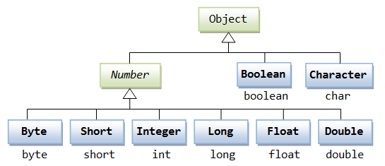

# Классы-обертки в Java

Мы уже давно знакомы с примитивными типами данных: `char`, `int`, `boolean`… Они хороши тем, что их использование очень
дешево — не создается объект, не надо каждый раз искать значение в памяти по ссылке. Но проблема в том, что достаточно
много функциональности в Java завязано именно на ссылочные типы. И для того, чтобы эта функциональность была доступна
для примитивов, придумали **классы-обертки** (**врапперы**, от англ. wrapper): `Character`, `Integer`, `Boolean`.
Каждому примитивному типу соответствует свой класс. Кроме примитивов есть и класс-обертка для `void` — `Void`. Ранее мы
для простоты считали `void` примитивом, но это не совсем так. `void` — отдельное ключевое слово и в Java он не является
типом данных. Лишь указывает, что метод не должен ничего вернуть.

Для первичного знакомства с классами-обертками предлагаю посмотреть видео ниже. Там есть незнакомый для нас синтаксис
**обобщенных типов (generics)** и использование **коллекций**, пока не заостряйте на этом внимание.

[](http://www.youtube.com/watch?v=ZHJLt6sadGs)

## Иерархия классов-оберток



2 примитивных типа не относятся к числовым: `char` и `boolean`. Их классы-врапперы — `Boolean` и `Character` — не имеют
суперкласса (не считая `Object`).

Остальные 6 примитивных типов работают с числами — целыми или вещественными. Как мы уже знаем, эти типы данных можно
преобразовывать друг в друга — приводить.

Методы, позволяющие вернуть из объекта класса-обертки (числового типа) примитивный тип (в т.ч. и с предварительным
приведением) объявлены (и, отчасти, реализованы) в абстрактном классе `Number`. Остальные
классы-обертки (`Byte`, `Integer`, `Double` и т.д. - см. рис. 1) являются наследниками `Number`.

Все обертки являются _final_-классами, следовательно, у них не может быть наследников. Это гарантирует прозрачность
поведения этих классов.

## Автоупаковка и распаковка

Как и с любым другим классом, мы можем создать объект класса-обертки через конструктор с вызовом `new`:

```java
    Integer i = new Integer(10);
```

Параметром конструктора будет значение примитивного типа, для которого мы создаем объект.

Также существуют конструкторы, позволяющие передать строковый эквивалент значения, который будет превращен в
соответствующее значение (или выпадет исключение, если строковое значение некорректно):

```java
    Integer i1 = new Integer(10);           //OK
    Integer i2 = new Integer("bla-bla");    //Exception
```

Кроме того, для `Boolean` определены константы: `Boolean.TRUE` и `Boolean.FALSE`. При инициализации переменной типа
Boolean можно использовать и их:

```java
    Boolean b = Boolean.TRUE;
```

В этой истории хорошо все, кроме того, что на практике оказалось очень востребовано обертывание примитива в объект и
наоборот. И каждая такая операция выглядит примерно так:

```java
    int i = 10;
    //...
    Integer i1 = new Integer(i);
    //...
    i = i1.intValue(); //если потребовалось получить значение примитива.
```

Это не слишком громоздко, когда переменная одна, когда их несколько — такой подход использовать не комфортно.

Поэтому в Java 5 (надеюсь, никто не стал ставить себе такой древний JDK) были добавлены механизмы **автоупаковки
(autoboxing)** и **распаковки (unboxing)**.

Автоупаковка — механизм автоматического преобразования примитива в эквивалентный ему объект соответствующего
класса-обертки:

```java
    int i = 10;
    Integer i1 = i; //или Integer i1 = 10; — так тоже можно
```

Распаковка — механизм автоматического преобразования объекта класса-обертки в значение примитивного типа:

```java
    Integer i1 = 10;
    int i = i1;
    long l = i1; //Неявное приведение допустимо, с явным — немного сложнее
```

Стоит отметить, что распаковка не работает, если нам нужен явный каст (приведение `Integer` к `byte`, например):

```java
    Integer i = 10;
    byte b = (byte) i; //Невозможно привести Integer к byte
```

Для таких приведений существуют специальные методы, объявленные в `Number`:

```java
    Integer i = 10;
    byte b = i.byteValue(); //OK
```

Автоупаковка и распаковка — крайне удобный и, в целом, простой в использовании механизм. Единственное, что надо
помнить — переменная ссылочного типа (в т.ч. и класса-обертки) может быть `null`. При попытке распаковки `null` будет
выброшено исключение `NullPointerException`. Поэтому автоупаковка возможна всегда, а автораспаковка может преподнести
сюрприз. Впрочем, эту особенность можно обернуть себе во благо в ряде случаев. Например, она дарит нам третье значение
для `Boolean`:)

## Неизменяемость объектов и немного о кэшировании

Классы обертки являются неизменяемыми — в прошлом уроке мы разбирались с тем, что такое неизменяемый объект в Java.

Во-первых, это дает уверенность, что значение (поля объекта) не будет изменено, что позволяет использовать объекты
классов-оберток в качестве идентификаторов и дает тот же результат, что и использование примитива — например, нельзя
изменить значение объекта класса-обертки в методе, если объект передан в качестве параметра.

Во-вторых, позволяет использовать **кэширование** объектов. Согласитесь, странно создавать объект `Boolean` каждый раз,
учитывая, что он имеет лишь 2 возможных значения (не учитываем `null`, это не самостоятельное значение в полном смысле).

Немного разовьем тему кэширования.

Чтобы оптимизировать работу с объектами оберток для их классов реализовано подобие кэширования, которое предназначено
для того, чтобы избежать повторного создания объектов с уже существующими значениями. Если быть точным, ряд объектов,
соответствующих значениям примитивов, создается JVM заранее:

- Для `Boolean`: заранее создаются объекты, эквивалентные `true` и `false` у примитива;
- Для целочисленных типов (`Byte`, `Short`, `Integer`, `Long`): значения от -128 до 127. Для `Integer` (и только для
  него) верхнюю границу предсозданных значений можно изменить в настройках JVM. Этот набор объектов также известен как *
  *пул** (от англ. pool) целых чисел;
- Для `Character`: значения, соответствующие кодам чисел от 0 до 127;
- Для `Double` и `Float` кэш не предусмотрен.

Обратите внимание, что это не кэш в привычном значении слова — это именно предварительное создание некоторых объектов.
Т.е. другие значения добавлены в кэш не будут и, скажем, `Long` для 1000 всегда будет создавать новый объект.

Кэш работает только(!) для инициализации через автоупаковку. При создании объекта через вызов конструктора в любом
случае будет создан новый объект.

## Методы классов-оберток

Методов, конечно, много, какие-то из них имеют аналоги в других обертках, какие-то — специфичны для конкретного типа. Мы
рассмотрим основные из них:

- `parse<Тип примитива>()`. Например, `parseInt()`. Подобный метод отсутствует у `Character`. Возвращает примитив
  указанного типа на основании строкового параметра. Если строковое значение не соответствует ожидаемому формату —
  исключение. Будьте осторожны со знаками-разделителями вещественных чисел. По умолчанию ожидается «.». `parseBoolean()`
  ожидает только строки _«true»_ или _«false»_;
- `valueOf()`. Возвращает объект обертки на основании параметра(-ов). Перегружен. Принимает как соответствующий
  примитив, так и строку, так и некоторые другие варианты. Реализация со строковым параметром обычно вызывает внутри
  себя соответствующий `parse<Тип примитива>()`;
- `compareTo()` и `static compare()`. Вернет отрицательное значение, если первый параметр меньше второго, 0 (ноль) —
  если значения равны, положительное значение, если первый параметр больше второго. Для символов будет использовано
  сравнение по числовым кодам, для `Boolean` — `true` считается `> false`. В методе `compareTo()` первым значением
  считается то, для объекта которого был вызван метод.

Также из `Number` в числовых типах доступны методы вида _<тип примитива>Value()_. Например, `intValue()`. Возвращают
соответствующее значение примитивного типа для объекта, у которого были вызваны. Из-за механизма распаковки используются
только для тех случаев, где нужно явное приведение.

Безусловно, каждый (почти) из классов имеет собственные методы, характерные лишь для него. Они не слишком часто
используются на практике, но вы можете ознакомиться с ними самостоятельно, если интересно.

#### На сегодня все!


Я не вижу смысла давать полноценные задачи исключительно на эту тему. В качестве практики предлагаю попробовать
использование разобранных выше методов, особенное внимание уделить методам сравнения и `parseDouble()`. Также можно
потрогать руками автоупакову и распаковку.

> Если что-то непонятно или не получается – welcome в комменты к посту или в лс:)
>
> Канал: https://t.me/ViamSupervadetVadens
>
> Мой тг: https://t.me/ironicMotherfucker
>
> **Дорогу осилит идущий!**