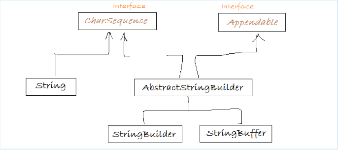

# Классы для работ со строками

В рамках этого урока мы разберемся с тем, какие строковое типы существуют в Java. Разберем плюсы и минусы каждого из
них, включая известный нам тип `String`.

Для начала посмотрим на упрощенную иерархию строковых классов:



## Интерфейс CharSequence

Все строковые типы в Java реализуют интерфейс `CharSequence`. Его иногда можно увидеть в качестве параметра методов,
принимающих строку в любом виде. Такие методы, в том числе, позволяют совмещать работу с разными реализациями строк,
например, конкатенировать их.

Данный интерфейс содержит ряд методов, которые реализует каждый из наследников. Рассмотрим те из них, которые могут быть
полезны нам:

- `charAt()`. Метод, принимающий индекс (порядковый номер) символа в строке (считая с нулевого) и возвращающий символ,
  находящийся под этим индексом;
- `isEmpty()`. _Boolean_-метод, возвращающий `true`, если строка пустая;
- `length()`. Метод, возвращающий длину (количество символов) строки.

Также на этом этапе стоит отметить, что любая из рассматриваемых реализации строковых типов содержит внутри себя массив
символов. Вся остальная надстройка - поля и методы, предназначенные для оптимизации работы с исходным массивом символов.
Понимание этого очевидного, казалось бы, факта, многим помогает избавиться от магического мышления в отношении строковых
типов.

## StringBuilder и StringBuffer

Оба эти класса являются наследником абстрактного класса `AbstractStringBuilder`, именно в нем объявлены все публичные
методы этих классов.

Особенностью этих реализаций является то, что они, в отличии от `String`, изменяемы. Соответственно конкатенация строк с
использованием `StringBuilder` и `StringBuffer` будет дешевле за счет того, что при каждой конкатенации не нужно
создавать новый объект.

Отличительной особенностью `StringBuffer` является потокобезопасность. Это означает, что он гарантирует корректную
работу в многопоточной среде, в том числе ситуации, когда с объектом `StringBuffer` работают несколько потоков
одновременно.

`StringBuilder` не гарантирует потокобезопасности, но за счет этого работает быстрее.

Методы, которые нас интересуют (методы `CharSequence` также доступны) в этих классах:

- `append()`. Перегружен под разные типы данных. Аналогичен оператору `«+»` для строк — добавляет переданный параметр в
  конец строки;
- `insert()`. Перегружен под разные типы данных. В большинстве реализаций, первый параметр — смещение (индекс элемента),
  второй — данные, которые надо вставить в подстроку. Пример:

```java
    StringBuilder stringBuilder = new StringBuilder("000"); //"000"
    stringBuilder.insert(1, "111"); //"011100"
```

- `compareTo()`. Сравнивает строки посимвольно (условно, в алфавитном порядке, на самом деле - по кодам каждого
  символа). Если параметр, переданный в метод, меньше строки, для которой метод был вызван — вернет отрицательное число,
  если больше — положительное. Если строки равны — вернет 0 (ноль). Как правило, этот и подобные ему методы используются
  для различных сортировок;
- `delete()`. Принимает два параметра типа `int` — `start` и `end`. Удаляет из строки элементы с индекса `start` по
  индекс `end` (не включительно);
- `deleteCharAt()`. Принимает параметром индекс элемента. Удаляет его из строки;
- `replace()`. Если метод `delete()` удаляет элементы по указанному диапазону индексов, то `replace()` заменяет
  подстроку, ограниченную индаксами другой подстрокой — переданной в качестве параметра в метод;
- `reverse()`. Разворачивает строку: `"123"` → `"321"`.

Указанные классы содержат и другие методы, но они вряд ли пригодятся нам на практике. Однако при желании всегда можно
обратиться к [документации](https://docs.oracle.com/) или в IDEA, открыв соответствующие классы.

## String

С классом **String** мы знакомы давно и, время от времени, узнаем о нем что-то новое.

Напомним, что `String` — неизменяем, а значит, при каждом изменении строки вынужден создавать новый объект. Таким
образом, операции, изменяющие исходную строку в `String` будут дороже, чем в `StringBuilder`.

Из плюсов — у `String` есть пул строк, который позволяет переиспользовать строковые литералы. Но об этом ниже.

Пока предлагаю ознакомиться с теми методами `String`, которые потенциально могут быть нам полезны. Поскольку `String` —
основной класс для работы со строками, методов будет много:

- `static join()`. Позволяет объединять несколько строк в одну, расставляя между ними подстроки-разделители (разделитель
  передается как один из параметров). Имеет перегруженную реализацию, которая также позволяет установить в
  результирующей строке префикс и суффикс — подстроки в начало и конец результирующей строки одновременно;
- `static valueOf()`. Возвращает строковое представление переданного параметра. С примитивными типами, полагаю, понятно.
  Для `null` вернет _"null"_ (именно как строку), для объекта — вызовет `toString()` и вернет его результат. Именно этот
  метод используется внутри `System.out.print()`;
- `static format()`. Метод форматирования строк с использованием спецификаторов. Сигнатура такая же, как в известном
  нам `System.out.printf()`. Принцип действия тоже совпадает, только вместо вывода результирующей строки на консоль, она
  будет возвращена из метода. В Java 15 появился не статический метод с той же функциональностью: `formatted()`. Он
  более удобен в использовании;
- `split()`. Принимает в качестве параметра разделитель. Возвращает массив строк, получившийся в результате разделения
  изначальной строки по переданному разделителю. Разделителем можно выступать как обычная строка, так и **регулярное
  выражение**. С механизмом регулярных выражений (**regex**, он же **regexp**) мы познакомимся в одном из ближайших
  уроков;
- `toLowerCase()`. Приводит все символы строки к нижнему регистру (не буквенные символы остаются без изменений);
- `toUpperCase()`. Приводит все символы строки к верхнему регистру (не буквенные символы остаются без изменений);
- `compareTo()`. По логике работы аналогичен этому же методу в `StringBuilder`;
- `compareToIgnoreCase()`. Полагаю, название говорит само за себя. Сравнивает строки, игнорируя регистр
  символов `"hi".compareToIgnoreCase("HI") == 0`;
- `contains()`. Проверяет, содержит ли исходная строка подстроку, переданную в качестве параметра;
- `intern()`. Добавляет строку в пул строк, если она там отсутствует. Если уже существует — возвращает ссылку на
  эквивалентную строку из пула;
- `isBlank()`. Проверяет, является ли строка пустой. В отличии от `isEmpty()` (он также доступен), `isBlank()` посчитает
  пустой и строку, состоящую только из пробелов;
- `matches()`. Проверяет, соответствует ли исходная строка переданному регулярному выражению;
- `replace()`. Заменяет все символы, аналогичные переданному как первый параметр на символы, аналогичные второму:
  `"haha".replace('h', 'b').equals("baba")`. Также есть перегруженный метод, принимающий в качестве параметров строки;
- `replaceAll()`. Аналогичен `replace()` со строковыми параметрами. Но первым параметром можно передать регулярное
  выражение;
- `substring()`. Возвращает подстроку по указанным в параметре индексам (или от указанного индекса до конца строки).
  Если у вас стоит JDK 6 или более ранние версии — рекомендую использовать с осторожностью, этот метод приводит к
  утечками памяти. В более поздних версиях проблема была исправлена;
- `toCharArray()`. Представляет строку как массив символов, из которых она состоит. Порядок символов сохраняется;
- `strip()`. Обрезает пробелы в начале и конце строки;
- `trim()`. Похож на `strip()`. Только пробелом считает любой символ, с кодом <= 20.

Используя методы, изменяющие строку — помните, что эти методы вернут новый объект строки:

```java
    String str = " haha ";
    str.trim();
    System.out.println(str); //" haha "
    -----------------------------------
    String str = " haha ";
    str = str.trim();
    System.out.println(str); //"haha"
```

Также советую пока не особо обращать внимание на упоминание регулярных выражений. Но рекомендую вернуться к текущей
статье, когда мы разберемся с ними. Это произойдет уже совсем скоро:)

## Пул строк

Объекты `String` можно создать двумя способами: через литерал `String str = "sthStr"` 
и через конструктор `String str = new String("sthStr")`.

Первый способ использует **пул строк (String pool)** — область кучи, которая хранит существующие строковые литералы.
Если такой литерал уже есть в пуле, будет взят он. Если нет — новый литерал будет добавлен в пул.

Второй же способ создаст новый объект `String`, даже если строка с таким значением уже есть в пуле. Но строку можно явно
добавить в пул, вызвав для нее метод `intern()`.

Пул строк — важный механизм, позволяющий использовать `String` намного более эффективно. Создание строк через
конструктор — сомнительная практика, ее выгоды не очевидны. Не рекомендую использовать этот подход, поскольку он
избыточен с точки зрения памяти.

#### С теорией на сегодня все!


Переходим к практике:

## Задача 1:

Реализуйте 
[задачу](https://github.com/KFalcon2022/practical-tasks/blob/master/src/com/walking/lesson6_methods/Task3.java)
используя `StringBuilder` или `StringBuffer`. Объясните свой выбор.

## Задача 2:

Реализуйте программу, принимающую с клавиатуры строку, содержащую слова, разделенные пробелом. Выведите в консоль
количество уникальных слов в строке. Учтите, что строка может начинаться с пробела.

Для упрощения допустим, что в строке не могут использоваться символы, отличные от пробела или русских/английский букв.
Помните, что слово может быть введено в разных регистрах.

> Если что-то непонятно или не получается – welcome в комменты к посту или в лс:)
>
> Канал: https://t.me/ViamSupervadetVadens
>
> Мой тг: https://t.me/ironicMotherfucker
>
> **Дорогу осилит идущий!**