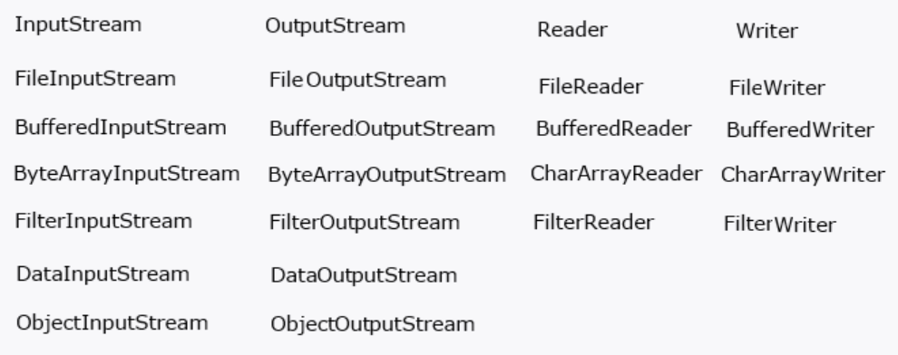

# Работа с файлами. Часть II

## Класс File

Чтобы избежать необходимости работы с файлом посредством указания пути к нему, как мы делали в рамках прошлого урока, в
Java существуют более гибкий способ работы с файлами (и директориями), с использованием класса `File`. Объект `File` не
является прямым отражением файла (т.е. объект класса не будет хранить, например, информацию, записанную в
соответствующем ему файле), но имеет ряд полезных методов, позволяющих узнать массу информации: существует ли файл,
каков абсолютный путь до него, как называется файл и пр. Также он аккумулирует в себе простейшие действия с директориями
и файлами. Подробнее с методами `File` можно познакомиться в рамках [статьи](https://metanit.com/java/tutorial/6.11.php)

## Reader и Writer для файлов

Как вы можете помнить, Java предоставляет классы для более удобного взаимодействия с I/O Streams – `Reader` и `Writer`
(точнее, наследники этих абстрактных классов).

Логично, что такие обертки есть и для чтения/записи файлов: `FileReader` и `FileWriter`.

Примеры использования рассмотрим в [статье](https://metanit.com/java/tutorial/6.8.php)

Данный способ все еще является достаточно низкоуровневым, поскольку любой `Reader` или `Writer`, по сути, является лишь
оберткой для соответствующего I/O stream’а. Методы, безусловно, более удобны для использования, нежели методы самих
stream’ов, но все, что касается взаимодействия с внешним ресурсом, физически происходит так же, как если бы мы работали
со stream’ом напрямую (не совсем так, но именно чтение-запись в рамках одного потока выполнения - да).

Соответственно, `FileReader` и `FileWriter` все также обращаются к файлу для чтения/записи каждого байта (даже методы
вроде `readNBytes()` читают каждый байт посредством физического обращения к файлу). Это достаточно дорого. Чтобы
оптимизировать расходы на взаимодействие с ресурсом реализованы решения, которые мы рассмотрим в следующих двух
подразделах. Они не решают проблемы побайтового чтения и записи самой по себе, но позволяют экономить накладные расходы
процессорного времени на взаимодействие с ресурсом.

## BufferedInputStream и BufferedOutputStream

Данные потоки не относятся к работе с файлами напрямую, но реализуют механизм ввода/вывода с использованием **буфера**
(не путайте с буферами в рамках `java.nio`, если уже знакомы с ними).

Опять же, более подробно познакомимся с использованием данных stream’ов в рамках 
[статьи](https://metanit.com/java/tutorial/6.5.php)

> !NB: вероятно, стоит сначала ознакомиться со [статьей](https://metanit.com/java/tutorial/6.4.php), 
> чтобы примеры по ссылке выше не вызывали вопросов.

И, как вы уже могли догадаться, буферизованным потокам соответствуют буферизованные _Reader’ы_ и _Writer’ы_. 
Их мы рассмотрим в следующем подразделе.

## BufferedReader и BufferedWriter

Так же, как `BufferedInputStream` и `BufferedOutputStream` являются, по сути, обертками над не буферизованными потоками 
ввода-вывода, так и буферизованные _Reader’ы_ и _Writer’ы_ являются обертками над не буферизованными. Обратите внимание 
на параметры конструкторов в примерах, указанных в [статье](https://metanit.com/java/tutorial/6.9.php).

## Заключение

В рамках этой статьи мы охватили, пусть и очень поверхностно, несколько различных подходов к вводу-выводу данных в Java
с использованием `java.io`. Эти подходы, как вы могли понять, актуальны не только для работы с файлами. Скажем, те же
принципы, с небольшими поправками, будут работать и при взаимодействии с консолью.

На данном этапе в голове может возникнуть путаница, поскольку, при различности подходов, синтаксис их использования
достаточно однотипный. Для того, чтобы закрепить новые знания в голове, рекомендую разобраться с понятием **буфера** (по
сути, предварительном скоплении данных в памяти перед вызовом метода чтения/записи), также разграничить использование
потоков ввода-вывода и их оберток – `Reader` и `Writer`.

Если наложить получившуюся конструкцию на табличку ниже (была в одной из первых статей metanit по I/O Streams),
получится достаточно структурированная модель зависимостей, где базовые потоки ввода-вывода могут быть обернуты в
буферизованные, а как буферизованные, так и не буферизованные потоки могут быть, в конечном итоге, обернуты в _Reader’ы_
и _Writer’ы_:

Кроме изученного материала, важно также понимать, что ввод-вывод может быть построен не только на рассматриваемом в
последних уроках `java.io`, но и на более гибком подходе, реализуемом в пакете `java.nio`. **NIO - Non-blocking I/O**
(также зачастую расшифровывается как **New I/O**).

Основные проблемы **потоко-ориентированного** ввода-вывода, реализованного в рамках `java.io` заключаются в следующем:

1. Этот подход является **блокирующим**. В рамках изучения многопоточности данная формулировка станет более понятной.
   Вкратце, это означает, что работать с ресурсом в единицу времени может лишь один поток выполнения. В этом было бы
   несложно убедиться, зайдя в исходный код изученных классов, будь мы знакомы с синтаксисом для работы с
   многопоточностью;
2. Потоки (не только ввода-вывода, а как подход к поточной обработке в целом) очень удобны в использовании ровно до
   момента, пока нет необходимости в движении «назад». Например, если мы захотим заново считать данные в файле, которые
   прочли ранее, в текущей концепции нам придется читать файл сначала. Это, очевидно, не очень оптимальный подход.

В свою очередь `java.nio` реализует **буферно-ориентированный** подход (в каком-то смысле, расширяя эрзац-решение в лице
буферизованных потоков), решающий проблему возвращения к считанным данным (п.2 выше). Также, отчасти и за счет
использования буферов, решается и проблема доступности ресурсов из разных потоков выполнения (п.1 выше). И,
наконец, `java.nio` предоставляет более гибкий функционал для работы с ресурсами. За счет большего количества **уровней
абстракции** этот функционал кажется более громоздким и сложным в использовании, но он позволяет обеспечить более
комфортную работу с внешними ресурсами.

Я не уверен, что в рамках текущего курса мы сможем глубоко нырнуть в тему NIO, поэтому предлагаю ознакомиться с разницей
между IO и NIO в рамках [статьи](https://habr.com/ru/post/235585/)

Мы сейчас недостаточно знакомы с теорией и синтаксисом (особенно, многопоточностью и понятием асинхронности), чтобы в
полной степени разобраться в статье. Но она, по крайней мере, позволит составить представление об основных различиях
двух подходов.

#### С теорией на сегодня все!

Переходим к практике:

## Задача 1:

Реализуйте Задачу 1 из урока [Работа с файлами. Часть I](https://telegra.ph/Rabota-s-fajlami-CHast-I-12-17) с помощью:

1. `FileWriter`;
2. `BufferedOutputStream`;
3. `BufferedWriter`.

## Задача 2:

Реализуйте Задачу 2 из урока [Работа с файлами. Часть I](https://telegra.ph/Rabota-s-fajlami-CHast-I-12-17) с помощью:

1. `FileReader`;
2. `BufferedInputStream`;
3. `BufferedReader`.

Начиная с текущего урока и далее рекомендую использовать какие-либо обертки для получения доступа к файлу. 
На данном этапе – `File`, в дальнейшем познакомимся и с другими. Обращение к файлу посредством прямого указания его 
адреса при создании I/O Stream с данного момента нежелательно.

> Если что-то непонятно или не получается – welcome в комменты к посту или в лс:)
>
> Канал: https://t.me/ViamSupervadetVadens
>
> Мой тг: https://t.me/ironicMotherfucker
>
> **Дорогу осилит идущий!**