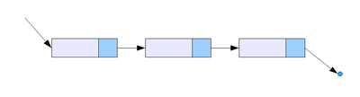
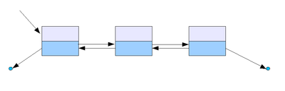

# Queue и вариации на тему. Часть I. Структуры данных

Следующий тип коллекций, с которым мы познакомимся – **Queue – очередь**.

В рамках этого урока мы разберем несколько структур данных, которые применяются в коллекциях данного типа. В следующей
части этого урока – познакомимся с имплементациями этих структур в рамках Collections Framework.

В классическом представлении, Queue – структура данных, строящаяся на принципе **FIFO – first-in, first-out** (первый
вошел – первый вышел). В целом, принцип достаточно очевиден и часто употребим в реальной жизни (куда чаще, чем также
знакомый нам LIFO).

Забавно, но программная реализация FIFO сложнее, чем LIFO:)

Однако в Java под коллекциями типа Queue понимаются не только очереди в классическом представлении, а целый набор
различных структур данных от связных списков (в разных вариациях) до стеков и, непосредственно, очередей. И не все
очереди в итоге следуют FIFO. В общем, все не так просто, как хотелось бы.

Итак, постараемся разобраться со структурами данных.

## Структуры данных. Связный список.

**Связный список** – одна из классических структур данных, минимальной самостоятельной частью которой является **узел
(Node, нода)**, хранящий элемент(полезную нагрузку, в нашем случае - объект какого-то класса) и ссылку (ссылки) на
следующий и/или предыдущий элемент(-ы).

Из наиболее классических реализаций можно выделить **односвязный список** (есть ссылка на узел-вершину, каждый узел
хранит элемент и ссылку на следующий элемент). В ссылке на следующий узел у последнего узла в списке будет `null`:

С таким списком мы уже знакомы из практики к [уроку 28](https://telegra.ph/Generics-CHast-I-12-12). Там произошла
некоторая путаница в названиях, но все же.

Таким образом, односвязный список работает по принципу LIFO. Упоминаемый в практике выше **стек** – частный случай
односвязного списка. Их разница в том, что при получении элемента стека – элемент удаляется из структуры данных. В
контексте односвязного списка удаление элемента не регламентировано – оно может производиться или не производиться, в
зависимости от потребностей конкретной реализации.

На этом этапе мы можем положить в копилку 2 новые структуры данных: односвязный список и стек.

## Двусвязный список

Двусвязный список немногим сложнее односвязного, но гораздо более функционален.

Двусвязный список представляет собой ссылки на первый и (опционально) последний узлы. Каждый узел хранит элемент, а
также ссылки на следующий и предыдущий элементы:

Поле ссылки на предыдущий элемент у первого узла списка содержит `null`. Также и поле ссылки на следующий элемент у
последнего узла списка будет `null`.

Двусвязный список может работать как по принципу FIFO, так и по принципу LIFO.

Так, как стек является частным случаем односвязного списка, **двусторонняя (двусвязная) очередь (deque - double ended
queue, дек)** является частным случаем двусвязного списка.

Двусторонняя очередь – структура данных, в которой добавление и удаление элементов возможно как с начала, так и с конца.
Пройти же вглубь очереди, не удаляя элементы, нельзя (так же, как и в стеке).

На этом этапе в копилку структур данных отправляются еще две: двусвязный список и двусторонняя очередь.

## Очередь

Возвращаясь к классической очереди – queue – все немного сложнее с точки зрения реализации.

Если стек реализовывать удобно – наличия вершины и ссылки на следующий элемент достаточно, то в случае с очередью
необходимы:

- ссылка на начало очереди, чтобы «доставать» (эту функцию называют в очередях и стеках _pop_) элементы;
- на конец очереди, чтобы элементы «добавлять» (_push_);
- ссылка на следующий узел у каждого из узлов, чтобы добавлять новые элементы и при этом иметь актуальную ссылку на
  конец (хвост) очереди;
- ссылка на предыдущий узел у каждого из узлов, чтобы при выходе (pop) первого элемента получать ссылку на новое начало
  очереди.

В итоге получается, что для реализации односвязной очереди тоже нужен двусвязный список.

В общем-то, так и есть: одна из классических реализаций очереди основана на двусвязном списке. Альтернативные
реализации – на базе массива (на его основе иногда (на самом деле, часто) реализуют и стек), а также в виде двух
стеков (советую погуглить, выглядит достаточно оригинально).

## Вместо итога

Важно понимать, что некоторые структуры данных (в нашем случае – разные виды списков) регулируют лишь способ хранения
данных, некоторые же (стек, очереди) – описывают допустимые способы обработки данных.

При этом вторая группа структур более высокоуровневая и больше похожа на интерфейсы – стек/очереди описывают, что
структура умеет (должна уметь) делать, но не говорят о том, как это сделать. Иными словами, описывают контракт
взаимодействия.

В то время как первая группа (списки) – не ограничивает в функциональности, предоставляя лишь инфраструктуру хранения
данных и связь между ними (ссылки на следующий/предыдущий элемент).

Также очень важно понимать, что рассмотренные выше структуры данных – не единственные. И даже не единственные в своем
классе. Те же списки имеют массу реализаций, кроме двух рассмотренных. Например, кольцевые списки, развернутые списки,
списки с пропусками и пр.

Тема структур данных глубока, многогранна и интересна. Мы ее касаемся лишь минимально, на том уровне, который необходим
для понимания инструментов, которые изучаем на данный момент. Но даже в отношении рассмотренных структур данных я
рекомендую закрепить их понимание информацией со сторонних ресурсов. В обязательном порядке – посмотреть, какую
функциональность должны предоставлять изученные структуры (особенно актуально для стека и очередей). Чем лучше вы
разберетесь с этим сейчас, тем легче будет в дальнейшем.

В следующем уроке мы рассмотрим реализации изученных структур в Java-коллекциях.

#### С теорией на сегодня все!

Переходим к практике:

## Задача 1 (*):

Реализуйте односвязный список (можно использовать
[реализацию](https://github.com/KFalcon2022/practical-tasks/blob/master/src/com/walking/lesson28_generics1/task4/structure/Stack.java)
в рамках урока 28).

Реализуйте метод, разворачивающий односвязный список (первый элемент должен стать последним, второй – предпоследним и
т.д.).

Также реализуйте метод, удаляющий все узлы, хэшкод элемента которых - четный.

## Задача 2:

Реализуйте структуру данных стек. Используйте односвязный список из Задачи 1. При этом изменять сам класс, реализующий
односвязный список, недопустимо.

## Задача 3:

Реализуйте двусвязный список.

Реализуйте метод, разворачивающий список.

Также реализуйте метод, удаляющий все узлы, хэшкод элемента которых - четный.

## Задача 4:

Реализуйте одностороннюю очередь на базе двусвязного списка из Задачи 3.

> Если что-то непонятно или не получается – welcome в комменты к посту или в лс:)
>
> Канал: https://t.me/ViamSupervadetVadens
>
> Мой тг: https://t.me/ironicMotherfucker
>
> **Дорогу осилит идущий!**