# Структура данных Дерево

В рамках предыдущих уроков мы познакомились с некоторыми структурами данных: массив, несколько видов связанного списка,
стек и несколько видов очередей. Каждая из этих структур имеет свои характерные особенности, но все они относятся к
одной большой группе – **линейные структуры данных**.

Линейные структуры характеризуются тем, что каждый элемент имеет не более одного предка и не более одного потомка
(предыдущего и следующего элементов соответственно).

Однако структуры данных в массе своей куда более разнообразны. Сегодня мы познакомимся с большой группой **нелинейных
структур данных – деревьями**. Нет, не хвойными и не плодовыми. Мичуринцев из вас не получится:)

Именно на базе деревьев работают некоторые из коллекций в Java. Например, знакомый нам по предыдущему уроку `TreeSet`.

В общем случае, дерево – структура данных, у каждого из узлов которой есть не более одного предка, и может быть любое
количество потомков. Данное определение нельзя назвать академическим, но, на мой взгляд, оно отображает суть данной
группы структур.

Примеры визуализации деревьев можно увидеть ниже:

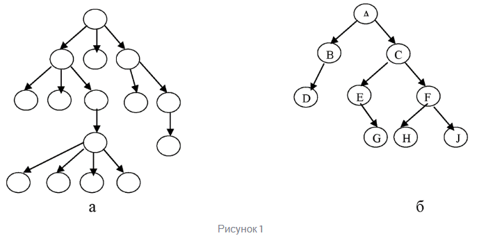

Именно возможность наличия у одного узла нескольких «следующих» узлов и делает подобную структуру нелинейной.

В целом, древовидные структуры существуют и в реальной жизни. Например, иерархия подчинения сотрудников в компании
представляется классической древовидной структурой. Структура папок в файловой системе компьютера тоже может быть
представлена в виде дерева.

Но при разработке ПО недостаточно интуитивного понимания древовидных структур. Именно поэтому сегодня мы познакомимся с
ними поглубже.

> !NB: Объекты в хипе (куче) – одной из областей памяти в JVM – тоже хранятся в структуре типа дерево.

## Основные термины

Поскольку деревья являются намного более сложной структурой, нежели изученные нами представители линейных структур,
предлагаю познакомиться с терминологией, применимой при описании и обработке деревьев. «Первый» и «последний» элементы
уже явно недостаточные термины для описания подобной структуры.

**Узлы** дерева (вне зависимости от их расположения) могут называться **вершинами**.

**Корень дерева (корневой узел, root)** – узел дерева, не имеющий предка. Является **точкой входа** в дерево, так же,
как **вершина** – точка входа в стек (не путать с вершиной в контексте деревьев).

**Лист (терминальный узел, leaf)** – узел дерева, не имеющий потомков. Если корень у дерева один, то листьев, как
правило, много.

Также иногда можно встретить термин **«внутренний узел»** – любой узел дерева, не являющийся корнем или листом
(соответственно, имеющий и предка, и потомка(-ов)).

Теперь, глядя на Рисунок 1, мы можем определить, что у дерева б есть:

1. Корень (узел А);
2. Внутренние узлы (B, C, E, F);
3. Листья (D, G, H, J).

Также в случае с деревьями возникает понятие **«глубины дерева»**. Поскольку структура данных не является линейной, путь
от корня до другого узла слабо коррелирует с количеством элементов в структуре.

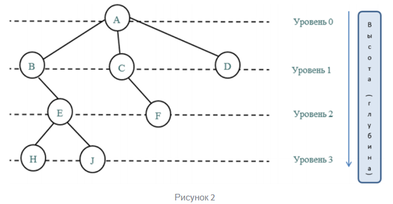

Зато коррелирует с количеством **уровней** в дереве.

Итак:

**Уровень дерева** – абстракция для группы узлов дерева, указывающая на количество узлов от корня до любого узла из
группы.

На Рисунке 2 дана визуализация уровней. Корень находится на нулевом уровне, элементы, являющиеся потомками (их также
называют **ветвями**) корня – находятся на первом уровне, потомки узлов первого уровня – на втором и т.д.

**Глубина (высота) дерева** – количество уровней в дереве. Например, на Рисунке 2 изображено дерево с глубиной 4 (не
забывайте, true-программисты считают с нуля).

По сути, глубина дерева – это количество итераций перехода между элементами, необходимое, чтобы добраться от корня до
самого дальнего листа (как можете увидеть на Рисунке 2, листья могут находиться на разных уровнях).

И, наконец, познакомимся с термином **«поддерево»**: поддеревом называется дерево, являющееся частью другого дерева.

Например, на Рисунке 2 можно выделить поддерево от вершины _«E»_, в таком случае дерево будет иметь 3 элемента: корень
_«Е»_ и листья _«H»_ и _«J»_.

Также мы можем выделить и поддерево с корнем _«C»_ - такое поддерево будет иметь лишь одного потомка и, де-факто,
выродится в связный список из двух элементов (_«C»_ и _«F»_).

## Виды деревьев

Деревья бывают разные, поэтому внутри этой группы структур есть своя классификация (и не одна). Она достаточно обширна,
в рамках урока мы познакомимся лишь с теми видами и представителями, которые нам могут понадобиться в обозримом будущем.

С точки зрения типа деревьев, в рамках урока нас интересуют, в первую очередь, **бинарные (двоичные) деревья**. Не
путайте их с **b-tree (В-деревьями)**. С последними советую познакомиться самостоятельно, если текущий урок дался вам
легко, гиперссылка в предыдущем предложении.

Итак, бинарные деревья – деревья, в которых каждый узел имеет не более двух потомков. При реализации бинарных деревьев в
программном коде, потомков узла обычно так и обозначают: _left_ и _right_. Ниже можно увидеть пример двоичного дерева:

Также для деревьев (не только бинарных, но для нас это не важно) существует понятие **балансировки**.

В общем случае, бинарное дерево можно считать **сбалансированным**, если для любого узла верно, что количество элементов
в его левом и правом поддеревьях, отличается не более, чем на единицу. Такое определение описывает идеальную
балансировку дерева.

Менее строгим будет определение для балансировки по высоте: дерево является **сбалансированным (по высоте)**, если
расстояние пути от корня до любого из листьев отличаются не более, чем на единицу. Иными словами, все листы (элементы
без потомков) расположены в рамках одного или двух соседних уровней. Например, дерево на Рисунке 3 является
сбалансированным по высоте. Но применяя более общее определение балансировки, то же дерево назвать сбалансированным уже
нельзя.

Балансировка дерева необходима для того, чтобы поиск по дереву был максимально эффективен. Если же балансировку не
производить – вполне вероятны сценарии, когда дерево (или, чаще, ряд поддеревьев) вырождаются в списки или глубина
левого и правого поддерева какого-то из узлов оказывается сильно различной, соответственно, эффективность доступа к
листьям различных поддеревьев будет сильно различаться.

Полагаю, достаточно очевидно, что при балансировке у дерева может измениться корень – логично, что корнем
сбалансированного дерева должно быть значение, близкое к медианному для элементов дерева. Иными словами, если выписать
элементы дерева в отсортированном виде, корневым, в идеале, стоит делать элемент, находящийся в середине списка. Чтобы
количество элементов слева от выбранного, и справа, было равно (или почти равно).

На практике, не всегда корнем сбалансированного дерева будет медианный элемент – операция балансировки является
достаточно дорогой при любой реализации, вызывать ее после каждой операции вставки/удаления элемента – крайне
сомнительная затея.

В качестве частного случая двоичного дерева предлагаю рассмотреть **двоичное дерево поиска**.

_Примечание_: если хочется нырнуть глубже в тему деревьев – предлагаю после освоения этого урока самостоятельно
ознакомиться с понятием **двоичной кучи**. Вряд ли эти знания пригодятся в рамках текущего курса, но точно будут
полезны, если вы более-менее уверенно чувствуете себя в структурах данных.

Итак, двоичным деревом поиска называется двоичное дерево, которое удовлетворяет следующим условиям:

- Для любого узла верно, что его левое поддерево (поддерево, где корнем взят левый потоком текущего узла) содержит лишь
  меньшие или равные значения;
- Для любого узла верно, что его правое поддерево содержит лишь большие значения;
- Для любого узла верно, что оба его поддерева (левое и правое) являются двоичными деревьями поиска (читай, являются
  двоичными деревьями и выполняют оба условия выше).

Как видите, описание условий для дерева сильно напоминает рекурсивные. В общем-то, обработка деревьев – одна из
классических областей применения для рекурсии.

К слову, Рисунок 3 демонстрирует именно двоичное дерево поиска.

Различные реализации такого типа деревьев отличаются, в первую очередь, условием, при котором будет запущена
балансировка. С этим мы познакомимся чуть позже.

Но, чтобы понять, как работает балансировка дерева (спойлер: по-разному, алгоритмы балансировки могут отличаться даже
для одной и той же реализации дерева может существовать несколько алгоритмов балансировки для разных ситуаций), стоит
сначала разобраться с более простыми операциями: вставки и удаления.

## Добавление элемента в двоичное дерево поиска

Вставка в двоичное дерево поиска происходит следующим образом:

1. Если дерево пустое (элементы отсутствуют), сделать добавляемый элемент корневым;
2. В противном случае сравнить элемент с корнем: если он больше текущего значения – вызвать функцию добавления для
   поддерева, где корнем будет правый потомок текущего узла, в иных случаях `<=` – вызвать функцию добавления в
   поддерево с корнем в лице левого потомка текущего узла;
3. Через какое-то количество рекурсивных вызовов шага 2, функция добавления будет вызвана для пустого поддерева, что, в
   свою очередь, равносильно шагу 1.

Если попытаться визуализировать алгоритм добавления, он сведется к сравнению добавляемого элемента с текущими и
переходом к следующей итерации сравнения (с правым или левым потомком) до тех пор, пока добавляемый элемент не будет
сравнен с `null` (отсутствующим значением). Именно на место отсутствующего значения и будет вставлен элемент.

Функция добавления элементов достаточно проста в реализации, но, как и большинство рекурсивных алгоритмов, достаточно
тяжела для описания.

## Удаление элемента из двоичного дерева поиска

Функция удаления может работать по-разному, в зависимости от конкретной реализации. Предлагаю рассмотреть один из
возможных вариантов:

1. Найти удаляемый элемент;
2. Если элемент отсутствует (включая ситуацию, когда дерево пустое) – закончить выполнение, иначе перейти к п.3;
3. Если потомков нет (удаляемый элемент является листом дерева) – заменить ссылку на удаляемый элемент в родительском
   ссылкой на `null`, иначе – перейти к п.5;
4. Если удаляемый элемент имеет лишь одного потомка (правую или левую ветвь) – присвоить предку удаляемого элемента
   ссылку на потомка (вместо ссылки на удаляемый элемент) для соответствующей ветви. Этот пункт напоминает удаление
   элемента из середины односвязного списка. Если потомков 2 – перейти к п.5;
5. Найти среди левого поддерева наибольший элемент и перенести его на место текущего (для найденного элемента будет
   применен п.3).

Таким образом, ссылка на удаляемый элемент исчезнет из иерархии дерева, вместо нее будет `null` или ссылка на другой
элемент. Обратите внимание, если дерево может содержать лишь уникальные элементы, в п.5 может быть как наибольший
элемент из левого поддерева, так и наименьший из правого – в обоих случаях это будет элемент, максимально близкий к
удаляемому по значению. В нашем случае выбран вариант с поиском в левой ветви, потому что в ней могут содержаться
дубликаты удаляемого значения (полные, или имеющий одинаковый вес для выбранного в данном дереве параметра сортировки –
не имеет значения).

Также стоит обратить внимание, что в классической реализации, если дерево будет содержать несколько одинаковых
элементов, то при попытке удалить указанный элемент будет удален лишь один (наиболее близкий к корню), а не все.

Теперь, после знакомства с операциями добавления и вставки, предлагаю разобрать несколько известных реализаций двоичного
дерева поиска и нюансы балансировки, которые для них характерны.

## АВЛ-дерево

**АВЛ-дерево** – двоичное дерево поиска, сбалансированное по высоте (выше мы разобрались, что это значит).

Удаление элемента в данном виде дерева происходит по принципу, описанном в предыдущем пункте статьи.

Хорошая новость заключается в том, что в рамках данного определения все очень легко. Плохая – в том, что вся суть
АВЛ-дерева в способах его балансировки и именно с ними мы познакомимся ниже (да, их несколько).

Балансировка АВЛ-дерева происходит после вставки нового значения, если эта вставка привела к тому, что разница высот
правого и левого поддерева любого из узлов стала равна 2. Напомню, при балансировке по высоте допустимая разница – 0
(высоты равны) или 1.

Всего существует 4 способа балансировки АВЛ-дерева, каждый из которых используется для своих условий.

Ниже будут использованы слайды презентации, в которой, на мой взгляд, наиболее доступно и лаконично описаны способы
балансировки АВЛ-дерева. Если кому-то зашел формат описания, можете ознакомиться с 
[презентацией](https://ppt-online.org/13500) целиком. Она, посвящена, преимущественно, разбору АВЛ-дерева и дает более 
исчерпывающее описание и примеры по данной структуре данных.

### Малое правое вращение

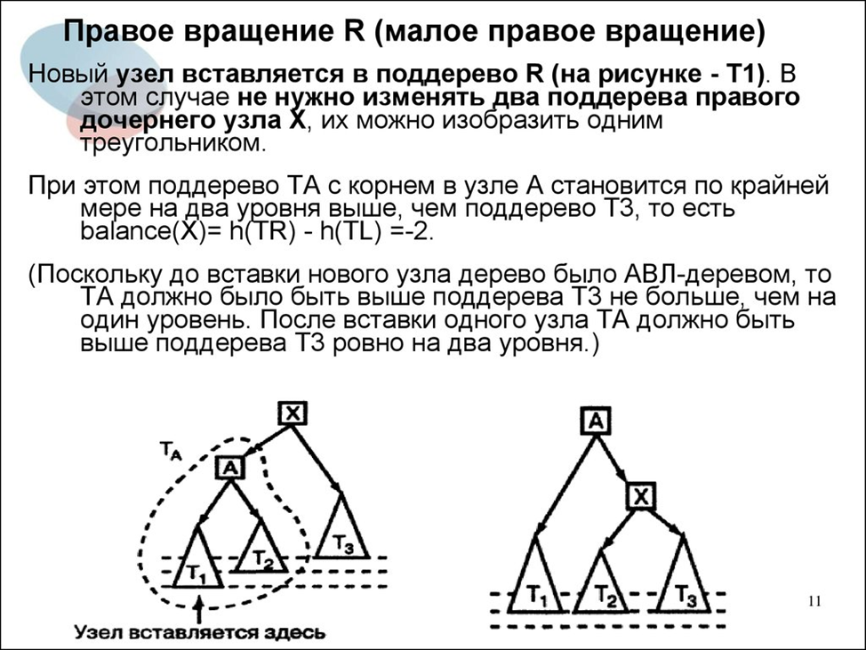

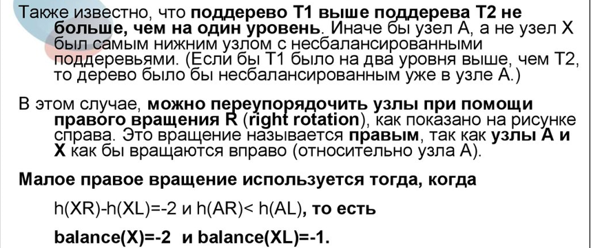

Обратите внимание на способ визуализации узлов и поддеревьев, в т.ч. и то, что визуально из одного узла может выходить
узел (с поддеревьями) и поддерево одновременно (на первом слайде это также подчеркнуто). Такая форма визуализации очень
лаконична, но непривычна и тяжела для восприятия новичками. Тем не менее, именно она используется повсеместно (если
захотите глубоко нырнуть в тему деревьев – стоит привыкать уже сейчас).

### Малое левое вращение

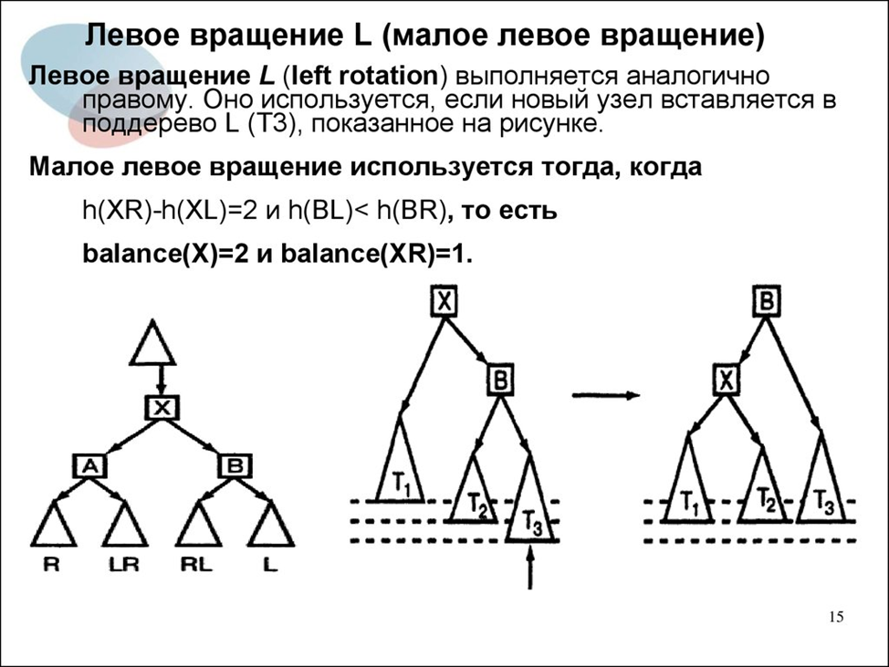

В целом, симметрично малому правому.

### Большое правое вращение

Небольшая расшифровка легенды перед слайдом:

- _TX_ – дерево (поддерево) с корнем в узле _X_;
- _ТА_ – дерево с корнем в узле _А_;
- _ТС_ – дерево с корнем в узле _С_. Оно же _LR_ (на левом изображении);
- _Т2_ и _Т3_ – левое и правое поддеревья С соответственно. Т.е. _С_ – предок для корней поддеревьев _Т2_ и _Т3_.

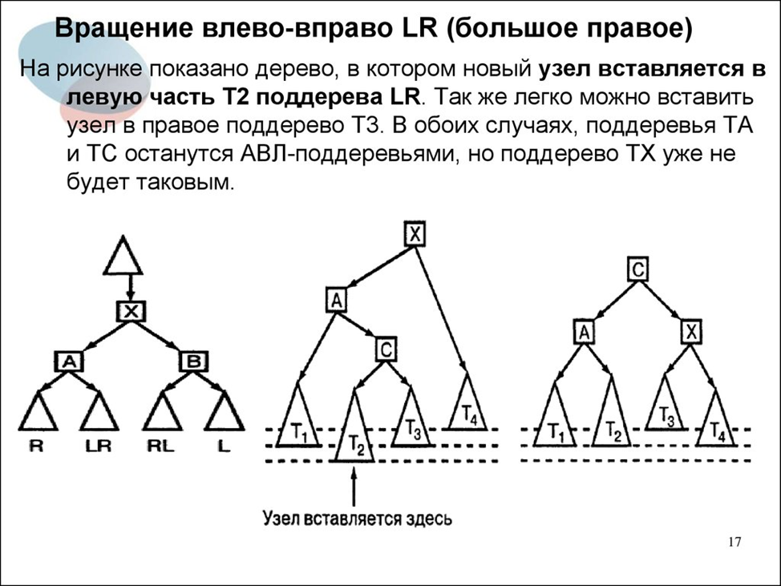

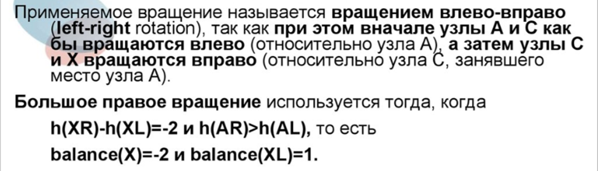

### Больше левое вращение

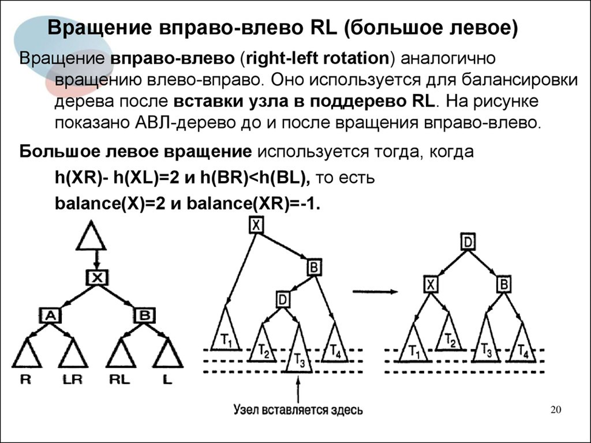

Опять же, симметрично большому правому вращению.

Для закрепления понимания принципов работы АВЛ-дерева рекомендую ознакомиться со следующей 
[ссылкой](https://www.cs.usfca.edu/~galles/visualization/AVLtree.html)

Она позволяет посмотреть визуализацию добавления и удаления элементов пошагово. Переключение шагов доступно в
автоматическом и ручном режимах.

## Красно-черное дерево

Если АВЛ-дерево является очень чувствительным к вставкам, результатом чего является частая перебалансировка, то
следующий рассматриваемый нами вид деревьев, является менее прихотливым, хоть и все еще самобалансирующимся.

Итак, **красно-черное дерево**. Оно же **red-black tree**, оно же **RB-tree** (именно такое название вы будете слышать
чаще всего в профессиональной деятельности).

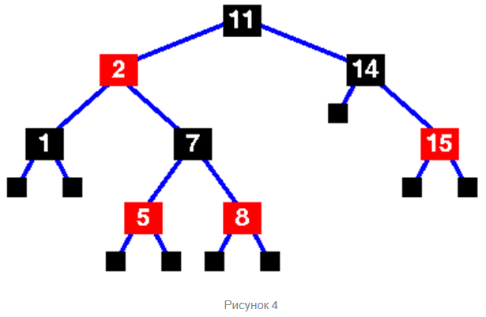

Характерной особенностью этого дерева является дополнительный параметр узла – его _«цвет»_. Этот параметр бывает двух
видов: красный или (неожиданно) черный. От чего это зависит мы разберем ниже.

Итак, особенности RB-tree:

1. Каждый узел имеет цвет и двух потомков;
2. Листья – всегда фиктивные, т.е. узел есть, а данных в нем (полезной нагрузки) – нет. Именно поэтому каждый
   узел [с заполненным значением] имеет двух потомков. На самом деле, есть реализации, не выполняющие этого условия, но
   это не входит в рамки сегодняшнего урока;
3. Листья – всегда черные;
4. Корень – всегда черный (на самом деле, не имеет значения, просто традиция);
5. Потомки любого красного узла – черные;
6. Пусть от любого узла до любого из листьев-потомков должен иметь равное число черных узлов.

В описанных условиях получается, что наличие красных узлов – вообще не обязательно. На самом деле, это не совсем так С
учетом п.6. – совершенно не так, если дерево содержит четное количество элементов, т.е. каждую вторую вставку:)

Красно-черное дерево является более сложным в контексте операций вставок и удаления из-за необходимости проверки цвета
узлов и потенциального перекрашивания. В рамках урока кажется избыточным разбирать это в подробностях – на первых порах
хватит разбора на примере АВЛ-дерева.

Отметим лишь ряд особенностей, характерных для красно-черного дерева:

- Добавляемый в дерево узел изначально маркируется красным. В дальнейшем его цвет может быть изменен на черный в
  зависимости от цвета близлежащих узлов. Этот момент подсвечен исключительно для понимания, откуда вообще в
  красно-черном дереве берутся красные узлы;
- RB-tree, в отличии от АВЛ-дерева, балансируется не при разности высот >1, а в ситуации, когда количество черных узлов
  в пути от вершины до листьев становится различным. Т.е., на практике возможна ситуация, когда путь до крайнего (не
  считая пустые листовые) потомка по одной ветви в два раза короче, чем путь до потомка по другой. Потому что одна ветвь
  содержит лишь черные узлы, а вторая – чередует красные и черные (напомню, два красных узла подряд быть не может). Зато
  операция перекрашивания узлов, в отличии от перебалансировки, работает почти на каждое добавление;
- За счет особенности условий перебалансировки из предыдущего пункта, RB-tree, безусловно, менее эффективно, чем
  АВЛ-дерево при поиске, но разница в эффективности находится в пределах 39%. Обычно она еще меньше;
- На практике, чаще всего для хранения данных используется именно красно-черное дерево, а не АВЛ. Да, оно, зачастую,
  чуть менее эффективно при поиске, но добавление и удаление элементов там, зачастую, дешевле за счет менее строгих
  требований к балансировке. В том числе, на базе RB-tree работает ряд коллекций в Java (об этом в следующем уроке).

Как и в предыдущем пункте, вы можете посмотреть на
[визуализацию операций](https://www.cs.usfca.edu/~galles/visualization/RedBlack.html) в красно-черном дереве:

## Обход дерева

**Обход дерева** – термин, обозначающий поиск элемента в дереве, при котором каждый узел «посещается» лишь 1 раз. Также
называется **«поиском по дереву»**.

В данном случае, под поиском подразумевается не нахождение конкретного элемента в дереве поиска (это можно сделать
намного эффективнее, чем проверить все узлы дерева), а выборка элементов вне дерева поиска (или в нем, но по признаку,
отличному от того, на основании которого распределялись элементы в дереве). Также может иметь смысл, если необходимо
выбрать все элементы, удовлетворяющие критерию поиска.

Кроме, непосредственно, поиска, актуально для любых операций, которые необходимо сделать со всеми элементами дерева.

В рамках статьи мы коснемся лишь обхода бинарного дерева.

До того, как перейдем к конкретным алгоритмам обхода, отмечу, что дерево можно обходить (безотносительно конкретного
алгоритма обхода) как слева-направо, так и справа-налево. Это не имеет серьезного влияния на алгоритм, поэтому при
разборе ниже этот фактор опускается. На практике, обычно реализуют обход слева-направо.

## Обход в глубину 

**Обход в глубину** – общее название для алгоритмов обхода дерева, подразумевающих полный обход каждого поддерева до
перехода к следующему поддереву. Его альтернативой является обход в ширину, который мы кратко затронем чуть ниже.

**Прямой обход** – алгоритм обхода дерева, который может быть описан следующей последовательностью шагов 
(п.2 – само действие с элементов, пп.3-4 – рекурсивные вызовы):

1. Проверка узла на `null`;
2. Действие с узлом (проверка условия поиска или др.);
3. Вызов функции прямого обхода дерева для левого поддерева;
4. Вызов функции прямого обхода дерева для правого поддерева.

Визуализация порядка обработки элементов при прямом обходе. Точками обозначено «действие с узлом», с учетом порядка
обработки элементов (пунктирная линия):

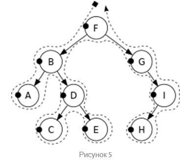

**Центрированный обход** – алгоритм, описываемый следующими шагами
(п.3 – само действие с элементов, пп.2,4 – рекурсивные вызовы):

1. Проверка узла на `null`;
2. Вызов функции центрированного обхода дерева для левого поддерева;
3. Действие с узлом (проверка условия поиска или др.);
4. Вызов функции центрированного обхода дерева для правого поддерева.

Визуализация:

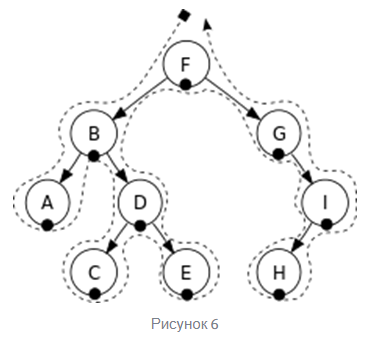

**Обратный обход** может быть описан с помощью следующей последовательности шагов
(п.4 – само действие с элементов, пп.2-3 – рекурсивные вызовы):

1. Проверка узла на `null`;
2. Вызов функции обратного обхода дерева для левого поддерева;
3. Вызов функции обратного обхода дерева для правого поддерева;
4. Действие с узлом (проверка условия поиска или др.).

Визуализация:

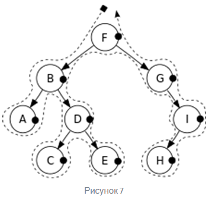

## Обход в ширину

Обход в ширину является принципиально другим подходом. Она заключается в том, чтобы сначала обработать все элементы на
одном уровне, а лишь потом переходить к следующему.

Визуально обход в ширину можно представить следующим образом:

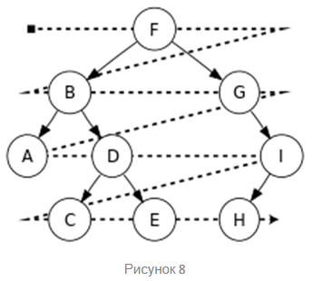

Важной особенностью такого подхода является необходимость хранения элементов, обработка которых откладывается. Если при
обходе в глубину хранение «отложенного» элемента можно делегировать стеку рекурсивных вызовов (альтернативно, можно
сохранять в стеке явно, но не суть), то при обходе в ширину явно сохранять отложенные элементы придется в любом случае.
Обычно для этого используются очереди (сейчас речь именно о структуре данных, а не о типе Java-коллекций).

Таким образом, обход в ширину является менее очевидным алгоритмом, хотя, в сущности, остается несложным. Но иногда он
может быть полезным. Например, визуализировать дерево в консоли с помощью псевдографики определенно удобнее, используя
обход в ширину.

## Итог

Тема деревьев является очень обширной и интересной. Мы затронули ее совсем поверхностно, на уровне, чуть более глубоком,
чем необходимо для дальнейшего изучения Java-коллекций. На самом деле, средний разработчик (не только джуниор или миддл,
но, подозреваю, и многие, из называющих себя сеньорами), скорее всего знает не больше (вероятно, даже меньше), чем
описано в данной статье. Поэтому нет ничего страшного, если на данном этапе вы ограничитесь этим материалом, при
условии, что смогли в него вникнуть и понять в полном объеме. Однако я надеюсь, что кому-то станет интересно
познакомиться с темой глубже. Для того, чтобы чуть облегчить погружение, в статье есть несколько ссылок, еще пару штук я
прикреплю ниже.

Отдельное спасибо хочу выразить коллеге, который помог с материалами для статьи. Именно благодаря ему в статье появились
ссылки на интерактивные визуализации работы АВЛ-дерева и RB-tree, а также были дополнены некоторые пункты и расширен
список ссылок для ознакомления.

## Собственно, ссылки

Альтернативная [статья](https://otus.ru/journal/derevo-kak-struktura-dannyh/) для первого знакомства

Тяжелая артиллерия при знакомстве со структурами данных: **Никлаус Вирт. Алгоритмы и структуры данных** (легко гуглится)

Подробное разжевывание красно-черных деревьев в двух частях. [Ссылка на первую](https://habr.com/ru/post/555404/)

Также для заинтересовавшихся рекомендую ознакомиться с **B-деревьями** (ссылка была в статье), структурами, производными
от **B-tree (B*-tree, B+-tree)**, а также 2-3-деревьями (отсылка на них была в предыдущей ссылке). Как минимум B-tree
деревья понадобятся для более глубокого понимания работы индексов в БД (правда, нам до этого еще далеко).

#### С теорией на сегодня все!

Переходим к практике:

## Задача 1:

Реализуйте бинарное дерево поиска. Учтите возможность использования дерева как для _Comparable_-сущностей, так и для
сортировки на основе компаратора.

Реализуйте в рамках дерева методы, производящие обход в глубину (любой из трех рассмотренных в статье) и ширину.
Результатом работы этих методов должно быть перечисление элементов дерева в консоли в порядке их обхода.

Обратите внимание: в этой задаче не идет речи об автобалансировке дерева.

Опциональное условие(*): реализуйте метод балансировки дерева по высоте. В рамках текущей задачи принимается реализация
любой степени наивности, если она дает корректный результат.

## Задача 2 (**):

Реализуйте АВЛ-дерево. Сопроводите действия по добавлению (и последующей балансировке) и удалению элементов выводом
соответствующих сообщений в консоль.

> Если что-то непонятно или не получается – welcome в комменты к посту или в лс:)
>
> Канал: https://t.me/ViamSupervadetVadens
>
> Мой тг: https://t.me/ironicMotherfucker
>
> **Дорогу осилит идущий!**