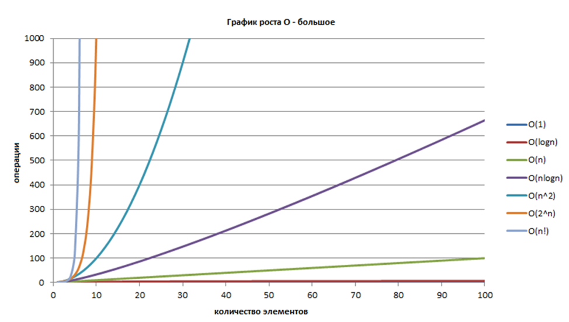
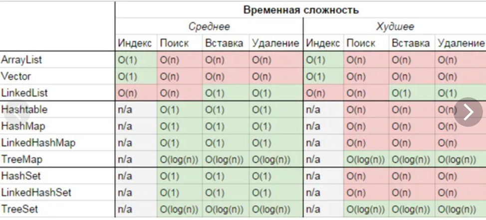

# Сложность алгоритмов. Первое знакомство

**Сложность алгоритмов** (или **вычислительная сложность алгоритмов**) – математическая функция, демонстрирующая
примерную зависимость **времени выполнения** алгоритма (или **потребляемой памяти**) в зависимости от числа элементов.

Данная тема достаточно важна для того, чтобы сравнивать различные алгоритмы между собой. Сюда же можно отнести выбор
структуры данных (в нашем случае – актуально при выборе коллекций, в первую очередь) в зависимости от задачи – поскольку
определенные структуры данных используют определенные алгоритмы для вставки, удаления и поиска значений – можно сделать
сравнительный анализ сложности используемых ими алгоритмов и руководствоваться таким анализом при выборе конкретной
структуры данных.

Я не могу сказать, что данную тему стоит изучать досконально на ранних этапах, но общее представление о ней стоит иметь.
Как минимум, чтобы знать о том, что такие подходы существуют и их можно использовать при необходимости.

В рамках данного урока мы разберем классические примеры операций, по использованию которых можно оценить сложность
алгоритма (преимущественно, временную) и рассмотрим сложность операций в различных типах коллекций в Java.

Поскольку тема сложности алгоритмов достаточно востребована различными специалистами (включая разработчиков
безотносительно используемого ими ЯП), материалов, в т.ч. русскоязычных, достаточно много. Поэтому вы можете
воспользоваться как предлагаемыми мной ссылками, так и найти иные источники, которые вам покажутся доступными (если
таковые будут – не стесняйтесь делиться в комментах).

Начать предлагаю со [статьи](https://tproger.ru/articles/computational-complexity-explained/)

Очень короткая и очень простая статья, не дающая полного представления, но очень удачная, чтобы начать свой путь в теме
сложности алгоритмов.

Из нее рекомендую отметить следующие моменты:

- Сложность алгоритма не дает информацию о затрачиваемом времени (или памяти) в абсолютным величинах. Впрочем, этого
  обычно и не требуется;
- Что такое **О-нотация**. Рекомендую ознакомиться отдельно, если этот термин незнаком. Хотя бы на Википедии или в
  другом источнике на ваш выбор;
- _n_ – количество элементов, обрабатываемых алгоритмом;
- Конечная сложность алгоритма, может быть представлена как в виде нескольких слагаемых (например, _log(n) + n2_), так и
  в виде какого-то константного коэффициента в функции (скажем, _7log(n)_) и прочих вариациях на тему. За редким
  исключением (например, _nlog(n)_), все «вторичные» элементы выражения игнорируются, оставляя лишь то, что в большей
  степени влияет на сложность: (_log(n) + n2) → n2_, _7log(n) → log(n)_;
- Примеры. Они описывают лишь **линейную**, **квадратичную** и **логарифмическую сложность**, но вполне доступны.
  Алгоритмы, приводимые в пример – просты и их легко разобрать, даже если ранее они вам не встречались. Единственное,
  для квадратичной сложности я бы привел в пример **сортировку пузырьком**. Она имеет ту же сложность, но чаще известна
  новичкам.

В целом, рекомендую запомнить следующие варианты сложности алгоритмов и общий сценарий их возникновения:

1. _О(1)_. Сложность алгоритма не зависит от числа элементов. Получение длины массива, например;
2. _О(n)_. **Линейная сложность**. Например, обход массива циклом;
3. _O(n²)_. В общем случае можно представить как _O(nᵐ)_ (да простят меня за такие обобщения). Классический пример –
   вложенные циклы с полным перебором. Как пример квадратичной сложности – упомянутая выше сортировка пузырьком, в общем
   случае – сложность алгоритма будет зависеть от числа вложенных циклов: при полном перебора элементов в 4 вложенных
   друг в друга циклах, _m = 4_, сложность алгоритма – _О(n⁴)_;
4. _О(log(n))_. **Логарифмическая сложность**. Пример алгоритма – бинарный поиск в массиве, приводился в статье по
   ссылке выше. Альтернативный пример – поиск элемента в бинарном дереве поиска. По сути, каждая итерация алгоритма
   будет вызвана на _n/2 (3, 10, m)_ множестве данных, в сравнении с предыдущей. Где _2 (3, 10, m)_ будет основанием
   логарифма, но обычно им пренебрегают (в целом, почти всегда – 2);
5. _O(nlog(n))_. Все то, что вы сможете нагуглить по фразе «разделяй и влавствуй» в алгоритмизации. Сюда можно отнести
   большинство эффективных сортировок: **quicksort** (исключая худший случай), **merge sort** и т.д. Суть сводится к
   рекурсивной обработке массива данных с уменьшением этого массива в _2 (3, 10, m)_ раз, указывающем на основание
   логарифма, но, в отличии от алгоритмов поиска, с перебором элементов на каждой итерации. В наиболее общем случае
   можно представить как совокупность рекурсивных вызовов(каждый вызов порождает _2 (3, 10, m)_ новых) и цикла (или
   нескольких циклов, но без вложенности).

Факультативно могу предложить рассмотреть заодно:

- _О(2ⁿ)_. В более общем случае, можно представить как _mⁿ_. **Экспоненциальная сложность**. Пример – рекурсивный поиск
  чисел Фибоначчи. Или полный перебор возможных значений строк заданной длины. _m_ – количество возможных символов,
  _n_ – длина строки. В общем, весь возможный спектр алгоритмов, где каждая итерация увеличивает обрабатываемое
  множество данных в _2 (3, 10, m)_ раз;
- _О(n!)_. **Факториальная(?) сложность**. Классических примеров в контексте алгоритмов, честно говоря, не знаю, но
  логика подсказывает думать в сторону комбинаторики. Вики подсказывает
  решение [задачи коммивояжера](https://ru.wikipedia.org/wiki/Задача_коммивояжёра) методом полного перебора.

Последние два пункта вряд ли понадобятся вам на практике, но ярко демонстрируют, насколько затратные алгоритмы можно
реализовать.

> !NB: Уже написав большую часть урока наткнулся на неплохую 
> [статью](https://techrocks.ru/2020/07/15/big-o-explanation-for-newbies/) с примерами

В качестве визуализации – график роста О-большого для алгоритмов разной сложности. 
[Источник](https://habr.com/ru/post/188010/)

Не уверен, что стоит погружаться тем, кто впервые познакомился с темой, но некоторые графические материалы там довольно
интересны. Так что советую посмотреть, но не переживать, если что-то будет непонятно.

[Бесплатный бонус](https://tproger.ru/translations/algorithms-and-data-structures/).
Еще одна статься для начинающих. Тоже общие термины, классические примеры. Бонусом - понятие наилучшего, среднего и
наихудшего случаев. Чуть ниже мы его коснемся.

В целом - советую изучить все представленные ссылки. Тема тяжела для восприятия, если ранее с ней не были знакомы.
Повторенье - мать ученья:)

## О наших баранах и Java

Как уже было сказано, сложность алгоритма может быть применена в отношении потребляемой памяти или в отношении
затрачиваемого времени. Мой опыт говорит, что временная сложность имеет большее значение в современной Java-разработке,
поскольку дефицита памяти на горизонте не видно. Но в данном случае на истину не претендую.

Также стоит отметить, что оценка сложности, как правило, проводится для худшего и среднего случаев (где это имеет
смысл). Иногда – еще и для лучшего. И это имеет смысл.

Скажем, для лучшего случая (сортировки уже отсортированного массива) сортировки пузырьком, временная сложность будет
_O(n)_, а вот для классической реализации quicksort временная сложность в лучшем и среднем случае – _O(nlog(n))_.

Соответственно, в ситуации, когда в вашу функцию сортировки в 90% случаев приходит уже отсортированный ранее массив и
лишь в 10% случаев – не отсортированный, возможно, стоит использовать именно сортировку пузырьком:)

Касательно сложности операций в различных java-коллекциях – предлагаю картинку ниже:

Она уже знакома тем, кто читает чаты, но может быть в новинку для остальных.

Опираясь на нее, можно, например, сделать вывод, что `TreeMap` – лучший выбор, если вы предполагаете частый (в сравнении
с операциями вставки и удаления) перебор всех значений в отсортированном виде - именно тогда может иметь значение
порядок элементов. Но, для ситуаций, когда вставка/удаление значений происходит чаще, чем подобные операции – выгоднее
использовать `HashMap`.

К слову, в отношении последней (а также ее наследников и связанных _Set_’ов) советую особо не переживать насчет худших
показателей – они представлены для некорректно определенных хэшкодов – по сути, для ситуации, когда все значения (пары)
оказались в одном бакете и представляют собой связный список.

## В качестве заключения

Сложность алгоритмов – достаточно серьезная тема. Но главное, что стоит помнить о ней – она показательна на объемах
данных, стремящихся к бесконечности. И абсолютные затраты времени на малых объемах данных могут быть выгоднее в
алгоритмах, которые на большом объеме совершенно неэффективны.

Вторым важным пунктом стоит отметить, что сравнивать различные алгоритмы (особенно – эффективность различных структур
данных) стоит тогда, когда с выбранной структурой будет производиться множество операций. Иными словами – помните о
накладных расходах.

Скажем, нет смысла превращать ваш `ArrayList` в `TreeSet` ради единичной операции поиска – создание новой структуры
(с _N_ вставками) будет куда дороже, чем потенциальный выигрыш от более эффективного поиска. Зато это может иметь 
смысл, если структура будет инициализирована единожды, в количество проверок на вхождение будет многократно превышать 
число элементов в ней.

К сожалению, это очевидно на банальных примерах, но не всегда очевидно на практике.

#### На сегодня все!

Урок теоретический. В качестве практики могу предложить воспроизведение основных операций для различных коллекций –
посмотрите, на каких объемах данных выигрыш у различных коллекций станет ощутим. Самый простой способ измерить разницу
во времени – использовать `System.nanoTime()` или `System.currentTimeMillis()` до и после замеряемых операций и считать
их разность.

> Если что-то непонятно или не получается – welcome в комменты к посту или в лс:)
>
> Канал: https://t.me/ViamSupervadetVadens
>
> Мой тг: https://t.me/ironicMotherfucker
>
> **Дорогу осилит идущий!**