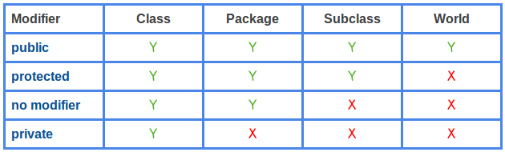

# Инкапсуляция. Пакеты. Модификаторы доступа. Getter'ы и Setter'ы

## Понятие инкапсуляции

Сегодня мы разберемся с одним из принципов ООП — **инкапсуляцией**, а также средствами, которые используются в Java для
ее достижения. Как синтаксическими, так и нет.

С точки зрения базового определения, инкапсуляция — это объединение в одной структуре (в одном компоненте) данных и
логики. В терминах Java — объединение полей и методов. Таким образом, определение инкапсуляции в каком-то смысле 
порождает уже знакомое нам понятие класса. Такое является достаточно вольной трактовкой, в силу того, что нам пока 
не знакомы некоторые термины, которые играют важную роль в более классической формулировке. 

С точки зрения применения, инкапсуляция часто заключается в сокрытии данных или реализации логики. И именно на это будут
направлены средства языка, которые мы изучим сегодня.

Стоит сразу отметить, что сокрытие, как данных, так и реализации, относится не к невозможности увидеть код или узнать
состояние объекта в процессе выполнения, а к невозможности получить какие-то поля/методы за пределами
класса/пакета/иерархии наследования.

Также можно говорить об инкапсуляции определенной логики в более глубоком смысле, в контексте жесткого ограничения
ответственности конкретных классов или модулей (что бы это слово не значило), но в рамках теоретической части курса мы 
будем касаться этого лишь поверхностно. Больше внимание этому аспекту будет уделяться в практических заданиях.

## Пакеты

**Пакеты** в Java — механизм, который, на первый взгляд, можно свести к обычным файловым директориям (папкам). Полагаю,
все понимают назначение папок на диске.

Однако в совокупности с **модификаторами доступа** (которым посвящен следующий подраздел), пакеты также участвуют в
ограничении доступа к данным (классам, конструкторам, полям или методам). Но об этом ниже.

С базовым синтаксисом предлагаю ознакомиться в [статье](https://metanit.com/java/tutorial/3.2.php).

Кроме того, рекомендую обратить внимание на следующие вещи:

* Пакеты принято именовать строчными буквами, в единственном числе. Рекомендуется использовать одно слово для названия
  пакета. Если пакет невозможно определить одним словом, способ разделения слов (или его отсутствие), определяются в
  рамках команды;
* Вложенные пакеты — не часть внешних пакетов. Т.е. если у нас есть классы/поля/методы, видимость которых ограничена
  (см. модификаторы доступа) в рамках пакета `a`, они не будут доступны в рамках пакета `a.b`. И наоборот. Пакеты в
  Java — это не древовидная структура, каждый пакет(`a`, `a.b`) является просто идентификатором, даже если физически он
  находится внутри другого пакета;
* Пакеты в Java принято разбивать на основе назначения классов, а не **доменной логики**. Условно, в программе, которая
  содержит классы создания треугольника и квадрата, а также свои классы-принтеры для каждой фигуры, пакеты стоит
  разбивать как: `figure`, `printer`. И ни в коем случае не `triangle`, `square`;
* Существует общепринятый подход к пакетам верхнего уровня. Он определяет первые три уровня пакетов. Т.е. даже в примере
  выше пакеты `figure` и `printer` должны оказаться на четвертом уровне вложенности. Разберемся подробнее в отдельном 
  абзаце.

Первые два уровня пакетов — доменное имя компании в обратном порядке. В качестве примера возьмем `google.com`. В
продуктах от Google на Java самым верхним пакетом будет `com`, в нем будет лежать пакет `google`. Пакет третьего 
уровня — обозначение (название) проекта. Далее идут пакеты функционального уровня, которые зависят от потребностей 
продукта. Т.е. в общем виде полное название пакетов в гугле можно определить как: 

```
    com.google.<projectName>.<sthPackage>.
```

Визуализировать структуру можно так:

```
 - com  
 -- google  
 --- {projectName} — в этом пакете обычно находится класс с методом main()  
 ---- {sthPackage1}  
 ---- {sthPackage2}  
 ----- {sthSubPackageInPackage2}  
 ...
```

Пакеты — важный инструмент в Java. Как с точки зрения удобства разделения классов по назначению, так и с точки
зрения инкапсуляции, поскольку позволяет ограничить доступ к классам (или их полям и методам) пределами пакета, где они
определены. Но для этого нам нужны **модификаторы доступа**.

## Модификаторы доступа

Этот механизм предназначен как раз для того, чтобы явно обозначить, где должен быть доступен класс, его поля и методы.

Предлагаю ознакомиться со [статьей](https://metanit.com/java/tutorial/3.3.php).

Также в комментариях к статье была достаточно наглядная картинка:  


К модификатору `protected` мы еще вернемся в следующем уроке (наследование). На данном этапе нам не хватает знаний
синтаксиса, чтобы закрепить его использование.

Стоит отметить, что модификатор доступа "по умолчанию" (на картинке выше — **no modifier**) также называют 
**package-private**, что в большей степени описывает его область видимости.

В контексте применения модификаторов доступа внутри класса можно вывести несколько базовых пунктов:

* Не константные поля классов принято определять как `private`;
* Методы, реализующие основную ответственность класса - `public`;
* Методы, которые не предполагается использовать за пределами класса (созданные в рамках декомпозиции больших публичных
  методов или какие-то переиспользуемые внутри класса методы, не имеющие смысла вне его) - `private`;
* Конструкторы - обычно `public`. Бывает иначе, но до этого мы еще дойдем.

## Getter'ы и Setter'ы

**Геттеры** и **сеттеры** — классические во многих ООП-языках методы для получения и изменения поля. В ряде языков для
них есть **синтаксический сахар**, в Java — нет. Нужны они для разграничения работы с конкретным полем.

В общем случае, метод-геттер возвращает значение поля класса, к которому относится. Метод-сеттер — принимает в качестве
параметра значение, которое нужно установить полю.

Каждому полю соответствует свой геттер и свой сеттер.

Также возможна ситуация, когда геттер (метод, возвращающий значение поля) есть, а сеттер — нет. Например, потому что не
предполагается прямое изменение этого поля извне.

В качестве общего примера для геттеров и сеттеров рассмотрим условный класс:

```java
    public class SthClass {
        private String sthField;
        
        public String getSthField() {
            return sthField;
        }
        
        public String setSthField(String sthField) {
            this.sthField = sthField;
        }
    }
```

Здесь `getSthField()` — геттер поля `sthField`, `setSthField()` — сеттер этого поля.

Почти всегда логика геттера заключается только в том, чтобы вернуть поле, а сеттера — в присвоении нового значения.
Крайне редко, но бывают ситуации, когда тела этих методов содержат еще какую-то функциональность. Однако на данном этапе
предлагаю не заострять на этом внимание, ибо кейсы использования дополнительной логики действительно узкие.

> **!NB**: комбинация клавиш `alt`+`insert` предложит вам сформировать стандартные геттеры и/или сеттеры для полей, 
> конструкторы по выбранным вами параметрам и еще некоторые вещи, с которыми мы еще не знакомы.

Возвращаясь к практике применения геттеров и сеттеров, в общем случае, поля должны быть приватными (`private`), 
а геттеры и сеттеры — публичными (`public`). На практике бывают разные ситуации, но они зависят от конкретных задач и 
особенностей их реализации.

Геттеры и сеттеры непривычны сначала и их использование кажется неудобным. Но именно они могут спасти вас от проблем со
случайной перезаписью значения, а в дальнейшем — дают гибкий инструмент настройки доступов к полям.

## В качестве вывода

Инкапсуляция, как и любой другой принцип ООП, достаточно проста в базовом применении. Синтаксис и общепринятые практики
ее достижения не являются чем-то сложным. С опытом и набитыми шишками многие вещи покажутся глубже, чем сейчас. Однако
уже сейчас стоит убедиться, что изученный принцип понятен на базовом уровне, а изученный синтаксис не вызывает полного
непонимания.

#### С теорией на сегодня все!


Переходим к практике:

С этого урока предлагаю принять, что все мы разрабатываем продукты для компании walking.com, соответственно,
пакеты 1го и 2го уровня: `com.walking`.

## Задача:

Разработать программу в рамках компании walking/com, позволяющую следить за счетчиками на газ, холодную воду, горячую
воду и электричество. Обозначение программы в рамках компании — `counterAggregation`.

Используя за основу 
[задачу](https://github.com/KFalcon2022/practical-tasks/tree/master/src/com/walking/lesson8_classes_objects)
из темы про классы и объекты, реализовать класс счетчика, который хранит название счетчика и его значение, его единицы
измерения, а также обеспечивает доступ к значениям. Название счетчика и его единицы измерения должны быть неизменны.

Также реализовать сервис `CounterService`, зона ответственности которого — хранение массива доступных счетчиков,
получение всех доступных счетчиков, получение доступа к счетчику по названию, увеличение значения счетчика на единицу
или заданное значение, а также сброс счетчика до нулевого значения.

Ответственность класса, содержащего `main()` — создание счетчиков. Сам класс также предлагаю назвать `Main`.

Также реализовать в классе `Main` приватный метод, который позволяет вывести значения счетчиков в виде:

```
    <Название счетчика>: <Значение счетчика>
```

Например:

```
  Газ: 2333
  Горячая вода: 0
  Холодная вода: 23
  ...
```

**Разбор практики для этого урока**:
[ссылка](https://github.com/KFalcon2022/CounterAggregation)

> Если что-то непонятно или не получается – welcome в комменты к посту или в лс:)
>
> Канал: https://t.me/ViamSupervadetVadens
>
> Мой тг: https://t.me/ironicMotherfucker
>
> **Дорогу осилит идущий!**
