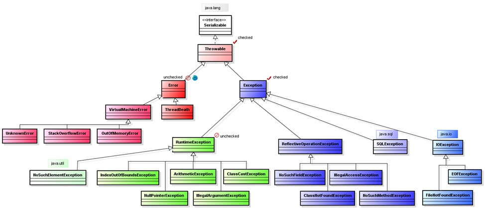

# Исключения

Мы уже не раз сталкивались на практике с ситуациями, когда необходимо обработать некорректные данные: дефолтные кейсы
в `switch-case`, не найденный элемент в массиве и пр. До этого момента мы были вынуждены возвращать из методов `null`
и/или выводить сообщение о некорректном вводе в консоль.

В Java, как и во многих других языках для обработки подобных ситуаций есть механизм исключений (эксепшнов, от англ.
_Exception_). Он позволяет сообщить, что поведение не укладывается в ожидаемые рамки и возникает некая ошибочная –
исключительная – ситуация.

Исключения можно **пробрасывать** (создавать), **отлавливать**, создавать свои или использовать те, которые уже
существуют в Java. Но обо всем по порядку.

В качестве первого знакомства можно ознакомиться со [статьей](https://metanit.com/java/tutorial/2.10.php)

А также главой 4 на metanit, полностью посвященной работе с исключениями и состоящей из трех статей:

* [первая](https://metanit.com/java/tutorial/4.1.php)
* [вторая](https://metanit.com/java/tutorial/4.2.php)
* [третья](https://metanit.com/java/tutorial/4.3.php)

Вся основная информация также будет представлена в рамках текущей статьи ниже.

## Иерархия исключений

Исключения в Java являются ссылочным типом. Абсолютно все исключения имеют общего предка – абстрактный
класс `Throwable`.

У `Throwable` есть два основных наследника: `Error` и `Exception`.

`Error` является общим предком для всех ошибок, которые так или иначе связаны с невозможностью продолжения корректной
работы JVM. Например, нехватка памяти (в разных вариациях) и пр. Исправление таких ситуаций внутри программы невозможно.

Два наиболее известных `Error` в Java – `StackOverflowError` и `OutOfMemoryError`.

`StackOverflowError` возникает в ситуации, когда у нас переполнился **стек**. Это область памяти, которая хранит
значения примитивов и ссылки на объекты. Мы будем рассматривать области памяти в JVM в рамках ближайших уроков и
подробно разберем, какие области памяти существуют, и что они хранят. Пока ограничимся тем, что отметим наиболее
очевидную причину переполнения стека: некорректная реализация рекурсивных алгоритмов. Как правило, это рекурсивные
методы, где не был корректно прописан кейс выхода из рекурсии.

`OutOfMemoryError` возникает в ситуации, когда закончилось место в другой области памяти – **куче (heap)**. Это область
памяти, которая хранит объекты. Может быть вызвана как ошибками проектирования, которые привели к **утечкам памяти**,
так и физическими ограничениями.

Как уже было сказано, в рамках программы невозможно обработать возникновение `Error`. Синтаксически Java позволяет такую
обработку, но она не имеет смысла. Единственное, что возможно сделать – проектировать систему так, чтобы избегать причин
появления `Error`. С другой стороны, иногда они возникают из-за физических ограничений компьютера (или сервера), в таких
случаях решение проблемы находится вне ответственности разработчика.

Другой наследник `Throwable` – `Exception` – является предком для всех классов-исключений, которые так или иначе можно
обработать в рамках Java-приложения. Сюда можно отнести большинство ошибок, которые могут возникнуть: отсутствие нужного
ресурса (например, файла, с которым должно взаимодействовать приложение), попытка обращения к полю или методу у `null`,
выход за пределы массива, деление на ноль… продолжать можно бесконечно.

У `Exception` стоит отметить одного потомка: `RuntimeException`. Он объединяет все исключения, возникающие во время
выполнения программы, которые Java не может предугадать заранее (ниже разберемся с этим подробнее). Другие потомки тоже
есть, но сейчас они нас мало интересуют.

Пока предлагаю рассмотреть схему, визуализирующую иерархию наследования от `Throwable`:



## Checked и Unchecked исключения

Кроме иерархии, все исключения (включая `Throwable` и `Error`) можно разделить на две группы:

1. **Проверяемые (checked);**
2. **Непроверяемые (unchecked).**

На схеме выше вы можете увидеть, какие исключения являются проверяемыми, какие – нет:

* Проверяемые: `Throwable`, `Exception` и все его наследники, исключая `RuntimeException` и его потомков;
* Непроверяемые: `Error`, `RuntimeException` и всех их потомки.

Проверяемые исключения характерны тем, что мы обязаны обработать возможность их возникновения в обязательном порядке
(иначе – ошибка компиляции), либо пробросить (из метода) наверх – в вышестоящий метод. Для этого существует несколько
синтаксических конструкций, с которыми мы познакомимся ниже. Еще одной отличительной чертой является то, что мы их можем
предугадать. Как, например, то, что файл, к которому мы попытаемся получить доступ, не
существует (`FileNotFoundException`).

Непроверяемые – наоборот, Java не обязует обрабатывать ситуации, где они могут возникнуть. Как минимум потому что такие
исключения могут возникнуть практически в любой строчке кода и предугадать это проблематично.
Например, `NullPointerException` возникает при обращении к полю или методу переменной (или поля класса) ссылочного типа,
в которую записан `null`. Обязать программиста проверять переменную на `null` перед каждым ее использованием – очевидно,
не самая удачная идея.

## Блок try-catch-finally

Первый механизм, позволяющий работать с исключениями (впрочем, используется он и для других
целей) – `try-catch-finally`. Зачастую его также называют `try-catch` (поскольку блок `finally` не обязателен и далеко
не всегда объявляется при обработке исключений).

`try-catch` используют для ситуаций, когда код может выбросить проверяемое исключение. Общий сценарий использования
можно описать следующим образом:

```java
    try {
        //Код, который может выбросить исключение
    } catch (Exception e) { //В скобках объявляем переменную того типа исключения, которую хотим отловить
        //Логика обработки исключения
    } finally {
        //Логика, которая отработает в любом случае после
        //блока try (или catch, если исключение будет отловлено). 
        //Даже если в блоках try или catch будет вызван return
    }
```

Стоит отметить, что блоки `catch` и `finally` – необязательны (`catch` необязателен, если из try-блока JVM не ожидает
проверяемого исключения, `finally` в целом является опциональным). Кроме того, блок `catch` может отлавливать несколько
исключений. Например:

```java
    try {
        //Код, который может выбросить исключение
    } catch (SthException1 | SthException2 e) { //Перечисляем возможные типы исключений через «|»
        //Логика обработки исключения
    }
```

Также и самих блоков `catch` может быть несколько (например, для разных исключений требуется разная логика обработки):

```java
    try {
        //Код, который может выбросить исключение
    } catch (SthException1 e) { 
        //Логика обработки исключения SthException1
    } catch (SthException2 e) { 
        //Логика обработки исключения SthException2
    }
```

При использовании нескольких блоков `catch` стоит помнить, что отработает лишь один (первый подходящий) блок. Поэтому
для ситуаций, когда отлавливаемые исключения принадлежат к одной иерархии (например, `FileNotFoundException` и его
предок - `IOException`), сначала стоит отлавливать более узкий тип (потомка), а лишь потом – более широкий (предка).
Иначе блок `catch` для потомка никогда не будет достигнут.

Не стоит бояться того, что вы не владеете названиями исключений. Наиболее частые из них запомнятся быстро, по мере того,
как будете с ними сталкиваться.

Механизм `try-catch` не рекомендуется использовать для обработки непроверяемых исключений (хоть синтаксис это и
допускает). Вызов таких исключений предпочтительно не допускать, посредством предварительной валидации (например,
используя проверки данных через `if`) и других способов, зависящих от логики приложения.

## Ключевое слово throws

Вторым способом обработки проверяемых исключений является их **«пробрасывание»** из метода, где они возникли. Таким
образом можно отдать обработку возникшего исключения вышестоящему методу. Рассмотрим пример использования `throws`:

```java
    public Object doSth() throws SthException {
        //Тело метода
    }
```

Таким образом мы делегируем обработку исключения методу, который вызовет наш метод `doSth()`. Он, в свою очередь, может
использовать `try-catch` или `throws`.

Также существует возможность пробросить из метода сразу несколько исключений, в таком случае их необходимо записать
через запятую:

```java
    public Object doSth() throws SthException1, SthException2 {
        //Тело метода
    }
```

Технически, мы можем пробросить и непроверяемое исключение, но это не имеет смысла – их обработка в вышестоящем методе
все равно будет необязательной.

> !NB При переопределении метода с блоком `throws` мы можем поменять порядок пробрасываемых исключений, добавить 
> новые исключения, а также полностью убрать блок `throws`.

## Ключевое слово throw

Зачастую необходимо самостоятельно объявить о том, что возникла исключительная ситуация. Это можно сделать, использовав
в методе оператор `throw`. Например:

```java
    public Object doSth() {
        throw new RuntimeException();
    }
```

Вызов метода `doSth()` приведет к возникновению непроверяемого исключения `RuntimeException`. Общий синтаксис
заключается в вызове конструктора нужного исключения после оператора `throw`.

Обратите внимание, что любой метод, возвращающий значение должен либо вернуть значение, либо завершиться с исключением.
Таким образом. Если какой-то из сценариев, описанных в методе, завершается с вызовом `throw`, `return` в этом сценарии
писать не нужно. Метод прекращает выполнение после вызова `throw`. Например:

```java
    public int doSth(int number) {
        if (number == 0) {
            throw new RuntimeException();
        }
        
        return number; //Если number == 0, сюда уже не дойдем
    }
```

## Содержимое класса Exception

Исключение, как и любой класс, может содержать поля, конструкторы и методы. В различных исключениях их набор может
отличаться, например, в собственных классах-исключениях мы можем объявить поля и методы, которые необходимы для нашей
специфичной логики. Однако рассмотрим то, что есть в `Exception`, а значит и во всех его потомках. Содержимое класса не
ограничивается тем, что ниже, мы отметим лишь то, что может быть нам полезно.

Поля (определены в `Throwable`, но доступны в `Exception`) и методы для доступа к ним:

* `detailMessage`. Содержит текстовое описание исключения. Может быть передано параметром конструктора при создании
  исключения. Доступно через метод `getMessage()`;
* `cause`. Содержит объект исключения, отлов которого привел к созданию рассматриваемого нами исключения (подробности
  ниже). Может быть передано параметром конструктора при создании исключения. Доступно через метод `getCause()`;
* `stackTrace`. Содержит массив данных, описывающий цепочку вызовов, которые привели к появлению этого исключения (среди
  прочего, предоставляет полное имя класса и строку, в которой произошел вызов). Визуализацию этого поля можно увидеть в
  консоли, если программа завершилась с исключением. Крайне полезно при поиске причины возникновения исключительной
  ситуации. Доступно через метод `getStackTrace()`.

Конструкторы:

* Конструктор по умолчанию;
* `public Exception(String message)`. Позволяет передать текстовое описание исключения (будет записано в
  поле `detailMessage`);
* `public Exception(String message, Throwable cause)`. Позволяет передать текстовое описание и исключение, которое стало
  причиной создания текущего исключения (будет записано в `cause`);
* `public Exception(Throwable cause)`. Позволяет передать только исключение, которое стало причиной создания текущего
  исключения;

Также `Exception` содержит еще один _protected_-конструктор для более тонкой настройки объекта исключения, но в рамках
данной статьи он рассматриваться не будет по причине бесполезности в повседневном использовании. При желании можете
ознакомиться самостоятельно.

Напомню, что наследники `Exception` могут содержать и другие поля, методы и конструкторы.

## Цепочки исключений

Немного более подробно рассмотрим актуальность поля `cause` в `Throwable`.

В большинстве систем предусмотрены те или иные механизмы обобщения и последующей работы с исключениями. Речь именно об
архитектурных решениях для такой обработки, а не каком-то специфическом синтаксисе.

Как правило, все исключения оборачиваются (изначальное исключение добавляется в `cause` и выбрасывается новое
исключение) в одно или несколько специфических, определенных в проекте (или используемой библиотеке/фреймворке)
исключений. Они могут содержать дополнительную информацию (например, код HTTP, который должен вернуть запрос). Такое
обобщение удобно, поскольку избавляет от необходимости ограничиваться полями и методами изначального исключения. Вместо
этого мы можем передавать в исключения любую дополнительную информацию, которая будет использована в дальнейшем.
Например, на клиентской (браузерной) части веб-приложения или в другом сервисе.

Подходы к обработке исключений различны, но любая гибкая настройка требует определенного обобщения в собственные классы.
Так и появляются цепочки исключений.

На самом деле, это отдельная обширная тема, но вряд ли мы ее затронем в рамках нашего курса. Она выходит за пределы
компетенций junior-специалистов и лежит скорее в области архитектуры информационных систем. Отмечу лишь, что подходы
могут быть разными, но почти все из них используют обертывание исключений в другие исключения на том или ином уровне
логики.

## Создание собственных классов-исключений

В этой теме нет синтаксических сложностей, достаточно создать класс, который наследует одно из существующих исключений
(обычно `Exception`, `RuntimeException` или одно из общих кастомных исключений в рамках проекта).

Однако существует сложность иного рода: когда стоит делать собственное исключение проверяемым, а когда – нет.

На первый взгляд, и здесь все просто: если хотим, чтобы наше исключение обрабатывалось в обязательном порядке – делаем
checked, если нет – unchecked.

Но когда стоит заставлять обрабатывать кастомное исключение?

Вопрос выбора checked/unchecked при реализации собственного исключения был популярен на собесах для middle-специалистов
несколько лет назад. Не знаю, изменилась ли ситуация сейчас. В любом случае, тема действительно важная.

Проверяемые исключения, в общем случае, не представляют собой ошибку поведения как таковую. Скорее, это возможность
ошибки, не связанной с поведением программы, о которой мы уведомляем JVM и просим отследить обработку ситуаций, если эта
ошибка возникнет. Например, отсутствие файла, класса, подключения и базе данных и т.д. Это достаточно небольшой процент
исключительных ситуаций. Чаще всего собственные проверяемые исключения создаются при написании библиотек. В качестве
подсказки: проверяемое исключение возникает по причинам, не связанным напрямую с действиями пользователя. Это просто
штатная ситуация, хоть и вне основного сценария взаимодействия. И эту ситуацию необходимо обработать.

Непроверяемые исключения – именно ошибка поведения. Некорректные данные от пользователя или некорректный способ
взаимодействия. Например, ввод строки вместо числа. Таким образом, это внештатная ситуация в рамках программы. Ее
проблематично предугадать заранее, обработать корректно – тоже проблема. Абсолютное большинство кастомных исключений –
непроверяемые.

Конечно, далеко не всегда непроверяемые исключения возникают по вине пользователя, зачастую они являются результатом
плохого кода. Но тип исключения мы определяем на этапе проектирования, кода еще не существует, а значит мы предполагаем,
что он идеален:)

#### С теорией на сегодня все!


Переходим к практике:

## Задача 1:

Создайте массив, имитирующий простейшую файловую систему и содержащий объекты файлов.

Реализуйте класс `«Файл»` содержит название файла, его размер и тип информации (Текст, изображение, аудио, видео.
Рекомендую задать типы информации через `Enum`).

Реализуйте механизм поиска по файлам. Метод, реализующий поиск должен выбрасывать `FileNotFoundException`, если файл не
найден (вне зависимости от варианта задачи). Если файл с названием, введенным пользователем с клавиатуры, существует –
вывести на экран информацию о нем (допустимо использовать переопределенный `toString()`). Если нет, то

1. выведите сообщение _«Искомый файл не существует»_;
2. выбросьте исключение `FileNotFoundException`. Подсказка: `throws` можно использовать в том числе в `main()`.

## Задача 2:

Реализуйте любой из вариантов Задачи 1 в [уроке 16](https://telegra.ph/Abstraktnye-klassy-i-interfejsy-11-28). 
При некорректном вводе с клавиатуры выбрасывайте собственное исключение `InputValidationException`. 
Не забудьте указать в описании, какой именно из вводов был некорректен - message исключения должен быть информативным. 
Предка исключения определите самостоятельно.

## Задача 3:

Реализуйте любой из вариантов задачи в [уроке 18](https://telegra.ph/Proverki-tipov-v-Java-11-30). 
Для ситуации, когда тип животного неизвестен, выбрасывайте собственное исключение `UnknownAnimalException`. 
Предка исключения определите самостоятельно.

Также предусмотрите валидацию массива животных на содержание пустых элементов. Если таковые существуют – бросьте
кастомное исключение `ArrayValidationException`, которое содержит информацию об индексе массива, содержащем
содержит `null`. 

> Если что-то непонятно или не получается – welcome в комменты к посту или в лс:)
>
> Канал: https://t.me/ViamSupervadetVadens
>
> Мой тг: https://t.me/ironicMotherfucker
>
> **Дорогу осилит идущий!**