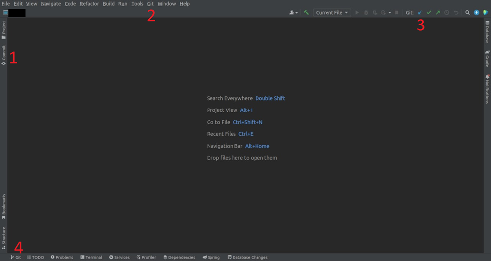
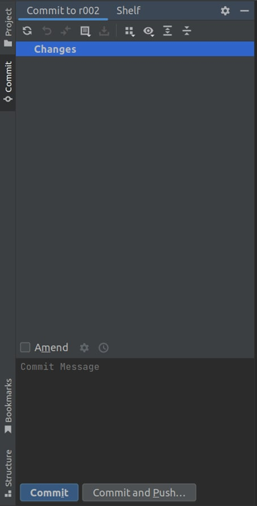
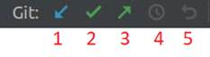
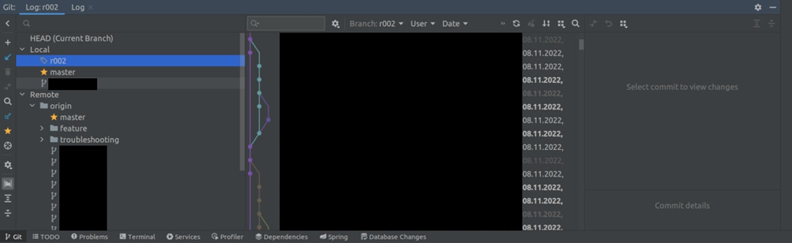

# Системы контроля версий. Git. Github

Сегодня мы отвлечемся от Java и познакомимся с другой технологией, которая важна для любого программиста и способна
многократно упростить написание кода в команде, а также увеличить вероятность того, что ваш код не потеряется из-за
каких-то технических проблем с компьютером или просто рукожопости:)

Актуальность этой технологии именно для нас и именно на данном этапе связана еще и с тем, что наша практика становится
больше и уже сейчас не влазит в один файл, соответственно, и проверять ее намного сложнее. Это уже не 20 строк кода,
которые можно просто скопировать в сообщение или даже заскринить. А т.к. современные проблемы требуют современных
решений — встречайте **системы контроля версий**!

## Системы контроля версий. Что это такое и как это кушать?

Системы контроля версий — набор технологий, предназначенный для упрощения работы с изменяющейся информацией. На самом
деле, это полезно не только для программистов. Используя те же технологии, можно облегчить жизнь даже в написании
собственного диплома в универе. Или написании совместной статьи с кем-либо. Любая работа с версионируемой и/или
совместно изменяемой текстовой информацией может быть облегчена именно использованием какой-либо системы контроля
версий.

Конкретные реализации бывают разные и работать могут на разных принципах. Из тех, что более-менее известны, можно
выделить **git** (и он явный фаворит), **Subversion** (он же **SVN**) и **Mercurial**.

Нас сегодня интересует только первая из реализаций. С определенной долей везения, оставшиеся две вам никогда не
понадобятся, а с первой вы будете сталкиваться на абсолютном большинстве проектов.

## Git

Наверно, никто не сможет рассказать о технологии лучше, чем [официальный источник](https://git-scm.com/book/ru/v2), тем
более, что у него есть русская локализация

К сожалению, информация там подается излишне углубленно для нашего уровня, поэтому советую почитать в фоновом режиме, в
рамках урока мы постараемся разобраться с основными командами.

Некоторые термины и объяснения на официальном сайте могут показаться громоздкими и непонятными — не стоит этого бояться.

К тому же, мы разберемся, как работать с git в IDEA — она имеет более интуитивно-понятный интерфейс, чем консольный
инструмент, а нам этого будет достаточно на данном этапе.

Итак, немного общей информации и основных терминов:

**Репозиторий** — это хранилище информации. Как правило, репозиторий делают на основании проекта, игнорируя те данные,
которые в версионировании не нуждаются (автоматически созданные файлы IDEA, кастомные локальные конфигурации, *
*скомпилированные** ресурсы (файлы `.class`) и т.д.).

Репозитории бывают **локальные** (хранящиеся на вашем устройстве) и **удаленные** (хранящиеся на внешнем сервере).

Стандартный путь работы с репозиторием — склонировать (`git clone`) удаленный репозиторий к себе и в дальнейшем работать
с ним, при необходимости обновляя его из удаленного репозитория (`git pull` или, вернее, `git fetch`), сохраняя свои
изменения в локальном репозитории (`git commit`) и отправляя их в удаленный (`git push`).

Репозиторий содержит в себе **ветки (branches)**. Они позволяют делать независимые изменения в рамках одного проекта.
Т.е. каждая из веток может хранить свою версию кода. Чисто теоретически, две ветки одного репозитория могут хранить в
себе два совершенно разных проекта.

Как правило, отдельная ветка используется для того, чтобы программист мог реализовать свою задачу в рамках проекта, а
после этого **слить** (**merge** — пока ограничимся только им) ветку, содержащую решение задачи, с основной веткой. Это
очень полезная функция, поскольку параллельно с одним и тем же кодом может работать несколько человек и такой подход
позволяет упростить решение **конфликтов**, которые возникают при внесении разных изменений в одних и тех же файлах.

Ветка, в свою очередь, состоит из **коммитов**. Каждый коммит фиксирует определенную версию программы в рамках ветки.
Тем самым, при необходимости, вы всегда можете откатиться к предыдущим версиям, при этом, не потеряв дальнейшие
изменения и вернуться к ним, если необходимо.

Ниже будет достаточно качественная визуализация веток и коммитов (рис. 5)

На данном этапе нам важно научиться:

* клонировать репозиторий;
* создавать ветки в локальном репозитории;
* переключаться между ветками (**checkout**);
* сохранять свои изменения (**коммитить**) в локальный репозиторий;
* отправлять свои коммиты в удаленный (**пушить**);
* получать (**пуллить/фетчить**) изменения из удаленного репозитория.

Существует достаточно подробная документация, как все это можно делать,
используя [интерфейс IDEA](https://www.jetbrains.com/help/idea/using-git-integration.html)

К сожалению, она на английском. К счастью, там есть картинки:)

Обратите внимание, статья по ссылке выше — корневая для главы. Слева есть оглавление.

В любом случае, ниже будет некоторое количество скриншотов от меня, чтобы понять, где находятся интересующие нас
функции. Помните, что интерфейс может незначительно отличаться в разных версиях IDEA.

Обратите внимание: это актуально, если ваш проект уже является репозиторием. Как его создать — мы рассмотрим в следующем
пункте.

Итак, в основном рабочем окне IDEA есть 4 места, так или иначе связанных с VCS. Также некоторые параметры для системы
контроля версий можно найти в настройках, но их мы на данном этапе касаться не будем.

При нажатии на вкладку _«Commit»_ возле цифры 1 мы увидим примерно следующее:

На месте Changes содержались бы измененные, по сравнению с предыдущей версией (коммитов), файлы. Эти изменения еще не
добавлены в локальный репозиторий (не закоммичены).

Ниже мы можем увидеть поле для текстового сообщения. Его заполнение обязательно, необходимо оно для того, чтобы описать,
какую именно задачу мы решали текущим коммитом.

Еще ниже есть две кнопки: _«Commit»_ и _«Commit and Push...»_. Первая добавит наши изменения лишь в нашу локальную
ветку, в которой мы вносим изменения _(активная ветка/active branch)_. Вторая – добавит изменения в локальную ветку и
предложит сразу отправить их в соответствующую ветку в удаленном репозитории. При этом мы увидим следующее модальное
окно:

`roo2` – название нашей локальной ветки.

`origin : roo2` – название удаленной ветки. Вернее, `origin/r002`. `Origin` – стандартное обозначение для веток,
находящихся у удаленном репозитории.

Синяя кнопка _«Push»_ позволяет нам подтвердить, что мы хотим отправить свои изменения (уже оформленные как коммит) на
удаленную ветку.

Пункт _vcs_ (под номером 2 на рис. 1) нас интересует в меньшей степени. В нем нам будет нужна только функция _«Share
Project on GitHub»_, к ней мы вернемся в следующем подразделе.

Переходим к цифре 3 на рис. 1

Это панель быстрого доступа для VCS. В нашем случае – для git. На ней мы видим 5 кнопок:

1. Обновить состояние ветки из удаленного репозитория (`pull`). Если нажать на нее, появится всплывающее окно, которое
   уточнит желаемый способ обновления. На данном этапе нас вполне устроит первый вариант: _«Merge incoming changes…»_.
   Для получения обновлений достаточно нажать _«OK»_;
2. Закоммитить изменения. При нажатии откроется вкладка с рис. 2;
3. Запушить изменения. При нажатии откроется всплывающее окно (рис. 3);
4. Кнопка _«Show history»_. Отображает историю изменений по коммитам для активного (открытого в данный момент) файла. На
   данный момент нас не интересует данный функционал;
5. Кнопка _«Rollback»_. Демонстрирует измененные после последнего коммита (незакоммиченные) файлы, отображая их в
   древовидной структуре на основании директорий, в которых они находятся. Позволяет быстро отменить незакоммиченные
   изменения для одного или нескольких файлов. Функция полезная, но крайне легкая для освоения. Достаточно хотя бы раз
   попробовать ее на практике.

Переходим к цифре 4 на рис. 1. По нажатии на вкладку _«Git»_ откроется следующее окно:

Слева мы можем увидеть список веток данного репозитория. _Local_ – ветки, которые имеет локальный репозиторий.
_Remote_ – ветки удаленного репозитория. Как вы можете заметить, ветки для удобства можно группировать (в нашем
примере - _feature, troubleshouting_). Желтым ярлыком отмечена активная ветка (та, в которой мы работаем сейчас), желтой
звездочкой – базовая ветка репозитория (почти всегда имеет название _«master»_).

При нажатии правой кнопкой мыши на ветку (любую, кроме активной), нам предлагается несколько опций. На данном этапе
отметим _«Checkout»_ – переключение на выбранную ветку и _«New Branch from selected(или имя выбранной ветки)»_ –
создание новой ветки на основании выбранной (она будет полной копией, пока мы не начнем добавлять свои коммиты). Также
здесь доступен функционал слияния веток (на данном этапе рекомендую merge) - результатом операции будет добавление
коммитов из выбранной ветки в вашу текущую.

В центральной части экрана находится история коммитов. Вы можете заметить что-то, похожее на граф возле левой границы
центральной области. Это визуализация истории коммитов в различных ветках, которые добавлены в текущую ветку (я упоминал
о визуализации выше – это она). Каждый цвет – изменения определенной ветки. Каждая точка – коммит в соответствующей
ветке.

В черной области по центру содержится информация о каждом конкретном коммите: его автор и _«commit message»_ (мы видели
поле ввода на рис. 2).

В правой области были бы отображены изменения конкретного коммита, если бы мы выбрали какой-то коммит из истории и
захотели посмотреть его содержимое.

На этом предлагаю закончить рассмотрение git и перейти к следующему подразделу.

## GitHub

Как можно догадаться из названия, [гитхаб](https://github.com/) – это место, где можно разместить свои гит-репозитории.
Крупнейшее открытое хранилище кода.

Именно с ним мы будем взаимодействовать в рамках курса.

Чтобы разместить свой проект на гитхабе, нам потребуется аккаунт. Регистрация простая. Гитхаб предоставляет множество
функций и сервисов, часть из них платна, но нам хватит бесплатной функциональности.

Итак, после регистрации стоит вернуться в идею и вспомнить про пропущенную ранее цифру 2 на рис.1. И ту самую кнопку
_«Share Project on GitHub»_.

При нажатии на нее откроется всплывающее окно и предложит придумать название репозитория, добавить описание и
авторизоваться на гитхаб (процедура простая и в должной степени автоматизированная).

После заполнения полей достаточно нажать на кнопку _«Share»_. Далее появится всплывающее окно, которое предложит выбрать
файлы для первого коммита. Рекомендую его сделать пустым (просто уберите галочку с корня проекта) и нажмите _«Add»_.

Далее нам предложит создать файл `.gitignore`. Это файл, содержащий правила, по которым git понимает, какие файлы стоит
версионировать и хранить в репозитории, а какие – нет. Последние он будет игнорировать. Соглашаемся (_«Add»_).

После этого мы можем сделать наш первый осмысленный коммит (рис. 4, рис. 2). При нажатии кнопки _«Commit»_ может
появиться всплывающее окно _«Git User Name Is Not Defined»_:

В целом, вы можете ввести любое имя и любой адрес эл. почты. После этого нажимаем _«Set and Commit»_.

В новых версиях IDEA коммит может не произойти, потому что были найдены предупреждения или ошибки в вашем коде (
всплывающее окно в правом нижнем углу + изменение надписей на кнопках у вкладки с рис. 2). Если вы уверены, что все в
порядке – жмем _«Commit Anyway and Push…»_.

И переходим к рис.3. Здесь просто жмем _«Push»_.

_Вы великолепны!_

#### С теорией на сегодня все!

Но оставлю небольшое послесловие. Git достаточно прост в бытовом использовании и, уверен, вы быстро к нему привыкнете.
Однако его возможности достаточно обширны и изучать теоретический материал по взаимодействию с гиту - достаточно тяжело.
Справедливости ради, знакомить с гитом в формате статьи - тоже нетривиальная задача. Я искренне надеюсь, что смог хотя
бы поверхностно познакомить вас с основными функциями, но искренне советую не останавливаться на этой статье и изучать
как официальные источники, так, возможно, и какие-либо видеоуроки с демонстрацией возможностей гита.

По крайней мере, для меня эта статья была самой тяжелой на данный момент. И сомневаюсь, что она получилась самой
удачной. Но у нас все получится:)

А теперь переходим к практике:

## Задача 1:

Заведите учетную запись на [GitHub](https://github.com/)

## Задача 2:

Опубликуйте на гитхабе задачу из урока 
[Классы и Объекты](https://telegra.ph/Klassy-Obekty-Konstruktory-no-ne-Lego-i-klyuchevoe-slovo-this-11-17).

> Если что-то непонятно или не получается – welcome в комменты к посту или в лс:)
>
> Канал: https://t.me/ViamSupervadetVadens
>
> Мой тг: https://t.me/ironicMotherfucker
>
> **Дорогу осилит идущий!**