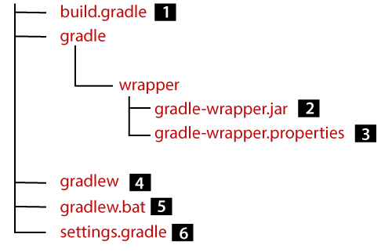

# Gradle. Первое знакомство. Сравнение с Maven

В рамках данной статьи мы начнем знакомство с системой сборки, которая появилась после Maven. А значит постаралась
учесть его ошибки и недостатки.

На данный момент Maven и Gradle являются наиболее типичными для Java системами сборок. Gradle встречается реже в
среднем по больнице, но при этом чаще, если речь идет о свежих проектах.
Кроме того, именно Gradle является стандартной системой сборки в Android-разработке на Java и Kotlin.

Сегодня мы познакомимся с классической структурой проекта в Gradle, попробуем переписать с использованием
Gradle уже знакомый нам проект с log4j и попробуем выделить наиболее крупные сходства и различия двух систем сборки.

В следующих статьях рассмотрим ключевые термины и механизмы Gradle более подробно.

## Структура Gradle-проекта

Рассмотрим структуру Gradle-проекта и файлы конфигурации, которые будем использовать. Ниже приложена схема,
обозначающая характерные для Gradle-проекта файлы и директории.



Структура хранения исходного кода и ресурсов в Gradle аналогична Maven - такая же директория `src` с таким же
внутренним содержимым. Поэтому выше данная часть проекта опущена.

Также в схеме не указана директория, в которой будут храниться результаты сборки - аналог `target` в Maven. Такой
директорией будет выступать `build`.

> Внутреннее содержимое этих директорий отличается, но в рамках разработки этот
> факт мало на что влияет.

Теперь рассмотрим, что, собственно, демонстрирует схема. Пройдем по пунктам:

1. `build.gradle`*. Файл, отвечающий за конфигурацию модуля. По своему назначению он почти на 100% соответствует
   `pom.xml`;

> *Gradle поддерживает конфигурацию с помощью DSL (предметно-ориентированных языков) на базе Groovy и Kotlin. В случае
> использования последнего `build.gradle` и `settings.gradle` будут иметь постфикс `.kts` - расширение файлов для
> скриптов, написанных на Kotlin.

2. Директория `gradle` и вложенная в нее папка `wrapper`. Глобально, в этих директориях хранятся файлы для, неожиданно,
   **Gradle Wrapper** - инструмента, который позволяет использовать Gradle в рамках проекта с учетом специфики
   проекта (например, требуемой версии Gradle), даже если сам Gradle не установлен на компьютере*.
   Собственно, `gradle-wrapper.jar` - архив со скриптами и ресурсами, необходимыми для работы Gradle Wrapper;

> Maven имеет аналог в лице Maven Wrapper, о чем было упомянуто в предыдущем уроке. Подробнее разберемся в одной из
> ближайших статей.

3. `gradle-wrapper.properties`. Файл конфигурации для Gradle Wrapper. Немного детальней познакомимся с ним в теме,
   посвященной Gradle Wrapper;
4. `gradlew`. Исполняемый файл, то, что подразумевается под Gradle Wrapper в узком смысле. Позволяет использовать
   Gradle в рамках проекта. Даже если сам Gradle (как консольная программа) не установлен на компьютере;
5. `gradlew.bat`. `gradlew`, но для Windows;
6. `settings.gradle`. Файл конфигурации модулей и их связей. В Maven эти конфигурации находятся в `pom.xml`, вместе
   со всеми остальными настройками, в Gradle же вынесены отдельно. В итоге в Gradle-проекте может быть много `gradle.
   build` (по одному на модуль), но лишь один `settings.gradle`.

Как видите, ничего сложного нет. Лишь пачка файлов для Gradle Wrapper, которые нас не интересует на данном этапе, и два
файла для конфигурации проекта, заменяющие `pom.xml` в Maven. Остальное не имеет критических различий.

## Создание проекта с использованием Gradle

В рамках пункта предлагаю разобраться проект по ссылке:
[подключение логгера в Gradle-проект](https://github.com/KFalcon2022/gradle-sample).

Этот проект идентичен тому, который мы рассматривали во время знакомства с Maven, за исключением используемой
системы сборки. Рекомендую ознакомиться с `build.gradle` и `settings.gradle`. Они снабжены комментариями,
объясняющими назначение тех или иных блоков конфигурации. Также местами проводятся аналогии с эквивалентными
элементами конфигурации в Maven.

Следующий пункт статьи раскрывает некоторые из описанных нюансов конфигурации, поэтому рекомендую изучить проект
перед тем, как читать дальше.

## Сходства и различия с Maven

### Различия

Безусловно, два разных инструмента, пусть и с одинаковыми целями, различны во множестве аспектов и могут
использовать разные подходы для решения одинаковых задач. В данном разделе мы не будем пытаться объять необъятное, лишь
постараемся подсветить пункты, которые позволят быстрее погрузиться в специфику Gradle, не изучая его с нуля, а взяв за
основу информацию, изученную при знакомстве с Maven.

#### Файлы и язык конфигурации

Если Maven сводит все в `pom.xml`, объединяя и конфигурацию самого модуля, и конфигурацию взаимодействия
родительских и/или дочерних модулей, то Gradle разделяет эти понятия, выделяя `settings.gradle` для декларации
модулей и их связей и `build.gradle` для конфигурации конкретного модуля - его зависимостей, специфики сборки и прочего.

Кроме того, конфигурация для Maven-проекта описывается в формате `xml`, что делает ее достаточно объемной даже в
небольших проектах. В по-настоящему крупных системах это может стать проблемой - слишком длинные конфиги, которые
тяжело даже читать, не говоря о поддержке.

Gradle вместо этого предлагает использовать DSL на основе Groovy или Kotlin. Как вы могли заметить в проекте из
предыдущего пункта, такая форма записи более лаконична. Например, подключение зависимости занимает не пять и
более строк:

```xml
<dependency>
    <groupId>org.apache.logging.log4j</groupId>
    <artifactId>log4j-api</artifactId>
    <version>2.20.0</version>
</dependency>
```

А лишь одну:

```groovy
implementation 'org.apache.logging.log4j:log4j-api:2.20.0'
```

Кроме того, если в Maven подключение и конфигурация плагина или чего-либо еще происходит, как правило, в одном месте:

```xml
<plugin>
    <groupId>org.codehaus.mojo</groupId>
    <artifactId>exec-maven-plugin</artifactId>
    <version>3.1.0</version>
    <configuration>
        <mainClass>com.walking.maven.Main</mainClass>
    </configuration>
</plugin>
```

То Gradle зачастую предпочитает декомпозицию подключения и конфигурации:

```groovy
plugins {
//    (Подключение других плагинов)
    id 'application'
}

//    (Какая-то другая конфигурация)

application {
    mainClassName = 'com.walking.Main'
}
```

Для маленьких проектов первый вариант может показаться предпочтительным, но в крупных - это может быть проблемой,
особенно при громоздких блоках конфигурации самих плагинов. Ведь, чтобы посмотреть список подключенных плагинов,
недостаточно открыть файл и посмотреть пару строк - потребуется пролистывать конфигурацию каждого плагина, прежде
чем перейдешь к следующему. Впрочем, эта проблема решается средствами визуализации подключенных плагинов в той же IDEA.

#### Обратная совместимость

Maven очень заботится об обратной совместимости, пусть и не гарантируя, но стараясь обеспечивать бесшовный или
легкий процесс обновления от версии к версии.

Плюсы этого подхода очевидны - в новых версиях, вероятнее всего, не изменится синтаксис конфигурации, не будет
конфликтов с конфигурацией, написанной для более ранних версий. При этом сам синтаксис остается стандартным,
известным любому более-менее опытному разработчику.

Минусы, во многом, исходят из плюсов. Если какой-то подход оказался неудачным - избавиться от него будет
проблематично. Если какая-то функциональность устарела или имеет более удачную альтернативу - все еще приходится
придерживаться старого подхода или хотя бы поддерживать его.

Gradle же пошел по иному пути. Его синтаксис может меняться от версии к версии.

Это, с одной стороны, позволяет постоянно улучшать саму систему сборки, делая ее более гибкой или же улучшая сам 
синтаксис, в том числе в сторону его лаконизации.

С другой стороны, такой подход приводит как к конфликтам версий, так и к неоднозначности описания - одни и те же 
вещи можно делать различными способами. И если за содержимым gradle-файлов никто не следит - различные способы 
вполне могут применяться совместно, запутывая конфигурацию и портя жизнь тем, кто пытается в ней разобраться.

Кроме того, со временем какие-то подходы устаревают и могут удаляться, что еще больше затрудняет миграцию на новую 
версию Gradle.

В силу этого, обновление версии Gradle - редкая история, чаще диктуемая внешними обстоятельствами.

#### Плагины и кастомизация

Этот пункт мы будем разбирать подробнее в рамках отдельного урока, поэтому здесь обойдемся несколькими тезисами.
И Maven, и Gradle оперируют понятием плагина для расширения возможностей системы сборки.

Но подходы этих двух систем несколько различаются. Maven предоставляет стандартные жизненные циклы со стандартными 
же фазами. И обеспечение гибкости сборки происходит за счет привязывания различных целей плагинов в определенном 
порядке к нужным стандартным фазам конкретного жизненного цикла.

Отдельно в Maven остается возможность вызвать цель напрямую, а не в рамках какой-либо фазы одного из циклов. Но если 
таких целей несколько и их надо вызывать в определенном порядке - по сути, имитируя фазы собственного жизненного 
цикла или нечто подобное - это становится проблемой.

Gradle в этом отношении предоставляет большую гибкость, позволяя, по сути, декларировать почти любые 
последовательности и связки. И, по сути, не загоняя разработчика в жесткую структуру стандартных жизненных циклов.

Де-факто, подобная кастомизация нужна редко и в большинстве случаев используются стандартные задачи из 
широкоизвестных плагинов (например, Java), которые и предоставляют свои аналоги жизненных циклов в Maven. При 
необходимости, туда добавляются собственные задачи.

Основным плюсом подобной гибкости можно считать сам факт гибкости - он допускает более тонкую настройку, нежели 
Maven. Минусы же, заключаются в более высоком пороге входа и потенциальной каше - вместо жесткого скелета Maven с 
гибко нарощенным "мясом" из целей получается структура, в которой скелет может быть практически любым.

### Сходства. И местами снова различия

#### Управление зависимостями, репозитории и артефакты

Обе системы сборки позволяют подключать и конфигурировать способы использования зависимостями.

В Maven за это отвечает (в простом сценарии) содержимое тега `<dependencies>` в `pom.xml`, в Gradle - блок
`dependencies` в `build.gradle`.

При этом обе системы в рамках зависимостей оперируют одними и теми же артефактами, могут использовать (и используют) 
одни и те же репозитории.

#### Жизненный цикл и плагины

Как уже было сказано выше, организация подхода жизненных циклов и фаз, в терминах Maven, в Gradle иная. Но результат 
во многом схож. Все также можно выделить стандартные (для большинства проектов) "фазы" сборки со стандартными, во 
многом однотипными для двух систем "целями".

Кроме того, Gradle так же во многом строит функциональность на системе плагинов. 

Но стоит понимать, что, в отличие от 
зависимостей, плагины Maven и Gradle не совместимы сами по себе. Более того, Gradle не оперирует в отношении 
плагинов понятием артефакта и хранит свои плагины в собственных репозиториях. Идентификатором плагина в Gradle 
являются `id` и `version`, против стандартного трио идентификатора артефакта.

#### Модули, профили и все-все-все

В разрезе возможностей Maven, которые мы не изучали в рамках курса, Gradle зачастую предоставляет идентичную или 
схожу функциональность. Это касается и понятия модуля для реализации многомодульных приложений, и профилей для 
создания различных сценариев сборки для различных контуров (хоть сам Gradle и не оперирует термином "профиль"), и 
даже wrapper'ов, о которых уже упоминали выше. 

## Заключение

В нескольких ближайших уроках мы познакомимся с Gradle более предметно. Как и в случае с Maven, основной задачей 
будет освоить инструмент до минимально комфортного уровня. Более глубокий уровень владения останется для 
самостоятельного изучения или изучения в условиях реальных проектов.

#### На сегодня все!

В качестве практики предлагаю собрать и запустить проект, который использовался в данном уроке:
[ссылка](https://github.com/KFalcon2022/gradle-sample).


> Если что-то непонятно или не получается – welcome в комменты к посту или в лс:)
> 
> Канал: https://t.me/ViamSupervadetVadens
> 
> Мой тг: https://t.me/ironicMotherfucker
> 
> **Дорогу осилит идущий!**
