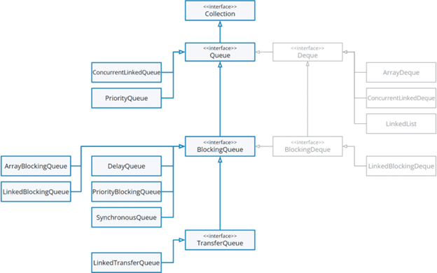

# Многопоточность. java.util.concurrent. Блокирующие и неблокирующие очереди

Сегодня мы завершим знакомство с потокобезопасными коллекциями, рассмотрев, какие реализации `Queue` присутствуют в
`java.util.concurrent`.

## Неблокирующие очереди

Начнем мы с **неблокирующих очередей** – во-первых, их область применения более очевидна, во-вторых, их просто меньше.

В многопоточной среде достаточно очевидным становится то, что очереди применяются, в первую очередь, для задач вида
«**издатель-подписчик**» (**Producer-Consumer**,
[тык](https://ru.wikipedia.org/wiki/%D0%98%D0%B7%D0%B4%D0%B0%D1%82%D0%B5%D0%BB%D1%8C_%E2%80%94_%D0%BF%D0%BE%D0%B4%D0%BF%D0%B8%D1%81%D1%87%D0%B8%D0%BA)
– ссылка на вики). В остальных случаях можно натянуть сову на глобус и привести задачу к виду «издатель-подписчик».

Суть заключается в том, что при использовании очередей чаще всего возникают ситуации, когда одни потоки (издатели)
помещают элементы в очередь, а другие (подписчики) – считывают и обрабатывают их. И в данном случае речь может идти о
любой сфере применения: от ориентированной на доменную логику (примерами могут служить Задачи 1 и 2 в практике), до
внутренних механизмов (например, пулов потоков, с которыми мы скоро познакомимся, отчасти – Задача 3 в практике).

Переходя к различию между блокирующими и неблокирующими очередями, все достаточно прозрачно: **блокирующие очереди**
могут блокировать поток, добавляющий данные в коллекцию, и/или поток, читающий из коллекции, в некоторых случаях –
коллекция заполнена, коллекция пуста, передача данных не ожидается в данный момент и пр. Неблокирующие очереди не
имеют подобной функциональности, оставаясь просто потокобезопасными имплементациями `Queue`.

### Реализации

Для потокобезопасных неблокирующих очередей не выделены отдельные интерфейсы (по аналогии с `ConcurrentMap` для
`Map`). Возможно, потому что самих реализаций всего две:

- `ConcurrentLinkedQueue` – обычная очередь на базе односвязного списка, но потокобезопасная. Работает на базе уже
  упомянутого в нескольких статьях CAS (Compare-And-Swap);
- `ConcurrentLinkedDeque` – потокобезопасный неблокирующий дек. Иными словами, двусвязный список. За счет
  необходимости поддерживать двунаправленную связность, в среднем менее производителен, чем `ConcurrentLinkedQueue`.
  В целом, с трудом могу представить сценарий, при котором в многопоточной среде нужен именно дек, то есть запись и
  чтение с двух концов. Поэтому, вероятно, основные сценарии использования сводятся к взаимодействию с коллекцией как
  со стеком или другой структурой, работающей по принципу LIFO.

Как видите, в случае с неблокирующими очередями рассказывать особо не о чем. Единственное, рекомендую обратить
внимание на ссылку: [ссылка](https://java-online.ru/concurrent.xhtml)

По ней можно найти неплохую шпаргалку по `java.util.concurrent`, в т.ч. и по рассматриваемой теме. На мой взгляд,
именно в качестве краткой шпаргалки – вообще лучшее, что можно найти в русскоязычном сегменте.

## Блокирующие очереди

У блокирующих очередей существует своя небольшая иерархия, поэтому сначала предлагаю рассмотреть визуализацию:

В данном случае, нас интересуют интерфейсы `BlockingQueue`, `BlockingDeque`, `TransferQueue` и их реализации.

### BlockingQueue и имплементации

Главная особенность блокирующих очередей, кроме, собственно, блокировок – они являются ограниченными по числу
элементов (в общем случае). Ограничение может выглядеть по-разному, но тем не менее: размер блокирующей очереди
обычно регламентируется при ее создании.

Кроме того, `BlockingQueue` добавляет несколько методов к уже известным нам и определенным в `Queue`:

- `put(E e)` – вставляет элемент в очередь. Если она заблокирована на вставку (заполнена) – будет ждать возможности
  вставки. Классические `add()` и `offer()` бросят исключение (`add()`) или вернут `false` (`offer()`), если вставка
  невозможна;
- `offer(E e, long timeout, TimeUnit unit)` – полагаю, вы уже догадались. Пытается вставить элемент в течение
  определенного периода времени и возвращает `true`, если это удалось, или `false` – если нет;
- `take()` – достает первый элемент в очереди, если очередь пуста – ждет появления элемента и берет его. Привычный
  нам `poll()` в случае пустой очереди вернет `null`;
- `poll(long timeout, TimeUnit unit)` – пытается получить элемент в течение заданного периода времени. Если элемент
  так и не появится – возвращает `null`;
- `remainingCapacity()` – возвращает число элементов, которые можно добавить в очередь до ее наполнения. Иными
  словами, возвращает результат выражения «`capacity - size`»;
- `drainTo()` – перемещает элементы очереди в коллекцию, переданную параметром. Операция не до конца предсказуема в
  ряде случаев, но позволяет экстренно вычистить элементы очереди, если это необходимо. Существует также
  перегруженная реализация, которая ограничивает число выгружаемых элементов отдельным параметром (оставшиеся
  элементы останутся в очереди).

Переходим к реализациям:

- `ArrayBlockingQueue` – блокирующая очередь на базе массива. При создании, в конструкторе можно указать параметр
  `fair` – справедливость предоставления доступа. Нюансы ровно те же, что и в других механизмах с fair/unfair
  доступом. Операции чтения и записи блокируются одним `Lock`'ом;
- `LinkedBlockingQueue` – блокирующая очередь на базе, неожиданно, очереди (реализована как односвязный список с
  сохранением ссылки на голову и хвост). Является более быстрым (в общем случае) аналогом `ArrayBlockingQueue`.
  Операции чтения и записи блокируются разными локами. Учитывая, что в общем случае нет общего ресурса в виде
  массива – это логично. Имеет конструктор без параметров – в таком случае размер очереди будет равен
  `Integer.MAX_VALUE`. Не поддерживает fair/unfair;
- `PriorityBlockingQueue` – потокобезопасный блокирующий аналог (читай, обертка) известной нам `PriorityQueue`.
  Требуется либо определение `Comparator`'а, либо `Comparable`-тип для элементов. Размер по умолчанию – 11.
  Специфична тем, что всегда доступна на запись. Поэтому, строго говоря, не является блокирующей в полном смысле, а
  также не является ограниченной по размеру и имеет функцию расширения;
- `SynchronousQueue` – интересная реализация «одноэлементной» очереди. По сути, не позволяет писать, пока предыдущий
  элемент не считан. Также не позволит читать, пока очередь пуста. Поддерживает fair/unfair предоставление доступа. В
  этой реализации идеально все, кроме того, что она не является очередью в полном смысле этого слова, ведь ее
  реальный размер всегда будет 0 (нуль) или 1 (при этом `size()` всегда возвращает 0 (нуль) и `isEmpty()` всегда
  `true`);
- `DelayQueue` – специфическая реализация очереди для элементов, реализующих интерфейс `Delayed`. Позволит извлечь
  элемент из очереди только через время задержки, определенное для данного элемента (`Delayed#getDelay()`). Подходит
  для использования в разного рода таймерах.

Как вы можете заметить, для ряда имплементаций есть определенная специфика, которая ограничивает и их область
применения. В широком смысле, очередями «общего назначения» можно считать только `ArrayBlockingQueue` и
`LinkedBlockingQueue`. Причем в отсутствие требований к памяти и необходимости справедливого предоставления доступа,
использование `ArrayBlockingQueue` выглядит не слишком привлекательным.

Классической областью применения для блокирующих очередей можно считать задачу Producer-Consumer, когда применение
неблокирующих очередей вызывает опасения (например, из-за интенсивной записи может закончиться место в heap'е и мы
хотим получить гарантии, что данные будут своевременно читаться и обрабатываться). Кроме того, широкий спектр
возможностей открывается, если параметризовать блокирующую очередь функциональным интерфейсом (обычно `Runnable`,
`Callable` или их наследники). В таком случае в очередь можно добавлять выполнение определенных задач, что позволяет
использовать такие очереди для пулов потоков или других механизмов, определяющих параллельное/асинхронное выполнение
различных задач с бо́льшим контролем за ресурсами, чем при прямом создании потоков.

### BlockingDeque

Интерфейс блокирующего дека, наследник `BlockingQueue`. Также наследует `Deque`. Как и `BlockingQueue`, имеет ряд
специфичных методов. Разбирать их подробно не вижу смысла, поскольку они представляют из себя аналоги методов
`BlockingQueue` с классическими для деков постфиксами `*First` и `*Last` для обозначения конца дека, к которому
применяются.

Имеет одну реализацию `LinkedBlockingDeque`, представляющую собой двусвязный список, работа которого синхронизируется
локом.

Область применения в общем случае остается загадкой. Вероятно, полезна для узких задач. Источник по ссылке выше
предлагает рассматривать `BlockingDeque` для решения различных рекурсивных задач/сложных задач на перебор. Это имеет
смысл, но такой спектр задач весьма специфичен.

### TransferQueue

Мы уже познакомились со специфической блокирующей очередью – `SynchronousQueue`, чье назначение сводится к передаче
объекта между потоками. `TransferQueue` предоставляет более гибкий интерфейс для таких операций. Имеет единственного
наследника в лице `LinkedTransferQueue`.

Данный интерфейс является наследником `BlockingQueue` и, соответственно, имеет все методы блокирующей очереди. В их
рамках `TransferQueue` будет работать как обычная блокирующая очередь. Однако существует и ряд методов, определенных
в `TransferQueue`, обеспечивающих синхронную передачу объектов:

- `tryTransfer(E e)` – если есть ожидающая операция чтения (т.е. очередь пуста) – кладет объект в очередь и
  возвращает `true`. Иначе – `false`. Существует также перегруженный метод, позволяющий указать период времени, в
  течение которого требуется пытаться «передать» элемент;
- `transfer(E e)` – передает элемент в очередь, если есть ожидающая операция чтения. Если таковой нет – ждет, пока
  она появится, и тогда передает. Если в процессе ожидания поток будет прерван – выбросит `InterruptedException`;
- `hasWaitingConsumer()` – возвращает `true`, если есть ожидающие операции чтения. Иначе – `false`;
- `getWaitingConsumerCount()` – возвращает количество ожидающих операций чтения.

Механизм `TransferQueue` является очень необычным при первом знакомстве. К сожалению, также он является не очень
очевидным. Предлагаю рассмотреть пример по ссылке, который позволит внести ясность в особенности работы метода
`transfer()`:

[ссылка](https://java-online.ru/concurrent-queue-block.xhtml#linkedTQ)

По сути, данный механизм позволяет передать объект в другой поток, дождаться его получения (читай, старта обработки),
а потом продолжить дальнейшую работу с объектом, если это необходимо.

#### С теорией на сегодня все!

Переходим к практике:

## Задача 1

Используя
[Задачу из урока 40](https://github.com/KFalcon2022/lessons/blob/master/lessons/collections-framework/040/Queue.%20Implementations%20in%20Java.md#%D0%B7%D0%B0%D0%B4%D0%B0%D1%87%D0%B0),
реализуйте сервис заданий, позволяющий добавлять и получать задания. Процесс добавления и получения задач должен быть
потокобезопасен.

## Задача 2

Реализуйте
[Задачу 1 из урока 62](https://github.com/KFalcon2022/lessons/blob/master/lessons/multithreading/062/Object%20Methods%20for%20Multithreading.md#%D0%B7%D0%B0%D0%B4%D0%B0%D1%87%D0%B0-1)
без использования `wait()` и `notify()`/`notifyAll()`.

## Задача 3 (*)

Развейте Задачу 1 из текущего урока.

Заданиями должно выступать выведение случайно сгенерированного числа (пределы определите самостоятельно) в консоль, а
потом усыпление потока-исполнителя на указанное число секунд. Задания должны генерироваться безостановочно (можно
ограничить емкость хранилища заданий), обрабатывать их должно не более 4 потоков одновременно.

По сути, корректным решением данной задачи является эмуляция работы пула потоков в его наивной реализации. С пулами
потоков, предоставляемыми Java, мы познакомимся в ближайших уроках.

**Разбор практики для этого урока**:
[ссылка](https://github.com/KFalcon2022/practical-tasks/tree/master/src/com/walking/lesson72_blocking_non_blocking_queue)

> Если что-то непонятно или не получается – welcome в комменты к посту или в лс:)
>
> Канал: https://t.me/ViamSupervadetVadens
>
> Мой тг: https://t.me/ironicMotherfucker
>
> **Дорогу осилит идущий!**
