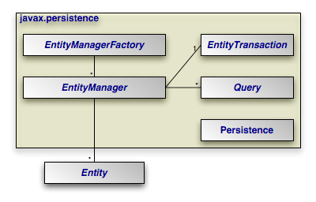
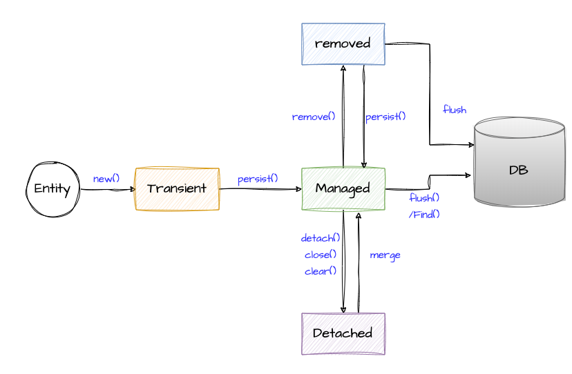

# EntityManagerFactory. EntityManager. Жизненный цикл Entity

Данную статью можно считать ключевой в разделе "ORM и JPA". Именно в ней мы разберемся с базовым устройством виртуальной
объектной БД, неоднократно упомянутой ранее. Фактически она посвящена API, который позволяет коммуницировать с БД
через JPA, работать с транзакциями и DML.

Следующие статьи раздела будут сконцентрированы на отдельных механизмах, которые делают JPA более гибким,
эффективным или удобным. Но большинство этих механизмов так или иначе завязаны на `EntityManager` - интерфейс,
который будет рассмотрен в текущей статье.

## Persistence

### Актуальность

Класс `Persistence` отвечает за предоставление API для наиболее глобальных функций в JPA. Проводя аналогии с JDBC, 
`Persistence` можно сравнить с `DriverManager`.

Его зона ответственности может быть сведена к следующим пунктам:

- Создание экземпляров `EntityManagerFactory`. Для чего нужна данная фабрика будем разбираться ниже. Этот пункт - 
  наиболее важный для нас;
- Запуск генерации DDL. Ранее уже упоминалось, что эта функциональность обычно не востребована;
- Получение доступа к интерфейсу, отвечающему за наиболее верхнеуровневый контроль состояния Entity-объектов.

С практической точки зрения лишь один пункт действительно важен в прикладной плоскости - создание
`EntityManagerFactory`. Оставшиеся два как минимум специфичны, а чаще - прост оне востребованы по тем или иным причинам.

### Persistence API

#### createEntityManagerFactory(String persistenceUnitName)

Данный метод отвечает за поиск Persistence Unit'а по указанному имени и создание объекта `EntityManagerFactory` на 
базе конфигурации этого Persistence Unit'а.

Описание может показаться сложным, но на самом деле логика достаточно тривиальна.

Мы уже описывали конфигурацию Persistence Unit в `persitence.xml` файле. И даже указывали в ней имя persistence 
unit'а - именно оно и должно использоваться для определения нужной реализации.

Эта схема выглядит избыточно до тех пор, пока наше приложение работает лишь с одной БД или до тех пор, пока нам 
достаточно одной конфигурации для работы с БД. Проблема в том, что на практике возможны более изощренные сценарии:

1. Несколько БД или СУБД. Очевидно, что для каждой нужны свои JDBC connection'ы, сами СУБД будут доступны по 
   различным адресам и могут иметь различные форматы авторизации или конфигурации в целом. Описанный выше подход 
   позволяет сконфигурировать несколько Persistence Unit'ов и работать с ними по отдельности - каждый будет 
   идентифицирован по имени и для каждого будет создан отдельный объект `EntityManagerFactory`. На практике одно 
   приложение с несколькими реляционными БД - относительно редкий, но возможный сценарий;
2. Одна БД, но разные конфигурации для работы с ней. Техническая целесообразность может сильно разниться*, но 
   сценарий вполне реальный;
3. Используются разные Persistence Provider'ы для доступа к одной или нескольким БД. Вероятность увидеть подобное 
   исчезающе мала, но определение нескольких Persistence Unit'ов тоже может выступить решением для данной ситуации.

> *Как пример такой ситуации рассмотрим необходимость генерации больших отчетов, которые будут содержать миллионы строк.
> 
> Допустим мы имеем сконфигурированный Persistence Unit, который используется для обработки основных функций 
> приложения. Вполне вероятно, что этот Persistence Unit имеет жесткие ограничения для connection'ов и connection 
> pool - это стандартный подход, имеющий массу мотивов, вплоть до обеспечения глобальной надежности приложения.
> 
> Проблема в том, что такой пул не подходит для генерации отчетов. Например, из-за рисков, что при генерации отчетов 
> будет исчерпан весь пул соединений и основная логика приложения окажется недоступна, ведь если нет подключений - 
> нет и доступа к БД.
> 
> Или же основной пул содержит timeout для connection'ов, который недостаточен, чтобы загрузить все необходимые для
> отчета данные.
> 
> Так или иначе, нам нужно выделить отдельный пул соединений специально для генерации отчетов. В том числе описать 
> конфигурацию пула, отличную от существующей. В случае с JPA решением может быть определение отдельного Persistence
> Unit'а.
> 
> На самом деле именно проблему можно решать иначе - и на практике ее почти всегда решают иначе. Существуют способы 
> и на базе JPA, и более высокоуровневые - через выделение функции генерации отчетов в отдельное приложение. 
> Существуют и ситуации, когда отдельный Persistence Unit действительно будет наиболее подходящим решением. Но 
> доступно описать такие ситуации в пределах этой статьи намного сложнее.

Также существует перегрузка для `createEntityManagerFactory()`, которая кроме имени Persistence Unit'а позволяет 
передать `Map` с дополнительными параметрами для `EntityManagerFactory`. Такие параметры, в том числе, могут 
перезаписывать параметры из `persistence.xml`. Это, к слову, один из способов решения описанной выше бизнес-проблемы 
через JPA, но без создания отдельных Persistence Unit'ов.

Отдельно стоит отметить, что метод `Persistence.createEntityManagerFactory()` актуален, в первую очередь, для 
приложений на базе Java SE. Или, если утрировать, приложений, не использующих Application Server'ы. Чуть более 
подробно рассмотрим это в конце статьи.

#### generateSchema(String persistenceUnitName, Map map)

Данный метод позволяет запустить генерацию DDL для указанного Persistence Unit'а.

На самом деле метод нужен для крайне специфичных ситуаций. Даже если игнорировать не востребованность этой
функциональности в принципе. Потому что генерация DDL обычно является ответственностью конкретного Persistence 
Provider'а. Соответственно, чтобы данный метод оказался востребован, генерация DDL должна быть не просто актуальна 
для приложения, но и по каким-то причинам сепарирована от создания `EntityManagerFactory`.

#### getPersistenceUtil()

Предоставляет доступ к объекту `PersistenceUtil`, который, в свою очередь, позволяет проверить любой entity-объект 
(или его атрибут) и узнать, загружен ли он (из БД) полностью с точки зрения JPA.

Примечателен разве что тем, что проверяет "загруженность" объекта для всех существующих Persistence Provider'ов. Но 
определение того, что понимается под загруженностью объекта настолько специфично, что объяснить его получится лишь 
через несколько статей.

Реальной прикладной ценности не несет - существует ряд более узконаправленных инструментов, позволяющих понять 
состояние объекта с точки зрения JPA. И даже они обычно не востребованы в прикладных задачах.

## EntityManagerFactory

В наиболее упрощенном виде `EntityManagerFactory` можно считать ровно тем, что написано в названии класса - фабрикой 
для создания объектов `EntityManager`. Но реальность несколько шире.

`EntityManagerFactory` можно считать той самой виртуальной объектной базой данных. Она предоставляет возможности, 
многие из которых мы можем ассоциировать с реальной СУБД (или БД). Аналогом в JDBC можно считать `DataSource`. Именно 
на базе таких ассоциаций ниже описывается API `EntityManagerFactory`. К некоторым из методов мы еще вернемся в 
следующих пунктах или статьях, но их описание позволит сложить более целостную картину того, как работает JPA.

> **!NB**: В Hibernate интерфейс-реализация `EntityManagerFactory` называется `SessionFactory`. Такое название часто 
> будет встречаться при изучении материалов непосредственно по Hibernate.
> 
> Имя поля или переменной, ссылающейся на `EntityManagerFactory`, зачастую задают как `emf` - это одно из немногих 
> более-менее общепринятых сокращений в Java.

#### createEntityManager()

СУБД непосредственно отвечает за создание, предоставление и контроль connection'ов. Мы знакомы с программным 
адаптером для работы с подключением к физической БД - интерфейсом `Connection` в JDBC.

Аналогом такого подключения для виртуальной БД можно считать `EntityManager`, с которым мы познакомимся в следующем 
пункте.

`EntityManagerFactory` предоставляет несколько перегруженных методов `createEntityManager()`, которые позволяют 
создать объект `EntityManager` с той или иной конфигурацией. Кроме создания с настройками по умолчанию, можно 
дополнительно передать два параметра - `Map` с дополнительными настройками и `SynchronizationType`.

Дополнительные настройки покрывают достаточно широкий перечень конфигураций, которые могут регламентировать практически 
что угодно - параметры JDBC connection'а, специфические параметры конкретного Persistence Provider'а или параметры, 
определенные в самой спецификации JPA. Функционально такие параметры тоже весьма разнообразны - от настроек 
максимального размера батча до управления JPA-кэшами (познакомимся в следующих статьях) и работы с блокировками 
(механизмы, которые обеспечения безопасное обновления данных в БД для конкурентной среды). Подробно погружаться в 
эту тему мы не будем - она специфична для конкретных реализаций JPA и сценариев использования. 

Второй параметр - тип синхронизации. Он отвечает за связь (собственно, синхронизацию) действий в виртуальной базе 
данных и фактической транзакции. В сложных промышленных системах под "фактической" транзакцией могут подразумеваться 
различные вещи, в том числе другая виртуальная транзакция, но на другом уровне абстракции. В простом примере, когда 
под фактической транзакцией подразумевается транзакция на уровне СУБД, все достаточно просто:

- `SynchronizationType.SYNCHRONIZED`. Поведение по умолчанию, неявная синхронизация. Каждое действие `EntityManager`,
  которое регламентируется как действие с настоящей (не виртуальной) БД, выполняется на уровне БД ровно тогда, когда 
  это действие сделано в `EntityManager`. То есть если я вызываю операцию, которая означает вставку новых записей из 
  виртуальной БД в физическую - этот запрос синхронно выполнится внутри транзакции на уровне БД;
- `SynchronizationType.UNSYNCHRONIZED`. Требует явного указания точки синхронизации. То есть если я вызываю операцию 
  вставки данных из виртуальной БД в физическую - необходимость действия будет сохранена, но не произойдет до тех 
  пор, пока не будет вызван метод `EntityManager`, который произведет синхронизацию с фактической транзакцией. В 
  пределах приложений на базе Java SE не актуален, требует использования JTA (Java Transaction API) - отдельной 
  спецификации, которая предоставляет функциональность распределенных транзакций, фактически внося новую абстракцию 
  между JPA и конечным хранилищем*.

> JTA в пределах курса не рассматривается, поскольку эта спецификация в своем классическом представлении не слишком 
> популярна в современной Java-разработке. К тому же, было бы проблематично объяснить эту концепцию на данном этапе 
> курса.

Второй вариант может быть полезен в различных ситуациях от оптимизации взаимодействия с БД до корректных (с точки 
зрения бизнес-логики) манипуляций данными в ситуациях, когда под "фактической" транзакцией скрывается сложная 
конструкция, объединяющая различные транзакции с различными базами данных (или другими инструментами, 
поддерживающими транзакционность). Иными словами, этот подход дает большую гибкость при работе с транзакциями. Но 
плата за это - риски в части несогласованности данных.

Благо, ситуации, когда требуется несинхронный подход, возникают не часто и подобные задачи нельзя назвать типовыми. 
Это скорее один из способов обойти ограничения, которые накладывает на разработчика JPA в силу своей внутренней 
организации.

#### getCriteriaBuilder()

РСУБД предоставляет средства для взаимодействия с БД через запросы - SQL. JPA для этих целей дает несколько 
интерфейсов: Criteria API, JPQL, нативные запросы (непосредственно SQL).

Непосредственно `EntityManagerFactory` предоставляет доступ только к Criteria API - метод `getCriteriaBuilder()` 
предоставляет доступ к интерфейсу `CriteriaBuilder`, который, в свою очередь, позволяет конструировать запросы, не 
выходя за пределы Java-кода.

Другие два способа доступны только через `EntityManager`.

Один из способов - нативные запросы - нам прекрасно знаком. Запрос оформляется как строка, при необходимости - 
добавляются параметры, которые позже подставляются программно. В этой части практически нет значимых отличий от JDBC.
Два других подхода мы рассмотрим в отдельных статьях. 

#### getMetamodel()

База данных имеет собственную структуру - схемы, таблицы, колонки, типы данных. И дополнительный инструментарий вроде 
PK и FK, констрэинтов, последовательностей (sequence) и т.д.

Метод `EntityManagerFactory#getMetamodel()` предоставляет данные о структуре виртуальной объектной базы данных. 
Именно через этот интерфейс можно получить информацию об Entity (аналогах таблиц), которые находятся в зоне ведения 
текущего Persistence Unit'а*, колонках (полях entity-классов), PK (колонках с аннотацией `@Id` или с иными 
аннотациями для составных ключей) и других элементах.

> *При этом каждый объект `EntityManagerFactory` будет создавать собственную виртуальную БД, даже если все они 
> относятся к одному и тому же Persistence Unit'у.

По сути, именно метамодель обеспечивает базис, на котором строятся гибкий маппинг строк таблиц на объекты, неявная 
инициализация id и многие другие возможности JPA.

При этом сам раздел JPA Metamodel - достаточно обширный и сложный для новичков. Но он во многом относится к 
внутренней кухне JPA и редко требуется в прикладных задачах. По крайней мере до тех пор, пока вы не захотите 
расширить возможности JPA в своем проекте. Именно этим объясняется то, что в пределах курса мы практически не 
затронем этот раздел JPA.

Но здесь стоит сказать несколько слов о той части Metamodel API, которая все-таки востребована в прикладной разработке.

Для внутренних механизмов JPA достаточно динамически сформированной модели, которая генерируется при создании объекта
`EntityManagerFactory`. Но JPA предоставляет интерфейс для создания статической метамодели - Java-классов, которые 
будут описывать элементы виртуальной объектной БД. Обычно это реализуется через подключение и использование 
специальных плагинов Hibernate или иной реализации JPA.

И именно статическая метамодель, вероятно, основной случай, когда разработчик может взаимодействовать с метамоделью 
напрямую. Такие сгенерированные классы упрощают разработку и поддержку кода с Criteria API и некоторыми иными 
инструментами в JPA. Собственно, именно в разрезе Criteria API мы и столкнемся с метамоделью в следующий раз.

#### getCache()

Как правило, в РСУБД существуют различные кэши, которые ускоряют получения данных из БД при повторных выполнениях 
запросов. Это позволяет снизить нагрузку на БД и ускоряет получение результатов запроса пользователем.

JPA также имеет несколько вариантов кэширования данных в рамках своей виртуальной БД. Один из таких кэшей мы 
рассмотрим уже сегодня, несколько других - в отдельной статье.

Метод `EntityManagerFactory#getCache()` предоставляет интерфейс для взаимодействия с кэшем, знакомство с которым 
произойдет в следующих статьях.

#### addNamedQuery()

БД может содержать view, процедуры и функции. Также мы знакомы с интерфейсом `PreparedStatement` в JDBC.

В API `EntityManagerFactory` с этой функциональностью в той или иной степени может быть ассоциирован метод
`addNamedQuery(String name, Query query)`. Он позволяет определить запрос через интерфейс `Query` и сохранить его с 
определенным именем. В дальнейшем такой запрос может быть вызван через API `EntityManager` через указание имени 
запроса, без необходимости дублироваться сам запрос или его конфигурацию. С последней тезисно познакомимся при 
знакомстве с `Query`.

#### addNamedEntityGraph()

Здесь провести прямую аналогию с функциональностью базы данных будет сложнее, поскольку сама концепция `EntityGraph` 
актуальна для объектных БД, а не реляционных.

Entity Graph - механизм JPA, который позволяет гибко описать правила для получения сущностей из БД. Например, он 
позволяет указать, какие из связанных сущностей (записей таблиц, которые связаны с текущей через FK) необходимо 
получать сразу вместе с основной, а какие - только при прямом запросе. Несколько Entity Graph'ов для сущности 
позволяют гибко настроить правила ее получения через различные запросы, тем самым оптимизировав коммуникацию с 
физической БД.

Более подробно эту функциональность мы рассмотрим в отдельной статье.

Метод `EntityManagerFactory#addNamedEntityGraph(String graphName, EntityGraph<T> entityGraph)` позволяет 
зарегистрировать именованный Entity Graph. Логика использования та же, что и для именованных запросов - зачем 
определять конфигурацию каждый раз, если можно единожды ее сохранить в пределах виртуальной БД и использовать, 
получая по имени.

#### Методы служебные назначения

Ниже описаны методы, которые несут вспомогательную функцию и относятся скорее к техническим особенностям реализации, 
нежели непосредственно к взаимодействию с виртуальной объектной БД.

- `unwrap()`. Позволяет получить доступ к объектам классов, которые определены в рамках реализации JPA, но не 
  имеющие ассоциированных с ними интерфейсов непосредственно в JPA. Конечный набор таких объектов определяется 
  реализацией. Может потребоваться для использования специфических возможностей конкретной имплементации;
- `getPersistenceUnitUtil()`. Метод во многом схож с `Persistence.getPersistenceUtil()`. Из новых возможностей 
  возвращаемого интерфейса - метод для определения id сущности по объекту сущности. Это может быть полезно в 
  ситуациях, когда происходит обработка не конкретных entity-классов (там id можно получить по полю), а 
  разрабатывается какая-либо общая логика для расширения возможностей JPA. В большинстве прикладных задач метод не 
  востребован;
- `getProperties()`. Возвращает настройки текущей `EntityManagerFactory` в виде `Map`.;
- `close()`. Стандартный метод для `AutoCloseable` интерфейсов. Закрывает все связанные ресурсы. Логика работы мало 
  чем отличается от работы с интерфейсами JDBC - как и там, любой верхнеуровневый интерфейс при вызове `close()` 
  закрывает зависимые от него ресурсы. В случае с `EntityManagerFactory` - речь, в первую очередь, об объектах 
  `EntityManager`.;
- `isOpen()`. Метод проверки состояния. Возвращает `true` до тех пор, пока не будет вызван метод `close()`.

> **!NB**: После вызова `EntityManagerFactory#close()` у конкретного объекта все остальные методы (кроме `isOpen()`) 
> начнут возвращать исключение. Соответственно закрытие фабрики должно происходить тогда, когда дальнейшая работа с 
> ней не ожидается.
> 
> Для стандартных приложений с единственным экземпляром `EntityManagerFactory` это фактически означает, что при штатном 
> режиме работы закрытие должно происходить лишь при завершении работы приложения.

## EntityManager и EntityTransaction

### Концепция и актуальность

Наконец, мы переходим к наиболее важной части статьи - знакомству с `EntityManager`. Именно с этим интерфейсом вы 
будете взаимодействовать больше всего при работе с JPA без более высокоуровневых настроек.

Проводя параллели с РСУБД, `EntityManager` - аналог подключения к БД (или `Connection` в JDBC). Точно также этот 
интерфейс отвечает за выполнение запросов к БД, работу с транзакциями и другие операции, касающиеся коммуникации с 
БД для выполнения бизнес-задач.

API будет рассмотрено ниже, сейчас же пришла пора разобраться с отношениями между различными интерфейсами в JPA и
жизненным циклом entity-объектов. Ведь во многом именно вокруг этих концепций и формируется API `EntityManager`.



Немного дополняя предыдущие пункты, получается следующая модель взаимодействия основных интерфейсов JPA:

1. Класс `Persistence` использует информацию из всех доступных инстансов `PersistenceProvider` (не отображены в схеме) 
   для создания объектов `EntityManagerFactory`. Для каждого `PersistenceProvider` технически можно создать 
   неограниченное количество `EntityManagerFactory`;
2. `EntityManagerFactory` отвечает за создание объектов `EntityManager`. В стандартном сценарии для каждой отдельной 
   бизнес-операции (на практике часто равносильно каждой отдельной транзакции) создается свой `EntityManager`;
3. `EntityManager` управляет Entity-объектами, определенными за пределами самой JPA-спецификации (отражено на схеме).
   Сами Entity-классы должны быть известны Persistence Unit'у и, как следствие, `EntityManagerFactory`;
4. `EntityManager` ассоциирован с одной `EntityTransaction` - интерфейсом, который отвечает за работу с физической 
   транзакцией. В пределах Java SE один `EntityManager` всегда ассоциирован не более, чем с одним объектом
   `EntityTransaction`. В Java EE с использованием JTA все может быть несколько сложнее, но 
   это тема для отдельного раздела, который для большинства читателей будет бесполезен;
5. Также на схеме указан интерфейс `Query` - он уже был вскользь упомянут выше. Он позволяет выполнять запросы к БД 
   с использованием JPQL и нативного SQL. Последний вариант мы рассмотрим чуть ниже, но более подробное знакомство с
   `Query` произойдет в следующих статьях текущего раздела. Как видно на схеме, один `EntityManager` может 
   оперировать множеством объектов `Query`, что вполне логично - в пределах одной транзакции может выполняться 
   множество запросов.

Теперь необходимо углубиться в то, как именно `EntityManager` управляет entity-объектами.



Как видно из схемы, entity-объект может находиться в одном из четырех состояний, переход между которыми происходит с 
использованием указанных возле стрелок методов `EntityManager`:

- **Transient**. Объект создан, но еще не был передан под управление ни одному `EntityManager`. Иными словами, это хоть 
  и entity-объект, но в таком состоянии он находится вне JPA. Чаще всего это состояние достигается для только что 
  созданных объектов, пока они не переданы под управление `EntityManager` через вызов `EntityManager#persist()`. 
  Характерной особенностью состояния можно отметить то, что у находящегося в нем entity-объекта не установлено 
  значение id. За исключение ситуаций, когда оно устанавливается разработчиком вручную;
- **Managed**. Фактически основное состояние. В нем оказывается объект после вызова `EntityManager#persist()` или 
  при извлечении из БД через API `EntityManager`. С последним есть нюансы, но для большинства случаев это так. 
  Фактически это состояние можно описать как "объект существует в виртуальной объектной БД". В случае с новыми 
  объектами это важно, потому что объект еще не существует в реальной базе данных (нет строки таблицы, которая была 
  бы с ним ассоциирована). Кроме того, состояние полей объекта может отличаться от состояния ассоциированных колонок 
  в БД, если объект был изменен в процессе обработки*. Если объект не удаляется (см. ниже), он будет находиться в 
  состоянии managed до закрытия `EntityManager`;
- **Detached**. Объект отключен от `EntityManager`. То есть entity-объект продолжает существовать, его можно 
  изменять, но `EntityManager` его уже не контролирует. Соответственно, объект (или его изменения) не попадут в 
  физическую базу данных по итогам транзакции. Это состояние во многом схоже к Transient, различие в основном в API, 
  с помощью которого объект вновь может быть добавлен под контроль `EntityManager`;
- **Removed**. Объект планируется к удалению из БД. То есть после коммита транзакции в таблице не должно остаться 
  строки, ассоциированной с данным entity-объектом. Состояние обратимо - то есть при вызове `EntityManager#persist()`
  для удаленного объекта он вновь окажется в состоянии Managed и не будет удален по итогам транзакции.

> *Это одна из распространенных неприятных ситуаций в JPA - с точки зрения разработчика может возникнуть ощущение, 
> что он уже сообщил БД об создании (запись создана) или изменении объекта (запись обновлена), но фактически 
> это не так.
> 
> Что, в свою очередь, приведет к неожиданным результатам при выполнении запросов к БД, в которых объект (строка 
> таблицы) должен был участвовать. Для простых запросов вроде `SELECT * FROM some_entity_table` это редко 
> актуально - Persistence Provider старается разрешать подобные ситуации тем или иным образом. Но для специфических 
> запросов, где запись использовалась бы неявно - различные агрегации, например - это может стать проблемой.
> 
> Так, например, JPA позволяет настроить параметр `flushMode`, выбрав одно из двух значений:
> 
> - `FlushModeType.AUTO`. Значение по умолчанию, синхронизация с БД происходит при отправке запроса к ней - обычно для 
>   получения данных из БД;
> - `FlushModeType.COMMIT`. Синхронизация с БД происходит только при коммите. Технически, оставляет возможность 
>   Persistence Provider'у производить дополнительные синхронизации на его усмотрение, но рассчитывать на это не стоит. 
> 
> В Hibernate за оптимизацию того же процесса отвечает енам `FlushMode`, которые дает более гибкие варианты 
> конфигурации, позволяя выбрать наиболее оптимальный вариант между "Виртуальная и реальная БД согласованы" и 
> "Коммуникация с реальной БД эффективна и не выполняет лишних запросов для синхронизации". 

> **!NB**: В Hibernate интерфейс-реализация `EntityManager` называется `Session`, а `EntityTransaction` - `Transaction`.
> 
> В качестве сокращения для имени поля/переменной, ссылающейся на `EntityManager` часто используется `em`.

По итогу жизненный цикл JPA представляет собой достаточно простую схему - по крайней мере, на таком уровне 
детализации. При этом сам факт такой надстройки над БД и некоторые объективные нюансы, связанные с реализацией этой 
схемы в коде, приводят к достаточно высокой сложности работы с JPA за пределами наиболее распространенных ситуаций. 
И тогда могут проявляться некоторые побочные эффекты, ограничения или недостаточная гибкость для оптимизации 
проблемных участков. Именно вокруг этой модели строится львиная часть аргументации критиков JPA и ORM.

Некоторые из недостатков в сокращенном формате рассмотрены ниже. По мере возможности они будут подсвечиваться и в 
дальнейших темах, поскольку далеко не все можно объяснить на базе опубликованного к текущему моменту теоретического 
материала.  

### Недостатки

#### Высокий порог входа

В целом, достаточно очевидный пункт для любого крупного фреймворка. Это уже четвертая статья в курсе, так или иначе 
посвященная JPA, но мы до сих пор не приступили к полноценной практике. Просто потому что еще не знакомы с 
необходимым минимумом API.

В каких-то ситуациях сложность решения сложно назвать недостатком, особенно при отсутствии разумных альтернатив. Но 
проблема JPA в том, что эта спецификация направлена именно на упрощение и ускорение процесса разработки.

В конечном итоге эта цель достигается, особенно для небольших проектов с более-менее простой логикой. Но для этого 
разработчику приходится изучать достаточно громоздкую структуру JPA, а затем постоянно углублять свои знания в ней. 
Потому что чем более нетиповую (относительно стандартного CRUD) задачу приходится решать, тем больше нюансов 
и пограничных ситуаций требуется учитывать.

При этом JPA имеет достаточно серьезные объективные ограничения - это решение не предназначено для реактивного 
программирования, имеет производительность хуже многих альтернатив (из-за громоздкого слоя "виртуальной БД" и 
тяжеловесного маппинга на базе рефлексии), не имеет штатных механизмов обработки для ряда взаимодействий с БД.

То есть JPA достаточно плохо подходит для приложений с продвинутым использованием инструментария РСУБД или для 
high-load приложений. Безусловно, даже на базе JPA можно добиться как приемлемой производительности под высокой 
нагрузкой, так и использовать необходимые инструменты СУБД. Но время и усилия, затраченные углубление в механизмы 
JPA и непосредственную разработку, адаптацию и поддержку получившегося проекта могут перечеркнуть те преимущества,
которые JPA призвана дать - легкость и скорость разработки.

Иными словами, далеко не каждый проект нуждается в JPA.

#### Непрозрачность логики

Этот пункт станет более наглядным, когда мы познакомимся с отношениями между entity - One-to-Many, Many-to-Many и т.д.

Но общая проблема заключается в том, что механизмы, обеспечивающие эти связи и некоторые иные инструменты, сильно 
отдаляют разработчика от фактической коммуникации Java-приложения и БД.

Например, за счет механизмов проксирования и ленивой загрузки entity-объектов возможны ситуации, когда вызов 
getter'а у entity приводит к одному или нескольким запросам в базу данных. При этом сам getter внутри entity-класса 
определен вполне традиционно.

Или же вызов getter'а приводит к исключению. Потому что он должен был сделать запрос к БД, но уже не может, 
поскольку `EntityManager` для этого объекта был закрыт.

Или попытка добавить в поле одного entity-объекта другой entity-объект (обработка ситуации, когда ассоциированные с 
этими entity таблицы связаны через PK-FK) приводит к исключению при следующей синхронизации `EntityManager` с базой 
данных. Потому что добавленный объект не находился под управлением данного EM.

Описанные выше ситуации - вполне типовые и хорошо известны каждому, кто работал с JPA. Как и известны способы их 
решения. Многие иные известны не так широко. Но их причина остается той же - стремясь к моделированию взаимодействия 
между сущностями БД на уровне Java-кода разработчики JPA добавили столько абстракций над реальной коммуникацией с БД,
что многие разработчики в принципе не понимают, какая магия происходит между моментом обращения к интерфейсам JPA в 
их коде и непосредственным применением изменений к базе данных.

#### Избыточные запросы

Тема избыточности в критике JPA достаточно популярна, хоть эта проблема и может решаться с разной степенью грациозности.
Так, в дальнейшем мы познакомимся с проблемой N+1, которая целиком сконцентрирована на ситуациях, когда вместо одного
большого запроса JPA создает множество маленьких, из-за чего страдает общая производительность приложения. Как и
рассмотрим способы борьбы с этой проблемой.

Но в этом пункте будет намного более простой пример.

Исходя из рассмотренного выше жизненного цикла Entity, легко понять, как в парадигме JPA необходимо реализовывать 
обновление сущностей (записей в БД). Рассмотрим на примере одного объекта.

Допустим, у меня есть некая запись в таблице "Человек". Я знаю его id и хочу обновить ему возраст. Классический для 
JPA подход выглядит примерно так:

1. Создание `EntityManager`;
2. Создание (открытие) транзакции;
3. Получение сущности по id - JPA сделает запрос в БД, создаст на базе результата entity-объект и поместит под 
   контроль `EntityManager`;
4. Обновление возраста через setter entity-объекта;
5. Вызов синхронизации `EntityManager` с БД (JPA вызовет UPDATE-запрос) и коммит транзакции.

Даже опуская пункты, связанные с транзакцией, получается, что мне необходимо получить значение из БД, потратить 
ресурсы на маппинг этого значения в Java-объект и лишь затем обновить его.

При этом все то же самое может быть реализовано с помощью одного UPDATE-запроса - ровно того же, который JPA в итоге 
и выполнит.

Справедливости ради, стоит отметить, что JPA предоставляет возможность выполнить подобный запрос самостоятельно, не 
тратя ресурсы на дополнительный `SELECT` и последующий маппинг. Проблема лишь в том, что этот подход не характерен 
для разработки с использованием JPA - это скорее один из инструментов оптимизации, который может принести свои 
побочные эффекты, если в пределах той же транзакции производились и иные манипуляции с той же таблицей. 

#### Side effects. Пример

О том, что разного рода нетиповые операции в JPA могут приводить к различным побочным эффектам было уже неоднократно 
упомянуто даже в пределах текущей статьи. Чтобы не быть голословным, опишу один широкоизвестный курьез.

Допустим, у нас есть некая таблица, в которой существует уникальный индекс (не считая PK). Например, One-to-One 
связь с другой таблицей и ограничение FK, которое защищает от мутации One-to-One в Many-to-One.

В рамках бизнес-логики мне необходимо удалить существующую строку и добавить новую для того же значения FK. С 
использованием JPA это выглядит примерно так:

1. Создание EM и открытие транзакции;
2. Получение записи, которую требуется удалить (например, по значению FK);
3. Перевод полученного entity-объекта (1) в состояние Removed;
4. Создание нового entity-объекта (2) и наполнение его полей;
5. Добавление entity-объекта (2) под управление EM, т.е. перевод в состояние Managed;
6. Синхронизация EM с БД и коммит транзакции.

Кажется, все логично и звучит несложно. Нелогичность заключается в том, что в результате этих действий произойдет 
ошибка - БД сообщит, что запись с таким значением уникального индекса уже существует.

Проблема в том, что для обеспечения согласованности данных при их синхронизацией между EM и БД, JPA должна сначала 
выполнить вставку данных, а лишь затем - их удаление. Это диктуется внутренней логикой JPA и призвано решить уже 
другие проблемы согласованности данных. Вот только для ситуаций, подобных описанной выше, это приводит к вполне 
понятной теперь ошибке.

Приведенный пример - не что-то страшное, эта ситуация может быть решена как логически, так и средствами JPA. Но 
заранее эта проблема совсем не очевидна.

#### В заключение о недостатках

Пункты выше могут звучать достаточно категорично. Однако я не агитирую ни за использование, ни за отказ от JPA.
Реальные задачи и разработка информационных систем достаточно сложны и разнообразны, чтобы не допускать однобокого 
взгляда на мир. Особенно, если задачи выходят за пределы непосредственно технической реализации тех или иных 
требований.  

Соответственно, выбор в пользу JPA или иного решения - всегда вопрос частных случаев и требований к разрабатываемой 
системе. И собственное мнение по этому вопросу лучше формировать на основе собственного опыта и углубленного 
изучения плюсов и минусов JPA (вплоть до конкретных провайдеров) и каждой рассматриваемой альтернативы. Но это точно 
не та информация, которую стоит почерпнуть из одного источника и принять ее как данность.

Поэтому я постараюсь и дальше подсвечивать конкретные недостатки, но ни один из них не стоит воспринимать как истину 
в последней инстанции.

Что более важно для новичков, JPA - одна из основных тем на большинстве собеседований и просто широко используемый 
подход в работе с БД. Соответственно, независимо от личного мнения о спецификации, Java-разработчику стоит знать ее 
на достаточно хорошем уровне хотя бы для того, чтобы найти работу.

### API EntityTransaction

Перейдем к рассмотрению API описанных выше интерфейсов. Поскольку `EntityTransaction` семантически проще - начнем с 
него.

Интерфейс предоставляет четыре управляющих метода и два информационных:

- `begin()`. Начало транзакции;
- `commit()`. Коммит транзакции;
- `rollback()`. Откат транзакции;
- `setRollbackOnly()`. Указывает, что данная транзакция может быть только откачена. Может использоваться вместо 
  явного вызова rollback - например, если при обработке бизнес-логики возникла ситуация, когда транзакция не должна 
  быть закоммичена, но сама бизнес-логика не предполагает выброса исключения или явного вызова `rollback()` по 
  каким-то причинам. В таком случае достаточно вызвать данный метод и дальнейший код будет выполняться в штатном 
  режиме, но при вызове `commit()` фактически будет вызвана логика `rollback()`;
- `getRollbackOnly()`. Метод, проверяющий статус транзакции. Возвращает `false`, если ранее у этой транзакции не был 
  вызван `setRollbackOnly()`;
- `isActive()`. Возвращает статус транзакции - `true` в промежутке между `begin()` и `commit()`/`rollback()`, в 
  любое другое время - false.

### API EntityManager

API EM намного разнообразнее.

#### Управляющие методы

- `persist(T entity)`. Берет переданный параметром entity-объект под свое управление и переводит объект в состояние 
  Managed. При попытке передать не entity-объект, или Detached (в терминах жизненного цикла Entity) объект - 
  выбрасывает исключение. Не добавляет объект в реальную БД, но в зависимости от настроек может выполнять некоторые 
  связанные действия - например, получить из БД id для новой сущности. Также триггерит пре- и пост-эффекты - при 
  знакомстве с Entity-классами мы видели аннотации `@PrePersist` и `@PostPersist`;
- `merge(T entity)`. Если EM не управляет объектом с таким же id, как у объекта, переданного параметром - создает 
  копию переданного объекта, помещает ее под управление EM и возвращает из метода. Если в EM уже есть объект с таким 
  id - устанавливает значения полей существующего объекта на базе полей переданного и возвращает из метода 
  существующий. Фактически является единственным способом вернуть Detached-объект под управление EM, но может 
  использоваться не только для этого;
- `remove(Object entity)`. Указывает, что переданный параметром entity-объект (должен находиться под контролем EM) 
  должен быть удален из БД;
- `flush()`. Применяет накопленные EM изменения к БД. Эта функциональность также может отрабатывать автоматически, в 
  зависимости от настроек EM. Ключевой момент - это равносильно выполнению запросов к БД внутри транзакции. 
  Особенности поведения будут зависеть от уровня изоляции транзакции. Но в рамках той же транзакции изменения теперь 
  будут гарантированно доступны при выполнении непосредственных запросов к БД. Этот метод позволяет решить некоторые 
  из проблем, описанных в предыдущих пунктах. Выбросит исключение, если вызвать вне транзакции (или без 
  синхронизации с транзакцией для режима `SynchronizationType.UNSYNCHRONIZED`); 
- `refresh(Object entity)`. Обновляет переданный объект, заменяя его состояние на то, которое хранится в БД. Зачастую 
  используется в связке с `flush()`, когда логика транзакции разбросана по различным методам и есть четкое понимание,
  что версия под управлением EM нерелевантна. Это не самая типичная, но легкодостижимая ситуация. Существует 
  несколько перегрузок этого метода с возможностью передать дополнительные параметры (например, правила поведения 
  кэша) и способ блокировки сущности при необходимости. О последнем чуть ниже;
- `detach(Object entity)`. Убирает объект из-под контроля EM. Если после последнего вызова `flush()` текущий объект 
  был как-либо изменен (в т.ч. был вызван `remove()` для него) - эти изменения затрутся и не будут применены к БД;
- `clear()`. Очищает EM. Равносильно вызову `detach()` для каждого объекта под контролем EM;
- `lock(Object entity, LockModeType lockMode)`. Блокирует указанную сущность с помощью одного из видов блокировок*.
- `joinTransaction()`. Данный метод позволяет явно синхронизировать EM с транзакцией. Необходим, если EM работает в 
  режиме `SynchronizationType.UNSYNCHRONIZED`.

> *В пределах курса мы фактически не сталкивались с механизмом блокировок в СУБД. Он достаточно специфичен по 
> сценариям использования и обычно не слишком востребован.
> 
> Отчасти это альтернатива уровням изоляции транзакций - механизмы блокировки решают те же проблемы конкурентной 
> работы с данными. Но если уровень изоляции един на всю транзакцию, то блокировки более гибкие - они позволяют 
> установить правила доступа и изменения к конкретной записи.
> 
> Так, JPA позволяет установить один из представленных в `LockModeType` типов блокировки через метод `lock()`, а 
> также при вызове `refresh()`. Дополнительно доступна возможность установить режим блокировки при получении 
> сущности по id - ниже мы познакомимся с методом `find()`.
> 
> Расписывать разницу в видах блокировок кажется избыточным, но при желании с семантикой каждого из типов можно 
> познакомиться в документации `LockModeType` - там достаточно хорошо описаны основные моменты. Здесь лишь отмечу, 
> что любые блокировки направлены на борьбу с грязным чтением (обычно не актуально, т.к. большинство БД по умолчанию 
> используют изоляцию READ_COMMITTED) и неповторяющимся обновлением.
> 
> Блокировка сущности действует до коммита (или отката) транзакции.

Описание некоторых методов выше может быть слишком тезисным, чтобы понять, когда и для чего их стоит использовать. К 
сожалению, не всегда просто объяснить это в пределах ознакомительной статьи. Поэтому следующая статья будет 
полностью посвящена примерам по использованию изученного API.

#### Работа с запросами

Методы ниже предназначены в первую очередь для получения данных из БД. Но некоторые из них также могут использоваться 
для модифицирующих запросов.

- `find(Class<T> entityClass, Object primaryKey)`. Метод для получения сущности из БД по ее id (PK). Наиболее 
  простой способ получения entity-объекта из БД. Существуют перегрузки метода для передачи дополнительных настроек и 
  типа блокировки;
- `getReference(Class<T> entityClass, Object primaryKey)`. Метод для получения _ссылки_ на сущность по ее id. Во 
  многом схож с предыдущим, но не загружает всю сущность целиком - лишь некий прокси для нее. Обычно используется, 
  если необходимо установить связь между entity-объектами (в терминах БД - установить FK для строки). В таких 
  ситуациях нет смысла загружать все атрибуты привязываемой сущности. Технически для этой операции было бы 
  достаточно и id (например, при реализации через JDBC). Но здесь в силу вступают ограничения JPA - она работает с 
  entity-объектами. Часто этот момент называют в перечне иных недостатков JPA. Соответственно, текущий метод - один 
  из способов сгладить углы и хотя бы не тратить лишние ресурсы на маппинг;
- `createQuery()`. Несколько перегруженных методов с различными параметрами, которые позволяют создавать объекты 
  `Query`, базируясь на переданных JPQL-запросах или объектах `Criteria`. Более подробно будем рассматривать этот API в 
  соответствующих статьях;
- `createNamedQuery()`. Несколько методов для получения копий именованных запросов. Такие запросы можно создать 
  через ранее рассмотренный метод `EntityManagerFactory#addNamedQuery()`. После получения запросы могут быть 
  окончательно сконфигурированы под текущие необходимости и выполнены - все это позволяет API `Query`, который мы 
  будем постепенно рассматривать в ближайших статьях; 
- `createNamedStoredProcedureQuery()`. Описание в целом аналогично предыдущему методу, но используется для 
  конкретного наследника `Query` - `StoredProcedureQuery`. Также будем более подробно знакомиться в следующих статьях;
- `createStoredProcedureQuery()`. Несколько методов, которые позволяют создать не именованные `StoredProcedureQuery`;
- `getCriteriaBuilder()`. Метод для получения `CriteriaBuilder`. Ничем принципиально не отличается от аналогичного 
  метода `EntityManagerFactory`.
- `createNativeQuery()`. Несколько методов, позволяющих создавать объекты `Query` на базе нативных SQL-запросов. 
  Наиболее легкий для новичков API, не требующий знания JPQL и Criteria API. Ниже будет рассмотрено несколько базовых 
  примеров.

#### Работа с Native Query

Ниже приведены несколько базовых примеров, которые позволят закрепить полученные в статье знания на практике. 
Шаблонный код опущен, поскольку создание EM, ET и базовые примеры взаимодействия с ними были представлены в 
предыдущих статьях.

Получение всех сущностей из таблицы:

```java
List<PersonEntity> persons = em.createNativeQuery("select * from person", PersonEntity.class)
        .getResultList();
```

Получение всех мужчин с использованием неименованного параметра:

```java
List<PersonEntity> persons = em.createNativeQuery("select * from person where gender = ?", PersonEntity.class)
        .setParameter(1, GenderType.MALE.name())
        .getResultList();
```

Аналогичный запрос для именованного параметра:

```java
List<PersonEntity> persons = em.createNativeQuery("select * from person where gender = :gender", PersonEntity.class)
        .setParameter("gender", GenderType.MALE.name())
        .getResultList();
```

Получение одиночного объекта из таблицы:

```java
PersonEntity person = (PersonEntity) em.createNativeQuery(
                "select * from person where gender = :gender limit 1",
                PersonEntity.class)
        .setParameter("gender", GenderType.MALE.name())
        // Если запрос вернет несколько записей - возникнет исключение
        .getSingleResult();
```

Получение необходимого перечня полей (вместо entity-объекта):

```java
// Если не укзаан целевой тип - каждая строка будет представлена как массив объектов
List<Object[]> result = em.createNativeQuery("select id, full_name from person")
        .getResultList();
```

Аналогичный запрос, но с репрезентацией каждой строки в виде `Map`:

```java
// Ключ - имя колонки в выборке, значение - значение ячейки
List<Map<String, Object>> resultMap = em.createNativeQuery("select id, full_name from person", Map.class)
        .getResultList();
```

При запросе единственной колонки можно указать ее целевой тип:

```java
List<Long> ids = em.createNativeQuery("select id from person", Long.class)
        .getResultList();
```

Сами запросы могут использовать любой синтаксис, допустимый для используемой СУБД - поэтому они и называются нативными. 
Также запросы могут содержать несколько параметров - в этой части практически нет отличий от JDBC.

#### API для доступа к иным механизмам JPA:

- `createEntityGraph()`. Позволяет создать неименованный `EntityGraph` или получить изменяемую копию 
  ранее добавленного именованного `EntityGraph` (в зависимости от выбранной перегрузки метода) для дальнейшей 
  настройки. Более подробно данный интерфейс будет рассмотрен в отдельной статье;
- `getEntityGraph(String graphName)`. Возвращает неизменяемую копию именованного `EntityGraph`. Напомню, что создать 
  его можно через специальный метод `EntityManagerFactory`;
- `getEntityGraphs(Class<T> entityClass)`. Возвращает список существующих именованных EntityGraph'ов для указанного 
  entity-класса;
- `getMetamodel()`. Аналогичен одноименному методу `EntityManagerFactory`;
- `getEntityManagerFactory()`. Возвращает EMF, который управляет текущим `EntityManager`;
- `getTransaction()`. Возвращает (если отсутствует - создает) объект `EntityTransaction` для текущего EM.

#### Другие методы

- `isJoinedToTransaction()`. Актуален для EM в режиме `SynchronizationType.UNSYNCHRONIZED`. Проверяет, был ли EM 
  явно присоединен к транзакции;
- `contains(Object entity)`. Возвращает `true`, если переданная параметром сущность находится под управлением 
  текущего EM.
- `getLockMode(Object entity)`. Возвращает тип блокировки, который установлен для переданного параметром entity-объекта;
- `setFlushMode(FlushModeType flushMode)`. Позволяет установить тип синхронизации с БД (условия неявного вызова
  `flush()`) на базе`FlushModeType`, упомянутого выше. Если необходима более гибкая настройка и провайдер ее
  предоставляет - ее стоит устанавливать через механизм настроек, которые можно передать при создании EM
  (предпочтительно) или через описанный ниже метод `setProperty()`;
- `getFlushMode()`. Возвращает текущее значение настройки синхронизации. Возвращаемое значение может не 
  соответствовать действительности, если использовались специфичные для провайдера настройки; 
- `setProperty(String propertyName, Object value)`. Позволяет установить дополнительную настройку, как
  регламентированную JPA, так и специфичную для провайдера;
- `getProperties()`. Возвращает копию актуального переченя настроек, примененных для EM. Формат возвращаемого 
  значения - `Map<String, Object>`;
- `unwrap()`. Аналогичен по своей логике `EntityManagerFactory#unwrap()`, но в зависимости от реализации JP может 
  отличаться перечень типов, которые этот методы готов обработать для EMF и EM.
- `getDelegate()`. Устаревший метод, по задумке схожий с `unwrap()`. Возвращает фактическую реализацию EM. Необходим 
  в первую очередь из-за того, что в своей внутренней логике реализации JPA могут использовать обертки-делегаты 
  ([ссылка](https://ru.wikipedia.org/wiki/%D0%A8%D0%B0%D0%B1%D0%BB%D0%BE%D0%BD_%D0%B4%D0%B5%D0%BB%D0%B5%D0%B3%D0%B8%D1%80%D0%BE%D0%B2%D0%B0%D0%BD%D0%B8%D1%8F)
  на паттерн), что отдаляет разработчика от конечного объекта EM. В целом, востребованность этого метода в 
  прикладной разработке крайне низкая;
- `close()`. Закрытие EM. Закрывает также все `Query`, ассоциированные с данным EM. После закрытия EM большинство 
  методов начнут возвращать ошибку при обращении к ним. Если на момент закрытия существует активная транзакция - 
  позволит ей завершиться в штатном режиме;
- `isOpen()`. Возвращает `true` до тех пор, пока не будет вызван `EntityManager#close()`. Напомню, что закрытие EM 
  может быть спровоцировано не только явно, но и, например, при закрытии EMF.

## Заключение

Текущая статья дает огромный пласт базовой теоретической информации о том, как работает JPA. Вполне вероятно, что 
уложить в голове все и сразу не получится - для этого требуется и время, и практика.

Следующая статья поможет с конкретными примерами использования наиболее важных методов и более-менее приближенных к 
реальности сценариев использования.

Однако даже после этого стоит понимать, что рассмотренное - лишь верхушка айсберга. Ее вполне достаточно для 
осознанной работы с JPA, особенно по мере изучения механизмов, описанных в следующих статьях. Однако многие вещи не 
нужны в курсе для новичков, но рано или поздно понадобятся в работе. Поэтому шишки придется набивать постепенно и 
преимущественно самостоятельно. Благо, при более-менее осознанном подходе к JPA этот процесс может быть даже 
по-своему приятным:) 

#### С теорией на сегодня все!


Переходим к практике:

## Задача

Реализуйте задачу из
[статьи 147](https://github.com/KFalcon2022/lessons/blob/master/lessons/web-and-java-ee/147/Servlet%20API.%20ServletConfig.%20ServletContext.%20Listeners.md),
используя JPA для коммуникации с СУБД. Обновленное условие описано здесь:
[ссылка](https://github.com/KFalcon2022/car-jpa-practical-task/).

Ветка для PR: [for-pr](https://github.com/KFalcon2022/car-jpa-practical-task/tree/for-pr).

> Если что-то непонятно или не получается – welcome в комменты к посту или в лс:)
>
> Канал: https://t.me/ViamSupervadetVadens
>
> Мой тг: https://t.me/ironicMotherfucker
>
> **Дорогу осилит идущий!**
