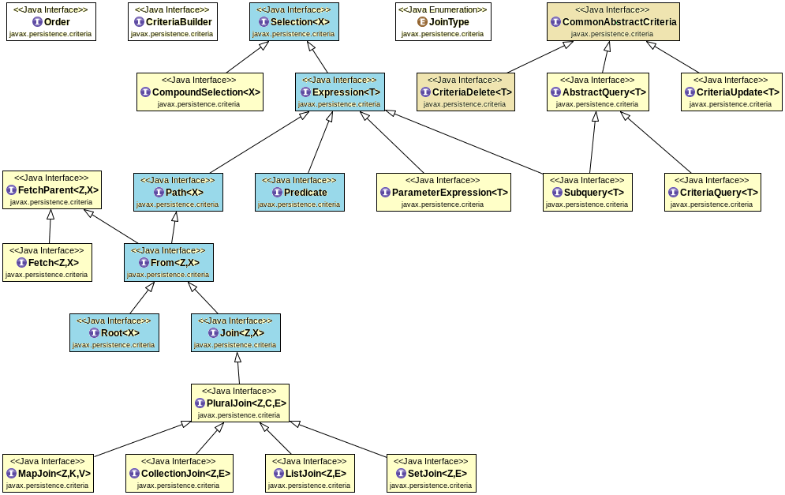

# Criteria API. Основной API

Сегодня мы начнем знакомство с еще одним из механизмов JPA - Criteria API. Сам по себе этот API имеет достаточно узкую
зону применения - о ней мы поговорим ниже. Но для нас данный инструмент полезен сразу по двум причинам:

1. Знакомство с первым DSL (domain-specific language,
   [ссылка](https://ru.wikipedia.org/wiki/%D0%9F%D1%80%D0%B5%D0%B4%D0%BC%D0%B5%D1%82%D0%BD%D0%BE-%D0%BE%D1%80%D0%B8%D0%B5%D0%BD%D1%82%D0%B8%D1%80%D0%BE%D0%B2%D0%B0%D0%BD%D0%BD%D1%8B%D0%B9_%D1%8F%D0%B7%D1%8B%D0%BA))
   для формирования запросов к БД. Со временем, скорее всего, вам придется столкнуться с Querydsl, JOOQ или чем-то 
   еще. Все из них используют собственный синтаксис, но общая идея и решаемые проблемы - те же, которые мы 
   рассмотрим на примере JPA Criteria API. А значит знакомство с каждым следующим решением будет кратно проще;
2. Решение проблем типобезопасности (type safety) при формировании запросов и работа с JPA Metamodel. Этому посвящена 
   следующая статья, но ее примеры будут строиться именно вокруг формирования Criteria-запросов.

В силу вышесказанного, знакомство с Criteria API будет менее глубокое, нежели с JPQL. Но все еще покроет наиболее 
важные механики, а также плюсы и минусы концепции, которая лежит в основе инструмента.

## Проблематика

При работе с данными достаточно часто возникают ситуации, когда необходимо сформировать выборку с гибкими фильтрами 
и сортировками, которые формируются динамически.

Классический пример - список товаров в онлайн-магазине. Пользователь может фильтровать товары по различным признакам -
цене, производителю, отдельным специфическим для товара характеристикам. При этом вполне логично, что может требоваться
комбинация фильтров - цена от и до, строго указанных производителей и четко заданных диапазонов показателей по тем 
или иным характеристикам. То же справедливо и для сортировок - они могут быть различны, при необходимости - 
комбинироваться.

Ситуация усложняется тем, что при использовании реляционной СУБД для некоторых фильтров могут требоваться JOIN'ы или 
какие-то специфические подзапросы. То есть надо предусмотреть как гибкую фильтрацию, так и дополнительные связи в 
запросе, которые могут как требоваться, так и нет - в зависимости от того, какие фильтры и сортировки задал 
пользователь.  

При попытке реализовать подобное с помощью JDBC, нативных или JPQL запросов в JPA или иными средствами, которые 
оперируют чем-то близким к SQL, решение сводится примерно к следующему:

1. Необходим некий класс `Filter`, которые будет предоставлять поля для данных, необходимых при фильтрации: "цена 
   от", цена "до", "производители" и т.д. Такой класс может получаться достаточно объемным, если фильтров много. 
   Также нужен объект, хранящий сортировки, но с ним проще - фактически, нужен список с ключами сортировки и 
   указанием направления сортировки для каждого ключа;
2. Необходим класс логики, который сконструирует запрос. Тут сценария два:
   * Громоздкий запрос, в который параметрами передаются все значения фильтров, а в WHERE-условиях проверяется: если 
     значения конкретного параметра не пустое - примеменяется связанная с ним фильтрация. Схоже для сортировок. С 
     JOIN'ами сложнее - потребуется определять, требуется ли для переданных параметров каждый конкретный `JOIN` и 
     если нет - как-то исключать его. Например, через указание заранее ложного условия JOIN'а (`1 != 1` или 
     подобного). Очевидно, полученный запрос тяжело видоизменять и поддерживать - одни и те же условия проверяются 
     несколько раз (`WHERE` и `JOIN` секции), если условия фильтрации взаимосвязаны - учитывать это в логике запроса.
     Теоретически такой подход возможен, но на практике более-менее реален только для небольшого числа опциональных 
     сортировок в пределах таблицы;
   * Формирование конечного запроса в Java-коде. Для каждого условия фильтрации задается `if` с проверкой 
     заполненности нужного поля в `Filter` и при выполнении условия - соответствующие WHERE- и JOIN-условия 
     добавляются в конечный запрос. По итогу сам запрос получается достаточно легким (насколько это вообще возможно 
     для запросов подобного рода), но появляется объемный класс, формирующий такой запрос. И если расширение 
     подобного кода новыми фильтрами или правки существующих обходятся более-менее дешево, то поддержка 
     согласованности кода с БД может стать проблемой. Ведь любое переименование или удаление таблицы (или колонки) в 
     СУБД, изменение типов колонок и другие правки в схеме БД могут сломать формируемый запрос (для JPQL - все то же 
     самое, но в части изменения Entity-классов). И узнаем мы об этом лишь тогда, когда запрос будет выполняться. Ни 
     на этапе компиляции, ни на старте приложения нет возможности проверить валидность запроса.

> Описанное выше может казаться чем-то сложным и непонятным. Но речь идет о достаточно простой логике. Для 
> наглядности, ниже представлен пример реализации описанных выше сценариев.
> 
> Допустим, мы разрабатываем онлайн-магазин автомобилей. Будем считать, что целевая таблица содержит необходимые 
> колонки для описанных ниже фильтров. Класс, хранящий условия фильтрации:
> 
> ```java
> public class CarFilter {
>     private Long priceFrom;
> 
>     private Long priceTo;
> 
>     private Set<String> brandNames = new HashSet<>();
> 
>     private Set<String> modelNames = new HashSet<>();
> 
>     private Long mileageFrom;
> 
>     private Long mileageTo;
> 
>     // Геттеры и сеттеры для полей
> }
> ```
> 
> При формировании запросов будем работать с SQL. Точнее, с тем API, который предоставляет JPA для нативных запросов -
> это упростит логику работы с передачей коллекции в виде параметра. Логику сортировок для простоты опустим - ничего 
> принципиально нового мы там не обнаружим.
> 
> Попытка включить все эти условия в один общий запрос (первый вариант реализации) может выглядеть примерно так:
> 
> ```sql
> -- Достаточно получить список подходящих id.
> -- Конечный набор атрибутов - дело десятое, достать его по списку id - дело техники
> select distinct c.id
> from car c
> -- Если фильтровать по присоединенной таблице не нужно - нет смысла и тратить ресурсы на фактический join
> left join brand b on coalesce(:brandNames) is not null and b.id = c.fk_brand
> left join model m on coalesce(:modelNames) is not null and m.id = c.fk_model
> where (:priceFrom is null or c.price >= :priceFrom)
> and (:priceTo is null or c.price < :priceTo)
> and (coalesce(:brandNames) is null or b.name in (:brandNames))
> and (coalesce(:modelNames) is null or m.name in (:modelNames))
> and (:mileageFrom is null or c.mileage >= :mileageFrom)
> and (:mileageTo is null or c.mileage < :mileageTo)
> ```
> 
> Второй вариант более многословен, но его легче поддерживать в Java:
> 
> ```java
> public List<Long> getCarIds(CarFilter filter, EntityManager em) {
>     Set<String> joins = new LinkedHashSet<>();
>     Set<String> wheres = new HashSet<>();
>     Map<String, Object> params = new HashMap<>();
> 
>    if (filter.getPriceFrom() != null) {
>        wheres.add("c.price >= :priceFrom");
>        params.put("priceFrom", filter.getPriceFrom());
>    }
> 
>    if (filter.getPriceTo() != null) {
>        wheres.add("c.price < :priceTo");
>        params.put("priceFrom", filter.getPriceTo());
>    }
> 
>    if (!filter.getBrandNames().isEmpty()) {
>        joins.add("left join brand b on b.id = c.fk_brand");
>        wheres.add("b.name in (:brandNames)");
>        params.put("brandNames", filter.getBrandNames());
>    }
> 
>    if (!filter.getModelNames().isEmpty()) {
>        joins.add("left join model m on m.id = c.fk_model");
>        wheres.add("m.name in (:modelNames)");
>        params.put("modelNames", filter.getModelNames());
>    }
> 
>    if (filter.getMileageFrom() != null) {
>        wheres.add("c.mileage >= :mileageFrom");
>        params.put("mileageFrom", filter.getMileageFrom());
>    }
> 
>    if (filter.getMileageTo() != null) {
>        wheres.add("c.mileage < :mileageTo");
>        params.put("mileageTo", filter.getMileageTo());
>    }
>         
>    var sql = "select c.id from car c %s %s".formatted(
>      joins.isEmpty() ? "" : String.join(" ", joins),      
>      wheres.isEmpty() ? "" : String.join(" and ", wheres)      
>    );
>         
>    var query = em.createNativeQuery(sql, Long.class);
>    params.forEach(query::setParameter);
>         
>    return query.getResultList();
> }
> ```
> 
> Несложно понять, что оба варианта - не эталон надежного и поддерживаемого решения.

Из описанного выше получается, что в знакомом нам инструментарии нет хороших решений для динамического формирования 
запросов с множеством опциональных условий. И нужен инструмент, который:

1. Позволит сделать логику формирования подобных запросов поддерживаемой и расширяемой;
2. Обеспечит валидацию формируемого запроса на этапе компиляции или старта приложения. Для JPQL-запросов есть опция 
   валидации при запуске приложения, если запрос именованный и добавляется через `@NamedQuery`. Но если сам запрос 
   формируется динамически - эта опция недоступна. 

JPA Criteria API, как и другие подобные DSL пытаются теми или иными средствами решить указанные проблемы. В массе своей 
они не спасают от лапши из цепочки if'ов в Java-коде, но более-менее успешно решают остальные проблемы. В случае с 
Criteria API - выше описана практически единственная ситуация, при которой данный инструмент используется в современной 
разработке. Никто не мешает использовать ее для любых `SELECT`, `UPDATE` или `DELETE` запросов, но для запросов со 
статической структурой Criteria API менее лаконичен, нежели нативные или JPQL-запросы. Почему - станет понятно при 
знакомстве с самим API.  

## Концепция

Criteria API представляет собой DSL, направленный на программное формирование объекта, эквивалентного по смыслу 
JPQL-запросу. Исходя из этого, Criteria-запрос позволяет сделать как минимум не меньше, чем позволяет JPQL в 
соответствии со спецификацией.

При этом формирование запроса как объекта означает, что сформированный Criteria-запрос - это не SQL-запрос и не 
JPQL-запрос. Это именно объект, который был сконфигурирован через методы определенных интерфейсов и содержит в себе 
информацию о том, что надо извлечь* из базы данным, по каким условиям (`WHERE`) и в каком порядке (`ORDER BY`). То есть
все операторы, функции и другие синтаксические возможности JPQL так или иначе представляются в виде Java-методов 
Criteria API.

> *Для запросов `DELETE` и `UPDATE` речь идет об удалении и обновлении данных соответственно.

Также стоит отметить, что смысловая эквивалентность между Criteria-запросом и JPQL-запросом - лишь декларация. То 
есть Persistence Provider не имеет обязанности (и обычно не реализует) конвертации по цепочке Criteria-запрос -> 
JPQL-запрос -> SQL-запрос, как можно подумать из описания выше. Обычно Criteria-запрос "компилируется" сразу в 
нативный SQL и затем применяется к БД.

## Основные интерфейсы

> Базовая работа с Criteria API, как и с большинством подобных DSL, доступна практически без подготовки - сам API 
> достаточно понятен на интуитивном уровне для человека, знакомого с SQL и JPQL. Ведь это просто попытка представить 
> строку запроса в виде Java-интерфейсов и методов.
> 
> Но когда приходится описывать с помощью Criteria API более сложные запросы и, особенно, бороться с багами в них, 
> такая легкость старта играет дурную шутку - разработчик зачастую не понимает, что делает написанный код и какими
> сущностями он оперирует. Чтобы составить более комплексное представление об этом, ниже рассмотрены основные 
> интерфейсы данного API и их зоны ответственности. И лишь затем детально рассматриваются примеры формирования 
> конкретных запросов. 

Все, что нужно для работы с Criteria API практически полностью инкапсулировано в пакет `jakarta.persistence.criteria`
(для более старых версий JPA - `javax.persistence.criteria`). Проблема лишь в том, что в этом пакете находится более 
20 интерфейсов. По названиям большинства из них можно понять их примерную зону ответственности, но для наглядности 
ниже обозначены как ключевые интерфейсы, так и их зона ответственности.

Прежде чем начать подробный разбор, стоит рассмотреть пример того, как с помощью Criteria API формируется объект 
запроса. Это как минимум позволит понять, что из себе представляет Criteria визуально. Фактически, ниже 
продемонстрировано создание запроса из примеров выше. При условии, что все поля фильтра обязательны к заполнению и не 
пусты, чтобы не загромождать пример if'ами:

```java
public List<Long> getCarIds(CarFilter filter, EntityManager em) {
    CriteriaBuilder builder = em.getCriteriaBuilder();
    CriteriaQuery<Long> query = builder.createQuery(Long.class);

    Root<CarEntity> carRoot = query.from(CarEntity.class);
    query.select(carRoot.get("id"));

    List<Predicate> predicates = new ArrayList<>();

    predicates.add(builder.ge(carRoot.get("price"), filter.getPriceFrom()));
    predicates.add(builder.lt(carRoot.get("price"), filter.getPriceTo()));

    Join<CarEntity, BrandEntity> brandJoin = carRoot.join("brand", JoinType.LEFT);
    predicates.add(brandJoin.get("name").in(filter.getBrandNames()));

    Join<CarEntity, ModelEntity> modelJoin = carRoot.join("model", JoinType.LEFT);
    predicates.add(modelJoin.get("name").in(filter.getModelNames()));

    predicates.add(builder.ge(carRoot.get("mileage"), filter.getMileageFrom()));
    predicates.add(builder.lt(carRoot.get("mileage"), filter.getMileageTo()));

    query.where(predicates.toArray(new Predicate[0]));

    return em.createQuery(query)
            .getResultList();
}
```

В общем виде интерфейсы в пакете `jakarta.persistence.criteria` можно визуализировать так:



### CriteriaBuilder

Данный интерфейс является точкой входа в формирование запросов с помощью Criteria API. Объект `CriteriaBuilder` 
доступен через уже знакомые нам методы `EntityManagerFactory#getCriteriaBuilder()` и 
`EntityManager#getCriteriaBuilder()`.

Сам интерфейс предоставляет методы для создания объектов Criteria-запросов, а также большинства конечных операторов 
и JPQL-функций.

Таким образом, `CriteriaBuilder` отвечает, в первую очередь, за формирование наиболее крупных сущностей вроде самого 
объекта запроса и наиболее маленьких составных частей - отдельный выражений.

### CommonAbstractCriteria и наследники

`CommonAbstractCriteria` - родительский интерфейс для всех типов Criteria-запросов.

От него наследуются два целевых типа - `CriteriaUpdate` и `CriteriaDelete` для запросов на обновление и удаление данных
соответственно. А также промежуточный тип `AbstractQuery` для `SELECT`-запросов. Последний, в свою очередь, имеет 
два наследника: `CriteriaQuery` непосредственно для работы с `SELECT`-запросами и `Subquery` для работы с 
подзапросами. Очевидно, оба типа имеют схожий API, но требуют различной обработки со стороны Persistence Provider'а.

В глобальном смысле все эти интерфейсы инкапсулируют в себе общую структуру запроса - содержать набор методов, 
позволяющих указать:

- Какие данные требуется извлечь (для наследников под `SELECT`);
- Откуда извлечь (или удалить, или изменить, в зависимости от интерфейса);
- Что обновить (для `CriteriaUpdate`);
- Какими фильтрами задаются ограничения выборки. В данном случае все конечные интерфейсы содержат метод `where()`, в 
  который передаются условия, формируемые с помощью методов из `CriteriaBuilder`;
- Группировки, `HAVING` и сортировки.
 
### Order

Здесь достаточно просто. Как было упомянуто в начале статьи, необходим некий объект, позволяющий описать условие 
сортировки и ее направление. А поскольку условие сортировки может быть представлено не только конкретным полем, но и 
некоторым выражением - приходится это закладывать в API.

### Selection

Если рассматривать методы описанных выше интерфейсов, несложно заметить, что большое их количество так или иначе 
используют `Expression` - `WHERE`-условия, сортировки, группировки... При этом сам интерфейс, как видно по схеме, 
является частью еще более крупной иерархии. Почему так и что за что отвечает?

Более обстоятельный ответ, вероятно, стоило бы формировать, исходя из того, как формируется дерево запроса - объект 
запроса и вложенные в него объекты, каждый элемент из которых описывает свою часть конечного запроса. Однако это 
отдельная большая тема, актуальная скорее для ситуаций, когда требуется реализовать собственный парсер или, наоборот,
механизм формирования итоговой строки или иной низкоуровневой сущности через какой-то DSL.

В более простом формате можно апеллировать к тому, что части запроса, используемые для выборки, описания условий
выборки, JOIN'ов между таблицами и других элементов требует общей функциональности, из которой постепенно и 
выстраивается та иерархия из половины содержимого `jakarta.persistence.criteria`, которую можно наблюдать выше.

Чтобы не уходить глубоко в теоретическую подноготную, выделим полезные для нас подгруппы в этой иерархии и 
рассмотрим их зону применения.

`Selection`, как общий предок элементов запроса в Criteria API описывает некое значение, которое может быть 
возвращено. С точки зрения документации это нечто, возвращаемое из запроса, но фактически зона применения намного 
шире. Так, объектом `Selection` или его наследника может быть репрезентация следующих элементов запроса:

- Поле таблицы. Обычно представляется через дочерний интерфейс `Path`. Впрочем, это не единственное 
  применение для `Path`;
- Проекция (constructor expression) или иные комплексные выборки, кроме получения Entity-объектов или ситуаций, 
  когда в возвращаемой выборке лишь одно значение на строку (как выше, где выбираем лишь `id`). Для этого выделен
  отдельный интерфейс `CompoundSelection`. Если знать о чем речь - название говорит само за себя. Фактически, этот 
  интерфейс обозначает синтетическую структуру, формируемую из одного или нескольких объектов `Selection`. В 
  конечном виде может использоваться для получения проекций, сложных выборок в виде массива объектов или `Tuple` из 
  запроса;
- Любой сложности предикаты - от банальных операций сравнения и операторов `IN`, `NOT` до операций комбинации условий
  (`AND`, `OR`) и иных конструкций, возвращающих `true`/`false`. Иными словами, сюда укладывается все условия,
  которые мы можем уложить в `WHERE` или `HAVING`. Как все вместе, так и каждое по отдельности. Для этих ситуаций
  определен интерфейс `Predicate` - фактически, параметризация более широкого интерфейса `Expression` под `Boolean`.
  Формально все еще является объектов `Selection`, хоть семантически и находится далеко от того, что описано в
  предыдущих пунктах. Пункты ниже также описывают применение `Expression` в различных вариациях;
- Обращения к JPQL-функциям, в том числе к агрегатным функциям. Это ничто иное, как некое выражение, возвращающее 
  некое значение. Возможно, то, что такие выражения актуальны как для `SELECT`-блока, так и для предикатов в 
  фильтрах - основная причина, почему `Expression` является наследником `Selection`. И это же является основным 
  примером использования именно типа `Expression`, в то время как остальные сценарии обычно опираются на 
  использование более узких типов-наследников;
- `Subquery`. Уже знакомый нам интерфейс для описания подзапроса. Но ведь нельзя отрицать, что подзапрос - это тоже 
  своего рода выражение и выборка? По сути, для условия, использующего подзапрос, нет большой разницы между 
  подзапросом, переданным массивом условий или иной составной частью выражения. Ведь нам не принципиально, подзапрос 
  мы использовали для правой части `IN` или просто набор литералов? Разработчики JPA пользовались той же логикой;
- Параметр запроса. В Criteria-запросы можно передавать параметры по тому же принципу, как мы передаем их в нативные 
  или JPQL-запросы. Это менее востребовано из-за существования иных механизмов передачи динамических значений 
  (продемонстрировано в примере выше), но тоже возможно. Собственно, получение значения параметра - тоже "выборка" и 
  тоже "выражение". Для того чтобы описать такую возможность, в Criteria API даже определен тип `ParameterExpression`;
- Обращения к полям Entity-сущностей и самим сущностям. И то, и другое мы можем рассматривать как некий "путь" до 
  значения. Для таких конструкций используется интерфейс `Path`, частный случай его использования был описан выше;
- Второй частный случай (имеющий свои вариации) - обращение к сущности порождает отдельный интерфейс - `From`. Ведь в 
  большинстве случаев обращение к сущности необходимо для `FROM`-конструкции или `JOIN`. `From` - фактически,
  промежуточный интерфейс. Для ситуаций, когда мы работаем с сущностью, непосредственно запрашиваемой через `FROM`
  выделен интерфейс `Root`. Фактически, он инкапсулирует в себе взаимодействие с основной таблицей запроса. В частности, 
  через него происходит вызов `JOIN`, получение конкретных полей сущности для описания предикатов и т.д.;
- `JOIN`, как отдельный частный случай `FROM`-выражения, также выделен в отдельный интерфейс - `Join`. Через него 
  также возможно обращение к конечным полям сущности (присоединенной), описание условий присоединения (`ON`-условия) 
  и т.д. `Join` имеет и еще более узкие дочерние типы, необходимые для ситуаций, когда JPQL `JOIN` происходит через 
  поля сущности с типами коллекций. То есть, фактически, для O2M и M2M связей, с характерной для этих ситуаций 
  спецификой: промежуточный `PluralJoin` и конечные интерфейсы в лице `MapJoin`, `CollectionJoin`, `ListJoin` и 
  `SetJoin`.

По совокупности получается описание практически всех базовых конструкций внутри блоков запроса - от `SELECT` до 
`ORDER BY`.

Все, что остается добавить - наличие отдельного интерфейса, предоставляющего методы для `FETCH JOIN` - сами методы 
доступны в интерфейсе `From` и его наследниках, но появляются они за счет наследования интерфейса `FetchParent`. 
Именно там эти методы декларируются.

## Синтаксис и примеры

Итак, мы познакомились с интерфейсами и высокоуровнево разделили между ними ответственность за различные части 
запросов или запросы целиком. Но без изучения конкретных методов интерфейсов писать запросы не получится. При этом 
API довольно громоздкий и не все его содержимое нам нужно, если мы не используем метамодель JPA или не разрабатываем 
свой Persistence Provider. Поэтому изучать отдельные методы будем в связке с практикой и конкретными примерами 
использования.

### Базовые запросы

#### SELECT

```java
CriteriaBuilder builder = em.getCriteriaBuilder();
CriteriaQuery<CarEntity> query = builder.createQuery(CarEntity.class);
query.from(CarEntity.class);

List<CarEntity> cars = em.createQuery(query)
    .getResultList();
```

Фактически аналогично запросу

```jpaql
select c from CarEntity
```

#### UPDATE

```java
em.getTransaction().begin();

CriteriaBuilder builder = em.getCriteriaBuilder();
CriteriaUpdate<CarEntity> query = builder.createCriteriaUpdate(CarEntity.class);
Root<CarEntity> root = query.from(CarEntity.class);

// Будем считать, что у машины существуют строковые поля number, number1 и number2
query.set("number", "1111");
query.set(root.get("number1"), "2222");
query.set(root.<String>get("number2"), builder.concat(root.get("number2"), "3333"));

em.createQuery(query)
    .executeUpdate();

em.getTransaction().commit();
```

Фактически аналогично запросу

```jpaql
update CarEntity c set c.number = '1111', c.number1 = '2222', c.number2 = concat(c.number2, '3333')
```

#### DELETE

```java
em.getTransaction().begin();

CriteriaBuilder builder = em.getCriteriaBuilder();
CriteriaDelete<CarEntity> query = builder.createCriteriaDelete(CarEntity.class);
query.from(CarEntity.class);

em.createQuery(query)
    .executeUpdate();

em.getTransaction().commit();
```

Фактически аналогично запросу

```jpaql
delete from CarEntity c
```

### Получение данных из конкретной колонки

```java
CriteriaBuilder builder = em.getCriteriaBuilder();
CriteriaQuery<String> query = builder.createQuery(String.class);

Root<CarEntity> carRoot = query.from(CarEntity.class);
query.select(carRoot.get("number"));

List<String> carNumbers =  em.createQuery(query)
    .getResultList();
```

Фактически аналогично запросу

```jpaql
select c.number from CarEntity
```

### WHERE и передача параметров

#### WHERE-условия и их комбинация через AND

```java
CriteriaBuilder builder = em.getCriteriaBuilder();
CriteriaQuery<CarEntity> query = builder.createQuery(CarEntity.class);

Root<CarEntity> carRoot = query.from(CarEntity.class);
List<Predicate> predicates = new ArrayList<>();

predicates.add(builder.le(carRoot.get("mileage"), 10000));
predicates.add(builder.le(carRoot.get("price"), 20000));
        
// Метод принимает на вход массив предикатов. Они объединяются через AND
query.where(predicates.toArray(new Predicate[0]));

List<CarEntity> cars = em.createQuery(query)
    .getResultList();
```

Фактически аналогично запросу

```jpaql
select c from CarEntity where c.mileage <= 10000 and c.price <= 20000
```

#### WHERE-условия и ручное комбинирование

Если нам требуется объединять запросы по более сложным условиям, лишь просто `AND`, мы можем делать это вручную:

```java
CriteriaBuilder builder = em.getCriteriaBuilder();
CriteriaQuery<CarEntity> query = builder.createQuery(CarEntity.class);

Root<CarEntity> carRoot = query.from(CarEntity.class);

Predicate mileagePredicate = builder.le(carRoot.get("mileage"), 10000);
Predicate pricePredicate = builder.le(carRoot.get("price"), 20000);
Predicate andPredicate = builder.and(mileagePredicate, pricePredicate);

// Не путайте equal() и equals(). Первое - метод для обозначения оператора "=", второе - стандартный метод Object
Predicate numberPredicate = builder.equal(carRoot.get("number"), "1234321");

Predicate finalPredicate = builder.or(numberPredicate, andPredicate);

query.where(finalPredicate);

List<CarEntity> cars = em.createQuery(query)
    .getResultList();
```

Описанное выше аналогично запросу

```jpaql
select c from CarEntity where c.number = '1234321' or (c.mileage <= 10000 and c.price <= 20000)
```

#### Передача параметров в запрос

```java
CriteriaBuilder builder = em.getCriteriaBuilder();
CriteriaQuery<CarEntity> query = builder.createQuery(CarEntity.class);

Root<CarEntity> carRoot = query.from(CarEntity.class);

Predicate predicate = builder.le(
    carRoot.get("mileage"),
    builder.parameter(Long.class, "mileage")
);

query.where(predicate);

// Более простой способ, если запрос исполняется там же, где и формируется.
// Вариант выше полезен, если формирование запроса и его вызов разнесены в коде
// query.where(builder.le(carRoot.get("mileage"), 10000));

List<CarEntity> cars = em.createQuery(query)
    .setParameter("mileage", 10000)
    .getResultList();
```

Фактически аналогично запросу

```jpaql
select c from CarEntity where c.mileage <= :mileage
```

### JOIN

Наиболее простой сценарий с использованием `JOIN` был рассмотрен ранее. Упростив, его можно описать так:

```java
CriteriaBuilder builder = em.getCriteriaBuilder();
CriteriaQuery<CarEntity> query = builder.createQuery(CarEntity.class);
Root<CarEntity> carRoot = query.from(CarEntity.class);

// Также доступны INNER и RIGHT JOIN'ы
carRoot.join("brand", JoinType.LEFT);

// select c from CarEntity c left join c.brand b
List<CarEntity> cars = em.createQuery(query)
    .getResultList();
```

Более специфичными могут быть ситуации, когда требуется явный `ON`:

```java
CriteriaBuilder builder = em.getCriteriaBuilder();
CriteriaQuery<CarEntity> query = builder.createQuery(CarEntity.class);
Root<CarEntity> carRoot = query.from(CarEntity.class);

Join<CarEntity, BrandEntity> brandJoin = carRoot.join("brand", JoinType.INNER);
brandJoin.on(builder.equal(brandJoin.get("name"), "Audi"));

// select c from CarEntity c join BrandEntity b on b.id = c.brandId and b.name = 'Audi'
List<CarEntity> cars = em.createQuery(query)
    .getResultList();
```

Проблема лишь в том, что использование `Join#on()` не отменяет первичного условия JOIN'а по id, лишь добавляет 
дополнительное условие через `AND`. Что не совсем очевидно. Фактически, это один из немногих случаев, когда 
Criteria-запрос идет вразрез с JPQL. Что еще более неприятно, избавиться от первичного условия не получится.

Также есть некоторая специфика в использовании `JOIN` для связей, описанных в изначальной сущности как коллекция - 
M2M, O2M. Как правило, для таких случаев достаточно и синтаксиса, описанного выше. Но для типобезопасности (ее мы будем 
больше обсуждать в следующей статье) и лучшей читаемости кода рекомендуется использовать более специфичные методы, 
соотносящиеся с типом поля, по которому производится `JOIN`:

- `Collection` - `joinCollection()`;
- `Set` - `joinSet()`;
- `List` - `joinList()`;
- `Map` - `joinMap()`.

Кроме безопасности и читабельности запроса, последние два дают и специфические методы для взаимодействия с 
коллекцией - получение индекса элемента (для списка) и взаимодействие с ключом, значением или `Entry` у `Map`. Но 
необходимости в подобных методах обычно не возникает, что делает само преимущество достаточно узконаправленным.

Пример использования `joinList()`. Предполагаем, что `CarEntity#owners` описывает M2M связь с `PersonEntity`:

```java
CriteriaBuilder builder = em.getCriteriaBuilder();
CriteriaQuery<CarEntity> query = builder.createQuery(CarEntity.class);
Root<CarEntity> carRoot = query.from(CarEntity.class);

// Возвращаемый тип тоже отличается. Впрочем, он является наследником Join
ListJoin<CarEntity, PersonEntity> personJoin = carRoot.joinList("owners", JoinType.INNER);

// select c from CarEntity c join c.owners p 
List<CarEntity> cars = em.createQuery(query)
    .getResultList();
```

#### FETCH JOIN

Также, как и в JPQL, для борьбы с N+1 предусмотрен `FETCH JOIN`:

```java
CriteriaBuilder builder = em.getCriteriaBuilder();
CriteriaQuery<CarEntity> query = builder.createQuery(CarEntity.class);
Root<CarEntity> carRoot = query.from(CarEntity.class);

// JOIN FETCH добавлен. Но обратите внимание на возвращаемый тип
Fetch<CarEntity, BrandEntity> brandFetch = carRoot.fetch("brand", JoinType.LEFT);

List<CarEntity> cars = em.createQuery(query)
        .getResultList();
```

Интересный момент заключается в том, что `Fetch` в JPA-иерархии не является ни предком, ни потомком `Join`. Что, 
фактически, не позволяет использовать `JOIN FETCH` в исполнении Criteria API для фильтраций или сортировок в запросе.
С одной стороны он для этого изначально и не предназначен, с другой - это вносит сложности в работу, когда подобные 
действия нужны.

Хорошая новость заключается в том, что в конечных реализациях (включая Hibernate) конечный наследник `Join` обычно 
является также и наследником `Fetch`, что позволяет реализовать приведение `Fetch` к `Join` и использовать его привычным
образом.

### Сортировки

В базовом варианте все довольно просто:

```java
CriteriaBuilder builder = em.getCriteriaBuilder();
CriteriaQuery<CarEntity> query = builder.createQuery(CarEntity.class);
Root<CarEntity> carRoot = query.from(CarEntity.class);

query.orderBy(builder.asc(carRoot.get("price")));

// select c from CarEntity c order by c.price
List<CarEntity> cars = em.createQuery(query)
    .getResultList();
```

Но, как и в JPQL, возникает проблема, если необходимо настроить параметры `NULLS FIRST`/`NULLS LAST`:

```java
CriteriaBuilder builder = em.getCriteriaBuilder();
CriteriaQuery<CarEntity> query = builder.createQuery(CarEntity.class);
Root<CarEntity> carRoot = query.from(CarEntity.class);

Expression<Object> priceNullsCase = builder.selectCase()
    .when(carRoot.get("price").isNull(), 0)
    .otherwise(1);
Order priceNullsFirstOrder = builder.asc(priceNullsCase);

Order priceAscOrder = builder.asc(carRoot.get("price"));

query.orderBy(priceNullsFirstOrder, priceAscOrder);

// SQL: select * from car order by price nulls first
// JPQL: select c from CarEntity car order by (case when c.price is null then 0 else 1 end), c.price
List<CarEntity> cars = em.createQuery(query)
    .getResultList();
```

### Агрегатные функции и группировки

Концептуальных различий в формировании запросов с использованием агрегатных функций и без них нет. Общая канва, как 
и ранее, укладывается в JPQL, а синтаксис, полагаю, понемногу укладывается в голове. Поэтому рассмотрим сразу 
комплексный запрос, сочетающий вызов агрегатной функции, `WHERE`-условие, группировку и `HAVING`:

```java
CriteriaBuilder builder = em.getCriteriaBuilder();
// CriteriaBuilder#createTupleQuery() создает запрос, возвращаемый тип которого - Tuple.
// Об этом типе данных кратко рассказано ниже
CriteriaQuery<Tuple> query = builder.createTupleQuery();
Root<CarEntity> carRoot = query.from(CarEntity.class);

//        Выбираем сразу несколько колонок, но не сущность целиком
query.multiselect(
//                Обратите внимание, мы впервые используем алиасы для более понятных названий
        carRoot.get("price").alias("price"),
        builder.count(carRoot).alias("count"))
    .where(builder.le(carRoot.get("mileage"), 100000))
    .groupBy(carRoot.get("price"))
    .having(builder.ge(builder.count(carRoot), 10));

// Tuple представляет собой слабо структурированный тип данных (смесь массива и Map), 
// позволяющий получать элементы по их индексу или же по их алиасу.
// Так, для отдельной записи цена будет доступна через tuple.get("price"),
// а количество машин по данной цене - через tuple.get("count")
List<Tuple> countByPriceList = em.createQuery(query)
    .getResultList();
```

С поправкой на то, что не все Persistence Provider'ы поддерживают `Tuple` за пределами Criteria API, criteria-запрос 
выше аналогичен следующему JPQL-запросу:

```jpaql
select c.price price, count(c) count
from CarEntity
where c.mileage <= 100000
group by c.price
having count(c) >= 10
```

### Работа с проекциями

Создадим класс проекции (считаем, что номер машины - не уникальный атрибут):

```java
public record CarCountByNumber(String number, long count) {
}
```

Теперь мы можем использовать ее при формировании запроса:

```java
CriteriaBuilder builder = em.getCriteriaBuilder();
CriteriaQuery<CarCountByNumber> query = builder.createQuery(CarCountByNumber.class);
Root<CarEntity> carRoot = query.from(CarEntity.class);

CompoundSelection<CarCountByNumber> projection = builder.construct(
    CarCountByNumber.class,
    carRoot.get("number"),
    builder.count(carRoot)
);

query.select(projection)
    .groupBy(carRoot.get("number"));

List<CarCountByNumber> carCountByNumberList = em.createQuery(query)
    .getResultList();
```

Фактически аналогично запросу

```jpaql
select new com.walking.jpa.CarCountByNumber(с.number, count(c)) from CarEntity c group by c.number
```

## Заключение

Все, что описано выше, фактически решает лишь одну из проблем, указанных в начале статьи - делает логику формирования 
запроса более поддерживаемой. При этом никакой предварительной валидации запроса все еще нет.

Следующая статья расскажет о том, как эта валидация реализуется и какова роль метамодели JPA в этом. С точки зрения 
кода это практически не принесет серьезных изменений, но концепция и то, как она реализована - определенно 
заслуживает внимания. 

#### На сегодня все!


> Если что-то непонятно или не получается – welcome в комменты к посту или в лс:)
>
> Канал: https://t.me/ViamSupervadetVadens
>
> Мой тг: https://t.me/ironicMotherfucker
>
> **Дорогу осилит идущий!**
