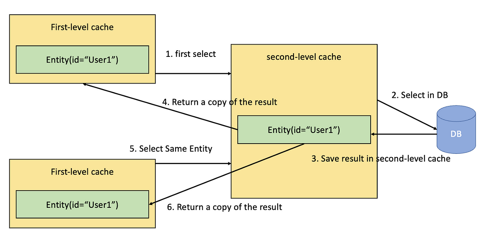

# JPA и Hibernate. Кэш второго уровня. Кэш запросов

Сегодня мы продолжим погружение в систему кэшей в JPA и Hibernate. Непосредственно технологический аспект будет 
иметь второстепенное значение - использование рассматриваемых кэшей нельзя назвать распространенным. Но концепции, 
подходы и проблематика, актуальные для кэшей в Hibernate легко будет переложить и на подходы к кэшированию, 
актуальные сейчас в Back-end разработке. Многое из того, что будет рассмотрено сегодня, актуально и для инструментов 
кэширования в Spring, и для любых иных кэшей уровня приложения. 

## Проблематика

Кэш второго уровня (second-level cache) - кэш Entity-объектов, не привязанный к конкретной транзакции или EM. Само 
название намекает, что это уровень кэша, стоящий за Persistence Context - кэшем первого уровня.

Спецификация JPA достаточно обобщенно определяет само понятие кэша второго уровня и предоставляет несколько крайне 
общих интерфейсов для работы с ним. Кроме того, поддержка такого кэша - право, а не обязанность Persistence 
Provider'ов. Проще говоря, JPA практически не регламентирует ни возможности, ни ограничения, ни само наличие кэша 
второго уровня для конечных реализаций спецификации.

Поэтому структура статью будет не совсем стандартной для этого раздела. Данный пункт будет посвящен в первую очередь 
проблематике, из которой следует существование подобного кэша. Далее тезисно рассмотрим, что предлагает JPA для 
работы с кэшем второго уровня и затем немного углубимся в реализацию кэша непосредственно в Hibernate.

В общем случае задачи практически любого кэша можно свести к двум пунктам:

1. Экономия вычислительных ресурсов. Иными словами, зачем считать что-то несколько раз, если это уже было посчитано 
   ранее;
2. Увеличение быстродействия. Зачем тратить время на вычисление результата, если результат уже был ранее получен.

Это уже было описано ранее, при знакомстве с понятием кэширования. Беда в том, что до этого момента мы не встречали 
таких инструментов, в том числе в JPA. Кэш первого уровня в отдельных случаях может сокращать время, затрачиваемое 
на получение сущности. Но, во-первых, эти случаи достаточно узкие (повторное получение одного и того же объекта в 
рамках транзакции), во-вторых - основные задачи Persistence Context вовсе не в этом.

Тем временем потребность в решении обозначенных выше задач никуда не исчезла - если об экономии ресурсов на 
получение данных из РСУБД задумываются относительно редко, то желание получить результат побыстрее, сэкономив на 
обработке SQL-запроса и, опционально, сетевых издержках - история весьма распространенная.

При этом, если мы говорим про JPA, хочется как-то встроить получение кэшированных данных в жизненный цикл Entity - 
мало кому захочется императивно (через отдельное обращение к кэшу в своем коде) получать объекты извне, так же 
императивно вызывать для них `EntityManager#merge()`, чтобы поместить под контроль EM, а потом в том же режиме 
годами следить за своевременной инвалидацией кэша - ведь кроме запросов на чтение существуют и запросы на создание 
или обновление сущностей, после которых данные в кэше становятся устаревшими.

Кажется, будет круто, если JPA в целом или Persistence Provider в частности возьмет часть управления на себя - сам 
будет проверять кэш, прежде чем запрашивать данные из БД, сам встраивать в жизненный цикл (как это происходит при 
извлечении сущности из базы данных) и сам же будет инвалидировать кэш, если что-то поменялось и данные в кэше стали 
не актуальны.

Еще круче будет, если Persistence Provider возьмет на себя все, описанное выше, но при этом позволит нам выбрать, 
какой инструмент кэширования стоит использовать - возможно, нас устроит локальный кэш, а может быть нужен 
распределенный. А может у нас уже есть какой-то инструмент кэширования для других задач и мы хотим переиспользовать 
его и для JPA.

Вероятно, примерно так же в свое время рассуждали разработчики Hibernate, в результате чего данный Persistence 
Provider предоставляет механизм, в той или иной степени удовлетворяющий вышеописанным запросам.

## Кэш второго уровня в JPA

Возвращаясь к JPA, можно рассмотреть несколько аннотаций и интерфейсов - некоторые из них будут фигурировать в 
следующих пунктах статьи:

- `Cache`. Интерфейс, инкапсулирующий в себе операции с кэшем, доступные пользователю JPA - проверка наличия объекта 
  в кэше по ключу и `id`, несколько методов для очистки кэша - целиком, по сущности, по сущности и `id` (удаление 
  конкретного элемента). Доступ к объекту `Cache` можно получить через `EntityManagerFactory#getCache()`, но обычно 
  работа с ним происходит неявно внутри Persistence Provider'а;
- `@Cacheable`. Аннотация позволяет пометить Entity-класс как кэшируемый или не кэшируемый, в зависимости от 
  значения атрибута. Иными словами, указывает, нужно ли кэшировать данную сущность с помощью кэша второго уровня. В 
  зависимости от выбранного режиме `SharedCacheMode` (см. ниже) указанное значение может быть как применено, так и 
  проигнорировано. Зачастую вместо этой аннотации проще использовать схожие по назначению аннотации непосредственно
  Persistence Provider'а, как более гибкие, но об этом позже;
- `CacheRetrieveMode` и `CacheStoreMode`. Енамы, значения из которых можно использовать в `pesistence.xml` для 
  связанных параметров. Управляют, собственно, способ получения данных из кэша (читай, использовать кэш или нет) и 
  способом обновления данных в кэше соответственно. Опять же, использование параметров конфигурации Persistence 
  Provider'а может быть более предпочтительно, поскольку учитывает специфику реализации;
- `SharedCacheMode`. Енам, значения из которого можно использовать в `pesistence.xml` для параметра, отвечающего за 
  режим использования кэша второго уровня. Так, можно кэшировать вообще все сущности. Либо не кэшировать вовсе. Либо 
  кэшировать, но только те, у которых кэширование явно включено через `@Cacheable`. Либо кэшировать все сущности, 
  кроме явно указанных как некэшируемые (через `@Cacheable`). Либо сказать, что у JPA лапки и делегировать данное 
  решение Persistence Provider'у. Последняя опция зачастую будет лучшим решением, в силу слабой регулируемости кэша 
  второго уровня спецификацией.

Сильно вникать в этот API на данном этапе нет смысла - скажем, Hibernate старается его поддерживать, но фактически 
это скорее попытка следовать букве конфигурации, которая несет вполне конкретные недостатки (включая избыточность в 
коде), но не дает явных преимуществ. Но данные интерфейсы можно рассматривать как некие маркеры при изучении - на 
что вообще стоит обращать внимание при знакомстве и работе с кэшем.

Если же говорить об общей схеме взаимодействия между знакомой нам частью JPA, кэшем второго уровня и СУБД, все 
можно свести к следующей схеме: 



То есть при наличии включенного кэша второго уровня получение сущности будет происходить следующим образом:

1. Попытка найти сущность в Persistence Context;
2. Если на шаге 1 сущность не найдена - обращение к кэшу второго уровня. Second-level cache привязан к 
   `EntityManagerFactory` (в терминах Hibernate - к `SessionFactory`), то есть в большинстве случаев будет 
   существовать все время жизни приложения. Соответственно, шанс обнаружить там искомую сущность намного выше, чем 
   найти ее в кэше первого уровня, ограниченного, в базовом сценарии, текущей транзакцией;
3. Если сущность не найдена и на шаге 2 - произойдет обращение к БД;
4. Извлеченная из БД сущность будет сохранена в кэше второго уровня;
5. Также она будет сохранена в рамках Persistence Context;
6. И лишь после этого станет доступна в клиентском коде, из которого была запрошена.

При этом важно понимать, что под управление Persistence Context попадет не тот же Java-объект, который сохранится в 
кэше второго уровня - во-первых, это могло бы привести к неконтролируемому изменению сущности, в том числе 
конкурентному, во-вторых - кэш второго уровня может находиться за пределами Java-приложения. Да и, строго говоря, 
кэш второго уровня обычно хранит данные не в виде Entity-объекта, а в более низкоуровневом представлении - массив 
объектов или иная структура, не суть важно.

Так или иначе, каждый Persistence Context будет получать под управление свою копию Entity-объекта. Это обеспечивает, 
среди прочего, защиту от одновременного изменения объекта разными EM, в том числе работающими в разных потоках. Что, 
в свою очередь, позволяет делегировать решение проблем многопоточности СУБД, не пытаясь синхронизировать изменения, 
потенциально относящиеся к одним и тем же строкам в БД, на уровне Java-приложения.

Еще одним достаточно очевидным, но требующим озвучивания, фактом является то, что ключ, по которому Entity-объект 
может быть получен из кэша второго уровня, совпадает с ключом в Persistence Context - это тип сущности (грубо, имя 
Entity-класса) и ее идентификатор (значение поля, аннотированного `@Id` у данного объекта Entity-класса).

## Cache provider'ы

Наконец, стоит обозначить, что из себя представляет сам кэш второго уровня. Здесь речь пойдет скорее о реализации в 
Hibernate, но именно ее обычно имеют в виду, когда обсуждают второй уровень кэширования в JPA.

Существует достаточно много инструментов для кэширования, которые имеют разное внутреннее устройство. Некоторые из 
них - Redis, Ehcache, Caffeine, Hazelcast - я упоминал в предыдущей статье. Каждый из инструментов имеет собственные 
достоинства и недостатки, а выбор подходящего решения - одна из распространенных архитектурных задач.

Инструменты, предоставляющие функциональность кэширования в общем случае называют **Cache Provider'ами**.

Собственно, Hibernate позволяет разработчику самостоятельно выбрать Cache Provider, который будет использован для 
кэша второго уровня. Проблема состоит в том, что различные кэши по-разному хранят данные, имеют разный API для 
взаимодействия с кэшем и массу других различий, как в архитектуре, так и в управляющих интерфейсах.

Но чтобы дать возможность работать с каждым из них нужен некий общий API. Мы уже наблюдали схожую картину в 
отношении логгеров и SLF4J, JPA и Persistence Provider'ов, JDBC и драйверов для конкретных СУБД... Но во всех 
случаях решение шло скорее от обратного: существовал некий общий интерфейс или спецификация (SLF4J, JPA, JDBC) и 
некая библиотека обязана была этот интерфейс реализовать.

В данном случае все несколько сложнее - Cache Provider'ы являются самостоятельными решениями, которым, в массе своей,
все равно, будет ли Hibernate использовать их в качестве кэша второго уровня. Чаще всего каждое решение предоставляет 
собственную библиотеку-клиент (актуально для удаленных и распределенных кэшей), позволяющую работать с этим решением 
через Java. Но такая библиотека не подчиняется как-то общей для всех спецификации и определяет свой API так, как 
считает нужным.

Соответственно, необходим некий адаптер, который позволит подружить API библиотеки-клиента и интерфейсы, 
предполагаемые для работы с кэшем JPA и Hibernate.

Отсюда следует, что при желании работать с кэшем второго уровня в своем приложении, необходимо подключения сразу 
нескольких зависимостей:

- Persistence Provider. В нашем случае будет Hibernate;
- JPA (обычно поставляется транзитивно Persistence Provider'ом);
- Библиотеку-клиент для работы с кэшем;
- Библиотеку-адаптер для Hibernate*, позволяющую работать с выбранным кэшем. По сути, это будет легковесная прослойка, 
  укладывающая возможности библиотеки-клиента в реализации нужных Hibernate интерфейсов. В первую очередь речь будет 
  идти о реализации интерфейса `RegionFactory` - в разрезе кэша второго уровня в Hibernate можем считать этот 
  интерфейс эквивалентом Cache Provider'а.

> *Как правило, библиотека-адаптер будет поставлять транзитивно и `hibernate-core`, который обычно подразумевают под 
> зависимостью для работы с Hibernate.

В таком подходе получается примерно следующий формат взаимодействия между Hibernate и целевым кэшем:

1. Hibernate передает кэшу инструкции по добавлению, обновлению, удалению или получению данных через собственный 
   интерфейс для работы с кэшем;
2. Реализация указанного интерфейса в библиотеке-адаптере формулирует полученные инструкции в формате, понятном 
   библиотеке-клиенту - на этом этапе речь все еще про Java API;
3. Библиотека-клиент* формирует запросы к удаленному серверу, хранящему закэшированные данные, и отправляет по сети. 
   При необходимости обрабатывает ответ и отправляет его по цепочке в обратном направлении.

> *Библиотека-клиент актуальна для удаленных и распределенных кэшей. В случае с локальным кэшем библиотека тоже 
> будет присутствовать, но называть ее клиентом некорректно - ведь эта библиотека будет не только предоставлять 
> публичный Java API, но и обеспечивать внутри себя хранения кэшированных данных. Примерно так же, как это делает 
> Persistence Provider относительно кэша первого уровня или как это могли бы делать мы сами, задайся целью написать 
> локальный кэш.

Похожая схема взаимодействия будет, например, в Spring Cache (на данный момент не входит в состав курса) или в любых 
иных решениях, ставящих перед собой цель предоставления общего интерфейса для работы с различными Cache Provider'ами.

## Пример

Чтобы не усложнять статью конфигурацией и развертыванием удаленного кэша, рассмотрим ключевые моменты на базе 
Ehcache - одной из популярных локальных реализаций.

Как и всегда, все начинается с зависимостей. Подключим через `build.gradle` Ehcache и адаптер для него:

```groovy
//    Версия библиотеки-адаптера должна быть согласована с hibernate-core. Кроме того, Ehcache реализует 
//    спецификацию Java Caching API (JCache, JSR107), что позволяет использовать адаптер именно под данную 
//    спецификацию, а не отдельно под Ehcache
    implementation 'org.hibernate.orm:hibernate-jcache:6.6.2.Final'

    implementation 'org.ehcache:ehcache:3.10.8'
```

Далее нам необходимо сконфигурировать сам Ehcache. Строго говоря, Hibernate может и сам справиться с этой задачей, 
достаточно выполнить техническое условие и дать хотя бы пустой конфиг:

```xml
<config
        xmlns:xsi='http://www.w3.org/2001/XMLSchema-instance'
        xmlns='http://www.ehcache.org/v3'
        xsi:schemaLocation="
        http://www.ehcache.org/v3 http://www.ehcache.org/schema/ehcache-core-3.10.xsd
        http://www.ehcache.org/v3/jsr107 http://www.ehcache.org/schema/ehcache-107-ext-3.10.xsd">

</config>
```

В таком случае нужные хранилища для кэша будут сконфигурированы Hibernate автоматически - по отдельному кэшу на каждую 
кэшируемую сущность. Вопрос лишь в том, готовы ли мы доверять такой конфигурации.

В целом, при любой работе с кэшем, независимо от его типа, стоит задумываться хотя бы о двух вещах:

1. Объем кэшируемых данных. Ведь та же таблица в базе данных может занимать десятки, сотни гигабайт и более. В 
   большинстве случае нет смысла кэшировать все содержимое - возможно, данные отранжированы по времени или каким-то 
   иным образом. Может быстрый доступ нужен лишь к части колонок таблицы, а какие-то отдельные колонки мало того, 
   что редко востребованы, так еще и наиболее объемны - скажем, хранят в себе большие JSON-объекты. Иными словами, 
   каждая ситуация может иметь свои нюансы. Которые стоит учитывать при проектировании горячего хранилища;
2. Время жизни кэша. Приложение (или сервер, хранящий кэш, если кэш не локальный) теоретически может работать без 
   перерыва месяцами или годами. И все это время будут происходить операции, в ходе которых в кэш записываются 
   какие-то данные. И даже если мы считаем, что данные в кэше остаются согласованными с холодным хранилищем, то 
   всегда остается вероятность, что эти данные просто не нужны. Например, как и в предыдущем пункте, есть 
   ранжирование по времени и объективно доступ нужен лишь к информации часовой, суточной или подставьте_свой_срок 
   давности. В таком случае более старые данные будут просто не востребованы, но продолжат занимать место в кэше.

Если для удаленных и распределенных кэшей эти пункты страшны в меньшей степени и ошибка разработчика при проектировании 
этих выльется скорее в избыточные финансовые затраты (за выделенную память приходится платить), нежели в технические 
проблемы, то с локальными кэшами все жестче. Они обычно хранят данные в памяти JVM, потребляя часть доступного 
пространства heap'а. И избыточно большой кэш начинает угрожать вполне понятными разработчику ошибками 
`OutOfMemoryError`.

В силу указанных вводных, полагаться на самостоятельную конфигурацию кэша со стороны Hibernate - самонадеянно. Лучше 
провести хотя бы поверхностный анализ и определить, какие кэши нам необходимы, какой объем памяти на них выделить и 
какие стоит задать ограничения времени жизни у элементов кэша.

Способы конфигурации и отдельные нюансы для разных кэшей будут разными - кто-то позволяет ограничить потребляемый 
кэшем объем в байтах, кто-то - в количестве хранимых объектов. Кто-то дает возможность сконфигурировать лишь жесткий 
TTL (time-to-live, время жизни), кто-то дает опцию задать ограничение по времени жизни от последнего обращения к 
элементу, а не от попадания в кэш, кто-то позволяет инвалидировать лишь кэш целиком, а не отдельные элементы в нем. 
Но это исключительно технические нюансы, с которыми всегда можно разобраться, потратив несколько часов на 
документацию конкретного кэша. Главное - знать, что искать.

Так, в нашем случае предлагаю определить стандартный кэш для каждой сущности, который вмещает не более тысячи 
элементов и ограничивает время жизни элемента в кэше не более чем 8 часами:

```xml
<config
        xmlns:xsi='http://www.w3.org/2001/XMLSchema-instance'
        xmlns='http://www.ehcache.org/v3'
        xsi:schemaLocation="
        http://www.ehcache.org/v3 http://www.ehcache.org/schema/ehcache-core-3.10.xsd
        http://www.ehcache.org/v3/jsr107 http://www.ehcache.org/schema/ehcache-107-ext-3.10.xsd">

<!--Создаем шаблон кэша с настройками: время жизни элемента - 8 часов, максимальное число элементов - 1000-->
    <cache-template name="entities">
        <expiry>
            <ttl unit="hours">8</ttl>
        </expiry>
        <resources>
<!--        Строго говоря, такой подход помечен как deprecated в Ehcache - рекомендуется оперировать объемом 
            памяти, а не числом элементов, что логично. Но для примера данный вариант более наглядный-->
            <heap>1000</heap>
        </resources>
    </cache-template>

<!--Создаем кэш по шаблону для каждой сущности, которую собираемся кэшировать-->
    <cache alias="carEntities" uses-template="entities"/>
    <cache alias="brandEntities" uses-template="entities"/>
    <cache alias="personEntities" uses-template="entities"/>
</config>
```

Теперь необходимо сообщить Hibernate, что мы хотим использовать кэш второго уровня, использовать именно Ehcache и т.д.

Для этого необходимо указать соответствующие параметры в конфигурации - в `persistence.xml` (наш вариант), либо в
`hibernate.cfg.xml` (если мы используем Hibernate не через интерфейс JPA):

```xml
<persistence ...>
    <persistence-unit ...">
        ...
        <properties>
            ...
<!--        Включаем кэш второго уровня-->
            <property name="hibernate.cache.use_second_level_cache" value="true" />
<!--        Указываем RegionFactory - реализацию для интерфейса-адаптера, который позволит Hibernate управлять 
            кэшем-->
            <property name="hibernate.cache.region.factory_class" value="org.hibernate.cache.jcache.internal.JCacheRegionFactory" />
<!--        Указываем локацию файла конфигурации. Ведь мы хотим использовать собственный конфиг кэша-->
            <property name="hibernate.jakarta.cache.uri" value="ehcache.xml" />
<!--        Опять же, раз мы хотим использовать собственную конфигурацию - необходимо указать класс cache 
            provider'а, который умеет с ней работать-->
            <property name="hibernate.jakarta.cache.provider" value="org.ehcache.jsr107.EhcacheCachingProvider" />
        </properties>
    </persistence-unit>
</persistence>
```

Теперь вся базовая конфигурация готова. Более тонкие настройки оставляем за скобками - они требуются для 
эффективного использования именно Hibernate кэша, но не дадут нам ценной информации о работе с кэшами в 
глобальном смысле. Чтобы все заработало, осталось лишь пояснить Hibernate, какие сущности мы хотим кэшировать.   

Как было сказано ранее, при работе с кэшем второго уровня нет особого смысла упираться в интерфейс, 
предоставляемый JPA - разумнее использовать API самого Hibernate.

Ключевой для нас в этом случае будет аннотация `@Cache`. В ней нас будут интересовать два атрибута:

- `usage`. Данный атрибут обязателен для заполнения и ожидает одно из значений енама `CacheConcurrencyStrategy`. 
  Назначение атрибута - определение стратегии обновления кэша. То есть выбор поведения для ситуаций, когда Hibernate 
  определяет изменение сущности, которая присутствует в кэше второго уровня. На практике выбор стратегии зависит от 
  предполагаемой частоты обновления - от не обновляемых сущностей (скажем, какие-то справочные данные) до регулярно 
  мутируемых*. Стандартным решением обычно выбирают `CacheConcurrencyStrategy.READ_ONLY` - в максимально 
  утрированном описании, использование кэша для элемента будет минимизировано, если Hibernate определит, что несколько 
  транзакций пытаются обновить этот элемент. Но в пределах базовых учебных примерах это не так важно; 
- `region`. Этот атрибут позволяет указать имя кэша (в терминах Hibernate отдельные кэши называются регионами), который 
  будет использован для конкретной сущности. Технически не будет проблем с тем, чтобы несколько сущностей складывать 
  в один кэш - все равно ключом элемента является тип сущности и идентификатор объекта. Но это затрудняет более 
  тонкую настройку, о которой мы говорили ранее - у разных сущностей может быть разный TTL, мы можем по-разному 
  ограничивать лимиты на число закэшированных элементов и так далее. Использование отдельного "региона" для каждой 
  сущности более предпочтительно, если описанная тонкая настройка необходима приложению.

> *Описанный подход с обновлением кэша не характерен для кэшей в общем - чаще элемент просто удаляется из 
> кэша при обновлении в основном хранилище.
> 
> Мы это можем сделать, например, через получение объекта `Cache` из `EntityManagerFactory#getCache()` и 
> использование метода `Cache#evict()` для удаления нужной записи или очистки кэша по конкретной сущности.
> 
> Если говорить про наиболее близкую к этому стратегию в Hibernate - это будет
> `CacheConcurrencyStrategy.NONSTRICT_READ_WRITE`. При данном подходе элемент будет инвалидирован в кэше, когда 
> Hibernate поймет, что происходит попытка его обновления. И еще раз инвалидирован после коммита изменяющей транзакции. 

Остальные два атрибута относятся к тонкой настройке кэша для ситуаций, когда Entity-объект содержит массивные поля, 
загружаемые через механизм ленивой загрузки. В данном случае речь не про ленивую загрузку связей*, а именно про 
обычные поля, хранимые в той же таблицы. Это не функциональность JPA, а специфическая фича Hibernate, направленная 
на повышение производительности приложения, затрагивающая compile-time и изменяющая byte-code. В курсе мы эту опцию не 
рассматриваем в силу ее непопулярности и неоднозначности самого подхода.

> Со связями тоже есть нюансы. По умолчанию они не кэшируются, но это настраиваемая опция. Но углубление в нее 
> потребует достаточно подробно затрагивать стратегии обновления кэша в Hibernate и пограничные ситуации, которые с 
> этим связаны. Поскольку основной ценностью статьи кажется знакомство с кэшированием через призму Hibernate и JPA - 
> подобное погружение в тонкости конкретной реализации выглядит избыточно.

Итак, добавим аннотацию `@Cache` для сущностей:

```java
@Entity
@Table(name = "person")
// jakarta.persistence.Cacheable. Использование этой аннотации над кэшируемой сущностью декларирует JPA, но 
// фактической необходимости в этом нет, лишь следование букве спецификации. Здесь установлена для демонстрации, в 
// следующих примерах игнорируется 
@Cacheable
// org.hibernate.annotations.Cache
@Cache(usage = CacheConcurrencyStrategy.READ_WRITE, region = "personEntities")
public class PersonEntity {
    // Тело класса
}
```

```java
@Entity
@Table(name = "brand")
@Cache(usage = CacheConcurrencyStrategy.READ_WRITE, region = "brandEntities")
public class BrandEntity {
    // Тело класса
}
```

```java
@Entity
@Table(name = "car")
@Cache(usage = CacheConcurrencyStrategy.READ_WRITE, region = "carEntities")
public class CarEntity {
    // Тело класса
}
```

Работу кэша можем проверить на простом примере:

```java
// На данный момент кэш второго уровня пуст. Сущность извлекается из БД по id, добавляется в кэш второго уровня, 
// затем - в Persistence Context и лишь затем возвращается как результат метода find()
var person = entityManagerFactory.createEntityManager()
    .find(PersonEntity.class, 1L);

// Используем отдельный объект EM, чтобы не получить данные из Persistence Context. По логам видим, что обращения к 
// БД не происходило, т.к. сущность была обнаружена в кэше второго уровня
person = entityManagerFactory.createEntityManager()
    .find(PersonEntity.class, 1L);
```

Как указано в комментариях к коду, для наглядности стоит включить логирование SQL-запросов (или debug-уровень для 
Hibernate в целом) - это поможет увидеть, в каких ситуациях происходит обращение к БД, а когда - обращение к кэшу.

Также мы можем проверить работоспособность инвалидации кэша:

```java
// Чтение из БД
var person = entityManagerFactory.createEntityManager()
    .find(PersonEntity.class, 1L);

// Инвалидация кэша для PersonEntity. В данном случае - удаляются все элементы в соответствующем кэше
entityManagerFactory.getCache()
    .evict(PersonEntity.class);

// Кэш для PersonEntity пуст - вность запрашиваем сущность из БД
person = entityManagerFactory.createEntityManager()
    .find(PersonEntity.class, 1L);
```

В целом, именно корректная инвалидация - ключевой момент при работе с кэшем второго уровня и с любыми кэшами в 
принципе. Так, например, несмотря на общую дружелюбность Hibernate в данном отношении, он все еще имеет специфичные 
сценарии, когда пользователь обязан инвалидировать кэш самостоятельно. К таким случаям относится, например, 
выполнение нативных запросов, которые могут изменить кэшируемые данные.

То есть в ситуациях, когда добавление, обновление или удаление сущностей происходит через стандартные операции с 
сущностями или JPQL-/Criteria-запросы, Hibernate возьмет инвалидацию кэша на себя. Но если вам потребовалось 
выполнить нативный запрос с `INSERT`/`UPDATE`/`DELETE` - ответственность за инвалидацию возлагается на разработчика.

Это, в целом, логично - Hibernate не валидирует и не смог бы в полной степени валидировать, что делает нативный запрос.
И это даже не было бы проблемой, не давай он механизма инвалидации связанных кэшей из коробки для других ситуаций. 
Но такие механизмы есть и они расслабляют разработчиков, что может привести к серьезным проблемам.

## Hibernate Query Cache

Еще один вид (или подвид) кэша в Hibernate - кэш запросов.

Описанный ранее кэш второго уровня актуален при получении сущностей по id. Это актуально при получении связанных 
сущностей и ряде иных ситуаций. Но большое число запросов более специфичны: получение всех записей из таблицы (за 
раз или с использованием пагинации), получение данных с использованием различных фильтров - все эти запросы 
вынуждены каждый раз обращаться к БД, даже если все объекты, которые будут получены, уже есть в кэше второго уровня.

Для большинства описанных запросов такое поведение оправдано - они могут использоваться слишком редко (в абсолютных 
величинах или относительно часто обновлений запрашиваемых данных), что делает кэширование запроса не эффективным. Но 
в отдельных ситуациях можно выделить часто используемые запросы. Что хуже - эти запросы могут быть дорогими с точки 
зрения времени их выполнения и затрат СУБД на фильтрацию и сортировку данных для формирования нужной выборки.

Именно для таких ситуаций Hibernate предоставляет кэш запросов. Иногда его даже называют третьим уровнем кэша.

Общая идея данного кэша заключается в сохранении набора информации о записях, которые должны вернуться 
из запроса.

В наиболее простом сценарии - извлечении entity-объектов не по id, механизм работы кэша запросов можно описать так:

1. Пользователь (код приложения) формирует JPQL, Criteria или нативный запрос к БД, в результате которого ожидает 
   получить один или несколько entity-объектов;
2. Пользователь помечает запрос как кэшируемый;
3. Пользователь выполняет запрос;
4. Hibernate проверяет наличие такого запроса в кэше запросов. Ключ кэша комплексный - сам запрос и значения его
   параметров;
5. Если в кэше результат не найден - запрос отправляется в СУБД;
6. Hibernate получает результат запроса из БД и кэширует результаты: идентификаторы полученных сущностей и 
   дополнительный набор метаданных помещаются в кэш запросов, а сами сущности - в кэш второго уровня*;
7. Результаты запроса возвращаются пользователю.

> *Строго говоря, кэш запросов - часть кэша второго уровня. Чтобы избежать путаницы, кэш второго уровня для 
> сущностей иногда называют кэшем сущностей, а кэш второго уровня для запросов - кэшем запросов.
> 
> Однако за пределами узких обсуждений под кэшем второго уровня обычно подразумевается только кэш сущностей, а 
> название "кэш запросов" говорит само за себя.

При следующем вызове этого запроса с тем же набором параметров не придется обращаться к СУБД, последовательность 
действий будет примерно следующей:

1. Пользователь (код приложения) формирует JPQL, Criteria или нативный запрос к БД, в результате которого ожидает
      получить один или несколько entity-объектов;
2. Пользователь помечает запрос как кэшируемый;
3. Пользователь выполняет запрос;
4. Hibernate проверяет наличие такого запроса в кэше запросов;
5. Hibernate извлекает из кэша запросов идентификаторы сущностей;
6. Hibernate извлекает из кэша второго уровня сущности по идентификаторам из п.5*;
7. Результат запроса возвращается пользователю.

> *Описанное выше в полной степени актуально до выхода Hibernate 6. И примерно такое же описание вы, скорее всего, 
> найдете в большинстве других материалов о кэше запросов.
> 
> Однако с Hibernate 6.0 подход изменился - кэш запросов начал содержать всю полезную информацию, полученную из Result 
> Set.
> 
> И, наконец, в Hibernate 6.5 появилась возможность сконфигурировать поведение кэша запросов и выбрать подход, наиболее 
> подходящий для конкретного приложения. При этом решением по умолчанию является именно кэширование всей информации 
> в кэше запросов, а не описанный выше сценарий.

Описанный подход с разделением данных между кэшем запросов и кэшем второго уровня имеет сразу несколько достоинств:

1. Кэш запросов не хранит дублирующие кэш второго уровня данные;
2. Сущности, попавшие в кэш второго уровня в результате выполнения кэшируемого запроса в дальнейшем могут 
   извлекаться по id сразу из кэша, то есть кэш второго уровня наполняется эффективнее;
3. Зоны ответственности кэшей фактически не пересекаются, что упрощает погружение в тему.

Само собой в работе с кэшем запросов существует масса тонкостей и его реализация имеет ряд недостатков - сноски выше 
являются лучшим подтверждением этого тезиса. Однако я все еще не вижу причин глубоко погружаться в устройство и 
тонкости работы с кэшем сущностей в данной статье, поэтому большинство нюансов опустим - с ними всегда можно будет
разобраться, если данный механизм потребуется на практике. Отмечу лишь несколько ключевых моментов, которые могут быть
полезны для формирования целостной картины.

При работе с кэшем запросов в описанном выше формате возникает необходимость продумывать конфигурацию кэшей второго
уровня с учетом настроек кэша запросов. Ведь если кэш второго уровня будет иметь меньший TTL, чем кэш запросов, 
существует вероятность ситуации, в которой кэш запросов будет хранить идентификаторы не закэшированных сущностей. И 
когда произойдет обращение к закэшированному запросу, Hibernate будет вынужден извлечь по id каждую сущность из БД. 
Тем самым вызывая проблему N+1.

Также стоит понимать, что описанный пример актуален в первую очередь для ситуаций, когда кэшируется получение 
сущностей через запрос. Если же возвращается что-то более специфическое - результат агрегации, проекции или что-то 
еще, не являющееся entity-объектами - кэш запросов будет содержать полную информацию о результате.

На этом с теоретической частью можно завершать. Осталось продемонстрировать пример.

Поскольку все нужные зависимости остались с предыдущего примера, перейдем сразу к конфигурации Ehcache.

Нам требуется сконфигурировать два кэша - непосредственно кэш для запросов, а также кэш с информацией о датах 
обновлений используемых в кэше запросов таблиц. Это необходимо для того, чтобы Hibernate мог своевременно 
идентифицировать устаревшие записи в кэше запросов. Как и с кэшем сущностей, это не является гарантией полной 
консистентности данных в кэше (например, нативные запросы на изменение все еще остаются на ответственности 
разработчика).

Также важно понимать, что кэш с информацией о датах обновлений должен быть более долгосрочным, нежели кэш с 
запросами - иначе есть риск, что данные будут несвоевременно удалены и кэш запросов пойдет вразнос. В идеале - 
сделать кэш с обновлениями таблиц бессрочным - он достаточно легковесный, при этом данное решение уменьшит число 
вводных, которые необходимо держать в голове при любых дальнейших правках конфигурации.

Итак, добавим следующую конфигурацию в `ehcache.xml`:

```xml
<config ...>
    ...

<!--Непосредственно кэш, который будет хранить результаты запросов-->
    <cache alias="queryCache">
        <expiry>
            <ttl unit="hours">1</ttl>
        </expiry>
        <heap unit="entries">500</heap>
    </cache>

<!--В данном случае название кэша совпадает с тем, которое Hibernate использует для данного кэша по умолчанию. Его 
    можно заменить на другое, но это потребует дополнительной конфигурации в Hibernate. В любом случае, в данном примере 
    мы не даем никаких ограничений данному кэшу - лишь отражаем его в конфигурации, на случай, если какие-либо правки 
    потребуются в будущем-->
    <cache alias="default-update-timestamps-region"/>
```

Теперь необходимо включить кэш запросов в конфигурации JPA/Hibernate. Внесем в `persistence.xml` следующие правки:

```xml
<persistence ...>
    <persistence-unit ...">
        ...
        <properties>
            ...
<!--        Включаем сам кэш запросов-->
            <property name="hibernate.cache.use_query_cache" value="true" />
<!--        Регламентируем сохранение минимального набора данных в кэше запросов, чтобы атрибуты сущностей
            извлекались из кэша второго уровня. Для кэширования всех данных (поведение по умолчанию, начиная с 
            Hibernate 6.0), необходимо укзать значение ALL. Сама опция подобной конфигурации доступна с версии 6.5-->
            <property name="hibernate.cache.query_cache_layout" value="SHALLOW" />
        </properties>
    </persistence-unit>
</persistence>
```

Теперь остается лишь написать код, который продемонстрирует использование кэша запросов:

```java
var persons = entityManagerFactory.createEntityManager()
    .createQuery("select p from PersonEntity p where name = :name", PersonEntity.class)
// Ключем кэша станет запрос и значение параметра
    .setParameter("name", "Иван")
// Указываем Hibernate, что данный запрос - кэшируемый. Работая с API Hibernate это можно сделать через 
// специальный метод, но при работе через интерфейсы JPA необходимо использовать хинты - они предназначены именно для 
// подобных ситуаций
    .setHint(HibernateHints.HINT_CACHEABLE, true)
// Указываем регион (имя кэша) для кэша запросов. При желании, можно разделить кэш запросов на несколько разных 
// кэшей, исходя из внутренних потребностей приложения. Тогда появится возможность управлять ими более гибко - например,
// в части инвалидации
    .setHint(HibernateHints.HINT_CACHE_REGION, "queries")
    .getResultList();

// Этот запрос уже не будет обращаться к СУБД - данные будут получены из кэша
persons = entityManagerFactory.createEntityManager()
    .createQuery("select p from PersonEntity p where name = :name", PersonEntity.class)
    .setParameter("name", "Иван")
    .setHint(HibernateHints.HINT_CACHEABLE, true)
    .setHint(HibernateHints.HINT_CACHE_REGION, "queries")
    .getResultList();
```

В принципе, все выглядит довольно просто. Если необходимо инвалидировать кэш запросов - придется обратиться либо к API 
Cache Provider'а, либо к API Hibernate:

```java
// SessionFactory - аналог (и фактический наследник) EMF в Hibernate
SessionFactory sessionFactory = entityManagerFactory.unwrap(SessionFactory.class);
// getCache() - метод из EntityManagerFactory, но в данном случае он вернет объект типа org.hibernate.Cache, который 
// более функционален, чем его предок в JPA
sessionFactory.getCache()
// Очищаем кэш запросов целиком
    .evictQueryRegion("queries");
```

Также существует вариант более гибкой инвалидации и даже перезагрузки результата из СУБД для отдельного запроса, без 
очистки всего кэша запросов. Но это опция актуальна скорее для боевого использования, при первом знакомстве данная 
информация кажется избыточной. Если для вас это оказалось актуально - рекомендую смотреть в сторону
`HibernateHints.HINT_CACHE_MODE`.

## Заключение

На этом мы завершаем знакомство с механизмами кэширования в JPA и Hibernate.

При желании, можно еще больше углубиться в тему самостоятельно и даже придумать себе практику по ней. В разрезе курса 
я не вижу в этом особой ценности, поскольку второй уровень кэширования и кэш запросов относительно редко встречаются 
в современной разработке. По крайней мере моей практике приоритет отдавался либо более высокоуровневому кэшированию, 
когда кэшировались результаты выполнения определенных методов (например, через уже упомянутый ранее Spring Cache), либо 
работа с кэшем производилась императивно в явном виде.

Оба этих подхода усложняют работу именно с JPA в части взаимодействия с кэшированными данными, но дают большую гибкость 
относительно применения кэшей в конкретном случае и содержимого кэша.

Однако общие концепции и цели всегда примерно одинаковы и разобравшись с ними в разрезе одной области применения, 
правила игры будут понятны и в остальных случаях, пока речь идет именно о кэшах уровня приложения. А любовь к 
обсуждению именно кэшей Hibernate'а на технических собеседованиях не позволили пройти мимо этой темы в разрезе JPA и 
заставили проводить первое погружение именно сейчас.

Возможно, мы еще вернемся к кэшам на завершающих этапах курса и рассмотрим те подходы, которые были упомянуты парой 
абзацев ранее. Но даже если нет, надеюсь, что самостоятельное знакомство не будет слишком сложным - ведь поменяется, 
в основном, Java API, все остальное будет подчинено тем же целям и ограничениям.

#### На сегодня все!


> Если что-то непонятно или не получается – welcome в комменты к посту или в лс:)
>
> Канал: https://t.me/ViamSupervadetVadens
>
> Мой тг: https://t.me/ironicMotherfucker
>
> **Дорогу осилит идущий!**
