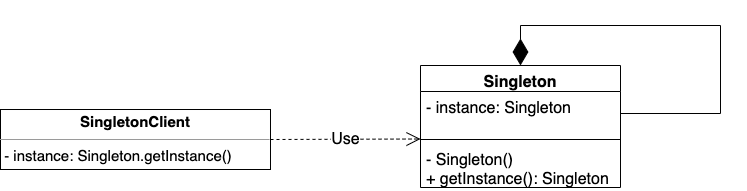

# Паттерны проектирования

Тема паттернов (шаблонов) проектирования уже не единожды поднималась в пределах курса - от определения данного термина
до разбора отдельных паттернов и зоны их применения.

Однако классификация паттернов и некоторые иные общие моменты до сих пор не были рассмотрены. Именно этому и 
посвящена текущая статья.

При этом сегодня мы не будем подробно разбирать популярные паттерны, кроме как в демонстрационных целях. В основном 
потому что это редко имеет смысл для новичков, кроме ситуаций, когда паттерн описывается вместе с конкретной 
прикладной проблемой, которую решает.

## Назначение паттернов проектирования

Как было упомянуто в одной из более старых
[статей](https://telegra.ph/Nemnogo-o-Stream-API-I-mnogo-o-smezhnoj-terminologii-02-24), паттерн проектирования (или 
design pattern) - общая схема решения часто возникающей проблемы проектирования.

Из определения следует и актуальность паттернов. В разработке существует достаточно большое число независимых от 
прикладной области системы технических проблем реализации, решение которых укладывается в достаточно общие схемы. 
Описание схемы решения конкретной проблемы и представляет собой паттерн проектирования.

Эта концепция позволяет избегать велосипедов в проектировании - если мы можем нашу частную проблему определить как 
некую типовую - можно сэкономить время на проектировании решения и использовать шаблон, который эту проблему решает. 
Зачастую это чревато переусложнением системы (помним о KISS), когда в частном случае проблема менее комплексная, чем 
описанная в паттерне. В таком случае применение паттерна может привести к overengineering'у и избыточно 
универсальному решению. Именно из-за этого многие критикуют использование шаблонов проектирования новичками - 
желание сделать "по учебнику" приводит к избыточной сложности решения.

Однако хорошее владение паттернами проектирование и навык эффективного их применения экономит как человекочасы на
разработку решения, так и упрощает аргументацию этого решения. Традиционно приводя к другой проблеме в сильных 
командах - выбору одного из нескольких паттернов, решающих одну и ту же проблему, в силу пристрастий конкретных 
членов команд и неприятия альтернативного мнения:)

Также напомню, что большинство традиционных паттернов проектирования (исключая часть архитектурных паттернов) обычно 
легче описать UML-диаграммой, нежели словесно или кодом/псевдокодом. От текстового сопровождения можно избавиться не 
всегда, но UML позволяет опустить как синтаксическую составляющую языка программирования, не критичную при описании
паттерна, так и избавиться от придумывания предметной области для демонстрации паттерна, оперируя лишь абстрактными
сущностями, описывающими те или иные составляющие шаблона. Что как минимум полезно для лаконичного представления 
паттерна в формате конспекта.

Например, так выглядит UML-диаграмма для паттерна
[Singleton](https://ru.wikipedia.org/wiki/%D0%9E%D0%B4%D0%B8%D0%BD%D0%BE%D1%87%D0%BA%D0%B0_(%D1%88%D0%B0%D0%B1%D0%BB%D0%BE%D0%BD_%D0%BF%D1%80%D0%BE%D0%B5%D0%BA%D1%82%D0%B8%D1%80%D0%BE%D0%B2%D0%B0%D0%BD%D0%B8%D1%8F)):

Здесь нам не нужно придумывать, ни то, что делает класс, который мы планируем сделать синглтоном, ни кто будет 
использовать этот класс. Не нужно описывать кодом реализацию конструктора и порождающего метода `getInstance()`. При 
условии, что проблематика известна читателю, достаточно лишь схематично указать, что есть некий класс (`Singleton`), 
которому мы определяем приватное поле того же типа (тем самым класс сам с собой вступает в отношение композиции), 
приватный конструктор и публичный метод `getInstance()`, возвращающий объект `Singleton` (вероятно, именно этот 
объект и записан в после `instance`). А также есть некий другой класс-клиент (или множество таких классов), который 
имеет поле типа `Singleton` и его инициализацию через вызов `Singleton.getInstance()`.

> Что забавно, синглтон в описанном выше виде уже долгое время является скорее антипаттерном (подробнее - ниже) и 
> вытеснен иными паттернами калибра - Inversion of Control (IoC) или иными. В них зачастую сохраняется сама 
> концепция объектов-синглтонов, но управляющая роль и непосредственное создание объектов (как и инициализация ими 
> других объектов - клиентов в схеме выше) делегируется некой центральной сущности-контексту. В случае с IoC -
> IoC-контейнеру.
> 
> Намного более подробно эту тему мы будем разбирать при знакомстве со Spring Framework.

Также стоит отметить, что некоторые паттерны могут казаться синтетическими - надстроенными поверх других паттернов 
или же являющимися переработкой других паттернов с сохранением их схемы, но вложением в эту схему иного смысла. В 
результате чего весьма похожие в части отношений между объектами конструкции имеют разные названия и решают разные 
проблемы. Популярный пример последнего - паттерны стратегия и состояние.

В силу этого, а также из-за очевидности некоторых паттернов, зачастую можно видеть, что опытные разработчики не 
задумываются над осознанным выделением паттерна или его именованием, а просто применяют его. При этом вполне 
вероятна ситуация, когда разработчик вообще не знает, что у применяемого им паттерна (или его кастомизации) есть 
название и он уже был описан лет 30 назад. 

Если хочется углубиться в тему паттернов самостоятельно, классическая рекомендация - банда четырех (Gang of Four, 
GoF) и их книга "Design Patterns: Elements of Reusable Object-Oriented Software". Далеко не все из существующих 
паттернов описаны ими и не все из описанных популярны в современной разработке (книга издана в 1994), но это может 
быть хорошей отправной точкой для теоретического погружения в тему.

## Классификация

Паттерны проектирования можно разбить на группы по их назначению. В классическом представлении группы три (выделены 
как раз бандой четырех) - порождающие, структурные и поведенческие. Но в силу того, что не все паттерны можно 
уложить в эти три группы, также выделяются и более специфические. В данной статье отдельно вынесены архитектурные 
паттерны, а также антипаттерны - совокупности распространенных решений, которые считаются некорректными. 

### Порождающие паттерны

Порождающие паттерны - паттерны, которые описывают процесс создания и конфигурации отдельных объектов или иерархий 
объектов для ситуаций, когда обычный публичный конструктор является недостаточным решением.

Примеры наиболее популярных порождающих паттернов:

1. Singleton. Разобран выше. На русский традиционно переводится как "одиночка", но фактически это название не 
   используется;
2. Factory method (фабричный метод). Примером реализации может служить знакомый нам по JPA `EntityManagerFactory` и 
   его реализации в различных persistence provider'ах. 
3. Abstract factory (абстрактная фабрика). Примером абстрактной фабрики в некотором отношении можно считать 
    `Connection` в JDBC - он предоставляет порождающие методы для различных типов интерфейсов-statement'ов, при этом сам
   является интерфейсом;
4. Builder. Русское название "строитель" фактически не используется. Паттерн в классическом представлении 
   используется для иерархий объектов, но чаще можно встретить упрощенную реализацию для объекта вне иерархии. В 
   упрощенном виде знаком нам по `FluentConfiguration` во Flyway и `Configuration` в Hibernate.

### Структурные паттерны

Структурные паттерны - паттерны, описывающие построение структур из нескольких классов или иерархий классов, 
позволяющих облегчить разработку или расширение программы через возможности наследования, агрегации и композиции.

Примеры структурных паттернов:

1. Proxy. В русском переводе - "заместитель", но обычно используется название "прокси". Известным нам примером можно 
   считать `HikariProxyConnection` в HikariCP, который добавляет некоторую собственную логику к методам `Connection` 
   (из JDBC), но основную работу делегирует имплементации `Connection` в драйвере для конкретной СУБД;
2. Decorator (он же Wrapper), в русском переводе - декоратор, реже - обертка. Не стоит путать с классами-обертками 
   для примитивов - несмотря на название, едва ли это можно считать реализацией данного паттерна. Крайне схож с 
   прокси в части структуры, но имеет иное назначение. Фактически это выражается в том, что прокси-класс берет на себя
   управляющую роль по отношению к управляемому объекту, в то время как конфигурация и управление в декораторе лежит 
   на классе-клиенте. Примером можно считать `ServletRequestWrapper` и другие интерфейсы-wrapper'ы в Servlet API;
3. Composite. По-русски - компоновщик, но на практике такой термин не используется. Пример из знакомых нам библиотек 
   привести сложно, но часто применяется в различных парсерах. В демонстрационных целях был реализован в разрборе 
   одной из практических задач:
   [ссылка](https://github.com/KFalcon2022/practical-tasks/blob/master/src/com/walking/lesson30_regex/task4/Main.java);
4. Facade (фасад). Достаточно простой по своей идее паттерн, базирующийся на идее предоставления более простого 
   API для класса (нескольких классов или целой библиотеки) с собственным сложным API. Не самым лучшим, но известным 
   нам примером можно считать SLF4J как общий фасад для множества различных логгеров;
5. Adapter (адаптер). Паттерн, целью которого является реализация возможности к взаимодействию объектов с изначально 
   несовместимым API. В чистом виде нам, вероятно, не встречался, но хорошо известен Android-разработчикам на Java и 
   Kotlin, поскольку реализован в Android SDK.

### Поведенческие паттерны

Поведенческие паттерны - паттерны, описывающие построение эффективной и гибкой коммуникации между объектами.

1. Chain of responsibility (Цепочка обязанностей). Реализация набора обработчиков для объектов по принципу 
   "обработай сам или передай следующему". Знаком нам по цепочке фильтров в Servlet API, был разобран в 
   соответствующем разделе;
2. Observer (наблюдатель). Был разобран в разделе, посвященном Servlet API. В самом Servlet API взаимодействие с ним 
   возможно через определение собственных слушателей для различных событий;
3. Command (команда). Достаточно сложный паттерн, который не встречался нам на практике, но является одним из 
   классических изучаемых поведенческих паттернов. А еще он просто грациозен как по себе:) Подробные разборы легко 
   гуглятся по названию;
4. Strategy (стратегия). Достаточно простой паттерн, предназначенный для реализации нескольких альтернативных 
   взаимозаменяемых алгоритмов. Применение паттерна также широкое, как в библиотечных компонентах, так и в 
   прикладном коде. Например, на базе этого паттерна в Hibernate реализованы стратегии генерации id для JPA Entity. 
   Реализация через аннотации не самая простая синтаксически, но поведенчески она мало чем отличается от более 
   каноничных. Простейшую, даже утрированную, реализацию стратегии в практических задачах курса можно найти здесь: 
   [ссылка](https://github.com/KFalcon2022/practical-tasks/blob/master/src/com/walking/lesson16_abstract_class_interface/task2/Main.java);
5. State (состояние). Похожий на стратегию в части реализации паттерн. Обычно используется для реализации перехода 
   состояний в любой статусной модели - от достаточно наивных самописных реализаций до библиотек и фреймворков, 
   предоставляющих state machine'ы (машины состояний). Теоретически базируется на идее конечных автоматов. 
   Хрестоматийный пример - некий документ в системе документооборота, имеющий различные статусы и правила перехода 
   между ними: "черновик", "на утверждении", "утвержден", "устарел" и т.д.;
6. Template method (шаблонный метод). Еще один несложный, но достаточно популярный паттерн. Базируется на наличии 
   некоторого абстрактного класса, у которого описано основное поведение, но не определена часть логики, выделенная 
   в абстрактные методы (в Java - часто protected-методы) и вызываемая из ключевых методов класса. Задача 
   наследников - определить поведение абстрактных методов, не меняя публичный API. Не встречался нам на практике, но 
   широко используется для самых различных прикладных задач;
7. Visitor (посетитель, русское название обычно не используется). Еще один сложный, но часто рекомендуемый для 
   изучения новичками паттерн. Что характерно, достаточно редко применяемый на практике. В статье разобран не будет, 
   поскольку достаточно громоздкий как в проблематике, так и в реализации. Также, как и команда, легко гуглится по 
   названию;
8. Iterator (Итератор). Паттерн, отделяющий реализацию перебора элементов контейнера от непосредственного контейнера 
   или иерархии контейнеров. Классический для Java пример - `Iterable` его реализации в различных коллекциях 
   Java Collection Framework. Именно в этом случае итераторы и контейнеры не разделены, но позволяют донести общую 
   идею - перебор элементов у разных контейнеров может иметь различную специфику из-за их внутреннего устройства, в 
   результате чего для разных контейнеров проблематично реализовать перебор через один и тот же итератор. 

### Архитектурные паттерны

Архитектурные паттерны - большая группа паттернов, в которую, в зависимости от автора и контекста применения термина,
включаются как подходы к коммуникации между системами, так и способы построения архитектуры системы в целом или 
отдельных компонентов. Также сюда часто включают решение отдельных проблем коммуникации между архитектурными слоями.

Группа может показаться излишне обширной в силу того, что сам термин "архитектура" - весьма широк и может иметь 
различное значение, в зависимости от контекста. Поэтому в различных классификациях паттерны этой группы могут 
относить к различным группам.

Сами архитектурные паттерны зачастую объемны в своем описании, поэтому примеры будут весьма тезисными. Число 
популярных паттернов также велико, поэтому ниже представлены скорее отдельные примеры того, что может называться 
архитектурным паттерном в различных контекстах:

- Saga (сага). Классический архитектурный паттерн, описывающий коммуникацию в цепочке различных подсистем в 
  пределах глобального бизнес-процесса продукта или экосистемы, а также обработку отказов на одном из шагов 
  коммуникации.  Актуален в первую очередь в микросервисной архитектуре и призван решить те же проблемы, которые в
  пределах одной системы (или подсистемы) может решаться атомарностью транзакции;
- MVC (Model-View-Controller). Еще один классически архитектурный паттерн, имеющий множество кастомизаций (MVP, MVVM 
  и др.). Описывает подход к разделению данных и управляющей данными логики в пределах одной системы через выделение 
  трех компонентов - модели, представления (View) и контроллера. В современной Backend-разработке на Java стал 
  практически не актуален с развитием Front-end разработки. Но именно ему обязан своим названием и частью 
  механизмов Spring MVC, который мы будем изучать в дальнейшем.
  -DAO (Data Access Object) и Repository. Два конкурирующих паттерна, описывающих подходы к реализации слоя доступа 
  к данным - обычно в контексте коммуникации с БД;
- DTO (Data Transfer Object). Достаточно простой в своей идее паттерн, описывающий создание классов-моделей с 
  состоянием, но без поведения, для передачи данных между архитектурными слоями приложения или между различными 
  приложениями. Широко используется для передачи данных как в пределах одного приложения, так и по сети. В частности,
  для описания тел запроса и ответа при HTTP-коммуникации с использованием более высокоуровневых подходов, нежели 
  Servlet API. Например, при реализации REST API с помощью Spring MVC;
- ORM (Object-Relational Mapping). Знакомый нам по JPA архитектурный паттерн, описывающий подход к коммуникации с 
  реляционными СУБД в приложениях, написанных с использованием ООП, через введение виртуальной объектной базы данных;
- IoC (Inversion of Control, инверсия управления). Архитектурный паттерн, призванный уменьшить связность кода и 
  описывающий подход к построению приложения через делегацию управляющих функций фреймворку. В узком смысле речь 
  обычно идет о делегировании создания и инициализации объектов классов бизнес-логики, в более широком - о 
  делегировании управления всем жизненным циклом приложения. Намного более подробно с IoC и его реализациями мы 
  будем знакомиться при изучении Spring - именно инверсия управления является основной задачей данного фреймворка.

Как видите, архитектурные паттерны могут относиться к совершенно разным уровням проектирования - от отдельных 
проблем коммуникации внутри одного приложения до подходов к реализации конкретных архитектурных слоев приложения и 
коммуникации между различными приложениями. 

### Антипаттерны

Отдельная группа спецификации - антипаттерны. Подходы или, чаще, проблемы в написании кода или реализации 
информационных систем, которые необходимо избегать. Если паттерны обычно содержат в себе проблематику или 
потенциальные проблемы и скелет ее программного решения, то антипаттерны описывают уже сложившуюся проблему и 
весьма общие рекомендации по ее решению вроде рефакторинга кода (или отдельных подходов к рефакторингу) или ссылок 
на паттерны.

Также к антипаттернам иногда относят паттерны, потерявшие свою актуальность, что регулярно становится поводом для 
холиваров.

Примеры:
- God Object (божественный объект). Описывает существование некого центрального объекта в системе (или части системы),
  который обладает избыточно широким набором функциональности. Зачастую это также приводит к тому, что слишком много 
  других объектов имеют зависимость от такого излишне крупного объекта. Часто является последствием нарушения single 
  responsibility principle (S в SOLID). Решение лежит в плоскости рефакторинга и декомпозции большого класса на 
  несколько более маленьких, а также изменения цепочек коммуникации между другими объектами системы с целью снижения 
  роли декомпозируемого god object;
- Spaghetti code (спаггети-код, индусский код). Наиболее известный антипаттерн, актуальный для любой парадигмы 
  программирования. Описывает собой плохоструктурированную и излишне запутанную систему, которая крайне тяжела для 
  изучения и поддержке. Изначально термин применялся к злоупотреблению оператором `goto` (в Java зарезервирован, но 
  не реализован. Видимо, от большой любви к его функциональности в C/C++), из-за которого может крайне усложняться 
  понимание алгоритма. Рекомендации к исправлению зависят от конкретного языка программирования, но в целом 
  варьируются от рефакторинга до использования огнемета и переписывания системы с нуля; 
- Magic value (магическое или волшебное значение). Еще один антипаттерн, мало привязанный к парадигме программирования. 
  Означает использование в коде не описанных и недокументированных значений - коэффициентов или иных литералов.
  Стандартная рекомендация - вынесение таких значений в константы и качественное документирование. При этом стоит 
  понимать, что не любой литерал вне константы стоит считать магическим. Скажем, инициализация итератора цикла с 
  нуля (`int i = 0`) в большинстве случаев очевидна и не требует дополнительного выделения значения в константу;
- Singleton. Как было описано выше, в ряде случае паттерн singleton критикуют и относят к антипаттернам. Контекст 
  критики может быть различным - от неуместного использования в конкретных ситуациях до критики непосредственно 
  наивных реализаций вручную (описана в начале статьи) вместо использования более высокоуровневых инструментов (в 
  частности, IoC) и сложностей с unit-тестированием таких наивных реализаций (классическая реализация предполагает
  приватный конструктор); 
- Anemic domain model (анемичная доменная модель). Описывает подход к проектированию системы, при котором доменные 
  объекты-модели не обладают никакой функциональностью, кроме геттеров и сеттеров, а бизнес-логика выносится в 
  отдельные классы логики вроде сервисов. Юмор ситуации в том, что в многих языках, включая Java, этот подход весьма 
  распространен и зачастую является вариантом построения системы по умолчанию. Эту же модель вы можете видеть в 
  разборе многих практических заданий в курсе именно по причине ее популярности в Java. Однако многие архитектурные 
  подходы (в частности, DDD - domain driven development) выступают против такого подхода, что, в целом, логично с 
  точки зрения ООП - ведь объект декларируется как инкапсуляция информации представления сущности реального мира 
  (данных сущности в виде полей) и ее функциональности (в виде методов) в одной программной сущности.   

Подводя итог, антипаттерны - большая группа антирекомендаций к разработке совершенно различных масштабов. При этом 
многие из антипаттернов могут быть спорными в зависимости от конкретного языка программирования или контекста 
обсуждения.

#### На сегодня все!

> Если что-то непонятно или не получается – welcome в комменты к посту или в лс:)
>
> Канал: https://t.me/ViamSupervadetVadens
>
> Мой тг: https://t.me/ironicMotherfucker
>
> **Дорогу осилит идущий!**
