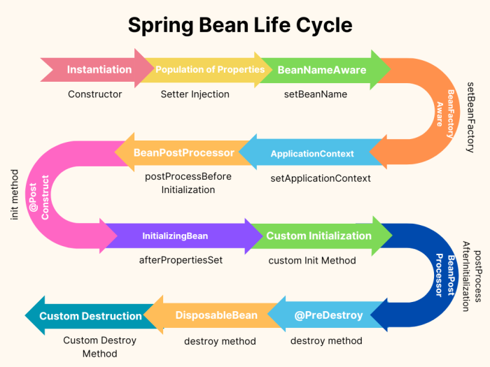

# Инициализация контекста Spring. Жизненный цикл bean'а

Сегодня постараемся рассмотреть две разные, но связанные темы: инициализация контекста (иными словами - 
IoC-контейнера) и жизненный цикл Spring bean'а.

Данные темы близки по двум причинам:

1. Конфигурация и создание бинов - большая и наиболее сложная часть их жизненного цикла. При этом чаще всего 
   создание бина будет частью инициализации IoC-контейнера. Существует достаточно ситуаций, когда это не так, но 
   такие сценарии обычно составляют проценты или доли процента от общей массы бинов, создаваемых приложением;
2. Для ряда операций можно провести явную параллель - они так или иначе проявляют себя и при инициализации 
   IoC-контейнера, так и при инициализации конкретного бина. Может звучать непонятно, но при фактическом разборе это 
   станет более очевидным.

Что до содержимого статьи в целом - оно во многом будет носить справочный характер. С одной стороны, нельзя совсем 
не затрагивать темы инициализации и жизненного цикла - они позволяют лучше понять реализацию IoC в Spring, 
характерные особенности, возможности и ограничения данной реализации. Кроме того, некоторые шаги имеют прикладную 
ценность - при знакомстве с ними будем разбирать примеры их использования. С другой стороны, большая часть и 
процесса инициализации контекста, и жизненного цикла бина - внутренняя кухня самого Spring. И ее понимание опытным 
разработчиком достаточно важно - без этого не сформируется комплексное представление о фреймворке. Однако для 
начинающих специалистов такая информация имеет сомнительную ценность и часто воспринимается скучной бесполезной 
теорией, не имеющей отношения к решению реальных задач.

В статье постараемся найти золотую середину и сделать акценты на действительно важные вещи, лишь тезисно обозначив 
все остальное.

## Инициализация контекста приложения

Сначала постараемся разобраться с тем, что происходит на старте Spring-приложения. В рассматриваемом ранее коде 
стартом можно считать момент создания контекста:

```java
ApplicationContext applicationContext = new AnnotationConfigApplicationContext("com.walking.springsample");
```

В разрезе данного пункта постараемся следовать общей логике инициализации - она будет более-менее для любого типа 
конфигурации и любого типа приложения. Там, где подобная специфика будет критична - рассматривать ее будем с точки 
зрения приложения, сконфигурированного через аннотации.

### Создание контекста

В принципе, данный пункт можно свести к явному созданию объекта `ApplicationContext`. Мы уже сталкивались с
`AnnotationConfigApplicationContext`, в одной из ближайших статей затронем альтернативные реализации. Но в 
глобальном смысле разница невелика.

В зависимости от реализации и выбора конкретного конструктора у этой реализации, создание контекста может как 
ограничиться созданием соответствующего Java-объекта, так и включать в себя определенные дополнительные действия - 
мы их будем рассматривать ниже.

Такие действия относятся либо к конфигурации и позволяют сообщить контексту какую-то важную информацию - примеры 
описаны в подпунктах ниже, либо запускают процесс его непосредственной инициализации (или перезагрузки, если реализация
позволяет подобное).

### Сканирование и регистрация конфигурации

Первое, что необходимо сообщить контексту - откуда ему начать получение конфигурации. Для приложений, конфигурируемых 
через XML, это обычно путь к файлу конфигурации.

Для более актуальной нам конфигурации через аннотации, можно выделить два основных способа:

1. `register()`. Метод `AnnotationConfigApplicationContext`, который принимает на вход массив объектов типа `Class`. 
   В общем, ожидается, что эти объекты будут помечены любой аннотацией компонента (`@Component`, `@Service`, 
   `@Configuration` и т.д.), однако на практике обычно используется для передачи именно классов конфигурации - это 
   банально логичнее;
2. `scan()`. Метод того же класса, позволяющий передать массив строк, где каждая строка - имя пакета для 
   сканирования. Spring самостоятельно перепроверит все классы в указанных пакетах (включая подпакеты*) на наличие в 
   них компонентов. И если найдет - запустит процесс их инициализации.

> *Тут стоит сделать небольшую ремарку. В Java отсутствует понятие подпакета - `com.package.a` и 
> `com.package.a.subpackage` являются разными пакетами, никак не связанными между собой. Это легко 
> проверить с помощью модификаторов доступа `protected` и `package-private`.
> 
> Однако Spring имеет свою точку зрения по данному вопросу и позволяет оперировать "вложенными пакетами". Фактически 
> это означает, что в пределах своих собственных механизмов он считает условный `com.package.a.subpackage` 
> вложенным пакетом `com.package.a`. Это будет актуально для сканирования компонентов, поиска ресурсов и некоторых 
> других операций.

Оба подхода - регистрация компонентов и сканирование (более корректным будет назвать его **Component Scan** - именно 
это обозначение вы будете слышать чаще всего) часто используются совместно.

Зарегистрировать класс или указать пакет для сканирования можно несколькими способами:

- Методы `AnnotationConfigApplicationContext` - упомянутые ранее `register()` и `scan()`;
- Конструкторы `AnnotationConfigApplicationContext`. Мы уже ранее использовали конструктор, принимающий на вход 
  пакеты - в своей внутренней логике такой конструктор передаст полученные пакеты методу `scan()`. Существует и 
  схожий конструктор, принимающий классы-компоненты - далее он неявно делегирует их `register()`. Такие конструкторы 
  удобны для примеров или простых учебных проектов - они не только регистрируют нужные компоненты/пакеты, но и 
  запускают процесс инициализации контекста. В иных случаях это приходится делать явно;
- Основной способ работы с component scan - аннотация `@ComponentScan`. Располагается над классом, позволяет более 
  широко работать с настройками сканируемых пакетов: передавать их строками (как в ранее указанных способах), классами
  (у каждого переданного класса будет выделен пакет, в котором он находится, и просканирован), дополнительно
  отфильтровать сканируемые классы по дополнительным параметрам и ряд других настроек.

Довольно распространенный сценарий использования - аннотировать класс конфигурации `@ComponentScan` и 
зарегистрировать сам класс в контексте:

```java
@Configuration
// При сканировании текущего класса Spring увидит, что надо просканировать
// весь пакет "com.walking.springsample" и его подпакеты
@ComponentScan("com.walking.springsample")
public class MyConfiguration {
}

public class Main {
   public static void main(String[] args) {
      var applicationContext = new AnnotationConfigApplicationContext();
      // Сообщаем Spring о самом классе MyConfiguration
      applicationContext.register(MyConfiguration.class);
      applicationContext.refresh(); // Явно (пере-)запускаем контекст. Подробнее рассмотрим чуть позже
   }
}
```

Сильно углубляться в состав атрибутов `@ComponentScan` на данном этапе не будем - чаще всего используется лишь 
вариант передачи пакета(-ов) как строк, если пределах курса потребуется более тонкая настройка - рассмотрим отдельно. 

Необходимо отметить еще несколько важных на практике моментов.

Сама идея сканирования компонентов для нас важна по нескольким причинам:

1. Это позволяет построить процесс гибче, чем любая статическая конфигурация. Полагаю, довольно очевидно удобство 
   подхода, когда можно указать один или несколько пакетов (внутри классов которых могут быть указания на 
   сканирование других пакетов) вместо поклассового перечисления всех нужных компонентов в конфигурации - как это 
   было, скажем, с Entity-классами в JPA;
2. Данный подход все еще позволяет явно указывать, откуда именно мы хотим получать компоненты и, как следствие, бины.
   Технически ведь можно было давать Spring сканировать вообще весь classpath и создавать бины по всем компонентам, 
   которые обнаружит. Но такой подход имел бы очевидный недостаток - теоретически в нашем приложении может быть 
   подключена библиотека, совместимая со Spring - с классами, помеченными как компоненты и прочими атрибутами. Но мы 
   вполне можем не знать об этом или по каким-то своим причинам не желать ее использования через механизмы Spring. 
   Явное перечисление пакетов для сканирования - способ избежать нежелательных бинов в контексте. Реальные ситуации, 
   когда этот механизм полезен, чуть тоньше, нежели описанный выше пример. Но общая идея будет той же. 

Наконец, кажется важным отметить некую рекурсивность процесса сканирования: при обработке (сканировании) одного 
пакета может встретиться конфигурация с указанием сканирования другого пакета, оттуда - третьего и так далее. 

### BeanDefinition

Переходим к следующему этапу инициализации контекста - формированию объектов `BeanDefinition`. Сначала стоит 
выяснить, что это такое.

`BeanDefinition` - это интерфейс, предоставляющий API для работы с метаданными будущего бина. Сюда входит имя класса,
правила инициализации (с ними постепенно будем знакомиться позже), список параметров конструктора (единственного или 
же помеченного `@Autowired`) и ряд других характеристик.

Работать с `BeanDefinition` напрямую обычно не требуется - чаще всего этот интерфейс используется самим Spring в 
своих внутренних задачах. В этом он сильно напоминает JPA Metamodel - логика примерно та же.

Также очевидно, что на данном этапе мы не слишком близко знакомы со Spring и не знаем ряда его базовых механик. По 
совокупности причин, углубляться в API `BeanDefinition` кажется преждевременным - могу лишь посоветовать посмотреть 
исходный код интерфейса после завершения подраздела. К тому моменту более половины методов должны быть понятны.

Spring может формировать `BeanDefinition` на основании различных источников - через различные подходы к конфигурации.
Если конфигурация будет происходить через XML - Spring будет парсить XML-файл, на основании определенных тегов и их 
аргументов получать информацию о том, какие бины должны быть созданы, какие им требуются зависимости, какие 
дополнительные методы надо вызывать при инициализации и т.д. При конфигурации через аннотации - Spring будет 
рефлексивно анализировать класс-компонент (или содержимое аннотации `@Bean` над методом), учитывать его конструктор 
и аннотации - в конце концов сформирует примерно тот же набор данных, которые в предыдущем случае получил из XML и 
также упакует их в `BeanDefinition`.

Объекты `BeanDefinition` создаются при регистрации компонентов или же в процессе component scan. Далее они 
помещаются в хранилище - `BeanDefinitionRegistry`. Этот интерфейс реализует большинство имплементаций
`ApplicationContext`, но фактическим хранилищем таких объектов обычно выступает класс `DefaultListableBeanFactory`. 
Он же чаще всего считается и хранилищем bean'ов, но на самом деле все еще сложнее:)

В зависимости от способа конфигурации, задача формирования `BeanDefinition` и помещения их в хранилище будет 
ложиться на различные интерфейсы или классы. Традиционно это считается зоной ответственности реализаций 
`BeanDefinitionReader`, однако при конфигурации через аннотации отвечать за это будут чуть другие классы - 
`AnnotatedBeanDefinitionReader` (не является потомком `BeanDefinitionReader`) и `ClassPathBeanDefinitionScanner`.

> Я не думаю, что в ближайшем будущем вам действительно пригодится информации о классах, создающих объекты 
> `BeanDefinition`. Однако большинство источников по процессу инициализации контекста будут описывать этот момент и 
> указывать именно на `BeanDefinitionReader`. Что, в свою очередь, разойдется с вашими личными наблюдениями, если вы 
> решите посмотреть исходный код `AnnotationConfigApplicationContext`.
> 
> Лишь этот факт и ненулевая вероятность встретить вопросы по инициализации контекста на собеседовании заставили 
> меня погрузиться в такие детали:)

На данном этапе важно понять, что процесс получения `BeanDefinition` - часть рекурсивного процесса сканирования, 
упомянутого ранее. Работает это примерно так:

1. Spring получает классы-компоненты - через регистрацию этих компонентов или же через сканирование пакетов;
2. Создает `BeanDefinition` для данных компонентов. Для большинства компонентов все тривиально - на один 
   класс-компонент создается один объект `BeanDefinition`. В случае класса конфигурации логика ровно та же, но стоит 
   обозначить явно: будет создан объект `BeanDefinition` для класса конфигурации. Именно для класса конфигурации, но не
   для его `@Bean`-методов или чего-то еще*;
3. Анализирует наличие аннотаций `@Bean`, `@ComponentScan` и ряда других. В первую очередь это актуально для классов 
   конфигурации, но применимо к любому компоненту;
4. Для `@Bean`-методов запускает формирование собственных объектов `BeanDefinition`;
5. Для `@ComponentScan` - запускает сканирование новых пакетов (если указанные не были просканированы ранее), что 
   фактически приводит нас в п.1 этого списка;
6. В оставшихся случаях поведение будет соответствовать семантике конкретных аннотаций, но глобально они все 
   укладываются в диапазон возможным действий между пунктами 5-6.

> *История с разделением классов конфигурации и содержащихся в них `@Bean`-методов - достаточно важный момент. 
> Интуитивно кажется, что они близко связаны, однако для внутренних процессов Spring это не совсем так. Из-за чего 
> могут возникать различные казусы инициализации при наличии конфликтующих конфигураций и другие забавные моменты.
> 
> Скорее всего, в реальных условиях вы с этим столкнетесь относительно нескоро. И теоретический базис пока не 
> позволяет лаконично описать потенциальные проблемы. Но основной тезис можно запомнить уже сейчас: порядок
> инициализации классов конфигурации не имеет прямого влияния на порядок обработки `@Bean`-методов этих классов. 

В общем случае, к завершению данного этапа будут сформированы объекты `BeanDefinition` для всех будущих бинов 
приложения.

### Запуск контекста

В ранее рассмотренном примере:

```java
public class Main {
   public static void main(String[] args) {
      var applicationContext = new AnnotationConfigApplicationContext();
      applicationContext.register(MyConfiguration.class);
      applicationContext.refresh();
   }
}
```

Был вызов незнакомого нам метода `refresh()`. Он объявлен в `ConfigurableApplicationContext` и доступен для абсолютного 
большинства реализаций `ApplicationContext`. Его задача - запуск (или перезапуск) IoC-контейнера.

Функциональность данного метода заключается в том, чтобы корректно завершить работу существующего IoC-контейнера 
(включая уничтожение существующих бинов, рассмотренное ниже), а затем запустить все заново.

Такой подход полезен с той точки зрения, что позволяет заменить некую удаленную конфигурацию или еще какие-то 
особенности запуска и быстро перезапустить именно IoC-контейнер, не перезапуская Java-приложение целиком. Однако не 
все реализации `ApplicationContext` поддерживают именно механизм перезапуска (спойлер: 
`AnnotationConfigApplicationContext` не поддерживает).

В остальном `refresh()` можно рассматривать как метод запуска. И тут кроется наиболее важный для нас момент.

До вызова `refresh()`, инициализация `ApplicationContext` происходит крайне ограничено - `BeanDefinition` формируется
лишь у классов, которые либо были явно зарегистрированы, либо находились в явно указанных к сканированию пакетах. Иными
словами, выполнятся лишь пункты 1-2 из списка выше.

Весь дальнейший анализ, сканирование пакетов, указанных через `@ComponentScan`, создание `BeanDefinition` для 
`@Bean`-методов и прочее - вплоть до фактического создания bean'ов - произойдет лишь после вызова `refresh()`.

Таким образом сюда попадают все шаги, начиная с п.3 в списке выше, и до пункта "Уничтожение bean'а" данной статьи. В 
целом, уничтожение бинов тоже связано с `refresh()`, но будет происходить до инициализации контекста.

### BeanFactoryPostProcessor

Следующий шаг - применение post processor'ов к объектам `BeanDefinition`.

**Post processor** (постпроцессор) - это достаточно широкий термин для обозначения промежуточных обработчиков 
каких-либо данных. Spring обозначает понятием постпроцессора несколько различных интерфейсов, привязанных к тем или 
иным этапам жизненного цикла контекста или бина.

Именно `BeanFactoryPostProcessor` (и ее реализации) срабатывают после того как были сформированы все объекты 
`BeanDefinition` и позволяют изменять или заменять их в соответствии со своей внутренней логикой.

Фактически, все поведение классической реализации `BeanFactoryPostProcessor` будет описано в методе 
`postProcessBeanFactory()`. При необходимости мы можем создавать собственные реализации - они также будут вызываться 
Spring'ом в процессе инициализации, если будут определены как компоненты.

На практике редко приходится сталкиваться с `BeanFactoryPostProcessor` явно или тем более писать свои реализации 
этого интерфейса - он достаточно низкоуровневый по меркам Spring. Однако как минимум один пример его реализации 
стоит привести.

#### Пример

Spring позволяет привязывать поля, а также параметры конструкторов и некоторых методов к определенным параметрам 
конфигурации. То есть можно определить некий конфиг-файл (`*.xml`, `*.properties`, `*.yml` - не суть важно), в 
котором по каким-то ключам будут доступны какие-то значения. История для нас не новая - этот подход применяется 
во многих библиотеках и фреймворках. Собственно, Spring позволяет привязать значение определенного параметра из такого 
файла конфигурации к, скажем, полю класса. В таком случае на этапе написания кода мне достаточно указать ключ 
конфигурации, а во время выполнения Spring прочитает файл конфигурации, возьмет значение по ключу и инициирует им 
мое поле.

Функциональность очень полезная. Но Spring вынужден ее как-то реализовывать. Для этого он использует класс
`PropertySourcesPlaceholderConfigurer`. Он является наследником `BeanFactoryPostProcessor` и его роль сводится к 
тому, чтобы получить информацию об известных свойствах конфигурации, перепроверить все `BeanDefinition` и при 
необходимости заменить в этих объектах ссылки на свойство конфигурации по ключу соответствующим значением.

В одной из ближайших статей мы рассмотрим эту функциональность с прикладной точки зрения. Пока же она будет лишь 
демонстрацией возможностей `BeanFactoryPostProcessor`.

> **!NB**: Стоит помнить, что Spring - фреймворк с длинной историей и в его внутренностях накопилось достаточно 
> костылей. Учитывайте это при самостоятельном изучении тех или иных инструментов через исходники.
> 
> Думаю, подтверждение этой мысли вы найдете как только постараетесь рассмотреть самостоятельно иерархию 
> `BeanFactory`, однако наглядный пример есть и среди реализаций `BeanFactoryPostProcessor`.
> 
> Так, скажем, существует класс `ConfigurationClassPostProcessor`. Когда-то он был полноценной имплементацией 
> `BeanFactoryPostProcessor`. Более того - формально он и сейчас реализует данный интерфейс. Однако фактически не 
> совершает никакой полезной работы через `postProcessBeanFactory()`. Более того, он работает значительно раньше, 
> чем Spring производит запуск `BeanFactoryPostProcessor`'ов. Ведь именно `ConfigurationClassPostProcessor` 
> анализирует `BeanDefinition` классов-конфигураций и запускает рекурсивный процесс сканирования и создания новых 
> `BeanDefinition`, который мы рассматривали выше.
> 
> Таких примеров довольно много - конкретные операции (и классы, которые их обеспечивают) могут постепенно 
> сдвигаться на этапы выполнения, отличные от изначально задуманных. При этом в большинстве случаев Spring 
> постарается соблюсти обратную совместимость в том или ином виде и не станет полностью ломать существующие 
> иерархические цепочки.
> 
> Поэтому при необходимости глубоко погрузиться в конкретный инструмент всегда учитывайте рассматриваемую версию 
> фреймворка, учитывайте документацию именно этой версии и, если погружаетесь в исходный код - смотрите на 
> фактические реализации, не доверяйте контракту вслепую.

### Регистрация BeanPostProcessor'ов

Фактически мы подбираемся к завершению процесса инициализации контекста.

Одним из последних шагов является создание бинов, реализующих `BeanPostProcessor`. 

`BeanPostProcessor` - еще один интерфейс-постпроцессор. Но в отличие от `BeanFactoryPostProcessor`, его зона 
ответственности - несколько шагов из цикла инициализации бинов. Соответственно, вызываться такие постпроцессоры 
будут когда объекты бинов уже созданы.

Собственно, `BeanPostProcessor` предлагает к реализации два метода: `postProcessBeforeInitialization()` и 
`postProcessAfterInitialization()`. Подробнее рассмотрим их ниже.

Однако как и в случае с `BeanFactoryPostProcessor`, реализации `BeanPostProcessor` чаще остаются задачей Spring. 
Собственные имплементации интерфейса - относительно редкая история, хоть и более популярная, нежели реализация
`BeanFactoryPostProcessor`. В основном это связано с тем, что постпроцессоры фактически предполагают сквозную логику 
в процессе инициализации. При этом необходимая для типичного приложения сквозная логика в большинстве случаев будет 
реализована самим фреймворком и будет доступна либо изначально, либо при минимальных правках конфигурации фреймворка.

То есть собственная реализация `BeanPostProcessor` говорит примерно следующее: в своем проекте нам нужно что-то 
настолько специфическое, что это не предусмотрели разработчики Spring. Но настолько общее, что мы собираемся 
применить это ко всем нашим бинам - или, по крайней мере, к большинству. Очевидно, подобные ситуации возникают нечасто.

### Инициализация singleton-бинов

Наконец, последний из шагов, который мы рассматриваем в контексте инициализации `ApplicationContext` - создание 
singleton-бинов.

В принципе, любые бины, которые вы создавали до этого или видели в примерах к статьям - singleton'ы. То есть данный 
шаг - это создание таких бинов.

На этом мы завершаем рассмотрение именно инициализации контекста и переходим к следующему пункту - инициализации 
Spring bean'а.

## Инициализация bean'а

Данный пункт практически бесшовно продолжает предыдущий. Единственная существенная разница - если ранее мы 
рассматривали инициализацию всего контекста целиком, то теперь будем рассматривать большинство пунктов в разрезе 
инициализации конкретного объекта - бина.

Практически весь путь инициализации бина можно отследить по документации к `BeanFactory` - там содержится порядок 
выполнения aware-интерфейсов, постпроцессоров и большинства видов init-методов. Описано это с той точки зрения, что 
любая имплементация `BeanFactory` должна такой порядок поддерживать, но это вполне можно использовать в качестве 
шпаргалки по жизненному циклу. Там опущены буквально несколько пунктов, однако они достаточно очевидны и без подсказок.

Единственное, что стоит дополнительно отметить - процесс инициализации бина не всегда запускается во время 
инициализации `ApplicationContext`. Существуют prototype-бины (они упоминались ранее, также назывались одноразовыми) -
они будут инициализировать каждый раз, когда кто-то запрашивает их у контейнера. Существуют ленивые бины - они 
инициализируются единожды (если являются singleton'ами), однако это происходит лишь при явном обращении к ним. В 
этих и некоторых других ситуациях процесс создания объекта и дальнейшей инициализации бина так или иначе 
откладывается до соответствующего триггера. Более подробно связанные с этим механизмы будем рассматривать в 
следующих статьях.

Однако вернемся к основной теме. Итак, мы окончательно сформировали объекты `BeanDefinition` для всех будущих бинов 
нашего приложения. И теперь проходим циклом по всем объектам `BeanDefinition`, находим среди них singleton'ы и для 
каждого из объектов вызываем метод, который создаст соответствующий бин (или пропустит, если бин уже каким-то образом
был создан ранее). Ниже подробно рассмотрим, что происходит в таком методе.

Если хочется посмотреть самостоятельно - можно начать с `DefaultListableBeanFactory#preInstantiateSingletons()`, 
а чтобы рассмотреть сам процесс инициализации отдельного бина - можно сразу перейти к `AbstractBeanFactory#getBean()`. 

### Создание объекта

Создание бина начинается с создания объекта. В данном случае имеется в виду обычный Java-объект, создаваемый через 
вызов конструктора, ничего более. Для `@Bean`-методов все просто - контроль находится у нас, контейнер из метода получит
уже готовый объект, как именно он будет подготовлен внутри метода - ответственность разработчика. Для компонентов все 
немного сложнее.

Объекты для бинов на основе класса-компонента Spring создает самостоятельно, рефлексивно вызывая конструктор. И Spring 
должен понимать, какой именно конструктор использовать для создания объекта будущего бина. Как мы уже знаем из
предыдущих статей, получить такую информацию он может двумя способами:

1. У класса единственный конструктор и разночтений быть не может;
2. Конструктор помечен как `@Autowired`.

Но тут есть нюанс. У конструктора могут быть параметры. И Spring ожидает, что каждый из этих параметров будет Spring 
bean'ом.

Соответственно, до вызова конструктора, Spring должен его проанализировать, определить типы параметров и учесть
ожидаемые имена бинов при использовании `@Qualifier` - эти шаги происходят еще на этапе формирования `BeanDefinition`.

Далее необходимо получить подходящие бины из IoC-контейнера и передать их в конструктор. Однако нет никакой гарантии, 
что нужные бины уже находятся в контейнере. И это весьма важный для понимания работы Spring момент: Spring - ленивый 
фреймворк и зачастую не делает заранее то, что можно сделать в последний момент. В том числе, в большинстве случае 
Spring не строит заранее графы зависимостей для компонентов или бинов. И работает, фактически, по тому же принципу, 
который мы использовали в некоторых практических задачах: если Spring нашел в контейнере необходимый объект - он его 
возьмет. Если же не нашел - запустит механизм создания такого объекта.

Таким образом в процессе создания некоторого объекта (будущего бина) `A`, Spring может запустить механизм создания 
бинов `B` и `C`, которые выступают зависимостями для `A`. И в таком случае процесс инициализации `B` и `C` завершатся
раньше, чем хотя бы создания объекта `A`.

На этом сложности заканчиваются. Spring сформирует массив необходимых параметров и вызовет нужный конструктор. Этот 
этап принесет нам голый Java-объект, еще не являющийся бином.

> На самом деле, сложности в Spring не заканчиваются почти никогда. Описанная схема достаточна для текущего уровня 
> погружения. В следующих статьях мы еще вернемся к моменту создания Java-объекта для бина как минимум в контексте 
> циклических зависимостей. 

### Внедрение зависимостей в поля и методы

Переходим к следующему шагу. Мы имеем на руках Java-объект, который собираемся зарегистрировать как Spring bean. В 
нем даже внедрена часть зависимостей - те из них, которые передаются через конструктор.

Однако `@Autowired` (и некоторые другие аннотации) также позволяют внедрение через поле или метод. И это внедрение 
необходимо обеспечить.

За это отвечают классы, которые считаются постпроцессорами. В первую очередь речь пойдет о 
`AutowiredAnnotationBeanPostProcessor` - именно этот класс обрабатывает `@Autowired` над полями и методами. 
Формально он является реализацией уже знакомого нам `BeanPostProcessor`. Но как было упомянуто выше, Spring не 
всегда соблюдает букву контракта. В современных версиях Spring данный класс отрабатывает до вызова методов 
классических `BeanPostProcessor`.

На этом шаге могут применяться и некоторые другие постпроцессоры, контролируемые самим Spring'ом.
Однако для общего понимания в простых приложениях достаточно ориентироваться на `AutowiredAnnotationBeanPostProcessor`.

По итогам этого этапа инициализации работу DI можно считать завершенной - впереди еще будут моменты, в которых мы 
можем самостоятельно получать бины через dependency lookup, также будут вызовы знакомых нам aware-методов, но это 
все не про внедрение зависимостей.

### Первый вызов aware-интерфейсов

После внедрения зависимостей запускается вызов методов части aware-интерфейсов. К ним относятся:

- `BeanNameAware#setBeanName()`. Позволяет бину узнать собственное имя. Иногда применяется для объектов, играющих 
  вспомогательную роль в приложении. Для бизнес-логики обычно не требуется;
- `BeanClassLoaderAware#setBeanClassLoader()`. Обычно это class loader, который использовался основными потоками 
  Spring. Чаще всего это будет обычный Application (он же System) ClassLoader. Однако при использовании 
  специфических серверов или движков все может измениться. В целом, этот интерфейс может быть не таким бесполезным, как
  кажется на первый взгляд - в сложных системах случаются разного рода конфузы. Например, определенные классы могут
  оказываться банально недоступны через тот class loader, который текущий класс (или поток) считает стандартным. 
  Ситуация не самая типичная, но и не настолько редкая, чтобы ее совсем игнорировать. Но как и любое иное 
  взаимодействие с загрузчиками классов, в данном случае разработчик должен четко понимать, что, зачем и почему именно 
  таким образом он пытается сделать;
- `BeanFactoryAware#setBeanFactory()`. Позволяет бину получить объект `BeanFactory`. Данный интерфейс менее 
  популярен, чем уже известный нам `ApplicationContextAware`, хотя в большинстве случаев он способен решить задачи, 
  для которых обычно используется `ApplicationContextAware`.

### BeanPostProcessor#postProcessBeforeInitialization()

Наконец, мы пришли к шагу, который впервые упомянули еще при рассмотрении шагов инициализации `ApplicationContext`.

`postProcessBeforeInitialization()` - один из двух методов `BeanPostProcessor`. Из названия следует, что он 
вызывается "до инициализации". Инициализацией при этом считается вызов init-методов, о котором мы поговорим чуть позже.

Необходимость создавать собственные реализации `BeanPostProcessor` с каким-либо поведением в 
`postProcessBeforeInitialization()` возникает нечасто. Скажем, в моей практике не помню ни единого случая, когда это 
было бы необходимо.

Однако те реализации, которые предоставляет Spring, нас весьма интересуют. В первую очередь, две из них:

- `ApplicationContextAwareProcessor`. Данный постпроцессор отвечает за вызов aware-интерфейсов, не вызванных ранее; 
- `CommonAnnotationBeanPostProcessor`. Этот класс отвечает за обработку части аннотаций жизненного цикла бина. 
  Строго говоря, фактическая встреча с ним возможна еще на этапе внедрения зависимостей, но там это пока не критично.
  А вот его роль в следующих шагах жизненного цикла стоит осветить более подробно.

Оба пункта более подробно рассмотрим ниже.

### Вызов aware-интерфейсов через постпроцессор

Если на ранее рассмотренном шаге прозводился лишь вызов трех наиболее базовых 
aware-интерфейсов - получение бином собственного имени, получении загрузчика классов и получение объекта 
`BeanFactory`, то `ApplicationContextAwareProcessor` обеспечивает вызов целого каскад разнообразных callback'ов, 
которые могут быть полезны в тех или иных ситуациях:

- `EnvironmentAware#setEnvironment()`. Позволяет бину получить объект `Environment`. Это наиболее низкоуровневый
  (по меркам Spring) интерфейс, который позволяет получать информацию о параметрах конфигурации. К параметрам 
  конфигурации, в зависимости от настроек и среды выполнения, могут относиться переменные окружения (уровня 
  операционной системы), переменные уровня JVM, параметры из файлов конфигурации, которые были прочтены и сохранены 
  Spring и так далее. Также `Environment` позволяет работать с механизмом профилей в Spring - эту тему мы рассмотрим в 
  отдельной статье. В большинстве случаев, получение информации и о параметрах конфигурации, и об используемых 
  профилях происходит через более высокоуровневые инструменты - мы будем знакомиться с ними по мере углубления в 
  Spring. Однако узкие инструменты имеют очевидный минус - они заточены на работу в своей узкой зоне ответственности.
  Если же нужно что-то нестарндартное - скорее всего придется использовать `Environment`;
- `EmbeddedValueResolverAware#setEmbeddedValueResolver()`. Параметром метода будет передан `StringValueResolver`. 
  Это интерфейс, отвечающий за замену placeholder'ов - конструкций вида `${my.config.key}` на реальные значения 
  конфигурации (в данном случае - привязанных к ключу `my.config.key`). Также этот интерфейс применяется для 
  выполнения выражений **Spring Expression Language** (**SpEL**) - в курсе мы не будем затрагивать эту технологию
  подробно, но несколько раз будем сталкиваться с частными случаями ее проявления.
- `ResourceLoaderAware#setResourceLoader()`. Позволяет получить доступ к `ResourceLoader` - одному из инструментов 
  Spring, позволяющих загружать внешние ресурсы во время выполнения из какого-либо источника - classpath, файл на 
  диске, внешний сетевой ресурс и т.д. В целом, Spring предоставляет намного более удобный API для подобных операций,
  нежели мы встречали ранее. В стандартной реализации фактически будет передан объект `ApplicationContext` - среди 
  прочего, он реализует интерфейс `ResourceLoader`;
- `ApplicationEventPublisherAware#setApplicationEventPublisher()`. Позволяет бину работать с объектом 
  `ApplicationEventPublisher`. Опять же, фактической реализацией интерфейса выступает сам `ApplicationContext`. 
  `ApplicationEventPublisher` - точка входа в механизм Spring Events, внутренний инструмент Spring, обеспечивающий 
  передачу информации о каких-либо событиях - стандартных (запуск приложения, переход в определенную фазу жизненного 
  цикла и т.д.) или пользовательских. Сам механизм представляет собой реализацию паттерна publisher-subscriber 
  (подписчик-слушатель, pub-sub) внутри одного Spring-приложения. Данный инструмент относительно не популярен по 
  ряду причин, поэтому сильно углубляться в эту тему мы не станем. Возможно, в обзорном формате рассмотрим основные 
  моменты на завершающих стадиях знакомства со Spring Core;
- `MessageSourceAware#setMessageSource()`. Предоставляет бину объект `MessageSource`. Данный интерфейс - точка входа 
  в тему интернационализации в Spring. Скажем, через нее можно реализовывать формирование сообщений об ошибках или 
  каких-либо иных сообщений на конкретном языке (при условии, что существует файл с переводами таких сообщений на 
  нужный язык). Используется в некоторых компонентах Spring. Например, в модуле валидации. Однако с точки зрения 
  пользовательской функциональности кажется невостребованным. По крайней мере, в разрезе backend-приложений - так 
  подобная интернационализация обычно остается зоной ответственности клиентских приложений. Опять же, в качестве 
  реализации интерфейса выступает `ApplicationContext`; 
- `ApplicationStartupAware#setApplicationStartup()`. Передает бину один из объектов для работы с метриками в Spring -
  `ApplicationStartup`. Именно этот объект позволяет работать с информацией о запуске приложения - добавлять свою 
  или получать доступ к записанной ранее. Сильно углубляться в эту тему не будем - она важная, но точно не 
  первостепенна для начинающих специалистов;
- `ApplicationContextAware#setApplicationContext()`. Позволяет бину получить доступ к объекту `ApplicationContext`. 
  Вероятно, самый популярный из aware-интерфейсов. В том числе и потому что замещает собой множество из них - какой 
  смысл передавать в бин `MessageSource`, `ResourceLoader` и `ApplicationEventPublisher`, если фактически все это 
  будет объектом `ApplicationContext`. В целом, одна из задач данного подпункта статьи - продемонстрировать 
  разнообразие возможностей `ApplicationContext`. И, возможно, объяснить, почему он считается центральным интерфейсом 
  во всем Spring Framework.

### Init-методы

Init-методы - группа различных подходов, так или иначе позволяющих бину "инициализировать себя". Под этим понимается 
то, что метод инициализации (init-метод) располагается внутри класса, из которого формируется бин.

Вызов таких методов - следующий шаг жизненного цикла бина.

В отличие от постпроцессоров, init-методы - узкий инструмент - каждый init-метод относится к конкретному классу, 
таким образом, может содержать логику, специфичную именно для этого класса. Собственно, init-методы, наверно, 
являются наиболее популярными инструментами донастройки, реализуемой в конечном приложении, совокупно перебивая по 
востребованности даже всю совокупность aware-интерфейсов.

Ниже рассмотрены три варианта установить бину init-метод. Технически, можно использовать несколько из них 
одновременно для одного бина, но практической ценности это обычно не несет.

Однако прежде, чем перейти к рассмотрению API, необходимо обозначить основную ценность init-методов - то, почему их 
вообще используют, а не описывают ту же логику в конструкторах. Все достаточно тривиально: к моменту выполнения 
init-метода бин уже преимущественно инициализирован - внедрены нужные зависимости, в том числе внедряемые через поля 
и методы. Это позволяет работать с объектом практически как с полноценным бином. Кроме того, конструкторы просто 
исторически стараются делать простыми и не перегруженными логикой, в то время как в отношении init-метода таких 
предрассудков нет.

#### @PostConstruct

Первым init-методом по очередности выполнения и популярности использования является метод, аннотированный 
`@PostConstruct`.

Эта аннотация не является частью Spring и пришла из Java EE. Поэтому для работы с ней нам потребуется дополнительная 
зависимость:

```groovy
    implementation 'jakarta.annotation:jakarta.annotation-api:3.0.0'
```

Сама аннотация `@PostConstruct` имеет определенную семантику при использовании в среде Java EE, однако для Spring 
все сильно проще: такой init-метод не должен иметь возвращаемого значения и параметров, не должен быть финальным:

```java
@Service
public class MySpringService {
    @PostConstruct
    public void init() {
        System.out.println("MySpringService init...");
    }
}
```

Такие init-методы запускаются как часть шага обработки `BeanPostProcessor#postProcessBeforeInitialization()` - их 
запуском руководит класс `CommonAnnotationBeanPostProcessor`. О нем мы еще поговорим чуть подробнее в заключительной 
части статьи.

Основной плюс именно такого подхода к реализации init-методов заключается в лаконичности: не нужно реализовывать 
дополнительные интерфейсы, можно в относительно свободной форме определить сам метод. При этом подход через 
аннотации у многих начинающих разработчиков плотно ассоциируется со Spring и, видимо, импонирует больше, чем 
какой-либо иной.

#### InitializingBean

Следующий вид init-методов реализуется через имплементацию компонентом интерфейса `InitializingBean` и реализацию 
метода `afterPropertiesSet()`.

`afterPropertiesSet()` выполняется после выполнения `@PostConstruct` и, в целом, после завершения работы 
постпроцессоров. Каких-то кардинальных отличий с предыдущим подходом нет - лишь задействован иной языковой 
инструментарий и ответственность за обработку лежит на другом классе. Ни первый, ни второй факты никак не влияют на 
фактический результат.

Небольшим и очень натянутым недостатком инициализации через `InitializingBean` можно считать то, что 
`afterPropertiesSet()` будет публичным и на это не получится как-либо повлиять. `@PostConstruct`-метод можно 
объявлять с любым модификатором доступа.

```java
@Service
public class MySpringService implements InitializingBean {
    public void afterPropertiesSet() {
        System.out.println("MySpringService init...");
    }
}
```

#### Init-метод

Для третьего подхода нет какого-то особенного названия. Он заключается в возможности указать init-метод при создании 
бина через `@Bean`. Если два предыдущих подхода четко указывали, что класс либо является компонентом, либо, по 
крайней мере, находится в зоне ответственность разработчика (есть возможность изменять кодовую базу), то данный 
способ применим вообще к любым классам.

Суть заключается в использовании атрибута `@Bean#initMethod`. В него можно передать имя метода, который будет вызван 
для инициализации создаваемого `@Bean`-методом бина. При этом init-метод должен существовать в классе или интерфейсе,
который указан возвращаемым значением `@Bean`-метода:

```java
public class MySpringService { // Класс НЕ помечен как компонент
    public void init() {
        System.out.println("MySpringService init...");
    }
}

@Configuration
public class MyConfiguration {
    @Bean(initMethod = "init")
    public MySpringService mySpringService() {
        return new MySpringService();
    }
}
```

Такой подход не является сколь-либо популярным и, в целом, скорее является наследием XML-конфигурации - в дальнейшем,
при разработке конфигурации через Java, разработчики Spring постарались перенести всю функциональность, доступную 
через XML. Но ряд инструментов были оправданы в отделенном от кода XML-файле, в новых же подходах к конфигурации они 
стали не востребованными. Однако сам подход остается и, при необходимости, может быть использован.

На этом мы завершаем знакомство с синтаксисом init-методов и рассмотрим несколько примеров реального применения 
таких методов. При этом не все эти примеры - руководство к действию. Но абсолютно точно из них всех получится 
вынести что-то полезное.

#### Примеры. Получаем List, хотим - Map

Начнем с простого и, в общем-то, косметического примера.

Ранее мы уже рассматривали сценарий, при котором мы внедряем в бин не просто другой бин, а список бинов - все 
существующие бины определенного типа (и его подтипов).

Чаще всего такое действие делается для реализации паттернов, предполагающих диспетчеризацию или иной поиск 
подходящей имплементации - паттерны проектирования вроде Стратегии, Команды или Service Locator (в наивной реализации).

В таких случаях использование списка часто бывает неудобно и гораздо более оптимальным вариантом выглядит `Map`. 
Чтобы было понятнее, рассмотрим на примере. 

Допустим мы разрабатываем сервис генерации excel-отчетов. Отчетов много, они разные, но при этом просматривается 
общая логика - есть некий тип отчета, по которому мы можем его идентифицировать, есть логика формирования отчета, 
разбитая на те или иные шаги: создание excel-документа с нужным названием, получение данных для отчета из БД, запись 
данных в excel-документ и так далее.

Чтобы не дублировать множество однотипных методов мы решили сделать общую точку входа - пользователь лишь передает 
нужный тип отчета (в виде значения енама `ReportType`) и дальше наше приложение разберется самостоятельно. Также мы 
формализовали логику генерации и описали ее в виде интерфейса `ReportGenerator`. Если необходимо добавить новый вид 
отчетов - достаточно расширить енам новым значением и сделать новую реализацию `ReportGenerator`. Весь остальной код 
останется прежним.

Оформим в виде кода:

```java
public enum ReportType {
    ANNUAL_OPERATIONS, MONTHLY_OPERATIONS, BEST_MEMES;
}

public interface ReportGenerator {
    ReportType getType();

    // API выполняющее полезную работу в реальной жизни было бы сложнее, но сейчас нас интересуют другие детали
    ExcelReport generate();
}
```

И опишем несколько реализаций:

```java
@Service // Мы собираемся использовать эти классы в DI, то есть нужно, чтобы Spring создал для них бины
public class AnnualOperationsReportGenerator implements ReportGenerator {
    @Override
    public ReportType getType() {
        return ReportType.ANNUAL_OPERATIONS;
    }

    @Override
    public ExcelReport generate() {
        return new ExcelReport(); // Какая-то логика формирования нужного отчета
    }
}

@Service
public class BestMemesReportGenerator implements ReportGenerator {
    @Override
    public ReportType getType() {
        return ReportType.BEST_MEMES;
    }

    @Override
    public ExcelReport generate() {
        return new ExcelReport(); // Какая-то логика формирования нужного отчета
    }
}
```

Осталось реализовать метод, который будет принимать тип отчета, необходимый пользователю, а возвращать - 
сформированный отчет.

Можно сделать, скажем, так:

```java
@Service
public class ReportManager {
    private final List<ReportGenerator> reportGenerators;
    
    // Spring сам сформирует и предоставит список из всех бинов, так или иначе подходящих под тип ReportGenerator
    public ReportManager(List<ReportGenerator> reportGenerators) {
        this.reportGenerators = reportGenerators;
    }
    
    public ExcelReport generateReportByType(ReportType type) {
        // Надо как-то поулчить нужный генератор
        var reportGenerator = reportGenerators.stream()
                .filter(generator -> generator.getType() == type)
                .findFirst()
                .orElseThrow();

        return reportGenerator.generate();
    }
}
```

Подобная реализация будет работать и выполнять свою задачу. Однако каждый раз искать нужный генератор через перебор 
списка - дело неблагодарное. Очевидно, хранить генераторы в виде `Map<ReportType, ReportGenerator>` - куда более 
разумное решение. И разумный человек сделает примерно так:

```java
@Service
public class ReportManager {
    private final Map<ReportType, ReportGenerator> reportGenerators;

    public ReportManager(List<ReportGenerator> reportGenerators) {
        this.reportGenerators = reportGenerators.stream()
            .collect(Collectors.toMap(ReportGenerator::getType, Function.identity()));
    }
    
    public ExcelReport generateReportByType(ReportType type) {
        var reportGenerator = reportGenerators.get(type);

        return reportGenerator.generate();
    }
}
```

И задача будет решена, никаких дополнительных init-методов не потребуется.

Но периодически можно встретить убеждение, что писать в конструкторе что-то, кроме простых операций присваивания - 
моветон. Дополнительно ситуация усугубляется популярностью Lombok - библиотеки, автоматически генерирующие типовые 
элементы кода при компиляции, на основе аннотаций в классе. И в итоге вполне реально встретить такую реализацию 
класса выше:

```java
@Service
// Аннотация Lombok, которая создаст конструктор с инициализацией всех final-полей.
// Ровно как в первой версии этого класса
@RequiredArgsConstructor
public class ReportManager {
    private final List<ReportGenerator> reportGenerators;
    
    private Map<ReportType, ReportGenerator> reportGeneratorsMap;

    @PostConstruct
    public void init() {
        this.reportGeneratorsMap = reportGenerators.stream()
            .collect(Collectors.toMap(ReportGenerator::getType, Function.identity()));
    }
    
    public ExcelReport generateReportByType(ReportType type) {
        var reportGenerator = reportGenerators.get(type);

        return reportGenerator.generate();
    }
}
```

На мой взгляд, такая реализация выглядит несколько странно и явный конструктор был бы лучше. Однако серьезных 
недостатков такой подход не несет, а в учебных целях имеет даже плюс - наглядно демонстрирует, что зависимости уже 
внедрены в формируемый бин и могут быть использованы в целях дальнейшей инициализации бина - даже в такой 
своеобразной форме.

#### Примеры. Запуск миграций

Второй пример обойдется без примеров кода, при этом он намного серьезнее, чем предыдущий.

Допустим, мы используем какой-либо инстурмент миграций. Скажем, Flyway. И нам необходимо запустить сам процесс миграций.

> Строго говоря, и Flyway, и Liquibase имеют интеграцию со Spring и чаще всего описанное не придется делать в явном 
> виде. Однако бывают и самые типичные сценарии использования, когда такие или похожие решения придется 
> реализовывать самостоятельно.

При этом нам нужно, чтобы процесс миграций запустился где-то на этапе запуска приложения и запустился автоматически. 
Все остальные варианты вполне оправдано кажутся неудобными в использовании.

Как опытные пользователи Spring, мы создадим компонент, в который внедрим нужные для работы с БД зависимости. Тут 
возможны вариации - можем внедрять объект `DataSource`, можно - предварительно созданный через `@Bean`-метод объект 
`Flyway`.

Так или иначе, мы получили в свое распоряжение все необходимое, чтобы обращаться к БД. И теперь можем с чистой 
совестью реализовать init-метод, который запустит процесс миграций.

Технически, это тоже можно реализовать через конструктор. Однако тут возникают более серьезные концептуальные 
вопросы. Ведь запуск миграций очень тяжело уложить в логику инициализации объекта. Объекту, вероятно, нужны его 
зависимости, операции с базой данных ему не нужны. А бину - вполне могут быть необходимы и как часть его жизненного 
цикла это выглядит вполне оправдано.

#### Примеры. Инициализация БД данными

Часто в учебных проектах возникает необходимость вставки в базу данных какой-либо тестовой информации, чтобы 
сразу обеспечить минимальную работоспособность приложению - ведь никому не хочется начинать взаимодействие с 
проектом со скучных операций создания тестовых данных вручную, вместо проверки классных фич.

В целом, то же может быть справдливо и для вполне реальных приложений, по крайней мере, при их запуске на различных 
тестовых окружениях.

Итак, надо как-то обеспечить базовый набор данных в БД после запуска приложения. Добавлять такие данные через 
миграции - неудобно, ведь обычно миграции применяются целиком на любом окружении, что может быть нежелательно.

Можно реализовать добавление по запросу - скорее всего часто потребуется руками делать лишний вызов, что быстро начнет 
раздражать. Или кто-то забудет сделать такой вызов и в итоге не разберется, почему БД пустая.

Наконец, можно использовать встроенные callback'и Spring, уведомляющие об успешном запуске приложения или ином 
пройденном этапе инициализации. Это вообще кажется наилучшей идеей. Но, к сожалению, мы с этими инструментами еще не 
знакомы, а многие Java-разработчики - просто не знакомы:)

Поэтому в качестве решения можно выбрать отдельный класс-компонент, вся полезная работа которого будет сводиться к 
init-методу. Который, в свою очередь, будет реализовывать заполнение базы данных начальным набором информации.

Общий подход к решению во многом созвучен с предыдущим примером. Однако имеет ряд концептуальных отличий. Основное 
из них - отказоустойчивость.

Нюанс в том, что не отловленное исключение при обработке init-метода приводит к завершению работы приложения. И если 
ошибка возникает при выполнении миграций - завершить работу приложения обычно оправдано. Скорее всего оно все равно 
не сможет адекватно работать, так как база данных не подготовлена.

Отсутствие какой-то информации в БД редко является фатальным фактором для работы программы. А если является - скорее
всего такую информацию стоило добавлять через миграции. Суть в том, что при использовании для описанной задачи
init-метода, мы создаем ситуацию, когда де-факто не критичная ошибка становится фатальной для приложения.

Технически эту проблему можно решить через вызов полезной работы метода внутри try-catch. Однако более правильным 
вариантом выглядит поиск более подходящего инструмента, ошибка в котором не будет восприниматься фреймворком как 
что-то фатальное.

И, повторюсь, такой сценарий использования вполне распространен на практике. И иногда его можно увидеть даже в 
серьезных коммерческих проектах.

На этом завершаем творческое отступление (и знакомство с init-методами), переходим к следующему шагу инициализации бина.

### BeanPostProcessor#postProcessAfterInitialization()

Мы подобрались к последнему шагу инициализации bean'а - вызову `BeanPostProcessor#postProcessAfterInitialization()`.

Существует достаточно много разрозненных реализаций данного метода и в отличие от `postProcessBeforeInitialization()`
тяжело выделить наиболее важные из них.

В целом, `postProcessAfterInitialization()` зачастую связан с проксированием и обработкой различных аннотаций над 
методами бина. Рассмотрим несколько примеров:

- Spring предоставляет механизм запуска методов по расписанию. Через использование cron-выражения -
  ([cron](https://ru.wikipedia.org/wiki/Cron)) или же с указанием фиксированных интервалов между запусками в секунду.
  Фактически это довольно простая надстройка над `ScheduledExecutorService`. Однако необходим механизм обработки, 
  который зарегистрирует конкретные методы как задачи для запуска по расписанию. Реализация подобного механизма 
  происходит именно в `postProcessAfterInitialization()` (класс `ScheduledAnnotationBeanPostProcessor`);
- Также Spring позволяет пометить метод как выполняемый асинхронно. В таком случае он будет выполняться в 
  отдельном потоке, не блокируя основной поток обработки. Такая функциональность требует создания прокси-объекта
  вокруг оригинального бина. Задача такого прокси, в общем-то, мало чем отличается от вызова `ExecutorService#submit()`
  с передачей оригинального метода как задачи для `ExecutorService`. Однако прокси все еще кто-то должен создать.
  В данном случае - `AsyncAnnotationBeanPostProcessor`. Сам он не реализует `postProcessAfterInitialization()`, 
  однако он реализован в одном из его предков с более широкой зоной ответственности, что неявно использует сам
  `AsyncAnnotationBeanPostProcessor`;
- Ряд иных ситуаций, требующих создания прокси - скажем, механизмы декларативной (через аннотации) работы с 
  транзакциями и с кэшем, которые обеспечивают различные модули Spring. Или же обработкой сквозной функциональности, 
  реализованной пользователем (разберем подробнее при знакомстве со Spring AOP). Фактически, обеспечение этой 
  функциональности происходит через создание прокси-классов, реализованное в методе `postProcessAfterInitialization()`
  различных реализаций `BeanPostProcessor`.

После выполнения данного шага бин считается полностью инициализированным. Если мы говорим о singleton-бине - после 
данного шага Spring помещает его в специальный кэш для обеспечения быстрого доступа к нему.

В завершение описания процесса инициализации бина приложу схему с визуализацией рассмотренных ранее шагов. Она не 
полностью отражает рассмотренное выше, но, в целом, выполняет свою роль:



## Уничтожение bean'а

Жизненный цикл бина можно грубо разделить на три этапа, характерных для абсолютного большинства жизненных циклов 
чего угодно:

1. Инициализация. Ее мы рассмотрели выше;
2. Использование. Обращения к методам в процессе жизни приложения. Разумеется, для каких-то бинов (конфигурация, 
   постпроцессоры) активная часть находится раньше, чем у других - сервисов, репозиториев и других классов логики;
3. Уничтожение. Здесь могут закрываться доступы к внешним ресурсам или происходить иные действия, необходимые перед 
   установкой или перезапуском приложения. Например, сохранение данных, хранящихся в памяти приложения, на диск или в 
   иное внешнее хранилище, оповещение каких-то внешних служб о том, что данный экземпляр приложения останавливает 
   свою работу и многое другое - конкретные примеры зависят от того, какие задачи нам необходимо решать при 
   завершении работы приложения.

Пришло время подробнее познакомиться с последним этапом. Spring предлагает несколько механизмов, срабатывающий при
завершении жизненного цикла бина:

- `DestructionAwareBeanPostProcessor` - наследник `BeanPostProcessor`, предлагает к реализации метод 
  `postProcessBeforeDestruction()`. Обычно об этой опции забывают упомянуть, рассказывая про жизненный цикл, но это 
  не удивительно - подготовка к уничтожению объектов вообще не пользуется популярностью. А этот механизм еще и 
  рассчитан на какую-то сквозную функциональность, что делает его крайне невостребованным в прикладной разработке;
- destroy-методы. Во многом напоминают init-методы и следуют той же логике - вызываются в конце жизненного цикла 
  (после `DestructionAwareBeanPostProcessor`), позволяют описать специфичную для конкретного бина логику.
  Классические примеры destroy-метода - вызов `close()` для `EntityManagerFactory` (JPA) или `DataSource` (JDBC).

Так же как с процессом инициализации, найти порядок работы этих механизмов можно в документации к `BeanFactory`.

В первую очередь нас будут интересовать destroy-методы. Единственное, что стоит точно знать про 
`DestructionAwareBeanPostProcessor` - это то, что известный нам `CommonAnnotationBeanPostProcessor` является его 
наследником.

### @PreDestroy

Аннотация `@PreDestroy`. Формально относится к Java EE. Вызывается первой из всех destroy-методов, если есть. Хороша 
тем, что не требует использования дополнительных интерфейсов, а сам подход с использованием `@PreDestroy` - наиболее 
известный из всех.

Проблема в том, что подходит лишь для собственных компонентов, в которых есть возможность менять код.

И в концепции, и во многих тонкостях реализации, и даже по части плюсов и минусов применения совпадает с
`@PostConstruct`.

Так, с технической точки зрения, вызов `@PreDestroy`-метода - ответственность `CommonAnnotationBeanPostProcessor`, 
вернее - его прямого предка `InitDestroyAnnotationBeanPostProcessor`. Именно в нем определен метод
`postProcessBeforeDestruction()`, упомянутый предыдущем подпункте, который и вызывает у бина метод, аннотированный
`@PreDestroy`. Несложно заметить, что это буквально тот же класс, который обрабатывает и `@PostConstruct`.

### DisposableBean

`DisposableBean` - интерфейс, предлагающий к реализации метод `destroy()`. Вызывается после `@PreDestroy`-метода.

Какие-то особенные плюсы этого подхода выделить сложно. Концептуально он схож с `InitializingBean`. 

### Destroy-метод

Наконец, третий способ произвести какие-либо действия перед уничтожением бина - указать атрибут `destroyMethod` в 
аннотации `@Bean`. Или же в соответствующем элементе XML-конфигурации.

Этот способ отрабатывает последним. Идеологический побратим `@Bean#initMethod`.

Характерной особенностью именно этого способа является то, что если у класса (или его предков) существует публичный 
метод без параметров с именем `close()` или `shutdown()`, он будет рассматриваться Spring как destroy-метод по 
умолчанию. Соответственно, если такие методы есть, но в качестве destroy-методов использоваться не должны - стоит 
явно указать пустое значение для `@Bean#destroyMethod`.

Данный способ указания destroy-метода фактически не имеет альтернатив для бинов, создаваемых из классов внешних 
библиотек.

## В заключение

В этой статье изложен довольно большой объем информации. И еще больший объем скрыт в рассмотренных темах, но не 
был затронут именно здесь.

Вполне нормально, что сразу все не усвоится - отдельные вещи, скорее всего, забудутся до тех пор, пока не появится 
необходимости в них.

Этого не стоит бояться. Как и всегда, самое главное - понимать общую логику и концепцию целиком - какие примерно 
шаги есть и какие цели эти шаги преследуют.

#### На сегодня все!


> Если что-то непонятно или не получается – welcome в комменты к посту или в лс:)
>
> Канал: https://t.me/ViamSupervadetVadens
>
> Мой тг: https://t.me/ironicMotherfucker
>
> **Дорогу осилит идущий!**
