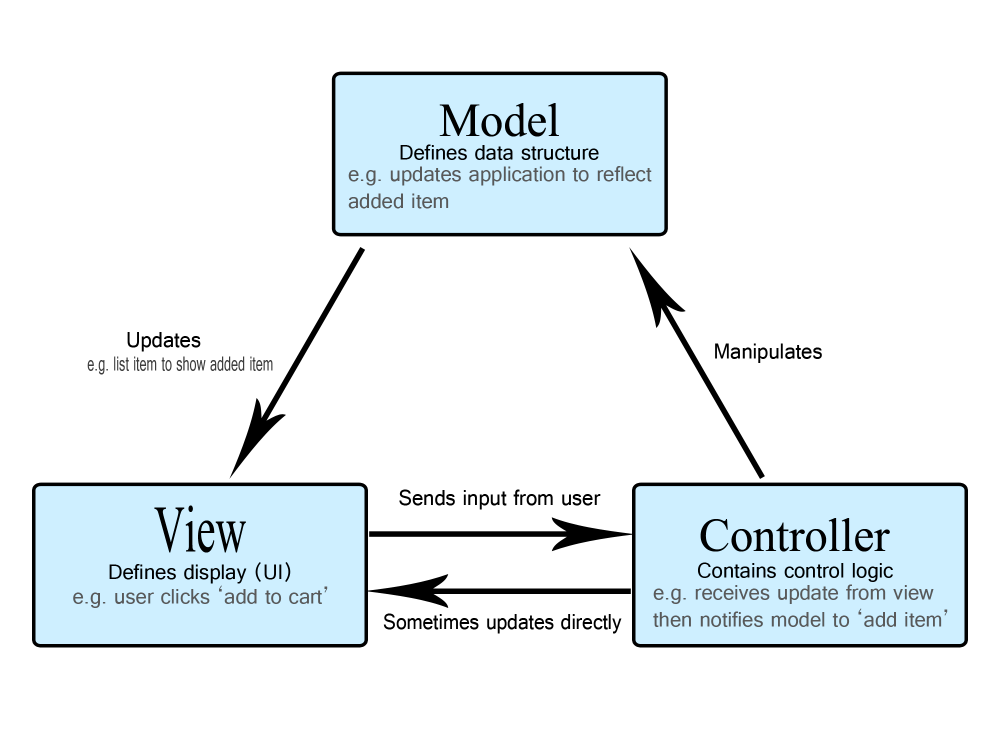
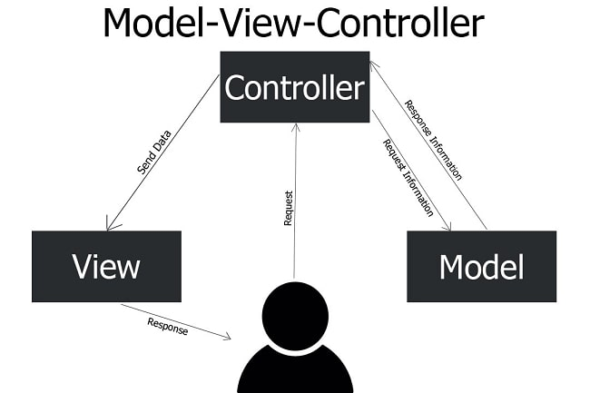

# Паттерн MVC. Реализация в Spring MVC

Данная статья открывает раздел Spring MVC, посвященный построению бэкенд-приложений на базе Spring. Практически все, что
мы узнаем в пределах курса об HTTP-коммуникации с помощью Spring-приложений, мы узнаем в данном разделе.

Текущая статья - вводная и скорее теоретическая. Она раскрывает суть паттерна MVC, неоднократно упоминаемого ранее, 
а также в общих чертах описывает, как Spring реализует данный паттерн.

Данный паттерн хорошо известен как минимум студентам IT-специальностей, поэтому в статье также постараемся 
разобраться с некоторыми вопросами и заблуждениями, которые зачастую возникают после университетского курса.

Прежде чем приступить к данной статье рекомендую освежить описание Spring MVC в обзорной статье по Spring Framework: 
[ссылка](https://github.com/KFalcon2022/lessons/blob/master/lessons/spring-framework/172/Spring.%20Introduction.md#spring-mvc).

## Исторический контекст

Паттерн Model-View-Controller впервые был описан еще в конце семидесятых годов и с тех пор неоднократно 
переосмысливался, интерпретировался и адаптировался под различную специфику.

Как несложно догадаться, разрабатывался он вовсе не для backend-приложений и, в общем-то, даже не для 
клиент-серверного подхода, из-за чего некоторые классические описания этого паттерна не до конца бьются с реальностью.
Это мы разберем подробнее чуть ниже и именно это у многих новичков вызывает диссонанс.

Отдельно стоит отметить, что именно этот паттерн почему-то очень полюбился сообществу. Про него рассказывают в 
профильных университетах, еще лет 6-7 назад его любили спрашивать на собеседованиях у разработчиков любых 
направлений, кроме (хочется верить), embedded-разработки.

При этом стоит понимать, что в отличие от множества иных паттернов, в том числе архитектурных, нет какой-то канонической 
реализации паттерна. Конечно, можно найти первые публикации о данной концепции от разработчиков Smalltalk, но никто 
всерьез не воспринимает их именно как эталон. Отсюда следует, что несмотря на общность идеи, различные имплементации 
могут довольно сильно отличаться друг от друга в деталях и, соответственно, MVC в разрезе Spring MVC вовсе не 
обязано быть похожим на, скажем, Laravel - PHP-фреймворк, предназначенный для разработки MVC-приложений.

## Концепция

В большинстве случаев первым, что узнает новичок о MVC - схема наподобие приложенной ниже:

Позже мы разберем, почему это не до конца соответствует реализациям MVC в Spring, пока же разберемся с 
компонентами, упомянутыми в диаграмме.

Каждый из них обозначает условный модуль с кодом внутри приложения со своей зоной ответственности. При этом чаще 
всего структура проекта не будет явным образом отражать MVC, следуя иным практикам оформления - принятым в Java 
подходам к оформлению пакетов, тем или иным архитектурным практикам, принятым на данном проекте и так далее. Поэтому 
новичкам бывает тяжело соотнести теоретические знания об MVC с тем, что они видят в реальных проектах. 

Что же значат сами компоненты и какая у каждого из них зона ответственности?

- **Model** (в русскоязычной среде - модель). Данные и логика их обработки - от бизнес-логики* до инфраструктурных 
  слоев для работы с БД, кэшем, очередями сообщений и т.д. Проецируя этот компонент на те сервлетные приложения, 
  которые мы писали ранее, в модель входят сервисы, репозитории и доменные объекты**;
- **View** (вью, вьюха, представление - в зависимости от того, насколько ваш собеседник любит жаргонизмы). Компонент 
  для "отображения" данных пользователю. Формат предоставления таких данных будет зависеть от выбранного 
  технологического стека: это может быть HTML/JSP-страница, DTO (которое далее сериализуется в JSON или иной формат), 
  медиафайл (аудио, видео, картинки) и так далее. В реалиях бэкенд-разработки на Java это обычно JSP или страницы, 
  сформированные шаблонизатором (например, thymeleaf) для легаси-приложений или же DTO, сериализуемые в JSON/иной 
  формат и `byte[]` или I/O stream для мультимедиа. При этом к view в такой картине мира будут относиться как 
  входящие, так и исходящие данные. В разрезе сервлетных приложений к view можно отнести как классы моделей или ресурсы,
  которые будут получены из объекта запроса или же записаны в объект ответа (в полной мере), так и `HttpServletRequest`,
  `HttpServletResponse` (с определенными оговорками);   
- **Controller** (контроллер). Компонент, с которым взаимодействует пользователь для получения view. С контроллером 
  взаимодействует пользователь (или клиентское приложение), чтобы получить или обновить отображаемые данные. В 
  реалиях сервлетных приложений к контроллерам будут относиться классы сервлетов и, с небольшой натяжкой, сервлетные 
  фильтры.

> *Отдельно стоит отметить, что MVC в принципе не оперирует понятиями сервисов и репозиториев - эти термины берут 
> начало из иных архитектурных подходов, пусть и не противоречащих MVC. Здесь термины использованы для наглядности, 
> более каноничным будет описание модели как доменных объектов и бизнес-логики без дополнительной детализации.

> **Бизнес-логика в модели - дискуссионный вопрос, на который разные эксперты смотрят по-разному. Кто-то будет 
> говорить, что бизнес-логика - часть контроллера, а модель должна оперировать только данными и их получением из 
> хранилища. Кто-то в ответ будет критиковать бизнес-логику в контроллерах и даже придумает уничижительный термин 
> для такого подхода - Fat Stupid Ugly Controllers (FSUC). До тех пор, пока мы говорим о MVC в вакууме, вопрос 
> границы между компонентами остается дискуссионным.
>
> В реалиях Java-разработки и, особенно, Spring MVC, контроллеры обычно стараются сделать тонкими, возлагая на них 
> лишь ответственность за получения запросов, их передачу в модель и обработку ответа. Мы это неоднократно встретим 
> в следующих статьях.

В наиболее популярных описаниях все три компонента взаимодействуют между собой:

- View → Controller. Пользователь управляет данными через контроллер - добавляет новые данные, обновляет или удаляет 
  существующие. В некоторых интерпретациях пользователь будет взаимодействовать с view, а уже view будет обращаться к
  контроллеру. В целом, это звучит адекватно, если условные кнопки и поля ввода на UI считать частью view;
- Controller → Model. Контроллер обращается к модели, чтобы действия пользователя были обработаны на уровень домена, 
  сохранены в БД и т.д.;
- Model → View. После обработки изменений модель должна обновить представление. Изначально это предполагалось 
  делать через паттерн Observer или иными схожими средствами. В реалиях веб-разработки это зачастую невозможно (если 
  речь идет о HTTP-коммуникации) и это один из наиболее дискуссионных вопросов в наших реалиях. Этот же вопрос чаще 
  всего вызывает вопросы новичков, ему во многом посвящен следующий пункт статьи.

На этом круг замыкается - каждый компонент вызывает следующий. В классических представления пользователь либо 
взаимодействует лишь с view (и видит отображение данных, и через нее же вносит изменения), либо воспринимает 
информацию, предоставленную view, а изменения вносит через контроллер. В реалиях бэкенд-разработки неважно, какой 
вариант считать правильным - это в любом случае не проблема сервера. Неизменным в абсолютном большинстве 
интерпретаций остается то, что пользователь не может взаимодействовать напрямую с моделью. 

## Реализация в Spring MVC

Spring MVC и многие другие фреймворки для бэкенд-приложений имеют свое видение идеи Model-View-Controller. В общем 
случае это видение будет довольно близко к тому, что вы ранее делали с помощью Servlet API, но отдельные нюансы 
стоит описать подробнее.

Контроллер в Spring MVC - достаточно компактный компонент. С точки зрения клиентского кода он чаще всего будет 
представлен классами-контроллерами и обработчиком ошибок (или несколькими обработчиками). Также сюда все еще можно 
отнести сервлетные фильтры (Spring MVC предлагает для них свой API) и interceptor'ы* - это менее часто используемые
инструменты, но все еще крайне важные - им уделим время позже.

> *Здесь стоит сделать небольшую ремарку. Фильтры и интерцепторы в разрезе Spring MVC, фильтры, объекты запросов и 
> ответов в разрезе Servlet API - все эти классы довольно опосредовано относятся к MVC.
> 
> С одной стороны мы можем грубо впихнуть их в тот или иной компонент паттерна, в статье это заметно в нескольких 
> местах. С другой - MVC не описывает инфраструктурную составляющую в принципе. Поэтому то, что относится к 
> - Конфигурации;
> - Транспортному уровню - HTTP-коммуникации или низкоуровневым интерфейсам для работы с БД или другими внешними 
>   ресурсами;
> - Логированию;
> - Другой вспомогательной логике, не относящейся к предметной области приложения.
> 
> Правильнее всего рассматривать как классы приложения, которые находятся за пределами MVC. Но я не уверен, что 
> такой подход будет проще для новичков, которые только начинают знакомиться с архитектурными паттернами.

Класс-контроллер - класс с аннотацией `@Controller` или `@RestController`. Обе аннотации - идеологические 
наследники `@Component`, наравне с `@Service` и `@Repository`, выделенные специально для контроллеров.

Обработчики ошибок можно определить по аннотациям `@ControllerAdvice` и `@ExceptionHandler`, но их идеологическая 
подоплека сложнее, поэтому оставим ее для соответствующей статьи.

View, как было упомянуто выше, может быть представлен по-разному. Но в реалиях современной разработки это почти 
всегда будут DTO*, которые принимают на вход или отдают методы контроллеров. В отличие от сервлетных приложений, в 
Spring MVC почти никогда не требуется работать с объектами запросов и ответов напрямую, Spring чаще всего 
предоставляет более высокоуровневый API для взаимодействия с полезной нагрузкой запросов и ответов.

> *Важно понимать, что DTO в принципе могут использоваться для любой передачи данных - по сети, между слоями 
> архитектуры одного приложения и прочих целей. Именно в разрезе MVC нас интересуют DTO, которые представляют 
> входящую или исходящую информацию относительно пользователя системы. На транспортном уровне такие DTO будут 
> сериализованы во что-то (JSON, XML, Protobuf и т.д.), но на уровне Java-кода выглядят как классы моделей.

Чуть в стороне стоит подход, предполагающий работу с формами в виде HTML/JSP страниц. Он все еще имеет право на 
жизнь, но с развитием Front-end приложений ушел в прошлое за исключением legacy-проектов. Какие-то самые базовые 
вещи мы рассмотрим в курсе, но без деталей.

Моделью будет являться все, что касается бизнес-логики, хранения данных и т.д. В этом плане мало что изменится - это 
те же модели, сервисы и другие классы, которые мы рассматривали в предыдущих статьях по Spring и ранее.

Один из ключевых моментов - взаимодействие модели и view. В реалиях Spring MVC диаграмма выше не соответствует 
реальности в полной степени. Корректнее будет описать схему взаимодействия примерно так:

Идея с прямым взаимодействие "Model → View" может быть неплоха для десктопных приложений - если и то, и другое 
выражено Java-классами в одном приложении, нет технической проблемы построить их взаимодействие каким-либо образом. 
Если же мы рассматриваем MVC в контексте веб-приложений - все немного сложнее.

С одной стороны, мы можем говорить о том, что view - это все еще объекты Java-классов внутри серверного приложения 
или ресурсы, находящиеся там же. Но в конечном случае нас интересуют не данные сами по себе, а их отображение 
пользователю. А для отображения их необходимо передать по сети*.

> *Здесь есть своя тонкость. С одной стороны MVС в контексте Spring-приложения означает, что весь паттерн реализован 
> в рамках этого приложения. И это так: приложение оперирует представлениями в том или ином виде, формирует их, 
> отправляет по сети и так далее. И лет двадцать назад можно было жить в такой парадигме, если клиент занимается 
> лишь отображением данных, пришедших с сервера. Это как раз укладывается в использование JSP или родственные ему 
> технологии.
> 
> Но все меняется, если мы берем современные подходы с Single Page Application, развитием JS и front-end фреймворков 
> вроде React и Angular. Сюда же можно относить мобильную разработку.
> 
> Теперь в контексте продукта MVC размазывается между клиентом и сервером. Есть разные интерпретации на тему того,
> размазывается ли контроллер, но view стоит рассматривать либо как исключительно клиентскую часть реализации паттерна
> (тогда серверный view идеологически будет частью контроллера), либо размазанную между клиентом и сервером. В иных
> случаях задача отображения данных клиенту не будет решена.
> 
> В описанной картине мира получается, что есть представление о MVC, актуальное в разрезе серверного приложения, где 
> view можно рассмотреть как набор DTO. И есть MVC в разрезе продукта, где компоненты разделяются на клиентское и 
> серверное приложение. В обоих случаях используются одни и те же термины, только границы между компонентами могут 
> отличаться.
> 
> Еще больше ситуация запутается, если вспомнить, что в некоторых случаях клиентское приложение тоже заявит, что
> реализует MVC и это будет уже третья интерпретация паттерна в пределах того же продукта. Но это мало на что 
> повлияет в жизни бэкенд-разработчика, поэтому данный аспект можно не учитывать.

При этом для сетевой коммуникации в абсолютном большинстве случаев современный мир использует HTTP. Который, в свою 
очередь, работает по модели "запрос-ответ" и логически подводит к тому, что некий компонент отвечает и за прием 
запроса, и за отправку ответа на этот запрос. В Java таким компонентом обычно является сервлет. И раз уже мы все равно 
должны отправить наш ответ через ту же точку, через которую пришел запрос - в чем актуальность взаимодействия модели и
view? Чаще всего это будет лишь ненужным усложнением. Отсюда и рождается схема, приведенная выше.

Конечно, даже в клиент-серверной архитектуре можно реализовать изменение view через модель - существуют технологии 
вроде WebSocket и паттернов вроде long polling. Они позволяют на том или ином уровне абстракции отказаться от 
завязки на запрос-ответ в классическом для HTTP смысле. И как результат - первая диаграмма в этой статье будет иметь 
право на жизнь даже для бэкенд-приложения. Но на практике чаще всего накладные расходы на поддержание 
WebSocket, long polling и иных схожих инструментов, а также привносимые ими ограничения, сильно перевешивают 
потенциальные плюсы и использовать их только ради реализации более классической формы MVC точно не стоит. Такого 
рода инструменты стоит использовать под соответствующие им задачи, но никак не для реализации паттерна "по учебнику".  

В конечном итоге все и всегда сводится к эффективному решению прикладной задачи. Используемые паттерны или 
интерпретации паттерна - лишь инструмент. И если инструмент для конкретной задачи не подходит - от него стоит 
отказаться, а не натягивать ~~сову~~ задачу на любимый ~~глобус~~ инструмент.

Более подробно со Spring MVC будем разбираться в следующих статьях - как с точки зрения внутреннего устройства, так 
и в разрезе предоставляемого API.

## Эволюция MVC

Поскольку статья, в первую очередь, посвящена архитектурному паттерну, а не Spring, стоит отметить, что MVC - лишь 
основа концепции. В свою очередь она породила ряд дочерних архитектурных подходов, некоторые из которых до сих пор 
актуальны в тех или иных направлениях разработки - например, front-end или mobile.

Сколь-либо детально рассматривать эти концепции мы не будем - они редко актуальны для бэкенда, но может хотя бы 
обозначить:

- MVVM (Model–view–viewmodel);
- MVP (Model–view–presenter). Не путайте с MVP в значении minimum viable product, эти вещи вообще не связаны между 
  собой;
- MVA (Model–view–adapter);
- PAC (Presentation–abstraction–control). Не уверен, что этот подход - прямой наследник MVC, но идеологически они схожи.

В заключение стоит добавить несколько слов. При погружении в архитектурные паттерны и подходы, особенно если речь 
идет об архитектуре приложений, могут возникать вопросы. Как (подставьте имя концепции) вообще решает мои проблемы? 
Зачем это описывать - это же очевидно? Зачем для этого давать собственное название? И прочие экзистенциальные 
вопросы.

Но стоит помнить, что те вещи, которые новичок в сегодняшних реалиях видит в книгах, обучающих статьях или видео, 
репозиториях на гитхабе или, в крайнем случае, на своем первом коммерческом проекте - вовсе не истина, высеченная 
предками человечества в граните. Еще 10-20-30 лет назад разработка была иной и многое из того, что сейчас 
постесняется коммитить даже самый дешевый индусский аутсорсер было нормой в те годы. И чем старше изучаемая вами 
архитектурная концепция, тем более простые и очевидные для вас вещи она будет описывать, если она популярна в 
современной разработке.

Так, скажем, изучающие этот курс достаточно быстро познакомились с концепциями сервиса, репозитория и идеями слоистой
архитектуры в целом. И для таких людей этот архитектурный подход скорее всего кажется естественным и вполне 
очевидным. И теоретически эти люди могут прочесть Мартина Фаулера или Роберта Мартина и удивиться - зачем писать 
целые книги о таких очевидных вещах?

При этом изучать архитектурные подходы можно и нужно. Лишь таким образом можно полностью представить себе их 
многообразие, понять, что в данный момент времени в данном проекта вам нужна именно такая архитектура и, наконец, 
отловить момент, когда что-то окончательно потеряет актуальность, чтобы не держаться за отжившие свое технологии и 
парадигмы. 

#### На сегодня все!

> Если что-то непонятно или не получается – welcome в комменты к посту или в лс:)
>
> Канал: https://t.me/ViamSupervadetVadens
>
> Мой тг: https://t.me/ironicMotherfucker
>
> **Дорогу осилит идущий!**
