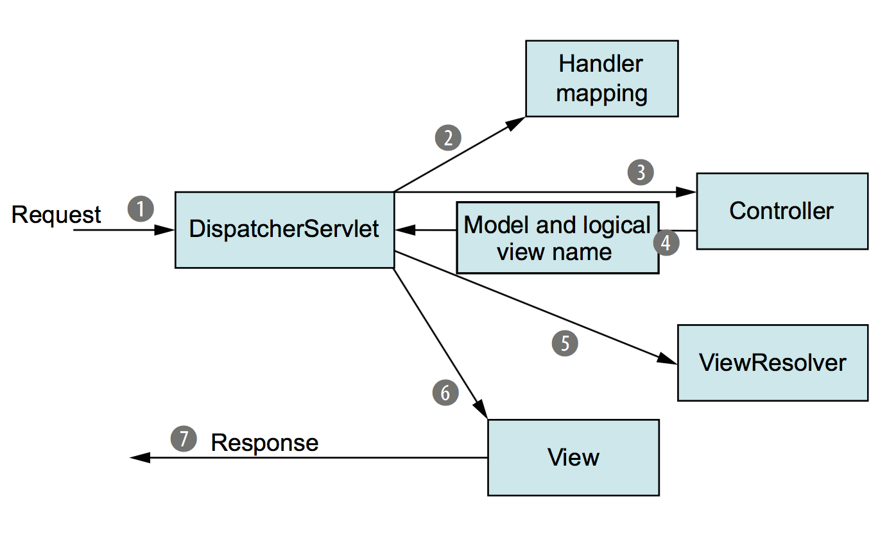

# Spring MVC. Знакомство с DispatcherServlet

Данная статья - ключевая во всем разделе Spring MVC. В ней мы постараемся разобраться где и как появляется магия,
превращающая сервлетные объекты запросов и ответов в тот набор удобных аннотаций, методов и DTO, которые мы
используем при работе с контроллерами в Spring. Заодно разберемся и с тем, как HTTP-запрос вообще попадает в метод
контроллера.

Иными словами, сегодня мы знакомимся с устройством Dispatcher Servlet!

## Введение

Данная статья - одна из наиболее сложных во всем курсе. Как в написании, так, полагаю, и в освоении. Хорошая новость для
читателей в том, что нет необходимости разбираться в теме досканально - достаточно уяснить ключевые компоненты, их зону
ответственности и, соответственно, составить общее представление, где и что искать в случае конкретных проблем.

Если открыть большинство популярных обучающих материалов, посвященных `DispatcherServlet` - скорее всего вы найдете
там схему, подобную этой:



Текст, соответственно, будет посвящен отраженным на диаграмме сущностям. Однако реальность намного сложнее и бОльшая
часть сложности в работе `DispatcherServlet` находится на этапах, которые на данной диаграмме не отображены вообще
никак.

При этом если вы имеете опыт реального взаимодействия со Spring MVC, скорее всего нестандартные случаи и основные
сложности в логике `DispatcherServlet` вы отнесете к совсем иным частям процесса обработки запроса.

Собственно, в текущей статье мы постараемся найти новый баланс между следующими столпами:

1. Понятность для новичков. `DispatcherServlet` скрывает под собой множество внутренних контрактов и SPI, в которых
   можно разбираться месяцами, прежде чем полная картина станет понятна. Такое погружение имеет смысл для
   контрибьютора Spring MVC, но не для прикладного разработчика и, тем более, не для новичка;
2. Практическая ценность. Некоторые из упомянутых SPI или отжили свое, или не имеют большого значения для прикладного
   разработчика, поскольку нацелены на потенциальное расширение или подмену стандартного поведения. Ряд из них не
   нашло прикладного применения, какие-то важны для обратной совместимости с первыми версиями Spring MVC, третьи -
   важны для контрибьюторов смежных библиотек, предлагающих интеграцию в Spring MVC;
3. Формирование общей картины. Схема выше делает фокус на отдельных узких этапах обработки запроса, опуская огромный
   пласт информации, без которой становится невозможным как системное представление логики работы Spring MVC в целом,
   так и кастомизация отдельных этапов обработки под нестандартную задачу. В результате даже для многих
   разработчиков с годами коммерческого опыта обработка запроса в Spring MVC остается магией, а любая нестандартная
   ошибка или требование - нерешаемая проблема;
4. Выделение ключевых интерфейсов. Средний разработчик под ответственностью `DispatcherServlet` обобщает множество
   механизмов, что превращает весь механизм в некий god object и лишь мешает пониманию реального процесса обработки
   запроса.

При этом ряд подтем умышленно исключен из статьи. Какие-то из них (локали, темы) не выглядят чем-то полезным в
сегодняшних реалиях, другие - например, механизмы асинхронной обработки запросов - кажутся вторичными именно на данном
этапе и слишком сложными, чтобы пытаться рассмотреть их в той же статье. Но по необходимости неосвещенные инструменты
могут затрагиваться в отдельных сносках для уточнения деталей в более приоритетных пунктах.

## Проблематика

Начнем с попытки понять, зачем вообще потребовался слой абстракции поверх Servlet API в виде dispatcher servlet. Эта
тема уже несколько раз затрагивалась, но с каждым разом мы можем смотреть на нее все более комплексно.

1. Маппинг запроса на обработчик. Servlet API имеет довольно жесткую привязку в коде: конкретный путь (или паттерн
   пути) обрабатывается конкретным классом. Соответственно, если вы имеете запросы вида `/api/user` с базовыми
   CRUD-операциями, а потом захотели добавить что-то с более сложной семантикой вида `/api/user/block` и
   `/api/user/assignRole`, вам придется создать два новых класса-сервлета - по одному на каждый путь. Либо оставить
   один сервлет, но внутри него дополнительно производить маппинг запроса на реальный обработчик с учетом отдельных
   сегментов пути, изобретая некий прото-dispatcher;
2. Биндинг параметров и заголовков. Servlet API предлагает оперировать объектами запроса и ответа. При этом
   естественным образом возникает необходимость закладывать наиболее общие типы данных для значений таких параметров
   и заголовков - `Object` или, на худой конец, `String`. При этом с точки зрения бизнес-логики и параметры, и
   заголовки вполне могут содержать числовые типы, enum'ы, представлять boolean-значения или что-нибудь еще. Однако
   ограничения Servlet API подталкивают к тому, что конвертация значений в целевые типы и их валидация должна
   происходить либо в каждом отдельном `do`-методе сервлета, увеличивая количество бойлер-плейта, либо разработчик
   вынужден изобретать собственный велосипед, обрабатывающий подобную конвертацию и валидация централизованно, но при
   этом оставаясь внутри ограничений Servlet API;
3. Конвертация тела запроса. В целом, пункт схож с предыдущим, но имеет ряд дополнительных сложностей. Ведь теперь
   вопрос стоит не в конвертации некой строки в число или подобных по сложности операциях, а в работе с множеством
   различных форматов - текста, url-encoded-form, JSON, XML и т.д. Если вы выполняли практические задачи в разделе
   Servlet API, вы могли почувствовать на себе, как неудобно работать даже с банальной (де-) сериализацией JSON. Решение
   либо стремится быть избыточным, либо не надежным и высокосвязным, особенно когда речь идет о десериализации;
4. Обработка ошибок. Нельзя сказать, что в Servlet API о ней не подумали. Но, как и многие другие механизмы, в "голых"
   сервлетных приложениях она слишком неповоротлива для HTTP-коммуникации на фоне конкурентов в других языках - C#,
   Python и т.д.

Список можно продолжить. Общая мысль заключается в том, что Servlet API - отличный низкоуровневый интерфейс,
предоставляющий все самое необходимое. Но он создан неудобен для быстрой разработки в современных реалиях. При этом в
общем смысле это не упущение разработчиков фреймворка - он просто не предназначен для решения описанных выше проблем.

Spring MVC попытался предложить комфортную надстройку для Servlet API, которая заберет на себя общие типовые проблемы,
позволив разработчику концентрироваться именно на бизнес-логике и проектировании API, а не борьбе с type cast'ом и
маршрутизацией запроса.

Задача нетривиальная. Ведь те удобные контроллеры и аннотации, которые мы видели ранее, автоматически означают,
что:

1. Кто-то проанализировал все зарегистрированные контроллеры и их методы. Сопоставил их с путями/шаблонами путей,
   убедился, что нет неоднозначности (например, один путь не обрабатывается сразу двумя методами), сохранил эти
   данные для оперативной маршрутизации запроса;
2. Проанализировал входящие параметры методов контроллеров, создал для них правила маппинга, конвертации и валидации,
   предоставил механизмы, которые осуществят все эти действия;
3. Продумал механизмы сериализации и десериализации. Ведь как-то надо понять, что тело одного запроса нужно
   десериализовать из JSON, тело другого - из XML, а ответ для третьего должен представлять собой URL-encoded form.
   При этом в каждом случае десериализации заранее требуется определить и сопоставить целевой Java-тип;
4. Предоставил непротиворечивый механизм работы с ответами. Если в Servlet API вы попытались записать тело ответа
   после коммита - это исключительно ваша проблема. В Spring MVC вы обычно не работаете с сервлетными объектами
   напрямую, то есть непосредственная запись - ответственность фреймворка. При этом она может происходить на разных
   логических этапах: сериализация ответа, рендер HTML, запись сообщения об ошибки и так далее. И поскольку
   управляет этими процессами фреймворк - он же должен гарантировать, что накладок в этом процессе не произойдет;
5. Предусмотрел обработку ошибок. Все описанные выше шаги в том или ином виде могут приводить к ошибкам. Некорректные
   входящие данные, отсутствие определенного маппинга или конвертера и многое другое. Кроме того, необходимо
   предусмотреть обработку пользовательских ошибок и дать разработчику понятный API для этого. Соответственно, нужны
   отдельные механизмы, которые будут управлять отловом, обработкой и представлением ошибок в HTTP-ответах.

При этом мы рассматриваем в основном happy path и не затрагиваем какие-то нетиповые сценарии. Скажем, необходимость
предоставлять маппинг запроса на обработчик не только по URL, но и через какие-то иные идентификаторы. Необходимость
предоставить механизмы для расширения существующего поведения (скажем, пользовательских аннотаций или типов). И
многие другие вещи, которые так или иначе требовались, были заложены и поддерживаются в Spring MVC.

Как следствие описываемой проблематики, появилось множество интерфейсов и классов, управляемых одной корневой
сущностью - классом `DispatcherServlet`. Именно `DispatcherServlet` является оркестратором для множества механизмов,
покрывающих как проблемы, изложенные выше и ряд других, не затронутых в статье.

Технически `DispatcherServlet` является потомком `HttpServlet`. То есть, в конечном счете, практически все поведение
`DispatcherServlet` и его предков вплоть до `HttpServlet` являются надстройкой над хорошо известными нам методами
`init()`, `destroy()` `service()` и `do`-методах (Spring в своих целях переопределяет и то, и другое).

Как мы знаем из предыдущих статей, в современных приложениях обычно используется один объект `DispatcherServlet`,
который маппится на корневой путь (`/`). Но также как в сервлетном контейнере возможно существование нескольких
сервлетных контекстов, в Spring MVC возможно существование нескольких `DispatcherServlet`, каждый из которых будет
отвечать за собственный шаблон пути, иметь свои специфические обработчики, контроллеры и так далее.

Едва ли вам придется на практике разбираться с системами из нескольких `DispatcherServlet`, но стоит понимать, что
это технически возможно и вполне использовалось на каком-то этапе эволюции бэкенд-разработки на Java.

## Схема обработки запроса

Прежде чем углубиться в детали отдельных шагов обработки HTTP-запроса, рассмотрим логику обработки целиком. Эта
схема значительно отличается от той, которой обычно описывают логику DispatcherServlet. Тем не менее даже такая схема
будет неполной, поскольку опускает часть не критичных механизмов:

```
DispatcherServlet
↓
Маппинг запроса (HandlerMapping)
↓
Перехватчик запроса (Interceptor.preHandle())
↓
HandlerAdapter
           ├─ ArgumentResolver (выделение @PathVariable, @RequestParam и т.д.)
           ├─ HttpMessageConverter (конвертация тела запроса из JSON, XML и других форматов в @RequestBody-параметр)
           ├─ Приведение данных в Java типы (строковые, числовые, ENUM'ы и т.д)
           ├─ Валидация данных
           ├─ Вызов метода контроллера
           ├─ Обработка ответа метода контроллера (ReturnValueHandler)
↓
Перехватчик запроса (Interceptor.postHandle())
↓
Формирование тела ответа для классического MVP и API подходов (ViewResolver/HttpMessageConverter)
↓
Перехватчик запроса (Interceptor.afterCompletion())
```

Вполне вероятно, что сейчас большинство шагов в схеме выглядят чем-то совершенно непонятным. Это нормально, поэтому
ниже мы разберем их подробнее.

Фактически пункты выше имеют множественные try-catch обертки, из-за чего ошибка на любом шаге будет так или иначе
обработана, иногда - в несколько этапов. Технически, можно попытаться выстроить схемы для негативных сценариев,
показывая, как будет обрабатываться цепочка

```
ServletException/Внутреннее исключение Spring/Пользовательское исключение
↓
Стандартный или пользовательский обработчик
↓
Фактический код ответа и, опционально, тело, записанные в ответ
```

В тех или иных случаях. Выше представлен наиболее простой вариант, иногда ошибка подавляется или пробрасывается
через несколько catch-блоков. Но действительно имеют значение лишь прикладные сценарии с пользовательскими ошибками и
статус-кодами - мы рассмотрим данные механизмы ближе к концу статьи. Внутренние обработки легче посмотреть сразу в
исходном коде и не имеет смысла изучать заранее, вне контекста конкретной проблемы.

Теперь, когда общая схема перед глазами, можем приступить к более детальному разбору отдельных шагов.

## Маппинг запроса

Первое, что необходимо сделать `DispatcherServlet` при обработке запроса - найти маппинг этого запроса на конкретный 
обработчик. Отвечает за это интерфейс `HandlerMapping`, наследники которого инжектятся в `DispatcherServlet`.

В современной разработке почти всегда речь будет идти о поиске метода контроллера с соответствующими требованиями. 
То есть поиск класса, аннотированного `@Controller` (или аннотациями-наследниками) и метода этого класса. Сам 
маппинг будет происходить на основании информации, указанной в `@RequestMapping` (или аннотациях-наследниках). То 
есть по факту во внимание будут взяты следующие параметры HTTP-запроса:

- HTTP метод;
- Путь запроса. В общем случае - весь, в ситуации, когда `DispatcherServlet` привязан не к `/`, а к более 
  конкретному пути - сегмент пути после завязанного на конкретный `DispatcherServlet`. Будет произведен поиск 
  наиболее подходящего паттерна из описанных в `@RequestMapping`. Среди прочего будет учтено, что часть сегментов может
  быть представлена в самом обработчике через `@PathVariable`. Если упростить, больший приоритет будет отдан 
  паттернам с полным совпадением фактического пути, если же таких нет - паттернам с учетом `@PathVariable`*;
- Параметры запроса. В случае, если заполнен `@RequestMapping#params()`;
- Заголовки запроса. В случае, если заполнены `@RequestMapping#headers()` (для любых заголовков), 
  `@RequestMapping#consumes()` (специально для хедера `Content-Type`) или `@RequestMapping#produces()` (для `Accept`).

> *Это защищает от путаницы в ситуациях, когда есть обработчики вида:
> 
> ```java
> @GetMapping("my/handler/example1")
> @GetMapping("my/handler/{myPathVar}")
> ```
> 
> Ведь формально запрос по пути `my/handler/example1` подходит и для первого, и для второго варианта.

Описанный выше маппинг реализован через `RequestMappingHandlerMapping`.

Однако Spring предполагает как ряд альтернативных обработчиков, доступных по умолчанию (в том числе устаревших вроде 
интерфейса `Controller`), так и возможность создать свой способ маппинга через имплементацию `HandlerMapping`. 
На практике это все обычно не требуется, однако объясняет, почему в этой точке вообще возник интерфейс и 
подразумевается несколько допустимых имплементаций.

Семантика `HandlerMapping` в общем виде ограничена методом `HandlerMapping#getHandler()`, который возвращает объект 
`HandlerExecutionChain`. Именно в реализациях `getHandler()` кроется сам механизм поиска подходящего обработчика для 
конкретного объекта `HttpServletRequest`.

`HandlerExecutionChain` фактически является просто контейнером для двух сущностей, которыми мы будем 
оперировать дальше: обработчика запроса (`HandlerExecutionChain#handler`) и списка перехватчиков запроса 
(`HandlerExecutionChain#interceptorList`).

Сами сущности мы подробнее разбираем ниже. Здесь отметим лишь ключевой момент, имеющий значение в контексте 
маппинга: то, что результат маппинга - объект `HandlerExecutionChain` содержит список interceptor'ов автоматически 
означает, что сами перехватчики привязаны именно к маппингу. То есть разные реализации `HandlerMapping` могут 
возвращать `HandlerExecutionChain` с разным списком интерцепторов.

Это не слишком важно в типовых сценариях использования, однако помогает достичь основной задачи этой статьи - 
наглядно объяснить основные взаимосвязи между компонентами, логика которых и формирует механизм обработки запросов в 
Spring MVC.

## Перехватчики запроса. `preHandle()`

Здесь мы начнем знакомство с перехватчиками запросов. Они же интерцепторы, они же interceptor'ы - в статьях эти 
термины буду взаимозаменяемы.

Interceptor в контексте Spring MVC - интерфейс `HandlerInterceptor` или какой-то из его наследников, в зависимости 
от контекста. В данной статье им посвящено три пункта, по числу методов в интерфейсе. Пункты расположены так, чтобы 
примерно отобразить место вызова конкретного метода в процессе обработки запроса dispatcher servlet'ом.

Сами объекты интерцепторов доступны через объект `HandlerExecutionChain` - он хранит список перехватчиков, доступных 
для ассоциированного с ним объекта `HandlerMapping`. В общем-то объекты `HandlerInterceptor` не вызываются напрямую, 
вместо этого `DispatcherServlet` использует методы `HandlerExecutionChain`, запуская применение доступных 
перехватчиков в тот или иной момент обработки запроса.

Всего `HandlerInterceptor` поддерживает три метода, с каждым из которых ассоциирован определенный метод в 
`HandlerExecutionChain`:

1. `boolean preHandle()`. Этому методу посвящен текущий пункт статьи. Вызывается через 
   `HandlerExecutionChain#applyPreHandle()`. Особенности использования разбираются ниже; 
2. `void postHandle()`. Вызывается через `HandlerExecutionChain#applyPostHandle()`. Разбор можно найти в следующих 
   пунктах статьи; 
3. `void afterCompletion()`. Вызывается через `HandlerExecutionChain#triggerAfterCompletion()`. Разбор также 
   представлен позже.

Если говорить обо всем упомянутых выше методах `HandlerExecutionChain`, их логика похожа: пройти циклом по всем 
хранящимся в объекте перехватчикам, вызывая их друг за другом. Какой-то сложной логики здесь нет.

Говоря же о `HandlerInterceptor` - этот интерфейс можно рассматривать как некую альтернативу сервлетному фильтру. 
Также, как и фильтры, перехватчики срабатывают на каждый запрос, предоставляя место для реализации сквозной 
функциональности. Отличий от фильтров несколько, определим ключевые:

1. Фильтры срабатывают раньше сервлета. Перехватчики - как часть логики обработки запроса через `DispatcherServlet`;
2. Фильтры очень гибки по месту выполнения полезной нагрузки: она может быть заключена до передачи управления 
   следующему фильтру цепочки, после выполнения следующего фильтра (в том числе, фактически, после выполнения логики 
   сервлета), если захотеть - фильтр может вообще не передавать управление дальше, закрывая собой вызов и следующих 
   фильтров, и самого сервлета. Интерцепторы намного более зарегулированы - они лишь описывают какую-то логику, 
   выполняемую в определенный момент обработки запроса: до его попадания в метод контроллера, после выполнения 
   контроллера и так далее. Различные опции рассмотрим далее по тексту статьи;
3. Фильтр может подменять объекты запроса и ответа - через создание новых объектов-врапперов или как-то еще. 
   Перехватчикам это почти недоступно - заменить объекты запроса или ответа они не могут физически, остаются лишь 
   варианты, предполагающие модификацию существующих объектов (установка атрибутов, статусов, заголовков и т.д.);
4. Управляющие конструкции. Вызов фильтров фактически регламентируется контейнером сервлетов и маппингом по пути. 
   Интерцепторы логически привязаны к `HandlerMapping`. То есть критерий их вызова зависит от того, какой объект 
   `HandlerMapping` отвечает за обработку запроса. Это может зависеть не только от пути запроса, но и от других 
   параметров, доступных из объекта `HttpServletRequest`. Но данное различие скорее теоретическое, на практике ваши 
   запросы почти всегда будет обрабатывать `RequestMappingHandlerMapping` и перехватчики будут привязываться к нему.

Итого, интерцепторы представляют собой более управляемый и ограниченный в возможностях механизм реализации сквозной 
функциональности под управлением `DispatcherServlet`.

Вернемся к методу `HandlerInterceptor#preHandle()`. Как понятно из названия, он вызывается до обработки запроса. 
Ниже мы рассматриваем, в чем именно заключается "handle". В упрощенном виде это можно рассматривать как "до вызова 
метода контроллера", в более широком - до вызова логики обработчика и соответствующего ему объекта `HandlerAdapter`.

Особенность `HandlerInterceptor#preHandle()` в том, что он возвращает `boolean`-значение. Если оно `true` - 
обработка запроса продолжается. Но если `false` - вызывается метод `afterCompletion()` того же перехватчика и на 
этом обработка запроса через `DispatcherServlet` фактически завершается. То есть создатель перехватчика сам определяет 
критерий успешности работы перехватчика и волен отменить дальнейшую обработку запроса. Впрочем, на практике это 
требуется довольно редко.

Вообще, именно `HandlerInterceptor#preHandle()` является наиболее популярным методом перехватчиков - большинство 
интерцепторов создается именно ради него. Чаще всего речь идет о следующих функциях:

- Авторизация. Например, в контексте проверки наличия сессии или токена доступа. При знакомстве со Spring Security 
  мы разберем этот вариант использования детальнее;
- Настройка безопасности. Например, настройка CORS-политики, добавление токена для CSRF-защиты и так далее. 
  Углубляться не будем, приведенные термины можно погуглить отдельно. Но, справедливости ради, для подобных вещей 
  есть более узконаправленные инструменты, в том числе в Spring Security;
- Логирование. Классический вариант для любой сквозной функциональности;
- Добавление атрибутов или заголовков. В случае с заголовками - довольно популярный вариант, в том числе так 
  можно реализовать упомянутые выше настройки CORS-политики и CSRF-защиты;
- Инициализация контекста. Не в разрезе Servlet Context или Application Context, а некий собственный контекст. 
  Скажем, мы решили хранить какую-то дополнительную информацию с помощью `ThreadLocal`. Если это привязано к 
  обработке запроса - `HandlerInterceptor#preHandle()`, вероятно, лучший вариант;
- Технически, можно использовать `preHandle()` для подмены поведения. Поскольку возвращение `false` из метода будет 
  означать, что дальнейшая обработка запроса производится не будет - в том числе будет пропущена часть стандартных 
  обработчиков ошибок `DispatcherServlet`, в перехватчике можно подменить поведение, сразу сформировав ответ сервера.
  В общем виде это звучит как костыль, но для отдельных ситуаций, ограниченных выполнением заданного условия (скажем,
  отсутствие идентификатора сессии в запросе) это может быть допустимо. Вариант менее гибкий, чем в API сервлетных 
  фильтров, но вполне реализуемый. 

Для завершения картины, пройдем по сигнатуре метода. `HandlerInterceptor#preHandle()` принимает на вход 
`HttpServletRequest request`, `HttpServletResponse response` и `Object handler`. Первые два параметра нам хорошо 
известны, третий - фактически объект обработчика запроса. Подробнее о нем рассказано в следующем пункте. Однако в 
пользовательских интерцепторах он используется редко - как правило, он им просто не нужен в силу реализуемой логики. 

## HandlerAdapter

Если посмотреть на объект обработчика, возвращаемого `HandlerExecutionChain`, несложно заметить важную деталь: у 
него нет жесткой привязки к какой-то иерархии типов, Spring оперирует обычным объектом типа `Object`. Это связано с 
желанием Spring MVC оставить максимальную гибкость в обработке запросов в ситуации, когда выделить сложно какой-то 
общий контракт в виде интерфейса. Насколько это решение оказалось верным в исторической перспективе - вопрос 
дискуссионный, но имеем то, что имеем.

Логичным следствием из того, что обработчик запроса представлен объектом типа `Object` естественным образом ведет к 
тому, что `DispatcherServlet` не может обработать его самостоятельно. Ведь, чтобы добраться поведения объекта, нужно 
даункастить его к какому-то из конечных типов (например, `HandlerMethod`), но `DispatcherServlet` не может знать 
этих типов, как минимум из-за того, что пользователь технически может добавить свои собственные обработчики. Как 
следствие, появляется необходимость в какой-то иерархии объектов, которая станет мостом между 
объектами-обработчиками запроса и `DispatcherServlet`.

Описание, возможно, запутанное, но фактически это прямо описание ситуации, которую призван решать паттерн "Adapter". 
Разработчики Spring MVC не стали что-то выдумывать и корневой интерфейс соответствующей иерархии так и называется: 
`HandlerAdapter`.

Как видно из схемы в начале статьи, бОльшая часть дальнейших шагов в обработке запроса - ответственность непосредственно 
`HandlerAdapter` (точнее, одной из реализаций этого интерфейса) или управляемых им компонентов: резолверов, биндеров, 
конвертеров и так далее - их рассматриваем ниже.

В общем случае ответственность `HandlerAdapter` заключается в следующем:

1. Сказать, способен ли адаптер обработать предоставленный ему хэндлер (`boolean supports(Object handler)`). 
   `DispatcherServlet` сам по себе знает лишь список доступных ему адаптеров и полученный от `HandlerMapping` объект 
   обработчика. Чтобы найти подходящий адаптер, `DispatcherServlet` опрашивает каждый из доступных: "можешь ли ты 
   обработать этот объект хэндлера?". В реализациях `HandlerAdapter` метод `supports()` обычно строится на базе 
   проверки типа через `instanceof`. В принципе, это довольно логично, исходя из сказанного выше;
2. Подготовить запрос для обработчика, вызвать обработчик и обработать его ответ. В этой части кроется и основная 
   сложность, и большая часть магии, которая для разработчика выглядит как красивые аннотации в методе контроллера.

Если мы говорим именно о современном понимании Spring MVC контроллеров (`@Controller` + `@RequestMapping`), обработчик 
для них будет представлен объектом типа `HandlerMethod`, а адаптер - объектом `RequestMappingHandlerAdapter`.

> Если говорить об этапе инициализации приложения, все контроллеры и их методы анализируются заранее и добавляются в 
> определенный реестр, внутри которого `RequestMappingHandlerMapping` впоследствии ищет подходящий обработчик под 
> конкретный запрос.

Именно `RequestMappingHandlerAdapter` отвечает за извлечение и подготовку для метода контроллера параметров, 
аннотированных `@RequestParam`, `@PathVariable`, `@RequestBody` и так далее. Аналогично для возвращаемого значения 
метода контроллера. Как именно это происходит - рассматриваем ниже.

## Подготовка аргументов для метода контроллера

Здесь и далее, вплоть до пункта "Перехватчики запроса. `postHandle()`", фактически описывается зона ответственности 
`HandlerAdapter`. В различных реализациях интерфейса его поведение может очень отличаться. Поскольку нас интересует 
в первую очередь прикладная составляющая - мы рассматриваем поведение `RequestMappingHandlerAdapter`.

Подготовка аргументов для метода контроллера фактически затрагивает весь перечень шагов от определения, что данному 
методу требуется получать из сервлетных объектов запроса и ответа до непосредственной передачи данных в метод 
контроллера. Эти шаги предполагают извлечение данных из сервлетных объектов и их приведение к нужным Java-типам, 
включая десериализацию тела запроса, валидацию данных параметров и прочие шаги, происходящие до вызова метода 
контроллера.

### Маппинг параметров

Под маппингом параметров метода контроллера подразумевается извлечение данных из сервлетных объектов (в первую очередь -
`HttpServletRequest` и `HttpServletResponse`) и их подготовку для передачи в метод контроллера.

Сюда входит как передача самих сервлетных объектов (`HttpServletRequest`, `HttpServletResponse`, `Session` и т.д.), 
так и более специфические конструкции Spring MVC - параметры, аннотированные с помощью `@RequestParam`, 
`@PathVariable`, `@RequestHeader`, `@RequestBody` и так далее.

Непосредственно извлечением и подготовкой данных в таких случаях занимаются реализации интерфейса 
`HandlerMethodArgumentResolver`. Аргумент резолверы, нужные конкретному адаптеру, регистрируются заранее и при 
вызове конкретного обработчика просто применяются, в зависимости от того, какие именно параметры заявлены для 
конкретного метода контроллера.

Для наглядности приведем несколько примеров таких резолверов для различных типов параметров:

- `@RequestParam` - `RequestParamMethodArgumentResolver`;
- `@PathVariable` - `PathVariableMethodArgumentResolver`;
- `@RequestBody` и `@ResponseBody` - `RequestResponseBodyMethodProcessor`;
- `ServletRequest`, `HttpSession`, `Reader`, `InputStream` и некоторые другие - `ServletRequestMethodArgumentResolver`.
  `Reader` и `InputStream` здесь обозначают объекты для доступа к телу запроса в сыром виде. В Servlet API доступны 
  через объект запроса;
- `ServletResponse`, `OutputStream` и `Writer` - `ServletResponseMethodArgumentResolver`.

Подобный подход позволяет относительно легко расширять список видов поддерживаемых параметров, а также инкапсулирует 
получение параметра каждого вида в отдельном классе. Так, `RequestParamMethodArgumentResolver` и 
`RequestResponseBodyMethodProcessor` могут бесконечно отличаться друг от друга в реализации. Это не имеет значения 
до тех пор, пока они следуют общему контракту:

- `boolean supportsParameter(MethodParameter parameter)`. Проверяет, поддерживает ли данный аргумент резолвер данный 
  параметр. `MethodParameter` - класс из Spring Core, который можно воспринимать как надстройку над `Parameter` из 
  Reflection API;
- `Object resolveArgument()`. Отвечает за фактическое получение значения. Входящие параметры данного метода опущены для 
  лаконичности.

В конечном итоге процесс маппинга можно описать как:

- Определение ожидаемых данных на основе информации в `HandlerMethod`;
- Поиск `HandlerMethodArgumentResolver` для каждого параметра метода контроллера;
- Вызов найденного `HandlerMethodArgumentResolver`. Сюда входит как извлечение параметров из объектов запроса, так и 
  их приведение в нужным Java-типам;
- Формирование итогового массива параметров для вызова метода контроллера.

Дополнительно существует опция валидации входящих параметров, но ее рассмотрим чуть ниже.

### Конвертация тела запроса

В большинстве случаев информация, требуемая для параметров метода контроллера передается в него либо в изначальном 
виде (сервлетные объекты и некоторые вспомогательные параметры), либо конвертируется из строкового представления 
(параметры запроса, path variable, заголовки). С телом запроса все обстоит сложнее.

Тело запроса в Servlet API представляется в виде `InputStream`, который фактически представляет собой поток байт, 
содержащий в себе что угодно. И задача превратить это "что угодно" во что-то более структурированное, чем массив 
байт сильно сложнее, чем конвертировать строковую информацию.

Отсюда появляется еще один уровень абстракции, который должен предоставить множество способов конвертации уже для 
`HandlerMethodArgumentResolver` (в данном случае - для объекта `RequestResponseBodyMethodProcessor`). Такой 
абстракцией является `HttpMessageConverter`.

Как сам `RequestResponseBodyMethodProcessor` будет выбирать одну из реализаций `HttpMessageConverter` не 
принципиально - это детали внутренней реализации конкретного аргумент резолвера. Для простоты можем считать, что 
каждому популярному значению заголовков `Content-Type` и `Accept` соответствует некая реализация 
`HttpMessageConverter`. В целом, это будет недалеко от истины.

Собственно, `HttpMessageConverter` - это общий механизм Spring MVC, направленный на десериализацию тела 
запроса и сериализацию тела ответа. Ключевые методы этого интерфейса:

- `canRead(Class<?> clazz, MediaType mediaType)`. Метод, проверяющий, может ли конвертер десериализовать значение в
  заданном `MediaType` (обычно по значению в заголовке `Content-Type`) в указанный класс;
- `canWrite(Class<?> clazz, MediaType mediaType)`. Метод, но уже для чтения - может ли конвертер сериализовать объект
  указанного класса в значение заданного `MediaType` (обычно по заголовку `Accept`);
- `T read(Class<? extends T> clazz, HttpInputMessage inputMessage)`. Метод для десериализации данных. 
  `HttpInputMessage` - обертка над `InputStream`, доступном для чтения тела из сервлетного запроса;
- `void write(T t, MediaType contentType, HttpOutputMessage outputMessage)`. Метод для сериализации данных.
  `HttpOutputMessage` - обертка над `OutputStream`, предоставляемая сервлетным ответом для записи тела;

Как следует из вышесказанного, сама логика (де-) сериализации тела запроса (или ответа) зашита в реализациях 
`HttpMessageConverter`. Задача `RequestResponseBodyMethodProcessor` в простом представлении сводится к выбору 
подходящего конвертера и его вызову.

Spring MVC предоставляет довольно много конвертеров - для JSON, XML, YML различных бинарных форматов и так далее. 
Более того, для некоторых форматов доступно сразу несколько конвертеров, инициализируемых в зависимости от того, 
какая библиотека подключена для сериализации. Скажем, на примере JSON, есть отдельные конвертеры на базе Jackson и 
GSON (библиотека для сериализации JSON от Google, более популярная в мобильной разработке).

Как несложно заметить, Spring с легкостью делегирует ответственность от абстракции к абстракции. И тем важнее 
понимать, где искать корень проблемы при ошибках в конкретном участке логики. Даже на примере данного пункта, 
ответственность в десериализации тела ответа переходит по цепочке:

1. `DispatcherServlet` - как общая точка входа для поиска любых проблем в обработке запроса за пределами бизнес-логики;
2. `RequestMappingHandlerAdapter` - как управляющий конструкт фактического обращения к обработчику метода;
3. `RequestResponseBodyMethodProcessor`;
4. `HttpMessageConverter` - конкретная реализация интерфейса, в зависимости от формата тела и используемых в проекте 
   библиотек;
5. Какая-то внешняя библиотека, используемая конкретным конвертером. Spring редко предоставляет нативные решения для 
   конвертеров, чаще это будет вызов API Jackson или какой-то либо другой внешней библиотеки.

### Биндинг и валидация параметров

Отдельная тема, которую необходимо затронуть хотя бы по касательной - функциональность биндинга в лице
`WebDataBinderFactory`, `WebDataBinder` и `BindingResult`. Объяснить ее несколько сложнее, нежели предыдущие 
сущности, поскольку зона ответственности `WebDataBinder` более размыта и размазана по процессу обработки в силу 
исторических причин.

В общем смысле биндинг означает привязку чего-то к чему-то. В разрезе Spring MVC - в первую очередь привязку 
элементов сервлетных сущностей к MVC модели.

> Если помните упоминание `@InitBinder` в одной из предыдущих статей - это часть логики биндинга. В данном случае - 
> его донастройка.

Думаю, не сильно погрешу против истины, если скажу, что за пределами работы с представлениями `WebDataBinder` 
сотоварищи нужны в первую очередь для валидации тела запроса. Этот механизм строится на основе спецификации Jakarta 
Validation API и ее использованию в Spring MVC посвящена одна из следующих статей.

Если же обращаться к истории сущности - `WebDataBinder` необходим для работы с классическим Spring MVC. Скажем, для 
обработки параметров типа `@ModelAttribute`. Там на механизм биндинга завязаны и процессы конвертации исходного  
значения в целевой Java-тип, и валидация значения, и, в некотором роде, обработка ошибок. С последним мы, 
впрочем, еще столкнемся в разрезе валидации.

## Выполнение метода контроллера

С точки зрения обработчика запроса, для Java-приложения сам вызов метода контроллера сводится к обычному 
`Method#invoke()`. Мы уже неоднократно сталкивались с использованием рефлексии в Spring и других фреймворках, здесь 
нет ничего особенного. 

То, что произойдет внутри метода контроллера для нас тоже понятно. Это не более чем выполнение конкретного метода 
конкретного контроллера и обработка описанной там логики.

## Обработка ответа метода контроллера

Рассмотрим, что происходит с возвращаемым значением метода контроллера.

Сам формат возвращаемого объекта достаточно вариативен:

- `void`;
- `String` (без `@ResponseBody`), фактически - имя представления;
- `View` и ряд других объектов, подразумевающих работу с классическим Spring MVC, но не через наиболее 
  распространенный формат с именем представления;
- `ResponseEntity`;
- Для методов, в том или ином виде помеченных `@ResponseBody` - произвольный объект, включая `String`;
- Ряд других специализированных форматов ответа, не имеющих широкой популярности.

Форматы ответов различны, соответственно, и обрабатывать их нужно по-разному. При этом необходимо сохранить некую 
общую стезю обработки запроса, поэтому на сцену выходит новый интерфейс - `HandlerMethodReturnValueHandler`. 
Концептуально он похож на `HandlerMethodArgumentResolver`, но применяется именно для возвращаемого значения.

В целом же обработка ответа контроллера выглядит примерно так:

1. Валидация ответа, если она включена. В текущем виде валидация существует со Spring 6, раньше она была реализована
   иначе, чуть в стороне от основного процесса обработки запроса;
2. Поиск подходящей реализации `HandlerMethodReturnValueHandler`. В случае работы с представлениями таковым чаще 
   всего будет `ViewNameMethodReturnValueHandler`. В современных реалиях это чаще всего будет
   `HandlerMethodReturnValueHandler` (для `ResponseEntity`) и уже знакомый нам `RequestResponseBodyMethodProcessor` 
   для методов, аннотированных `@ResponseBody`. Последний, в силу структуры своих предков является и аргумент резолвером,
   и обработчиком возвращаемого значения. Что, впрочем, несложно предположить из названия;
3. Обертывание результата в `ModelAndView`. Это один из ключевых объектов в классическом подходе Spring MVC, 
   объединяющий информацию и о модели, и о представлении. Это имеет значение при работе с представлениями -
   `HandlerAdapter` таким образом передает наружу весь нужный контекст для дальнейшей обработки ответа*. Такой
   `ModelAndView` и является результатом работы `HandlerAdapter`, включая рассматриваемый нами
   `RequestMappingHandlerAdapter`.

> В API-based подходе это лишь формальность контракта, сам `RequestMappingHandlerAdapter` фактически вернет `null`. 
> Ниже затронем этот момент чуть подробнее.

Кроме того, стоит отметить сценарий, при котором метод контроллера возвращает `void`. В таком случае все еще проще: нет
возвращаемого значения - не надо ничего писать в тело сервлетного ответа. В таком случае программа не дойдет до логики
выбора `HandlerMethodReturnValueHandler`, сразу перейдя к п.3. в схеме выше.

> Дополнительно отмечу, что здесь мы рассматриваем именно логику обработки возвращаемого значения. Чисто технически 
> никто не запретит создать `void`-метод контроллера, который будет принимать на вход `HttpServletResponse`, 
> `Writer` или `OutputStream` и записывать тело ответа внутри логики контроллера. Однако это весьма нетипичный 
> сценарий использования контроллеров для прикладных задач.

## Формирование HTTP-ответа

Перейдем к следующему логическому шагу - подготовке и записи ответа контроллера в сервлетный ответ.

### API формат

Здесь все достаточно просто. Как было сказано выше, `RequestMappingHandlerAdapter` фактически не создает 
результирующего объекта своей работы - `ModelAndView` - при обработке методов контроллера, возвращающих 
`ResponseEntity` или помеченных `@ResponseBody`.

Основная причина этого - особенности работы соответствующих `HandlerMethodReturnValueHandler`. И 
`HandlerMethodReturnValueHandler`, и `RequestResponseBodyMethodProcessor` фактически производят запись тела ответа в 
сервлетный объект внутри собственной логики, используя уже знакомые нам сущности типа `HttpMessageConverter`. То есть к
моменту, когда указанные обработчики закончат работу, от `DispatcherServlet` уже практически ничего и не требуется - 
тело ответа записано, статус-код и основная часть заголовков ответа - тоже. Необходимо лишь выполнение 
второстепенных механизмов вроде интерцепторов, но для них `ModelAndView` не нужен.

### Классический MVC

Здесь все несколько сложнее. Особенно с учетом того, что сам формат работы с представлениями мы практически не 
рассматривали.

Чтобы разобрать, как работает обработка ответа на практике, опишем простой пример, демонстрирующий работу Spring 
MVC при обработке JSP-представления. Стандартная конфигурация Spring MVC - `@EnableWebMvc`, конфигурация 
dispatcher servlet - опущены, так как были описаны в предыдущих статьях.

```java
@Configuration
public class ViewResolverConfig {
    @Bean
    // Создадим собственный ViewResolver. Его роль описана в следующем пункте
    public ViewResolver viewResolver() {
        var resolver = new InternalResourceViewResolver();

        // Указываем, что представления нужно искать в директории "/WEB-INF/views/"
        resolver.setPrefix("/WEB-INF/views/");
        
        // Здесь может быть любой суффикс для имени представления, но обычно указывают только формат файла. То есть 
        // представление с именем "hello" должно соответствовать файлу "hello.jsp" в директории "/WEB-INF/views/"
        resolver.setSuffix(".jsp");

        return resolver;
    }
}
```

Данный конфиг должна быть зарегистрирован как класс сервлетной конфигурации при настройке dipatcher servlet. В случае с
подходом, рассматриваемым ранее, класс нужно добавить в возвращаемое значение метода
`WebAppInitializer#getServletConfigClasses()`.

```java
// Создадим просто контроллер, обрабатывающий GET-запросы по пути /view/hello. Он должен отдавать практически 
// статичную JSP-страницу, единственный динамический элемент - подстановка в конечную HTML-страницу имени, 
// передаваемого параметром запроса
@Controller
@RequestMapping("view")
public class HelloViewController {
   @GetMapping("/hello")
   // Model - объект Spring MVC, олицетворяющий модель в MVC. Позволяет указывать атрибуты, которые доступны для JSP
   // или иного ресурса и используется при рендеринге конечной страницы. Можно упрощенно рассматривать как определенную
   // надстройку над атрибутами запроса в Servlet API 
   public String hello(@RequestParam String name, Model model) {
      model.addAttribute("name", name);
      return "hello";
   }
}
```

Опишем содержимое файла представления. Сам файл в данном случае должен называться `hello.jsp`

```html
<%@ page contentType="text/html;charset=UTF-8" %>

<!DOCTYPE html>
<html>
    <head>
        <title>Hello</title>
    </head>
    <body>
    Hello ${name}!
    </body>
</html>
```

Если все сделано правильно, при запущенном приложении можно сделать GET-запрос вида 
`http://localhost:8080/view/hello?name=Ivan` и получить корректный ответ.

Ниже рассмотрим, что происходит с `ModelAndView`, который сформирует `RequestMappingHandlerAdapter` после обработки 
метода контроллера выше. Однако сильно в детали углубляться не будем - подход фактически устаревший и используется
нечасто. Следующие два подпункта представлены в первую очередь для полноты картины.

#### ViewResolver

Этот и следующий подпункт находятся за пределами ответственности `HandlerAdapter` - они обрабатываются уже на 
основании результатов его работы (полученного `ModelAndView`) самим `DispatcherServlet`. Это хорошо видно и на самой 
первой схеме в начале статьи.

Цель данного шага обработки запроса - получить объект представления, он же `View`. Из названия доступного к этому 
моменту `ModelAndView` может показаться, что объект и так находится в прямом доступе. Однако чаще всего 
`ModelAndView` содержит лишь имя представления, на основании которого сам `View` надо как-то найти.

Маппинг между именем и целевым объектом может быть реализован по-разному: представление может находиться в ресурсах 
сервера, может находиться на внешнем сервере, может вообще быть представлено бином и так далее. Соответственно, 
нужен механизм, который опишет, как найти `View` по его имени. Именно такой маппинг имени на представление и является 
ответственностью `ViewResolver`.

В своем примере мы используем JSP-страницу, которая лежит в ресурсах сервера. Для таких ситуаций существует 
стандартный класс `InternalResourceViewResolver` - он позволяет соотнести имя представления с локацией и именем 
фактического файла. Поскольку локация, расширение файла и сам формат маппинга может отличаться - создание 
конкретного бина `ViewResolver` обычно лежит на ответственности разработчика системы.

В нашем случае все довольно просто. Мы решили, что все файлы представлений лежат по пути `~/WEB-INF/views/`, а 
формат файла - строго `.jsp`. Каких-то дополнительных манипуляций с названием тоже не нужно - мы решили, что имя 
представления соответствует фактическому имени файла. Именно поэтому наш `ViewResolver` достаточно простой.

Сами бины `ViewResolver` инжектятся в `DispatcherServlet` по типу, то есть `DispatcherServlet` знает обо всех 
резолверах, зарегистрированных для него (так или иначе попадающих в конфигурацию конкретного dispatcher servlet'а).

Все, что делает сам `DispatcherServlet` для поиска `View` аналогично поиску обработчика - перебираются все доступные 
бины `ViewResolver` до тех пор, пока один из них не вернет `View` на основе указанного имени.

#### View

После того как объект `View` был найден, необходимо его отрендерить - сформировать конечную HTML-страницу или иной 
документ, который будет записан в качестве тела ответа.

Сам по себе `View` - лишь интерфейс, который имеет единственный метод - `render()`. Фактически этот метод отвечает 
за следующее:

1. Формирование конечного набора динамических элементов - в разрезе JSP это обычно атрибуты сервлетного запроса, 
   которые используются JSP-страницей;
2. Непосредственный рендеринг конечной страницы - выполнение кода внутри JSP-страницы, подстановка переменных и так 
   далее;
3. Запись отрендеренного документа в тело ответа. 

Стоит отдельно обозначить, что ни `View` как интерфейс, ни какая-либо из его реализаций не является файлом ресурса в 
чистом виде. Так, описанная выше JSP-страница хоть иногда и называется представлением, по факту является лишь 
шаблоном, который реальный объект `View` будет использовать для рендеринга.

Реализаций `View` достаточно много под различные форматы возможного ответа. Они могут обрабатывать JSP, документы 
других шаблонизаторов (скажем, Thymeleaf), PDF и Excel файлы. Есть даже `View`, предназначенные для рендеринга JSON 
и XML. Именно в нашем случае будет использоваться `InternalResourceView`.

В конечном итоге, обработка запроса для классического MVP заканчивается именно рендерингом `View`. Если в API-based 
формате тело ответа обычно записывается одним из объектов `HttpMessageConverter` внутри 
`HandlerMethodReturnValueHandler`, то здесь таким шагом является рендеринг представления.

## Перехватчики запроса. `postHandle()`

`HandlerInterceptor#postHandle()` - второй из трех методов, доступных в перехватчиках. Срабатывает после того, как 
отработает `HandlerAdapter` (и, соответственно, сам хэндлер), но до вызова `ViewResolver`. Также `postHandle()` не 
срабатывает, если ранее при обработке запроса произошла ошибка.

В силу того, как устроена обработка методов контроллера с `@ResponseBody` (или `ResponseEntity`), такие запросы уже 
будут фактически обработаны, включая запись тела ответа. Что делает `postHandle()` почти бесполезным для современной 
разработки. В случае с классическим MVC, такого рода перехватчики могут взаимодействовать с `ModelAndView`, в том 
числе модифицировать его.

За пределами классического MVC полезность `postHandle()` остается под вопросом - для общих сценариев вроде 
логирования гораздо лучше подойдет рассматриваемый ниже `HandlerInterceptor#afterCompletion()`, предложить же что-то 
специфическое в разрезе современных подходов данный метод не способен.

С точки зрения реализации вызовов `postHandle()` стоит отметить, что `HandlerExecutionChain` обращается к ним в 
порядке, обратном применяемому для `preHandle()`. То есть в порядке обработки сохраняется та же логика, что и для 
сервлетных фильтров - чем позже перехватчик стоит в списке, тем раньше сработает его post action.  

## Обработчики ошибок

В общем смысле, обработка ошибок проходит красной нитью через весь алгоритм обработки запросов. Как упоминалось ранее, 
`DispatcherServlet` и ряд связанных сущностей довольно активно используют конструкции try-catch, отлавливая ошибки 
на разных этапах обработки запроса. Если говорить именно про `DispatcherServlet`, ошибки часто подавляются, обычно с
сохранением объекта исключения в переменную, которая далее используется для корректной обработки ошибки в общем виде.

Непосредственно за обработку ошибок и их представление в HTTP-ответе отвечает интерфейс `HandlerExceptionResolver`.

С прикладной точки зрения стоит знать о трех резолверах, ниже они указаны в порядке приоритета:

1. `ExceptionHandlerExceptionResolver`. Пытается обработать исключения доступными методами `@ExceptionHandler`. Как 
   расположенными в контроллерах, так и расположенными в `@ControllerAdvice`. Здесь есть ряд нюансов, но их мы будем 
   рассматривать в отдельной статье. Пока достаточно знать, что это наиболее приоритетный обработчик;
2. `ResponseStatusExceptionResolver`. Пытается обработать исключение через поиск аннотации `@ResponseStatus` над 
   классом этого исключения. Если найдет - будет использовать код и, при наличии, атрибут `reason` для описания 
   ошибки в ответе сервера. Важно: речь идет именно о `@ResponseStatus` над классом исключения. Эта же аннотация над 
   методом контроллера будет штатно обрабатываться handler adapter'ом, над методом `@ExceptionHandler` - резолвером 
   `@ExceptionHandler`;
3. `DefaultHandlerExceptionResolver`. Обработчик исключений по умолчанию. Предназначен для стандартных исключений
   Spring MVC: `NoHandlerFoundException`, `HttpRequestMethodNotSupportedException` и так далее (полный список описан 
   в документации к `DefaultHandlerExceptionResolver`).

Если резолвер не может обработать ошибку сам - управление передается следующему резолверу в списке. Если ни один 
резолвер так и не обработал исключение - оно будет проброшено на уровень контейнера сервлетов и обработано либо 
одним из фильтров, либо механизмами самого контейнера.

Механизм обработки ошибок в данном случае достаточно прост и логичен. Остается лишь добавить, что его срабатывание 
происходит до рендеринга представления. Это логично, так как если представление уже записано в объект ответа - 
исправить содержимое ответа практически невозможно. В том числе поэтому возможны ситуации, когда рендеринг 
произойдет фактически некорректно, но Spring не сможет указать это в ответе и в лучшем случае залогирует проблему на 
сервере. Впрочем, для современной разработки, построенной на API, это не имеет никакого значения, ведь там нет 
механизма рендеринга как такового.

## Перехватчик запроса. `afterCompletion()`

Фактически последний этап обработки запроса в классической схеме. И последний, на который разработчик имеет реальное 
влияние.

В отличие от `HandlerInterceptor#postHandle()`, `afterCompletion()` будет вызван даже в случае исключения ранее по 
флоу. Кроме того, в таких ситуациях он отработает уже после описанного выше механизма обработчиков. 

Однако функциональность данного метода интерцепторов не слишком широкая - в норме к моменту их вызова ответ уже 
закоммичен и не может быть значительно изменен.

`afterCompletion()` нельзя назвать популярным методом, чаще всего он просто не востребован. Тем не менее, если нужно 
совершать некие действия, которые должны гарантировано примениться при обработке запроса dispatcher servlet'ом, при 
этом их по какой-то причине не хочется располагать в сервлетном фильтре - это отличный вариант. К потенциальной зоне 
ответственности такого перехватчика можно отнести:

- Логирование;
- Очистку ресурсов. Скажем, в разрезе упомянутого для `preHandle()` примера с использованием `ThreadLocal` именно 
  здесь стоит располагать его очистку;
- Сбор данных для мониторинга. На практике обычно используют специально предназначенные для этого библиотеки, 
  которые не предполагают ручной работы с интерцепторами, но как пример для некой ментальной модели - пойдет;
- Обработка ошибок, возникших при рендеринге или вышеописанном механизме обработки исключений. Конечно, этот 
  механизм не может изменить респонс, но как минимум позволит залогировать ошибку или иным способом сохранить 
  информацию о ней. Это возможно в силу того, что сам `afterCompletion()` вызывается, в том числе, в catch-блоках 
  после обработки ошибок, а также потому что сигнатура предусматривает получение объекта исключения.

Как и `postHandle()`, `HandlerExecutionChain` обрабатывает `afterCompletion`-перехватчики в обратном порядке. При этом 
обработка начинается не с конца списка интерцепторов вообще, а от последнего успешно отработавшего `preHandle()`. 
Это защищает от избыточных вызовов в ситуациях, когда один из `preHandle()`-перехватчиков вернул `false` (или
исключение) и прервал штатную обработку запроса.

## В качестве заключения

Возможно, несмотря на попытки упростить логику `DispatcherServlet` до полезного новичкам минимума, данная статья все 
равно покажется сильно подробной. Возможно, так и есть. К сожалению, из песни слов не выкинешь - так и мне не 
получилось опустить еще какие-то детали без потери ощущения "законченности" финальной картины. 

#### На сегодня все!


> Если что-то непонятно или не получается – welcome в комменты к посту или в лс:)
>
> Канал: https://t.me/ViamSupervadetVadens
>
> Мой тг: https://t.me/ironicMotherfucker
>
> **Дорогу осилит идущий!**
