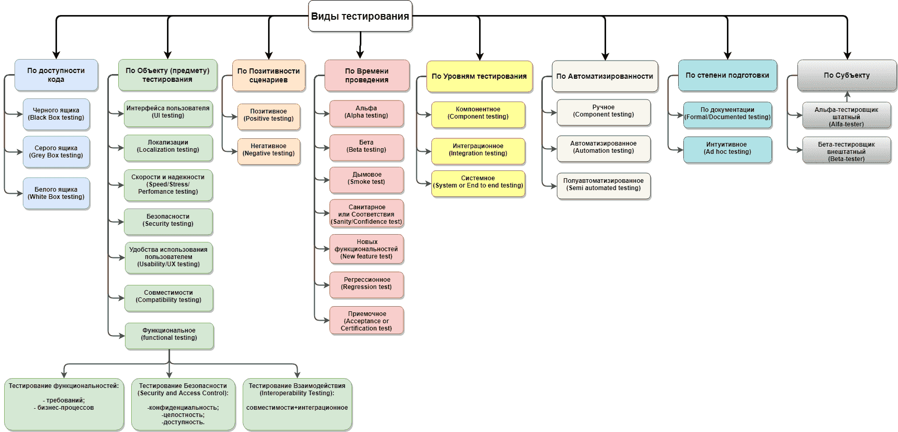

# Концепция юнит-тестирования

В этом разделе мы познакомимся с основами тестирования ПО. Первый пункт текущей статьи охватывает основные виды
тестирования, которые производятся как разработчиками, так и тестировщиками, а также другими специалистами или
даже конечными пользователями. Второй пункт посвящен непосредственно юнит-тестированию, базовые инструменты которого
будут разобраны в следующих статьях.

Кроме того, рекомендую посмотреть вебинар, посвященный введению в тестирование ПО.
Данная статья написана с учетом того, что видео будет просмотрено, поэтому минимизированы перекрытия в содержании,
насколько это возможно в рамках одной темы и уровня знаний целевого читателя:

[](https://youtu.be/_rjoW1Njs8w)

## Тестирование программного обеспечения

Полагаю, вы неоднократно слышали о том, что тестирование бывает разным. Понимание процессов, происходящих на
различных этапах жизненного цикла продукта (в более узком смысле - программы), позволяет определиться с
необходимостью применения разных видов тестирования.

Некоторые проблемы и, соответственно, виды тестирования, призванные их решить, достаточно очевидны даже человеку извне.
Другие могут потребовать более глубокого погружения в контекст и описания специфики проблем. Иные становятся понятны
лишь со временем и с конкретными сложностями, возникшими в продакшене. Либо так и остаются непонятыми - в зависимости
от опыта конкретного человека.

В этом пункте мы поверхностно познакомимся с классификациями и разновидностями тестирования, немного углубившись в те,
с которыми чаще всего сталкивается усредненный бэкенд-разработчик при самостоятельной разработке тестов или же при
взаимодействии с результатами работы своих коллег из смежных направлений.

Итак, некая классификация видов тестирования. Не самая полная и подробная, но достаточно детальная для наших задач:



Рассмотрим некоторые из пунктов. Заранее уточню, что разные пункты из разных колонок могут относиться к одному виду
тестирования на практике - просто в силу того, что каждая колонка представляет собой собственную классификацию по
какому-либо признаку.

### Позитивное и негативное тестирование

Очень общая классификация, которую можно отнести к большинству из видов в соседних колонках.

С **позитивным тестированием** все довольно понятно на интуитивном уровне: независимо от инструментария и подхода мы
проверяем что-то с использованием корректных данных и это что-то работает так, как ожидалось.

Ключевой момент в том, что тестирование происходит с использованием ожидаемых системой данных. Например:

- Тестируемая функциональность: обработка пароля при регистрации аккаунта;
- Требования к паролю: длина от 8 до 20 символов, необходимо использовать хотя бы одну большую и одну маленькую
  букву, хотя бы одно число и один спецсимвол (%, _, &);
- Недопустимо использовать пробелы, буквенные символы, кроме букв латинского алфавита.

При позитивном тестировании будут использоваться корректные пароли: _'Qwerty123_'_, _'Kakoy_parol1488'_ и пр.

В свою очередь **негативное тестирование** предполагает проверку корректности реакции системы на невалидные входные
данные, их отсутствие и прочее. Обычно речь идет о том, что:

1. Работа системы не будет нарушена - условно, вы не увидите некий синий экран из-за того, что ввели невалидный пароль;
2. Система не отработает по позитивному сценарию - в нашем примере пароль НЕ будет принят (аккаунт НЕ будет создан
   или иная реакция, в зависимости от специфики конкретного продукта и требований к нему);
3. Система обработает ситуацию корректно: выдаст некую ошибку. На практике, скорее всего, будет проверено соответствие
   между полученной ошибкой и ожидаемой. Скажем, для пароля _'111'_ будет ошибка _'Слишком короткий пароль'_, для пароля
   _'Мама Любит Раму'_ - _'В пароле использованы недопустимые символы'_, а для попытки создать аккаунт без указания
   пароля - _'Пароль не указан'_.

Как правило, негативное тестирование требует даже большего внимания, чем позитивное, в силу массы причин:

- Число позитивных сценариев ограничено даже для нелинейной логики исполнения, число негативных - стремится к
  бесконечности или же кратно больше;
- Позитивные сценарии так или иначе прописаны в требованиях, более интуитивно-понятны и логически-обоснованы.
  Негативные могут возникать на различных уровнях - от бизнес-логики до банальной валидации входных значений, от не
  прописанной особенности поведения какой-либо функциональности до различных побочных эффектов, в т.ч. не связанных
  напрямую с объектом тестирования. Этому пункту посвящена небольшая заметка ниже*;
- Негативные сценарии имеют большее влияние на систему - вплоть до ее полной неработоспособности;
- И многие иные причины, как общие, так и связанные со спецификой конкретной предметной области или даже конкретного
  продукта.

> *На самом деле, проблема обнаружения негативных сценариев чудовищна.
>
> Во-первых, человеческий мозг всегда старается идти по валидному сценарию, если его знает. А если вы участвуете в
> разработке функциональности - вы знаете, как "должно быть". И умение видеть иные варианты взаимодействия - важный
> и ценный навык. Если вы видели различные мемы, видео и прочие анекдоты про тестировщиков - они обычно посвящены
> именно этому навыку.
>
> Во-вторых, различные участники проектной команды и конечные пользователи обычно имеют разные взгляды на
> функциональность системы. Особенно это заметно, когда член команды не работает с графическим или иным интерфейсом
> продукта, а конечный пользователь видит его в действии. То, что для вас, как разработчика, может показаться очевидным
> и стандартным для работы с конкретной функциональностью, необязательно будет таким же для конечного пользователя,
> и наоборот.
>
> Если вы когда-нибудь пользовались сырым продуктом - от новой версии Word до свежей компьютерной игры - скорее всего,
> встречали баги "на поверхности", проблемные или просто некомфортные сценарии - казалось бы, можно сделать
> удобнее и даже очевидно как именно!
>
> В общем-то, все это про "во-вторых". Конечно, иногда подобные истории связаны с неудачной экономией на тестировании.
> Но гораздо чаще дело в том, что проектной команде это _не очевидно_: они не взаимодействовали с системой в
> качестве пользователей. Именно отсюда растут ноги различных фокус-групп, стадий альфа- и бета-тестирования (о них
> ниже) и, отчасти, A/B-тестирования (о нем не будет, но можно погуглить).

### Мануальное и автоматизированное тестирование

Этот пункт больше относится к работе QA, а не к разработчикам, но пару слов о нем стоит сказать.

Тестирование по автоматизации можно разделить на три вида, как видно на схеме выше. Полуавтоматизированное
тестирование мы опустим, поскольку концептуального значения оно не имеет.

**Мануальное тестирование**, вне зависимости от объекта тестирования, имеет очевидный признак: тестировщик проверяет
тестовые сценарии самостоятельно - тыкает кнопки на GUI, отправляя запросы на сервер или иным способом. Вручную же
сравнивает полученный результат с ожидаемым.

Такой подход имеет ряд плюсов:

- Тестировщик, в ряде случаев, имитирует действия живого пользователя и, как следствие, может заметить что-то, что
  пользователю будет доставлять дискомфорт. Или же заметить баги, не очевидные для того, кто системой не пользуется -
  разработчика, например:)
- Некоторые виды тестирования плохо поддаются автоматизации - особенно те, которые связаны с GUI и эргономикой;
- Мануальные тестировщики банально дешевле, по крайней мере, на короткой дистанции. Как с точки зрения зарплаты, так
  и с точки зрения потребляемых вычислительных мощностей.

Кроме того, мануальное тестирование предполагает написание **тестовой документации** - в том числе сценариев
тестирования (тест-кейсов), которые в дальнейшем могут быть использованы для автоматизации тестирования.

**Автоматизированное тестирование**, как можно догадаться - это весь спектр видов тестирования ПО, при котором тестовые
сценарии описываются в виде скриптов, а само "тестирование" заключается в запуске этих скриптов. Такой подход хорош
для функциональных тестов, тестирования нагрузки (его реализуемость в мануальном режиме крайне сомнительна) и многих
других. Но, очевидно, не позволяет тестировать эргономику или эффективно тестировать GUI. Кроме того, он требует
вычислительных мощностей на само выполнение тестов - гораздо больших на единицу времени, нежели мануальное тестирование.

Также к автоматизированному тестированию относится использование ряда сторонних инструментов. Относительно простым
примером может послужить автоматическая проверка используемых версий внешних библиотек на наличие уязвимостей -
частный случай аудита (тестирования) безопасности системы. В данном примере принцип работы похож на антивирус -
некая программа индексирует используемые библиотеки и проверяет по своей внутренней базе наличие уязвимостей у
используемых в системе версий этих библиотек.

Юнит-тестирование в том виде, в котором мы его будем изучать в этом разделе - тоже пример автоматизированного
тестирования.

> **!NB**: чаще всего термин "автоматизация тестирования" используется в контексте проверки неких пользовательских
> сценариев в автоматическом режиме: определенный сценарий действий потенциального пользователя описывается в виде
> скрипта и этот скрипт запускается автоматически, а результаты его работы - автоматически же валидируются. Т.е. в
> узком смысле речь идет об "автоматизации функционального тестирования". О самом функциональном тестировании - чуть
> позже.

### Тестирование производительности

Достаточно широкий вид и крайне важное, но, к сожалению, не самое распространенное направление тестирования.

В упрощенном виде **тестирование производительности** можно описать как проверка возможности системы выдерживать
определенную нагрузку - постоянную или пиковую, по числу активных пользователей или одновременных операций.

Данный вид тестирования не требует частых активных действий - его нет смысла запускать после каждой выполненной
задачи или даже каждой итерации разработки (мы еще не знакомы с методологиями разработки, но можете погуглить термин
**sprint** в **scrum-методологии**). Но он может дать ценную информацию как о пропускной способности системы в целом,
что позволяет принять меры по масштабированию системы или введению определенных ограничений - например, на количество
одновременных онлайн пользователей, так и идентифицировать отдельные узкие места и увеличить производительность всей
системы, от этих узких мест избавившись.

Тестирование производительности, в зависимости от команды, может быть ответственностью как разработчиков или
тестировщиков-автоматизаторов, так и отдельной роли (достаточно редко) - **performance analyst** или
**performance tester**.

Проблема же этого вида тестирования часто упирается в его дороговизну - кроме самих скриптов для тестирования
требуется иметь возможность генерировать саму тестовую нагрузку - имитировать одновременные действия множества
пользователей. Когда речь идет о тысячах или десятках тысяч пользователей (не говоря о больших значениях) - это
становится ощутимой проблемой.

### Функциональное тестирование по уровням изолированности

Этот пункт соответствует классификации по уровням тестирования для функциональных тестов. Именно с этими тестами
чаще всего приходится сталкиваться разработчику и, соответственно, они представляют для нас наибольший интерес.

**Функциональное тестирование** - вид тестирования, включающий в себя различные подходы к тестированию конкретных
функций системы.

В противовес ему выделяют **нефункциональное тестирование** - к нему относятся тестирование производительности,
безопасности и прочие, которые тестируют не выполнение системой поставленной перед ней задач, а качество работы
системы в различных разрезах.

Стоит понимать, что тут обычно под функцией понимается не именованный блок программного кода, а некая бизнес-функция -
это может быть и функция сложения чисел у калькулятора, и функция расчета ВВП страны, и функция игры с компьютером в
шахматы. Иными словами, это некая логически завершенная и условно-самодостаточная часть возможностей системы,
которую можно выделить как самостоятельную единицу функциональности.

Функциональное тестирование достаточно удобно делится по **уровням изолированности** тестируемых блоков:

#### Юнит-тестирование

**Юнит-тестирование** (оно же компонентное, оно же модульное тестирование) - это, как правило, тестирование одной
функции в программном смысле. В разрезе Java это обычно тестирование каждого публичного (реже - `protected` или даже
`package-private`*) метода независимо от других классов и/или методов того же класса. В первую очередь этому виду
тестирования посвящен раздел, который мы сегодня начали изучать;

> *Стоит отметить, что самостоятельное тестирование `package-private` методов является скорее вынужденной практикой
> в ситуациях, когда приходится поддерживать старые проекты, не покрытые юнит-тестами ранее. Обычно это связано с
> тем, что публичные методы содержат слишком большую смысловую и кодовую нагрузку, что делает их тестирование крайне
> трудозатратным и тяжелым в поддержке (самих тестов). Де-факто, `package-private` методы в таких ситуациях - приватные
> методы, которым повысили модификатор доступа ради тестирования. Связано это с технической невозможностью тестировать
> приватные методы с помощью принятых в сообществе инструментов. Этот нюанс станет понятнее уже в следующем уроке.
>
> При разработке новой функциональности такого подхода стоит избегать или хотя бы минимизировать его.

В силу того, что тестируются конкретные методы классов, которые чаще всего нельзя изолировать из "внешнего мира" -
юнит-тестирование является прерогативой разработчиков.

#### Интеграционное тестирование

**Интеграционное тестирование** - следующий, менее изолированный уровень, объединяющий различные формы тестирования на
уровне модуля. В микросервисной архитектуре (один из видов архитектуры, при котором продукт состоит из множества
независимо запускающихся программ, взаимодействующих через HTTP, БД или иным образом) это обычно тестирование одного
микросервиса изолированно от остальных. Для монолитных приложений это может быть тестирование конкретной подсистемы или
модуля (ближе всего подходит понятие модуля в Maven, но это грубая аналогия) или даже просто нескольких
взаимодействующих классов. Все, что находится вне тестируемого "модуля" - не работает, а заменяется имитацией - в
следующих статьях мы познакомимся с понятием Mock'а.

В зависимости от реального уровня изоляции и используемого инструментария, интеграционное тестирование может быть
ответственностью как разработчиков, так и тестировщиков. В случае с тестировщиками в данном случае почти всегда
имеются ввиду автоматизаторы.

#### End-to-end тестирование

**Системное** или, чаще, **end-to-end**(**e2e**) **тестирование** - тестирование продукта целиком. При этом
бизнес-функции тестируются по-отдельности, но в рамках всего приложения - т.е. нигде и ничего не имитируется, все
элементы системы работают по-настоящему. Это достаточно трудозатратный вид тестирования, который наиболее приближен
к реальной работе продукта, за исключением нагрузки на систему (по крайней мере, пока мы рассуждаем в парадигме
функционального тестирования).

Стоит понимать, что тестирование по уровням изолированности компонентов - лишь еще одна из классификаций. Она
необязательно связана с функциональными тестами. Мы же рассматриваем ее в разрезе функционального тестирования потому
что это ближе к типовым задачам разработчика.

### Заключение

В обзорной статье тяжело рассмотреть все и сразу. Поэтому в качестве самообразования рекомендую познакомиться
с рядом концепций, с которыми вы скорее всего столкнетесь в командной работе. Они достаточно просты, но их понимание
позволит лучше понять бизнес-процессы внутри проектной команды:

- **Smoke-тестирование**;
- **MAT** (_Minimal Acceptance Test_) **тестирование**;
- **AT** (acceptance testing) **тестирование**;
- Регрессионное тестирование.

Мы же, тем временем, углубимся в концепцию юнит-тестирования.

## Юнит-тестирование

> Вначале разберемся с терминологией. Далее будет активно использоваться понятие **тестовый метод** - это то,
> что и называют **юнит-тестом** в узком смысле. Это некий метод специального тестового класса,
> который содержит вызов тестируемого метода с определенным набором параметров и сверку результатов этого вызова с
> ожидаемыми.
>
> Возможно, звучит сложно, но дальше станет понятно - особенно когда начнем знакомиться с юнит-тестами на практике.

Юнит-тестирование, если отойти от базовой информации выше, означает покрытие кода (логики) тестовыми методами.

Как правило, одному тестируемому классу соответствует один класс с тестами. При этом каждому публичному методу
тестируемого класса соответствует один или несколько тестовых методов тестового класса, проверяющих тестируемый.

Однако вернемся к тестовому методу.

Кроме уже обозначенных частей для вызова тестируемого метода и сверки результатов, тестовый метод может содержать некую
подготовительную часть до вызова тестируемого метода - в ней может содержаться как подготовка данных - создание
объектов, используемых в качестве параметров, так и кодовые инструкции для замены поведения связанных методов и/или
классов имитациями, что и позволяет достигать изолированности тестируемого метода.

Сами блоки - подготовка, вызов и сверка - исключительно логические. Т.е. это просто части кода тестового метода,
которые отвечают за указанные операции. При этом они могут быть как выделены визуально, так и нет. Об этом будем
говорить подробнее в следующей статье.

Кажется, с подготовкой и вызовом более-менее прозрачно, что же с третьей частью? Сверка полученных данных с ожидаемым
результатом тоже может выглядеть по-разному, в зависимости от используемых инструментов:

- Сверка возвращаемого значения с ожидаемым. Наиболее каноничный вариант. Также может проверяться, что вернулось
  исключение, которое ожидалось (для негативных сценариев). Этот вариант хорош всем, кроме того, что им
  проблематично тестировать void-методы;
- Проверка внутренних вызовов. С помощью ряда библиотек можно проверять, какие методы вызывались внутри тестируемого
  блока, сколько вызовов методов произошло и с какими параметрами. По сути, это основной сценарий тестирования
  void-методов, но он вполне используется совместно с предыдущим пунктом. Проверки подобного рода имеют свои
  издержки и недостатки, но об этом мы подробно поговорим в уроке, посвященном Mock'ам;
- Все прочие проверки. Это могут быть проверки содержимого каких-то промежуточных объектов, живущих внутри метода - для
  этого тоже есть инструменты - или иные вспомогательные средства, помогающие определить, что внутри тестируемого
  метода происходило именно то, чего мы ожидали.

В идеальном случае, число тестовых методов должно быть не меньше, чем число вариантов поведения метода при разных
входных данных (с поправкой на циклы внутри метода).
Т.е. метод без условных конструкций, циклов и throws-блока может быть покрыт одним тестовым методом. А может
потребовать и большее число сценариев - например, если необходимо проверить поведение метода при передаче в него
null-параметров, или если понятны некие логические ограничения - скажем, метод сложения двух чисел может потребовать
отдельный тестовый метод для проверки сценария выхода за пределы вместимости типа. Пример условный, но хорошо
демонстрирует, что линейная структура метода не означает единственный возможный сценарий поведения.

В случае с наличием в тестируемом методе цикла, количество итераций которого как-либо зависит от входных параметров,
также может потребоваться несколько тестовых методов:

- Для 0 итераций. Скажем, если происходит перебор массива или коллекции, переданной параметром - передать пустую
  коллекцию или массив;
- Для 1 итерации;
- Для нескольких итераций. Особенно если тело цикла содержит некие аккумуляционные вычисления - поведение всего
  метода при 0, 1 и 10 итерациях цикла может быть кардинально разным;
- Исключение. При переборе все той же коллекции/массива из параметра - в сам параметр передан `null`.

Конечно, на практике все будет зависеть от внутренней логики - вполне может оказаться, что четыре метода ради одного
несчастного цикла - избыточно. Скажем, число итераций не имеет решающего значения. Или сам цикл вспомогательный и
вообще не является значимым в рамках тестируемого метода.

Чуть проще дело обстоит с условными конструкциями - `if-else` и `switch-case`. Количество тестовых методов скорее
всего будет пропорционально количеству опций. Т.е. метод, состоящий из

```java
    if (condition1) {
        // some logic
    } else if (condition2) {
        // some logic
    } else {
        // some logic
    }
```

с линейной логикой в каждом блоке достаточно покрыть тремя тестовыми методами.

Не всегда этим правилам необходимо следовать буквально - вполне возможно, что отличия в поведении метода 
мало зависят от отдельного `if-else` блока внутри. Но, как минимум, стоит покрывать все сценарии с ключевой разницей в 
поведении, а также каждый негативный (завершающийся выбросом исключения) сценарий по отдельности. В целом же, 
необходимость покрывать свое решение тестами может служить хорошим мотиватором писать чистый и, как следствие, 
легко тестируемый код.

Кроме того, советую обратить внимание, что в данном пункте я часто говорю о тестировании "логики". Имеется 
ввиду, что юнит-тестирование подразумевает проверку методов, производящих некую полезную нагрузку - нет особого 
смысла в покрытии тестами геттеров, сеттеров и различных вспомогательных методов.

В завершение отмечу, что несмотря на некоторую монструозность описаний в данной статье, практическая часть 
юнит-тестирования редко вызывает трудности. Особенно, если стараться покрывать код тестами своевременно и писать 
сами тесты чисто. Рекомендациям по оформлению тестовых методов будет посвящена часть следующего урока, они тоже 
достаточно просты.

Единственное, что может по-настоящему испортить покрытие кода тестами - слабый уровень понимания технического решения
и/или бизнес-задач, которые тестируемый код призван решить. Хорошая новость в том, что локализация непонимания,
возникшего при написании теста, позволяет хорошо и предметно сформулировать вопрос коллегам. Это может стать точкой
роста как в профессиональном плане, так и в овладении предметной областью.

#### На сегодня все!


Если что-то непонятно или не получается – welcome в комменты к посту или в лс:)

Канал: https://t.me/ViamSupervadetVadens

Мой тг: https://t.me/ironicMotherfucker

**Дорогу осилит идущий!**
