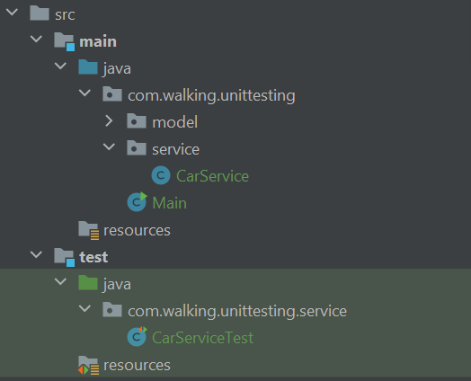

# JUnit

Сегодня мы познакомимся с фреймворком (или библиотекой, в данном случае терминология не однозначна) для
Unit-тестирования, которая стала фактически стандартом для Java-приложений: вплоть до того, что при создании
Gradle-проекта в IDEA этот фреймворк будет автоматически добавлен в тестовые зависимости. Имя ему - JUnit.

Разумеется, у нее есть аналоги, но они останутся за пределами курса в силу относительной непопулярности и, зачастую,
схожести базового API с JUnit.

Сама статья построена с фокусом на примеры применения описываемых функций, чтобы облегчить закрепление полученных
знаний на практике. В силу многообразия инструментов, предоставляемых библиотекой, затронуты будут наиболее
популярные и ключевые функции, позволяющие покрыть большинство практических сценариев. Остальные будут упоминаться
вскользь или не будут упомянуты вообще. В силу этого не стоит относиться к статье как к полноценному обзору
возможностей библиотеки, ее основная задача - продемонстрировать практическую реализацию концепций из предыдущего урока.

## Окружение, тестовые классы и методы

Как было указано в предыдущей статье, процесс юнит-тестирование в лаконичном изложении - запуск тестовых методов,
которые находятся (удивительно!) в тестовых классах.

В данной статье мы будем рассматривать написание юнит-тестов в Gradle-приложении, в силу этого некоторые структурные
нюансы могут быть специфичны для данной системы сборки. Впрочем, при использовании Maven отличия были бы связаны с
синтаксисом конфигурации, не более.

Итак, подключение JUnit в Gradle-приложение заключается в добавлении соответствующих зависимостей:

```groovy
testImplementation 'org.junit.jupiter:junit-jupiter-api:5.8.1'
testRuntimeOnly 'org.junit.jupiter:junit-jupiter-engine:5.8.1'
```

`junit-jupiter-api`, как можно догадаться из названия, представляет собой набор функциональности для написания
юнит-тестов, а `junit-jupiter-engine` - движок, инкапсулирующий в себе внутренние механизмы исполнения тестового кода.

В целом, можно сделать и проще - существует зависимость-агрегатор, включающая в себя в т.ч. и указанные выше
артефакты: `junit-jupiter`.

После подключения тестовых зависимостей мы можем приступать к непосредственному написанию тестов.

Тестовые классы и методы располагаются в директории `${projectHome}/src/test/java`. Сами тестовые классы обычно
располагаются в тех же пакетах (хоть это и физически разные директории), что и тестируемые. Это необходимо для
обеспечения видимости `protected` и `package-private` полей и методов тестируемого класса. Ниже будет рассмотрен
пример расположения тестируемого и тестового классов.

Рядом, в директории `${projectHome}/src/test/resources` могут быть расположены ресурсы, используемые тестами - от
файлов с тестовыми данными до конфигураций тестового окружения. Но на данный момент работы с тестовыми ресурсами мы
касаться не будем - тем более, концептуальной разницы в сравнении с использованием обычных ресурсов (из
`${projectHome}/src/main/resources`) нет. Серьезным нюансом будет лишь зона видимости - по умолчанию, собранный и
запущенный проект будет иметь доступ только к "обычным" ресурсам, а тесты во время выполнения - только к тестовым.

Пример расположения тестируемого и тестового класса в Gradle-проекте:



`CarService` - тестируемый класс, а `CarServiceTest` - тестовый для `CarService`. При этом если открыть каждый из
них, расположение класса будет обозначено пакетом `com.walking.unittesting.service`.

Постфикс `Test` в конце тестового класса не является обязательным, но я рекомендую его использовать по следующим
причинам:

- Поскольку тестируемый и тестовый класс находятся в одном пакете - они не могут называться одинаково. Т.е. мы в
  любом случае вынуждены как-то идентифицировать то, что тестовый класс тестируем именно `CarService`, а не какой-то
  другой класс из этого пакета, и именно этот класс является тестовым. Постфикс `Test` - общепринятое и, в общем-то,
  удобное обозначение;
- Сам JUnit не опирается на название класса или файла для его идентификации как тестового (в отличии, например, от
  стандартного механизма тестирования в языке Go). Однако иные инструменты вполне могут опираться на название в силу
  общепринятости подхода - другие библиотеки и фреймворки, IDEA или иные инструменты разработки. IDEA, к слову,
  имеет соответствующий warning, если название не совпадает с ожидаемым.

Кажется, с тестовыми классами понятно, а что же с тестовыми методами? Разберем на примере.

Попробуем тестировать класс `CarService`, представленный выше. За основу был взят соответствующий класс из практики
к уроку 61:
[ссылка на GitHub](https://github.com/KFalcon2022/practical-tasks/blob/master/src/com/walking/lesson61_synchronized/service/CarService.java).
Но в него были внесены некоторые изменения. Репозиторий с используемой кодовой базой можно найти в конце статьи.

Для удобства, необходимый нам фрагмент размещен ниже:

```java
public class CarService {
    private final Map<CarIdentifier, Car> cars = new HashMap<>();

    public synchronized Car add(Car car) {
        if (cars.containsKey(car.getIdentifier())) {
            throw new RuntimeException("Car exists");
        }

        cars.put(car.getIdentifier(), car);

        return car;
    }

    // Другие методы класса
}
```

Попробуем написать юнит-тесты для метода `add()`. Исходя из кодовой базы, логичным выглядит написание как минимум двух
юнит-тестов: проверка успешного добавления новой машины и выброс исключения в случае, если машина уже существует.

Объявим необходимые тестовые методы в `CarServiceTest`:

```java
class CarServiceTest {

    @Test
    void add_success() {

    }

    @Test
    void add_carExists_failed() {

    }
}
```

Здесь стоит обратить внимание на несколько нюансов.

Во-первых, аннотация [@Test](https://junit.org/junit5/docs/5.0.1/api/org/junit/jupiter/api/Test.html). Она (и ряд
других аннотаций) является индикатором того, что метод является тестовым. Вне зависимости от того, тестирует ли он
что-то на самом деле.

Во-вторых, сигнатура и модификаторы тестовых методов. Исторически такие методы являются `package-private`, но вы
можете дать им более широкий модификатор доступа. Другой вопрос, что практического смысла это не имеет - тестовые
методы не вызываются в программном коде явно.

Кроме того, тестовые методы обычно создаются без параметров. Исключения есть, часть из них мы затронем ниже. Но
стандартный тестовый метод параметров не содержит - они ему ни к чему, все необходимые данные будут либо созданы
внутри самого метода, либо доступны через поля тестового класса. Последних у нас пока нет, но это временно.

И, наконец, название самих методов. Вы можете заметить, что привычный camelCase здесь дополнен использованием
символа подчеркивания.

На самом деле в Java-сообществе не существует единого общепризнанного подхода к именованию тестовых методов. С одной
стороны, есть общее правило об использовании camelCase, которое однозначно определяет способ именования методов.

С другой, название метода должно быть осмысленным и давать информацию о том, что делает конкретный метод. Но
проблема в том, что тестовые методы - это, по сути, сценарии тестирования, в которых можно выделить несколько
ключевых информационных блоков:

- Какой метод тестируется;
- Какой сценарий поведения проверяется. В методах с обширным ветвлением и/или высоким уровнем вложенности логики
  таких сценариев может быть достаточно много;
- При каких условиях метод запускается: входные параметры, предварительная конфигурация. По сути, от этого зависит
  предыдущий пункт;
- Что именно проверяется в результате*.

> *На практике блок сверки результатов может быть весьма объемным, в силу чего может быть удобным разделить один
> юнит-тест на несколько, с примерно одинаковым сценарием тестирования, но различными акцентами при проверке
> результата. Существует даже идея написания тестовых методов по принципу "один метод - одна проверка", но на
> практике я такого не встречал.

Из-за этого название тестового метода может быть достаточно длинным, и его восприятие в camelCase может быть
затруднительным.

На практике существует масса различных подходов к именованию, отличающихся в зависимости от команды и проекта. Мне
импонируют два варианта.

Первый из них представлен в коде выше. Например, `add_carExists_failed()`. Здесь название разбивается на три блока,
описываемых в camelCase и разделенных символом подчеркивания. Первым указан тестируемый метод, вторым - тестируемый
сценарий (такая машина уже существует под управлением сервиса). И, наконец, третьим блоком описан ожидаемый
результат выполнения метода при указанном сценарии: `success` или `failed` для методов с простой логикой, где
`failed` - общее обозначение негативных сценариев. Для более сложных методов последний блок может быть более
детальным, с указанием результатов выполнения - тезисного описания возвращаемого значения и/или ключевых побочных
эффектов.

При таком подходе, с одной стороны, могут теряться как детали исходной конфигурации - какие именно данные нужно
передать на вход, какие подготовительные шаги необходимо произвести, не уточняется, каким именно образом
валидируется результат. С другой же стороны, название метода сохраняет тестируемый бизнес-сценарий, что удобно и при
знакомстве с кодовой базой, и при частичном изменении кода самого метода, его параметров или условий выполнения
сценария.

Второй подход заключается в максимально упрощенном именовании самого метода, вплоть до названия тестируемого метода
и порядкового номера тестового сценария: `add1()`. При этом все ключевые детали указываются в Javadoc,
сопровождающем этот метод, с некоторой формализацией, чтобы от сценария к сценарию структура описания была однотипной:

```java
/**
 * When: car exists
 * Result: RuntimeException("Car exists")
 */
@Test
void add1() {

}
```

Этот вариант неплохо подходит для ситуаций, когда приходится покрывать тестами плохо декомпозированный код, в
котором какая-то сложная логика размещается в одном классе с доступом через один публичный метод. Хорошо, если в
таком коде есть хотя бы декомпозиция на приватные методы - им можно повысить модификатор доступа до
`package-private` и тестировать уже их. Но иногда нет и этого.

Но при тестировании простых методов такой подход не целесообразен - и выглядит более громоздко, и трудозатрат на
такое описание больше, чем при обычном именовании метода.

Полагаю, со временем у вас сформируется собственная точка зрения на этот вопрос. В данном случае детали именования
предоставлены скорее как контекст для тезисов и акцентов, на которые стоит опираться при покрытии кода
юнит-тестами, нежели в качестве агитации за конкретный подход.

## Assert

Вернемся к самому механизму тестирования и проверки результатов.

Механизмов проверки есть несколько, как в самом JUnit, так и в дополнительных библиотеках - в том числе Mockito, с
которой мы познакомимся в следующей статье.

Тем не менее можно выделить самый базовый из них - **assertion** (утверждение). Концептуально, этот способ
направлен на проверку возвращаемого значения тестируемого метода, но может быть применен и иначе - например, если
тестируемых метод изменяет переданные в него параметры.

На практике JUnit предоставляет класс `Assertions`. Он содержит ряд статических методов, начинающихся со слова
"assert", которые проверяют переданный объект (или объекты, или примитив(-ы)) на соответствие определенному условию.

В общем случае, подобные методы принимают параметрами ожидаемый и фактический результаты выполнения тестируемого
метода и производят их сравнение. Или же только фактический результат, валидируя его по определенному правилу. Если
правило соблюдено - тестовый метод выполняется дальше, если нет - прерывается, тест считается "проваленным"
или "упавшим", что означает несоответствие поведения тестируемого метода ожиданиям.

Ниже представлены несколько наиболее популярных вариантов. Стоит понимать, что большинство из них имеют массу
перегрузок для разных типов данных, добавления каких-либо побочных эффектов (специфическое сообщение в консоль,
выброс указанного исключения и пр.) и т.д.

- `assertEquals()`. Проверяет, что переданные параметры равны по значению (для примитивов) или по `equals()` (для
  ссылочных типов);
- `assertNotEquals()`. Проверяет, что переданные параметры на НЕ равны по значению или по `equals()`;
- `assertTrue()`. Проверяет, что переданное булево значение - `true`;
- `assertFalse()`. Проверяет, что переданное булево значение - `false`;
- `assertNull()`. Проверяет, что переданный параметр равен `null`;
- `assertNotNull()`. Проверяет, что переданный параметр НЕ равен `null`;
- `assertThrows()`. Проверяет, что при выполнении переданного лямбда-выражения (обычно содержащего вызов
  тестируемого метода) падает определенное исключение.

Есть и более специфические методы - проверка, что выполнение переданной лямбды НЕ завершается исключением, проверки
массивов и коллекций на равенство элементов, проверки объектов на равенство по ссылке, проверка объекта на
принадлежность конкретному типу (или иерархии).

Существует даже проверка времени выполнения переданного лямбда-выражения, хотя полезность подобной функциональности
сомнительна.

С полным списком assert-методов в JUnit можно ознакомиться по
[ссылке](https://junit.org/junit5/docs/5.0.1/api/org/junit/jupiter/api/Assertions.html).

Также там можно увидеть ряд fail-методов, которые завершают тест как проваленный, не производя каких-либо проверок.
Подобные методы могут иметь смысл, если валидация результата была сделана самостоятельно - например, потому что
функциональности используемых тестовых фреймворков и библиотек не хватило. Но на практике такое встречается редко.

Рассмотрим, как assert-методы можно использовать на практике, протестировав `CarService#add()`:

```java
class CarServiceTest {

    // Объявление используемых констант

    @Test
    void add_success() {
//        given
        var carService = new CarService();

//        when
        var actual = carService.add(CAR_1);

//        then
        assertEquals(CAR_1, actual);
        assertEquals(1, carService.findAll().size());
    }

    @Test
    void add_carExists_failed() {
//        given
        var carService = new CarService();
        carService.add(CAR_1);

//        when
        Executable actual = () -> carService.add(CAR_1);

//        then
        assertThrows(RuntimeException.class, actual);
        assertEquals(1, carService.findAll().size());
    }
}
```

Ключевые моменты:

- Комментарии с обозначением "given-when-then" обозначают начала блоков подготовки тестового окружения, запуска
  тестового сценария и сверки результатов соответственно. Об этих блоках тестового метода упоминалось в предыдущей
  статье. Явное их обозначение не обязательно, но может быть полезно в сложных методах, блоки подготовки и валидации
  в таких случаях бывают многословны. Само именование таких "блоков" обозначенным способом вполне распространено, но
  является не единственным возможным. Как и всегда, зависит от конкретной команды и проекта;
- assert-методы обычно импортируются статически, чтобы не загромождать код избыточной информацией. Как правило, в
  рамках использования конкретного тестового фреймворка класс таких методов очевиден. То же может быть актуально
  для методов вспомогательных тестовых библиотек;
- Даже в рамках одного тестового сценария способы проверки могут быть вариативны. Например, в `add_success()` можно
  было бы сравнивать ожидаемую и фактически полученную машину по `assertSame()` - сравнение по ссылке, поскольку из
  кода метода следует, что вернуться должна именно та машина, которая была передана параметром в метод. Также в
  обоих методах можно было бы использовать `assertIterableEquals()` - проверка на равенство содержимого коллекций,
  вместо сравнения числа хранимых сервисом машин с ожидаемым. Выбор конкретных способов валидации должен зависеть от
  требуемой от метода логики - возможно, возвращать именно ту же машину критично. А может быть, это не критическое
  условие и уже завтра потребуется добавлять в сервис копию машины, а не сам переданный параметром объект. В
  последнем случае нам бы пришлось переписывать тест, изменись эта часть логики. Поэтому важен баланс между степенью
  валидации значений и поведения и чувствительностью конкретной логики к второстепенным изменениям технической
  реализации. Это не так сильно ощутимо именно при проверке через `Assertions` и юнит-тестах в целом, но может стать
  проблемой при использовании иных инструментов валидации и/или других видов функционального тестирования -
  интеграционном и end-to-end тестах;
- В данном примере для валидации выполнения одного метода (`add()`) используется другой - `findAll()`. В целом, это
  допустимая и достаточно частая практика, но использование этого приема стоит, по возможности, минимизировать - вполне
  может быть так, что тест упадет не из-за некорректности поведения тестируемого метода, а из-за ошибок поведения в
  методе, использованном при валидации результатов. Зачастую, определить это можно по падению также и тестов метода,
  используемого для валидации, но только при условии, что все тесты будут корректны и сам метод будет ими
  полноценно покрыт. К сожалению, так бывает не всегда.

## Подготовка и очистка контекста

Вы могли заметить, что даже в двух простых тестовых методах выше есть повторяющийся код, который точно не зависит от
тестируемого метода. В нашем случае - создание экземпляра тестируемого класса:

```java
var carService = new CarService();
```

Полагаю, очевидно, что чем более сложную логику мы тестируем, тем больше подобного однотипного кода придется
размещать в каждом тестовом методе. Кроме того, определенный "boilerplate"-код привносят и некоторые инструменты
тестирования.

На первый взгляд, в данном конкретном случае можно вынести эту переменную в поле тестового класса и инициализировать
там же*. Но ведь предварительная конфигурация может быть более широкой, чем просто создание экземпляров нужных 
классов - а это уже проблема. 

Для того чтобы сделать описание подобной типовой конфигурации комфортной, а иногда и сэкономить вычислительные ресурсы 
на инициализации тестового окружения, существуют несколько аннотаций, с помощью которых возможно централизация 
управления подготовкой контекста для тестового метода перед его вызовом и очистка этого контекста после.

> Может показаться, что при таком подходе каждый тест будет вносить собственные изменения в тестируемый экземпляр, 
> из-за чего один тестовый метода сможет влиять на результаты другого тестового метода. Если учесть, что по умолчанию 
> JUnit не гарантирует выполнение тестов в каком-то определенном порядке - это катастрофа.
> 
> Но на самом деле конфигурация JUnit по умолчанию будет создавать новый экземпляр тестового класса на каждый вызов 
> тестового метода. Это достаточно важный момент, поскольку от него зависят некоторые ограничения написания 
> тестового кода. Отчасти это будет пояснено ниже.
> 
> При желании можно эту конфигурацию изменить. Подробнее - 
> [здесь](https://junit.org/junit5/docs/current/user-guide/#writing-tests-test-instance-lifecycle). Но при 
> изменении дефолтной конфигурации проблема, описанная в первом абзаце заметки станет действительно актуальной.

### @BeforeEach

Метод, над которым повешена данная аннотация будет запускаться перед выполнением каждого тестового метода. В нашем
случае мы могли бы разместить в таком методе вызов конструктора `CarService`, тем самым сократив код тестовых методов:

```java
class CarServiceTest {

    // Объявление используемых констант

    private CarService carService;

    @BeforeEach
    void setUp() {
        carService = new CarService();
    }

    @Test
    void add_success() {
//        when
        var actual = carService.add(CAR_1);

//        then
        assertEquals(CAR_1, actual);
        assertEquals(1, carService.findAll().size());
    }

    @Test
    void add_carExists_failed() {
//        given
        carService.add(CAR_1);

//        when
        Executable actual = () -> carService.add(CAR_1);

//        then
        assertThrows(RuntimeException.class, actual);
        assertEquals(1, carService.findAll().size());
    }
}
```

Обратите внимание на название BeforeEach-метода: `setUp()`. В целом, название не имеет значения для JUnit, но
называть метод именно так - распространенная практика. В т.ч. такое имя будет предложено IDEA по умолчанию.

### @AfterEach

Данная аннотация, расположенная над методом, приведет к тому, что этот метод будет вызываться после каждого
тестового метода. В нашем случае с `CarService` это не слишком актуально - конечно, можно было бы завести метод
вроде `clear()` или `deleteAll()` и вызывать его для очистки коллекции, хранящей машины. Но как уже было сказано
выше - использование в тестовом классе методов тестируемого класса стоит минимизировать.

Более удачным сценарием применения могло бы быть закрытие ресурсов (скажем, доступа к файлу), если бы в
`setUp()` было расположено создание I/O Stream'а или нечто подобное.

> На самом деле, область применения этого метода сильно зависит от используемых инструментов тестирования - с
> некоторыми более приближенными к реальности мы познакомимся в следующей статье. Хотя и там суть будет сводиться к
> закрытию ресурса:)

Принятое имя для AfterEach-метода - `tearDown()`.

### @BeforeAll

Метод с такой аннотацией будет запускаться перед вызовом методов тестового класса. Таким образом, если число вызовов
`setUp()` равно числу вызовов тестовых методов, то BeforeAll-метод вызывается для одного тестового класса
единожды.

В этом методе может быть расположена более устойчивая конфигурация тестового контекста - например, инициализированы
классы, используемые тестируемым, но никак не изменяемые в рамках юнит-тестов. Таким образом, эту часть конфигурации
все также неудобно размещать в каждом тестовом методе, но и размещать ее в `setUp()` - избыточно.

Важно понимать, что из-за особенности конфигурации по-умолчанию, такой BeforeAll-метод должен быть статическим. 
Соответственно, и все поля, с которыми он взаимодействует - тоже. От этого можно уйти, если установить конфигурацию, в 
которой экземпляр тестового класса будет создаваться единожды.

Рассматриваемый нами `CarService` в текущем виде не подходит для демонстрации подобной функциональности, но можно
легко придумать пример на его основе. Допустим, внутри CarService мы захотим использовать некий `ValidationService`,
проверяющий переданную машину в соответствии с некоторыми правилами: корректность формата номера, существование
машины с такими данными в удаленной БД - не суть важно. Главное, что мы никак не изменяем состояние и поведение
этого класса своими тестовыми методами. В таком случае, мы могли бы создание `ValidationService` вынести в
BeforeAll-метод, а инициализацию `CarService`, включая передачу объекта `ValidationService` параметром конструктора -
оставить ответственностью `setUp()`.

С названием BeforeAll-метода обычно не заморачиваются - называют `beforeAll()`. Но, как и для других методов
конфигурации - это не какое-то общепринятое обозначение, лишь распространенная практика. Вряд ли единственная.

### @AfterAll

Полагаю, вы уже догадались, что тут происходит - метод, аннотированный `@AfterAll` вызывается после запуска всех
тестов в классе.

Логика использования тоже проглядывается - закрытие каких-либо ресурсов, открытых в `beforeAll()`. Но конкретные
примеры на данном уровне знакомства с Java-разработкой придумать сложно.

Распространенное название - `afterAll()`. Как и `beforeAll()`, при конфигурации по умолчанию этот метод должен быть 
статическим.

Таким образом, жизненный цикл тестового метода можно упрощенно представить в следующем виде (если он единственный в
тестовом классе):

1. `beforeAll()`;
2. `setUp()`;
3. Вызов тестового метода;
4. `tearDown()`;
5. `afterAll()`.

На самом деле, жизненный цикл может быть сложнее и может отличаться в зависимости от конфигурации самого JUnit. Но
представления в таком виде будет вполне достаточно для junior-специалиста.

## Параметризованные и повторяющиеся тесты

Аннотация `@Test`, использованная для обозначения тестовых методов выше, является основной, но не единственной -
существуют и другие.

Более продвинутые варианты, как правило, кроме самой идентификации метода как тестового, несут и дополнительную
функциональность. Ниже приведены несколько примеров.

### @RepeatedTest

Для тестов, которые должны быть запущены несколько раз. Количество повторений передается аргументом аннотации.

Это может быть полезно, если внутри логики тестируемого метода есть какая-то неопределенность - например, используется
рандомайзер - и результаты метода должны оставаться в рамках заданных ограничений вне зависимости от результата этой
"неопределенности".

> Менее "чистым" способом применения можно считать проверки в случаях, если тестируемый класс обладает неким 
> состоянием и нужно убедиться, что при вызове одного и того же метода несколько раз его поведение не изменится. Но 
> более удачным подходом здесь может быть многократный вызов тестируемого метода в одном тестовом методе. Это связано с 
> тем, что в концепции юнит-тестирования выполнение тестовых методов должно быть изолированным - один тестовый метод не 
> должен зависеть от других. 
> 
> С более практической точки зрения использовать повторяющийся тест в данной ситуации может быть неудобно при наличии 
> других тестовых методов в том же классе и инициализации контекста в `setUp()`, не говоря уже о том, что базовая 
> конфигурация вообще не позволит реализовать подобный тест из-за пересоздания экземпляра тестового класса на каждый 
> вызов.
> 
> Несмотря на все описанные нюансы, на практике этот подход можно встретить. Но придерживаться его не рекомендую. 

Подводя итог, в базовом варианте использования `@RepeatedTest` нужен, чтобы убедиться, что при запуске теста несколько
раз в одних и тех же условиях результат выполнения будет идентичным. Де-факто можно найти и более изысканные способы
применения, особенно при тонкой конфигурации валидации - можно настроить количество допустимых провалов
повторяющегося теста, получать и обрабатывать информацию о каждом запуске и т.д. Но в курсе мы эту информацию
обойдем стороной - все же, необходимость в подобной функциональности встречается нечасто.

На примере `CarService` идеологически верный пример придумать сложно, но для демонстрации можно покрыть
повторяющимся тестом метод удаления машины - он должен отрабатывать вне зависимости от наличия подходящей машины под
управлением сервиса:

```java
    @RepeatedTest(5)
    void delete_success() {
//        when
            Executable actual= ()-> carService.delete(CAR_1);

//        then
            assertDoesNotThrow(actual);
    }
```

### @ParameterizedTest

Для тестирования методов, которые при различных входных параметрах должны иметь одинаковый, или предсказуемо
различающийся результат. Чаще всего речь идет об одном или нескольких схожих вариантах выполнения, которые можно
протестировать одним и тем же набором ассертов (даже если ожидаемые значениях у них будут отличаться).

Суть заключается в том, что вместе с этой аннотацией передается набор входных параметров. В зависимости от
используемого инструментария это может быть массив значений, переданный атрибутом аннотации, указание имени метода,
возвращающего Stream значений, текстовое представление CSV-файла или сам CSV-файл и т.д.

Чаще всего такой подход используется для тестирования функциональности различных преобразований (скажем, конвертации
объектов одного типа в другой) или методов, содержащих различные вычислительные алгоритмы - примеры таких методов
повсеместно встречались в практических задачах [интенсива](https://t.me/ViamSupervadetVadens/184), недавно
проведенного в нашем сообществе. И именно параметризованные тесты часто использовались для первичной проверки подобных
задач.

> Важным нюансом является то, что для использования параметризованных тестов необходимо добавить еще одну зависимость:
> 
> ```groovy
> testImplementation 'org.junit.jupiter:junit-jupiter-params:5.8.1'
> ```
>
> Или использовать `junit-jupiter`, которая включает в т.ч. и `junit-jupiter-params`.

Опять же, поскольку `CarService` - достаточно примитивный **CRUD**-сервис (см.
[wiki](https://ru.wikipedia.org/wiki/CRUD)), хороший пример использования на его основе подыскать трудно. Но давайте
проверим сценарий с добавлением различных машин в сервис таким тестом.

В качестве источника данных будем использовать отдельный метод - такой способ лучше всего подходит для небольших
наборов тестовых данных, кроме строк и нескольких иных типов, которые проще передать просто атрибутами аннотации*:

```java
    @ParameterizedTest
    @MethodSource("carSource")
    void add_differentCars_success(String number, int year, String color, boolean actualTechnicalInspection) {
//        given        
        var car = new Car(number, year, color, actualTechnicalInspection);
        
//        when
        var actual = carService.add(car);

//        then
        assertEquals(car, actual);
        assertEquals(1, carService.findAll().size());
    }

    static Stream<Arguments> carSource() {
        return Stream.of(
        Arguments.of("RR-111-RR", 2015, "yellow", true),
        Arguments.of("RR-222-RR", 2016, "yellow", true),
        Arguments.of("RR-333-RR", 2017, "yellow", true)
        );
    }
```

Здесь стоит пояснить несколько важных нюансов:
- Тестовый код был умышленно усложнен. Можно было не создавать вставляемый экземпляры в самом методе, а вынести их в 
  константы, как в примерах выше. И сформировать `Stream` из объектов `Car`. Подход выше был выбран, чтобы 
  продемонстрировать, как выглядит код в ситуации, когда необходимо передать в тестовый метод несколько аргументов;
- Аргументом аннотации `@MethodSource` является название метода, предоставляющего тестовые данные. Это достаточно 
  очевидно, но стоит помнить, что атрибут аннотации - просто строковый литерал. При переименовании метода стоит 
  убедиться, что переименован и данный литерал. Как правило, IDEA подсвечивает подобные моменты, но надеяться только 
  на нее - опрометчиво;
- Метод с тестовыми данными должен быть статическим - по крайней мере, пока вы используете базовую конфигурацию JUnit;
- Несмотря на удобный синтаксический сахар, стоит помнить, что при работе с @ParameterizedTest вы работаете с 
  `Arguments`, а значит - IDE не подсветит несовпадение данных с сигнатурой тестового метода, их принимающих. И 
  выяснится это только при запуске тестов. Или не выяснится, если используемые типы могут быть приведены неявно, 
  из-за чего возможно непредсказуемое поведение теста.

> *Подробнее о разных способах передачи данных в параметризованный тест можно почитать здесь:
> [документация](https://junit.org/junit5/docs/current/user-guide/#writing-tests-parameterized-tests-sources).

## Другие возможности JUnit

JUnit - точно не самый сложный фреймворк в Java. И даже не самый сложный фреймворк для тестирования (скорее, один из 
самых простых).

Однако даже его невозможно изучить за день или полностью разобрать в рамках одной статьи. Поэтому за пределами урока 
остается множество функциональности разной степени полезности, популярности и рекомендуемости к использованию.

Так, мы совершенно не затронули или коснулись лишь вскользь следующих тем:
- Конфигурации JUnit;
- `Assumptions`;
- `Order` и специфики упорядоченного выполнения тестов;
- Параллельного выполнения тестов;
- Отключения или опционального запуска тестов;
- Расширений для JUnit (но к этой теме мы еще обратимся в следующей статье);
- Множества других крупных и мелких фич, предоставляемый фреймворком, которые делают работу с юнит-тестами более 
  эффективной и комфортной.

Я не считаю необходимым владение данными темами для новичков - как минимум, ряд из них тяжело хорошо понять и 
запомнить, не имея перед глазами случаев, когда они были бы полезны. Но рекомендую проверять StackOverflow и 
документацию JUnit каждый раз, когда вы захотите вставить в свой юнит-тест какой-то костыль - возможно, ваша 
проблема уже давно имеет решение из коробки, которое прошло мимо вас.

Ну и ссылка на User guide от JUnit. На мой взгляд, это одна из наиболее дружелюбных к новичку обзорных документаций 
(чего не скажешь об их же Javadoc): [User Guide](https://junit.org/junit5/docs/current/user-guide/).

## Рекомендации к тестовому коду

Несмотря на то, что тестовый код в среднем проще продуктового на порядки, зачастую качество этого кода оставляет 
желать лучшего - от отсутствия однообразия до нечитаемой мешанины различных вызовов, условий и проверок.

Связано это, в основном с тем, что часто юнит-тесты пишутся по остаточному принципу - это рутинная и скучная работа 
даже на фоне типовых бизнес-задач. При этом требования к тестовому коду и качество его ревью чаще всего менее 
жесткие, чем к продуктовому. И, наконец, отношение к поддержке актуальности юнит-тестов часто оставляет желать 
лучшего - зачастую написанный юнит-тест изменяется лишь тогда, когда упадет. Что на практике приводит к потере его 
реальной актуальности и постепенному увеличению числа не покрытых тестами сценариев.

Все перечисленные проблемы усугубляются, если тестовый код был написан плохо изначально, из-за чего работать с ним 
становится неприятно. Поэтому ниже я постарался подготовить короткий перечень рекомендаций, которым стоит следовать 
при написании юнит-тестов. Они вряд ли спасут тесты от постепенной деградации без внимания к этому вопросу со стороны 
лида или других опытных членов команды, но вполне могут сделать ситуацию чуть лучше:

1. Выработайте единый стиль тестов в рамках проекта. Это редко по силам Junior-специалисту, но и джунами вы 
   будете не всегда;
2. Следите за тем, чтобы тесты работали изолированно друг от друга. Если вам нестерпимо хочется использоваться 
   `@Order` или вы наблюдаете зависимость в работе тестов друг от друга - вы почти гарантированно свернули не туда;
3. Четко разделяйте блок предварительной конфигурации, вызова тестируемой функциональности и проверки результатов. 
   Даже если из-за этого тест из двух строчек увеличится в два раза;
4. Избегайте использования ветвления и циклов в тестовых методах. Первое иногда имеет право на жизнь в приватных 
   методах для подготовки тестовых данных, но циклы в классическом юнит-тесте почти никогда не нужны;
5. `try` и `try-with-resources` в юнит-тесте могут пригодиться, но это редкость. Прежде чем использоваться, 
   убедитесь, что их нельзя вынести в before- и after-методы или обойтись без их использования иным способом. 
   Например, тестовый метод вполне может содержать throws-блок. А JUnit имеет API для декларативной синхронизации 
   разделямых ресурсов;
6. Директория `test/java` может содержать не только тестовые классы. Если у вас есть громоздкие и/или дублирующиеся 
   в разных классах конфигурации - рассмотрите возможность декомпозировать их в отдельные классы. Это может здорово 
   разгрузить код и избавить вашего коллегу от самостоятельной конфигурации того, что вы уже сконфигурировали в 
   соседнем классе;
7. Не живите слишком подробно. Задача юнит-теста - проверить конкретный тестовый сценарий, а не убедиться, в том, 
   что каждая строчка тестируемого метода была запущена именно так, как вы сегодня написали. Завтра метод в этой 
   строчке переименуют и никому не захочется исправлять из-за этого миллион тестов. Баланс между доскональностью 
   покрытия и здравым смыслом должен быть и его нужно научиться чувствовать;
8. Давайте информацию о вашем тесте. Скорее всего, через полгода вы сами не вспомните, что ваш тест проверяет и 
   почему он это проверяет именно так. Осмысленные названия или комментарии могут сэкономить вам пару дней жизни.

Искренне надеюсь, что эти пункты помогут сделать вашу жизнь и жизнь ваших коллег чуточку лучше:)

Репозиторий с примерами, использованными в статье: 
[ссылка](https://github.com/KFalcon2022/simple-unit-testing-sample/tree/master).

#### С теорией на сегодня все!


Переходим к практике:

## Задача

На базе представленного решения
[задачи 2 урока 30](https://github.com/KFalcon2022/practical-tasks/blob/master/src/com/walking/lesson30_regex/task2/Main.java)
произведите декомпозицию решения с учетом объектной модели и покройте получившееся решение юнит-тестами.

Ссылка на репозиторий: [GitHub](https://github.com/KFalcon2022/unit-testing-practical-task). Ветка для PR: `for-pr`.

> Если что-то непонятно или не получается – welcome в комменты к посту или в лс:)
> 
> Канал: https://t.me/ViamSupervadetVadens
> 
> Мой тг: https://t.me/ironicMotherfucker
> 
> **Дорогу осилит идущий!**
