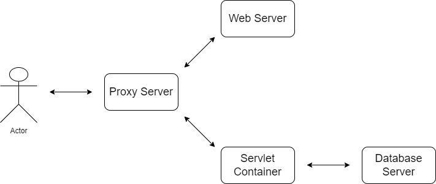

# Серверы. Виды серверов

Когда человек, далекий от разработки, слышит слово "сервер", обычно он представляет серверный шкаф. Что-то вроде
того, что на картинке ниже.

Термин "сервер" действительно актуален в отношении аппаратного обеспечения. Даже при том, что картинка выше - это не
совсем сервер:)

В контексте аппаратного обеспечения (в обиходе - "железа") сервер является специализированным компьютером с рядом
отличий от привычного ПК - от аппаратных до программных (например, на серверах используются иные операционные системы,
чем на ПК). Но сегодняшняя статья посвящена серверам в разрезе программного обеспечения. Это гораздо ближе к реалиям
разработки ПО. На самом деле, далеко не все разработчики видели вживую физические серверы. Еще меньше разработчиков
видело именно те машины, на которых развернуты продукты, написанные этими же разработчиками. Просто потому что в
общем случае разработчик физически не взаимодействует с физическим сервером.

Сервер как программное обеспечение - программа или набор программ, которые предоставляют различные услуги или
ресурсы клиентам.

Определение крайне общее, потому что серверы бывают разные и выполняют совершенно различные функции. С этим будем
подробно разбираться в следующих пунктах.

До этого же стоит понять, что сервер как ПО не имеет жесткой привязки к аппаратным серверам. Наоборот, сервер может
быть установлен и запущен на любом компьютер. В том числе на персональном, если это позволяет операционная система. Так,
мы уже работали с сервером базы данных, установленном на локальном компьютере. В дальнейшем на нем же будем
устанавливать и другие виды серверов для запуска и отладки веб-приложений.

## Виды серверов

В той или иной степени детализации мы рассмотрим различные виды серверов. Какие-то из них будут постоянно
встречаться в следующих статьях, какие-то нам уже знакомы, некоторые же обеспечивают существование Интернета в
привычном нам виде, но взаимодействовать с ними напрямую обычному разработчику не требуется. Но обо всем по порядку.

### Файловые серверы

Уверен, некоторые из вас что-то слышали или лично сталкивались с файловыми серверами в том или ином виде.

Это вид серверов, который необходим для централизованного хранения и управления файлами. А главное - предоставления
доступа к этим файлам по сети. До прихода облачных технологий (а во многих компаниях и поныне) многие компании
использовали собственный файловый сервер. Это дает достаточно много преимуществ в разрезе хранения данных, их защиты
и доступности. Часто такие серверы не имеют доступа в Интернет или доступны только через корпоративный VPN.

Зачастую рядовой пользователь взаимодействует с файловым сервером по специальному протоколу - FTP. Это не
является обязательным или достаточным атрибутом файлового сервера, но может помочь построить ассоциативный ряд для тех,
кто с этим протоколом сталкивался.

Ключевое, что стоит понять в данном пункте - файловый сервер является именно _видом_ программного обеспечения, а не
конкретным приложением. Так, большинство из читателей знакомы с Google Drive, Dropbox и другими веб-приложениями,
которые позволяют загружать файлы, делиться ими и скачивать. Некоторые из таких продуктов даже могут предоставлять
возможность взаимодействия по FTP. Однако эти продукты не являются файловыми серверами сами по себе. Но вполне
возможно, используют файловые серверы внутри себя.

### Сервер баз данных

Сервер баз данных - программное обеспечение, которое предоставляет возможность взаимодействовать базами данных по
модели клиент-сервер. Зачастую сервер баз данных включен в состав СУБД. Так, мы уже локально устанавливали такой сервер
для работы с PostgreSQL.

При этом стоит понимать, что СУБД и сервер баз данных - не равнозначные понятия. Во-первых, существуют СУБД, не
использующие сервер, даже локально установленный - например, [SQLite](https://ru.wikipedia.org/wiki/SQLite).
Во-вторых, СУБД - более широкое понятие, в котором сервер - лишь одна из составляющих.

Также стоит отметить, что различные СУБД (и, соответственно, серверы БД) предоставляют API на базе различных сетевых
протоколов. От известного нам HTTP до собственных протоколов, разработанных специально для конкретной СУБД. Так,
PostgreSQL работает на базе собственного безымянного протокола
([ссылка](https://www.postgresql.org/docs/current/protocol.html)).

### Почтовый сервер

Почтовый сервер - ПО, которое обеспечивает передачу электронных писем в Сети. Коммуникация между клиентами и самими 
почтовыми серверами происходит по характерным протоколам, названия некоторых из них вы могли видеть при конфигурации 
почтовых клиентов (Microsoft Outlook и др.): POP3, IMAP, SMTP.

В целом e-mail - достаточно интересная тема, на мой взгляд. Но она не имеет особой ценности в рамках курса, поэтому 
акцентировать внимание на этом пункте мы не будем. 

### DNS-сервер и немного про IP

DNS-серверы - вид серверов, которые обеспечивают конвертацию хостов в IP-адреса и наоборот. Де-факто имеет
собственные подвиды, отличающиеся по виду деятельности, но это детали, которые не имеют значения на данном этапе.

Тема DNS достаточно глубокая и для более-менее качественного ее понимания требуется разбираться с историей развития
сетей и, в частности, интернета. В силу того, что это огромный массив информации, не во всех разделах которого я
считаю себя компетентным, обойдемся минимумом, позволяющим хотя бы минимально понять ценность DNS-серверов и, заодно,
немного приблизиться к пониманию устройства сетей.

Мы уже знакомы с понятием хоста из статей об HTTP. Ранее оно было описано как адрес сервера в сети. Но ирония в том,
что идентификация компьютеров (в т.ч. серверов) строится на числовых идентификаторах, в то время как хост может быть
буквенно-числовым.

Большинство слышало о понятии **IP-адрес**, даже если не представляет, что это такое. Собственно, пора разобраться с
этим термином.

**IP** (Internet Protocol) - основной сетевой протокол, на базе которого и существует Интернет. Ранее под сетевым
протоколом в статьях подразумевался любой протокол, обеспечивающих коммуникацию в компьютерной сети. В данном же
случае этот термин более уместен (чаще обозначается как протокол сетевого уровня). И подразумевает конкретный
уровень абстракции в стеке протоколов, намного более низкоуровневый, чем знакомый нам HTTP*.

> Возможно, за пределами основного курса будут опубликованы статьи, посвященные компьютерным сетям. И в них будет
> дана более исчерпывающая информация об организации сетевой коммуникации, модели OSI и стеке протоколов TCP/IP. Это
> достаточно полезно для понимания инфраструктуры, в которой существуют веб-приложения, но мало влияет на прикладные
> задачи бэкенд-разработчиков.

IP-адрес - уникальный идентификатор конкретного устройства (компьютера, сервера) в сети, построенной на базе IP. В том
числе в сети Интернет. IP-адрес является числовым - 32-битным или 128-битным в зависимости от версии протокола IP.
Скорее всего вы слышали о IPv4 и IPv6. Собственно, это и есть четвертая и шестая версии данного протокола.

Несмотря на то, что IP-адрес является числом, обычно его представляют в более читаемом виде - как набор десятичных
(для IPv4) или шестнадцатеричных чисел, выведенных из изначального идентификатора по определенному правилу. Формат
записи такого набора чисел тоже регламентирован.

Так, пример IP-адреса для IPv4 выглядит так: `158.143.111.144` - четыре 8-битных (от 0 до 255) числа в
десятеричной (цифры от 0 до 9) системе счисления, разделенных точками.

IP-адрес в IPv6 выглядит примерно так: `2001:0db8:0000:0042:0000:8a2e:0370:7334`* - восемь 16-битных чисел (от 0
до 65535) в шестнадцатеричной (от 0 до F) системе счисления, разделенных двоеточием. С учетом системы счисления
вернее будет сказать, что допустимый диапазон значений каждого числа в IP-адресе - от 0 до FFFF.

> Этот адрес не соответствует тому, который использован в примере для IPv4. `158.143.111.144` в IPv6 выглядел бы как
> `0000:0000:0000:0000:0000:ffff:9e8f:6f90`. Или же `0:0:0:0:0:ffff:9e8f:6f90` - `0000` и `0` равноценны, первая
> форма лишь обозначает максимальное число знаков.
>
> Разные адреса в примерах были использованы в силу того, что большое число нулей не очень красиво выглядит в примере.

Итак, идентификатор любого компьютера в сети является числовым. И это прекрасно всем*, кроме того, что такие
идентификаторы тяжело запоминать - даже в форматах, продемонстрированных выше. А ведь именно по IP доступны
конкретные сайты, веб-приложения и сервера в целом. И это, очевидно, крайне неудобно для пользователей.

Отсюда появляются человекочитаемые имена, которые мы и используем как на бытовом уровне, так и при отправке тех же
HTTP-запросов. А для того, чтобы конвертировать эти имена в IP-адреса (и наоборот) существует **DNS** (Domain Name
System) - система для получения информации об адресе по имени хоста.

Собственно, мы возвращаемся в начало пункта: DNS-сервер - программное обеспечение, обеспечивающее сопоставление
доменных имен (хостов) и IP-адресов.

> *На самом деле проблема не только в неудобстве IP-адресов для конечного пользователя. Фактически манипуляция
> только IP-адресом при адресации сильно ограничивает возможную архитектуру веб-приложений.
>
> В современных реалиях бывает так, что одному IP-адресу соответствует несколько доменных имен - фактически означая
> расположение нескольких сайтов или веб-приложений на одном компьютере.
> 
> Или же наоборот - одному доменному имени может соответствовать множество IP-адресов. Это актуально для 
> высоконагруженных приложений, для которых недостаточно одного сервера. При этом причины, по которым сервера 
> недостаточно могут заключаться не только в ресурсах самой машины (условно, не хватает оперативной памяти для 
> обработки всех запросов), но и быть сетевыми - существуют определенные ограничения на число 
> одновременных клиент-серверных соединений.
> 
> Однако эти вопросы находятся вне компетенции рядового разработчика и освещаются здесь исключительно в ознакомительном 
> формате.

### Прокси-серверы

Еще один вид серверов, обеспечивающий решение инфраструктурных задач.

Основная функциональность прокси-серверов сводится к пересылке запросов от клиента до целевого сервера. Или до 
следующего прокси-сервера в цепочке.

Причины использования прокси-серверов могут быть различны - от обеспечения анонимности запросов до 
балансировки нагрузки между целевыми серверами с расположенным на них одним и тем же приложением* или 
обеспечения безопасности серверов. 

> *Запрос для гугла: "горизонтальное масштабирование".

В целом, под общим термином "прокси-сервер" в данном случае может скрываться большое число решений, которые различны 
как по своим внутренним механизмам работы, так и по целевому назначению.

Более того, в качестве прокси-сервера может выступать ПО, которое также используется в роли другого типа серверов - 
например, веб-сервера (см. ниже).

### Веб-сервер

Это один из видов серверов, который намного ближе к реалиям разработчиков, чем упомянутые ранее серверы. Именно 
веб-серверы хорошо знакомы фронтенд-разработчикам.

Веб-сервер - вид ПО, который предназначен для предоставления клиенту статической информации. Например, это может быть 
HTML или файлы Javascript. 

Когда вы открываете в браузере какой-либо сайт, именно веб-сервер обрабатывает запрос и отдает вам веб-страницу. При 
этом сама страница может содержать код на JavaScript, который умеет отправлять собственные запросы. Которые 
тоже будут обработаны веб-сервером или сервером приложений. О последних поговорим ниже.

Практика, как часто бывает, несколько сложнее, чем просто отправка запроса на веб-сервер и получение статики. Даже 
со стороны фронтенд-разработчиков есть своя специфика, определяющая, например, сторону, которая отвечает за итоговый 
вид страницы. Если интересно - можно погрузиться в различия между SSR и CSR - эти аббревиатуры легко гуглятся. Но к 
бэкенд-разработке это имеет весьма опосредованное отношение.

### Сервер приложений (Application Server)

Серверы приложений являются более мощным ПО, нежели веб-серверы. Теоретически, именно на них располагается бэкенд 
приложений и именно они отвечают за сложную бизнес-логику.

Этот вид серверов являются платформами с большим количеством функциональности, который обычно зачастую не ограничен 
простым размещением бэкенд-приложения. В зависимости от реализации, они могут предоставлять собственные 
имплементации различных спецификаций (в случае с Java - речь обычно о спецификациях Java EE), предоставлять 
возможности гибкой конфигурации налету (для изменения настроек бэкенд-приложения без перезапуска), динамической 
замены библиотек (от обновления версии до замены другой реализацией библиотеки - в случаях, когда библиотека 
реализует общую спецификацию с предыдущей) и даже свои in-memory хранилища.

Тема серверов приложений является достаточно сложной, особенно для новичков. Дополнительно это усложняется тем, что 
специфика серверов приложений привязана к языкам программирования, на которых написаны приложения, размещаемые на 
этих серверах.

В случае с Java, серверы приложений в основном остаются уделом действительно крупных (и, зачастую, старых) проектов, 
которые смогут эффективно использовать внутреннюю экосистему, предоставляемую application server'ом. И смогут 
оплатить его - как правило, серверы приложений в Java имеют платную лицензию.

Большинство же Java-приложений размещается на более легковесных решениях, которым посвящен следующий пункт.

### Контейнер сервлетов

Контейнер сервлетов - это платформа для размещения сервлетных приложений. Сервлет, в свою очередь - механизм Java, на 
базе которого строится логика обработки HTTP-запросов.

Таким образом, контейнер сервлетов - это ПО, которое позволяет запускать сервлетные приложения. Это стандартное 
решение для бэкенд-приложений на Java, которым не требуется полноценный application server.

> **!NB**: Application server'ы для Java тоже используют контейнеры сервлетов. Как составную часть своей экосистемы, 
> ответственную непосредственно за обработку HTTP-запросов.

Как правило, размещение бэкенд-приложения в контейнере сервлетов сводится к добавлению упакованного Java-приложения 
в соответствующей директории контейнера. Упаковка производится в один из видов Java-архива (мы уже знакомы с JAR), 
обычно - в **WAR** (Web Archive). В ближайших статьях мы рассмотрим, как это работает на практике.

На этом этапе стоит отметить важный момент: сервер приложений, по большей части, представляет собой набор из 
библиотек, которые сконфигурированы определенным образом для оптимального взаимодействия между собой. В дополнение 
может идти некая админ-панель и прочая дополнительная функциональность. Но основной набор необходимых возможностей 
предоставляют именно библиотеки, предоставляемые на уровне сервера.

При этом, вы можете добавлять нужные вам библиотеки в собственное Java-приложение. Зачастую эту будут те же 
библиотеки с теми же возможностями, что и используемые сервером приложений. В таком случае, ваше 
приложение, размещенное в контейнере сервлетов, может обладать теми же функциональными возможностями, что и 
приложение, размещенное на сервере приложений. Некоторые различия будут, но они обычно лежат вне слоя функциональных 
возможностей.

Скорее всего, сейчас понять детали работы и взаимоотношения контейнера сервлетов и сервера приложений будет сложно. 
На мой взгляд, это и не требуется, но у многих интервьюеров другое мнение на этот счет. Из-за чего 
Junior-специалиста вполне могут спрашивать об этих терминах и их различиях. Из-за чего советую вернуться к этому 
вопросу после нескольких ближайших статей, в которых мы познакомимся как с одним из наиболее популярных контейнеров 
сервлетов, так и с самим понятием сервлета в Java.

## Заключение

Тема, которую я постарался охватить в этой статье, крайне объемна. Из-за чего сама статья скорее обзорная, чем 
несущая информацию, полезную на практике.

Поэтому в заключение хочется дать схему простого веб-приложения с точки зрения роли различных серверов в его работе:

Примерно так выглядит простое веб-приложение:

- Есть прокси-сервер, к которому обращается пользователь, отправляя запросы к веб-приложению. Это позволяет 
  использовать на уровне клиента один и тот же хост, независимо от того, какой сервер на самом деле обработает 
  конкретный запрос;
- Если запрос относится к получению клиентской части приложения - HTML, CSS и JavaScript - прокси-сервер направит 
  запрос на веб-сервер, который раздает клиентское приложение;
- Само клиентское приложение в JavaScript коде отправляет запросы для получения или обработки различных данных. 
  Детали будут зависеть от того, что делает это приложение. JavaScript отправляет эти запросы со стороны клиента. 
  И такие запросы прокси-сервер будет пересылать контейнеру сервлетов, на котором развернуто Java-приложение;
- В свою очередь, Java-приложение при обработке пользовательских запросов будет обращаться к БД, которая расположена 
  на сервере баз данных.

При этом все 4 указанных на схеме сервера могут находиться как на одной физической машине (теоретически - даже на 
одном ПК), так и на разных физических серверах - даже в разных датацентрах.

Остается дополнить лишь пару мелочей:

1. На самом деле между запросом от клиента к прокси-серверу успеет выполнить свою роль и DNS-сервер. Именно он 
   преобразует человекочитаемый домен в IP-адрес, по которому расположен прокси сервер;
2. Теоретически, запросы к DNS-серверу могут происходить и дальше по схеме. Если обозначенные сервера не обращаются 
   друг к другу по IP-адресу. Но здесь слишком много вводных, от которых зависит, будут ли такие обращения на 
   практике. Поэтому в рамках теоретической схемы этот момент опустим;
3. Сюда, в принципе, можно легко добавить и почтовый сервер. Например, если в каких-то ситуациях сервер должен 
   запускать рассылку электронных писем. Тогда в этом примере Servlet Container имел бы дополнительную коммуникацию 
   с почтовым сервером. Технически, по той же схеме можно было бы добавить и файловый сервер. Или еще какой-то 
   сервер - даже другой контейнер сервлетов, если бы это было продиктовано архитектурой приложения.

Искренне надеюсь, что этот пример поможет объединить разные пункты сегодняшней статьи воедино.

#### На сегодня все!

> Если что-то непонятно или не получается – welcome в комменты к посту или в лс:)
>
> Канал: https://t.me/ViamSupervadetVadens
>
> Мой тг: https://t.me/ironicMotherfucker
>
> **Дорогу осилит идущий!**
