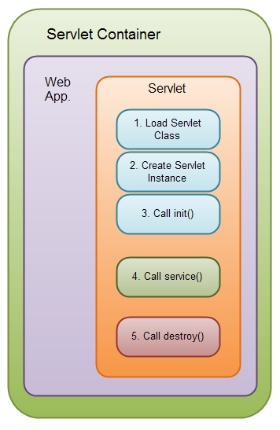
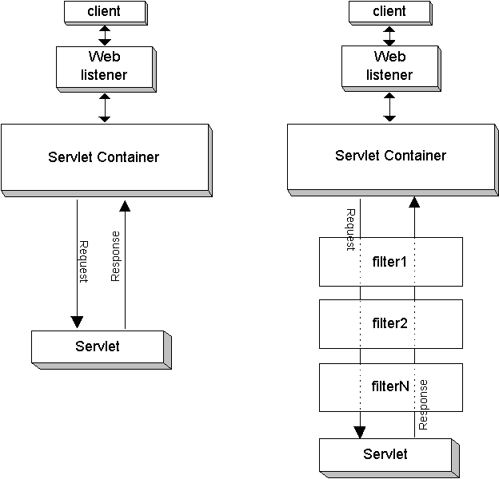

# Servlet API. Структура и жизненный цикл сервлетного приложения. Поиск main()

Сегодня постараемся разобраться с тем, как работают сервлетные приложения. Мы уже узнали, как написать и запустить
такое приложение, но, уверен, после предыдущей статьи осталось множество вопросов:

1. Кто создает и запускает сервлеты?
2. Как добавить и инициализировать поля в сервлетах?
3. Как запустить какие-либо фоновые процессы, не связанные с обработкой запросов?
4. Где точка входа в программу - ведь в примерах прошлой статьи не было `main()`?
5. Кем обрабатывается несколько параллельных запросов к одному сервлету - стоит ли беспокоиться о разделяемых ресурсах?

Уверен, есть и другие непонятные моменты, с которыми мы будем разбираться в этой и следующих статьях. Это позволит
ощущать себя намного увереннее в разработке серверных и, в частности, сервлетных, приложений.

Конкретно сегодня мы практически не затронем реальное применения рассматриваемых инструментов и концепций, но пункты
ниже призваны дать общее теоретическое понимание существующих механизмов. А заодно эти пункты дадут базис для
следующих статей.

## Куда пропал main()?

Любой, кто начинает изучать Java, очень быстро запоминает, что `main()` - центральная часть любой программы. Именно
с `main()` начинается выполнение программы и им же заканчивается. В зависимости от версии Java можно найти различный
сахар, который позволяет не создавать этот метод в явном виде, но это не существенно.

В случае с сервлетными приложениями мы видим, что `main()` отсутствует в приложении вовсе, есть лишь отдельные
наследники `Servlet`, к которым как-то попадает на обработку конкретный запрос. При этом как запрос попадает в
сервлет мы тоже не знаем.

То есть для обычных консольных программ мы в явном виде управляли получением и отправкой данных - пусть даже
через сконфигурированные не нами потоки ввода и вывода (`System.in`, `System.out`). Это позволяет утверждать, что
под нашим приложением находится лишь JVM, а все остальное - зона ответственности написанного нами приложения. Это
справедливо и для работы с файлами, и для взаимодействия с БД - какая-то часть работы скрыта внутренними
библиотеками, будь то `java.io` или драйвер JDBC, но наше приложение сохраняет функцию управления этими библиотеками.

Но в случае с сервлетными приложениями утверждать подобное нельзя - мы пишем лишь классы-обработчики на определенные
события (HTTP-запрос с использованием определенного метода по определенному пути), которые никак не управляют
приложением в целом. А если не управляют они, то кто-то управляет ими.

Именно в этом и кроется ответ. Сервлетное приложение само по себе не является самодостаточным. Это лишь набор
файлов и Java-классов, сфокусированных на двух задачах:

1. Конфигурация сервлетов и фильтров. Ни с конфигурацией, ни с фильтрами в сервлетных приложениях мы еще не знакомы,
   но им будут посвящены несколько следующих статей;
2. Обработка запросов с учетом бизнес-логики. Сюда относятся как сами классы сервлетов и пока еще незнакомые нам
   классы фильтров, так и любые классы, которые мы вызовем из этих сервлетов и фильтров - сервисы с логикой, классы
   взаимодействия с БД и что угодно еще.

Таким образом сервлетное приложение целиком фокусируется на решении пользовательских задач, никак не заботясь о
системной стороне вопроса - как именно запрос попадет в нужный сервлет, кто создаст сам объект сервлета и т.д. Все
эти вещи отданы на откуп управляющей программе - контейнеру сервлетов. Или Application Server'у, или другой
платформе, если таковая появится.

> Здесь стоит уточнить смысл термина **платформа** в данном контексте, поскольку зачастую его применяют, не
> задумываясь о смысле.
>
> Платформа - это некая среда или окружение, в котором запускается или работает программа. Так, для
> JavaScript-приложения платформой может выступать браузер - именно он скомпилирует и выполнит код. Для десктопного
> приложения (того же браузера) платформой можно считать операционную систему. Платформной для операционной системы
> можно считать некий набор аппаратных и/или низкоуровневых программных компонентов.
>
> В наших реалиях - платформой для сервлетного приложения является контейнер сервлетов. Его платформой, в свою
> очередь, является JVM.
>
> Таким образом термин платформа может применяться к различным программным или аппаратным продуктам, но он всегда
> подразумевает под собой некое окружение для выполнения программы более высокого (в плане удаленности от физической
> составляющей) уровня.

Из вышесказанного следует простой вывод: если хочется найти `main()` сервлетного приложения - его надо искать в
контейнере сервлетов.

Скорее всего, такой поиск не будет иметь практического смысла - с большой долей вероятности мы
в `main()` найдем какие-то достаточно низкоуровневые по меркам Java операции - сканирование директорий на наличие
WAR-файлов, их анализ, загрузку и прочие технические действия, связанные с запуском сервера и развертыванием
сервлетных приложений. Но это позволяет вернуть стройность картине мира, в которой у Java-приложения обязан быть
`main()`.

Можно посмотреть и под другим углом, постаравшись представить, что сервлетные приложения - это внешние библиотеки
для контейнера сервлетов. Библиотеки также не имеют собственного `main()`, поставляются в виде архива и т.д. И как
большинство логгеров в Java базируются на SLF4, так и сервлетные приложения базируются на спецификации Servlet API.
Вся разница в том, что библиотеки обычно инкапсулируют в себе решение типовых задач - вроде логирования и
взаимодействия с базой данных, а сервлетные приложения инкапсулируют бизнес-логику - наименее типовую часть любой
информационной системы.

## Конфигурация, структура и жизненный цикл сервлетного приложения

Предыдущий пункт крайне важен (по моему личному мнению) для психического здоровья Java-разработчика. Но он никак не
отвечает на прикладные вопросы, связанные с конфигурацией и использованием сервлетов в любой логике, которая будет
сложнее, чем "Hello World!"

Для начала, мы понимаем, что создание и инициализация объекта сервлета - ответственность контейнера. Но нам нужны
инструменты, которые позволят объяснить контейнеру, что именно делать на этапе инициализации (например, какие поля
сервлета нужно инициализировать и как), на запросы по какому пути должен срабатывать этот сервлет и т.д.

### Снова о привязке путей запроса к сервлету

Начнем с конца. Можно определить 2 базовых способа связать путь и сервлет, который будет обрабатывать запросы по пути:

1. `@WebServlet`. Эту аннотацию мы использовали в предыдущей статье. На этапе развертывания приложения контейнер
   сервлетов анализирует наличие данной аннотации и привязывает сервлеты к конкретным путям. При этом возможности
   аннотации намного шире, чем рассмотренное нами применение - через нее можно связать сервлет с несколькими путями,
   использовать определенные паттерны, чтобы привязать сервлет не к конкретному пути, а к некому шаблону и т.д.;
2. `web.xml`. Это файл конфигурации сервлетного приложения, с которым мы будем знакомиться в одной из ближайших
   статей. В широком смысле - `web.xml` является центральной частью сервлетного приложения, покрывая большую часть
   именно конфигурационной составляющей. Он позволяет объявить о существовании конкретного сервлета, соотнести пути
   запросов с классами-сервлетами и настроить множество иных вещей, которым посвятим отдельную статью. Пока лишь отмечу,
   что конфигурация `web.xml` имеет приоритет над `@WebServlet`.

> Если подняться на еще один уровень абстракции, можно в принципе пропустить связывание класса сервлета и пути
> запроса в собственных приложения.

> В силу того, что сам объект запроса содержит path, технически достаточно создать один сервлет, на который будут
> приходить все HTTP-запросы. И уже сам сервлет обязать определять конкретный класс (или метод), который должен
> обработать конкретный запрос. Это позволяет уйти от ряда неудобств, которые вызваны использоваанием сервлетов. И
> заодно добавить набор общих механизмов по обработке запроса до выполнения непосредственно бизнес-логики:
> десериализацию тела запроса, компоновку параметров запроса и заголовков в более удобные сущности и т.д. Такое решение
> достаточно громоздко само по себе, но вполне окупаемо, если вынести его в отдельный фреймворк или библиотеку.
>
> По совокупности описанный подход позволяет сделать механизм обработки запросов еще более дружелюбным, чем Servlet
> API, еще больше сократить количество типового кода и сконцентрироваться на бизнес-логике.
>
> Хорошая новость в том, что все это уже сделали до нас:) И в этой заметке утрировано описан подход к обработке
> запросов в Spring MVC, с которым мы познакомимся в одном из разделов курса.

### Конфигурация и структура приложения. Проблематика

Мы выяснили, что создание экземпляров классов-сервлетов - ответственность контейнера. С одной стороны, новость
хорошая - нам не надо самостоятельно управлять этой логикой, умный контейнер сам найдет все имплементации
`HttpServlet`, разберется к каким путям их привязать, сам создаст объекты и сам будет обращаться к этим объектам,
когда потребуется обработать запрос.

#### Инициализация полей

Но есть и проблемы. Наиболее очевидная из них - инициализация полей в объектах сервлетов. Скажем, если мы хотим
добавить в сервлет какие-то поля - сервисы, которые будут вызываться при обработке запроса для выполнения бизнес-логики.
Проблемы именно в добавлении полей в класс нет. Но эти поля нужно инициализировать.

Конечно, можно сделать это в конструкторе. Конструктор с параметрами - вполне знакомая нам штука, мы ее успешно
применяли и для классов логики - например, передавали через конструктор объекты репозиториев для сервисов. Но тут тоже
есть проблема: конструкторы сервлетов вызываются контейнером сервлетов. И контейнер ничего не знает о добавляемых
сервисах, из-за чего нет возможности использовать именно конструктор с параметрами.

Публичный конструктор без параметров может показаться выходом из ситуации - нужно просто создавать экземпляры всех
нужных сущностей прямо в конструкторе сервлета. Но это тоже неудобно - скажем, что делать с созданием
`HikariDataSource`? Создавать отдельный пул под каждый сервлет - явно непрактично. Как с точки зрения
производительности, так и с точки зрения количества типового кода.

Безусловно, можно найти более практичные решения - скажем, самопальные
[синглтоны](https://ru.wikipedia.org/wiki/%D0%9E%D0%B4%D0%B8%D0%BD%D0%BE%D1%87%D0%BA%D0%B0_(%D1%88%D0%B0%D0%B1%D0%BB%D0%BE%D0%BD_%D0%BF%D1%80%D0%BE%D0%B5%D0%BA%D1%82%D0%B8%D1%80%D0%BE%D0%B2%D0%B0%D0%BD%D0%B8%D1%8F)),
гарантировав единственный вызов создания сущностей, но оставив возможность доступа к ним через статический метод,
примерно
так: [пример синглтона](https://ru.wikipedia.org/wiki/%D0%9E%D0%B4%D0%B8%D0%BD%D0%BE%D1%87%D0%BA%D0%B0_(%D1%88%D0%B0%D0%B1%D0%BB%D0%BE%D0%BD_%D0%BF%D1%80%D0%BE%D0%B5%D0%BA%D1%82%D0%B8%D1%80%D0%BE%D0%B2%D0%B0%D0%BD%D0%B8%D1%8F)#Java_1.6).

Но такой подход заставляет нас строить сложные конструкции, в которых каждый конструктор внутри себя обращается к
множеству других классов напрямую. Это сводит на нет многие преимущества наследования и полиморфизма, так и
затрудняет поддержку приложения из-за слишком большой связности кода.

Ранее эту проблему можно было глобально решить через `main()` - единожды создать все необходимые сущности, передавая
в параметрах конструктора репозиториев `DataSource` или другие необходимые сущности. Но теперь единая точка входа
нам недоступна и приходится искать иные пути.

#### Инициализация приложения

Вторая проблема - запуск каких-либо процессов, которые не привязаны к обработке запросов. Сюда можно отнести что
угодно - от применения миграций для БД до запуска каких-либо периодических задач.

Раньше мы также разместили бы это в `main()` - от создания и запуска миграций в условном `Flyway` до создания и
сабмита периодических задач в не менее условном `ScheduledThreadPoolExecutor`.

И если для предыдущей проблемы еще можно было придумать какие-то костыли вокруг сервлетов, то здесь привязка к
сервлетам выглядит совсем странно - эта логика может быть вообще не связана с обработкой запросов.

В этому же пункту можно отнести различные загрузки конфигурационных файлов, настройку логгера и прочие задачи,
которые необходимо выполнить единожды, еще до того, как приложение начнет обрабатывать пользовательские запросы.

#### Общая функциональность при обработке запросов

Если задуматься над тем, что должно делать приложение, когда к нему поступает запрос - можно найти множество
аспектов, которые должны отрабатывать независимо от того, что за запрос пришел. Какие-то из этих аспектов решены на
уровне Servlet API или имплементаций конкретных контейнеров, какие-то - остаются на ответственности разработчика или
просто являются характерными именно для конкретного приложения.

Две наиболее простые вещи, которые приходят в голову в этом направлении - логирование запроса и/или ответа и
авторизация.

Первое необходимо в первую очередь для мониторинга и тех. поддержки - на случай, если у пользователя возникнут
проблемы. В такой ситуации жизнь проектной команды будет проще, если кроме описания проблемы пользователем будут
перед глазами логи действий этого пользователя.

Второе в дополнительных пояснениях не нуждается.

Первое решение, которые приходит в голову - дублирование всей этой функциональности в каждом do-методе каждого
сервлета. Более продуманный вариант - создание своего абстрактного сервлета, ответственностью которого будет вызов
этой функциональности перед вызовом do-метода.

Первый способ очевидно неудобен в поддержке - слишком много мест, в которых необходимо менять код при каждом
изменении общей логики. Второй подход также некомфортен в поддержке - такой общей функциональности может быть много,
какая-то ее часть может быть привязана не ко всем запросам, а к запросам с определенным методом или к запросам,
объединенным каким-то логическим признаком - иными словами, ответственность нашего абстрактного сервлета может стать
слишком широкой, а код - слишком объемным.

### Структура сервлетного приложения. Основные интерфейсы

Эти и многие другие проблемы решены на уровне Servlet API. Не все решения органичные и не все - максимально
комфортные для разработчика, особенно в сравнении с более высокоуровневыми фреймворками вроде Spring. Но решения,
предлагаемые Servlet API все еще на порядок лучше, чем россыпь костылей, описанная выше.

Проблема лишь в том, что для понимания этих решений необходимо взглянуть на сервлетное приложение целиком - в том
числе с учетом механизмов, с которыми мы еще не знакомы. С другой стороны, это облегчит более предметное изучение
таких механизмов в дальнейшем - ведь уже сформируется понимание, для чего они нужны.

#### ServletContext

Наверно, `ServletContext` можно назвать центральной частью композиции "сервлетное приложение". Он был вскользь
упомянут в предыдущей статье.

Итак, `ServletContext` - сущность, которая хранит в себе всю информацию о приложении - название, какие сервлеты в
нем существуют, содержит информацию о любых атрибутах, актуальных для всего приложения целиком. На одно сервлетное
приложение создается лишь один экземпляр `ServletContext`. И именно в этот экземпляр загружается вся конфигурация -
например, полезная нагрузка `web.xml`, упомянутого ранее.

Кроме того, что контекст содержит в себе много полезной информации, у него есть еще два полезных свойства:

1. Информацию в контекст можно добавлять. В базовом варианте это ответственность контейнера сервлетов, который
   загрузит `web.xml`, а также просмотрит классы приложения на предмет характерных аннотаций, вроде `@WebServlet` и
   некоторых иных. Но через определенные механизмы можно добавить в контекст и свою информацию - на этапе запуска
   приложения или позже. Например, экземпляры `DataSource` или иных классов, необходимых для корректной
   инициализации сервлетов;
2. Информацию из контекста можно получать. В том числе в сервлетах. В том числе на этапе их инициализации. Что, в
   целом, решает проблему корректной инициализации полей с небольшими ограничениями.

#### Servlet

С этим интерфейсом и его наследниками мы уже знакомы. Но не упомянуть его было бы некорректно.

#### EventListener

Строго говоря, интерфейс `EventListener` - маркерный интерфейс из `java.util`. Но в сервлетных приложениях у него
есть крайне полезные наследники:

- `ServletContextListener`;
- `ServletContextAttributeListener`;
- `ServletRequestListener`;
- `ServletRequestAttributeListener`;
- `HttpSessionListener`;
- `HttpSessionAttributeListener`;
- `HttpSessionIdListener`;
- и ряд других.

Все они представляют собой части паттерна
[наблюдатель](https://ru.wikipedia.org/wiki/%D0%9D%D0%B0%D0%B1%D0%BB%D1%8E%D0%B4%D0%B0%D1%82%D0%B5%D0%BB%D1%8C_(%D1%88%D0%B0%D0%B1%D0%BB%D0%BE%D0%BD_%D0%BF%D1%80%D0%BE%D0%B5%D0%BA%D1%82%D0%B8%D1%80%D0%BE%D0%B2%D0%B0%D0%BD%D0%B8%D1%8F)).

Если опустить детали, имплементации этих классов будут вызываться на определенные события - например, инициализация или
закрытие `ServletContext` (в случае с `ServletContextListener`). И это отличная возможность выполнить какую-то
логику, которая привязана к такому событию. Скажем, если инициализация контекста фактически равнозначна запуску
сервлетного приложения - почему бы не написать реализации `ServletContextListener`, которые будут создавать
`DataSource` или иные экзмепляры нужных классов логики, запускать миграции и т.д.

Отдельная прелесть механизма listener'ов в том, что на уровне `web.xml` можно задать порядок их срабатывания. А
значит - гарантировать, скажем, что миграции БД будут запускаться строго после создания `DataSource`, который для
этих миграций необходим.

Сферу применения других listener'ов можно предположить исходя из названий интерфейсов и методов, которые в них
содержатся.

#### Filter

Интерфейс `Filter` во многом схож в `Servlet`. У них схожа иерархия: `Filter` -> `GenericFilter` -> `HttpFilter` ->
любые пользовательские фильтры. Также они похожи и своим жизненным циклом - об этом позже.

Задачи фильтров - это как раз та общая для обработки запросов логика. В зависимости от того, как описан фильтр, его
логика будет срабатывать до и/или после того, как запрос будет обработан сервлетом. Таким образом фильтра может
взаимодействовать с объектом запроса до сервлета и/или объектом ответа после сервлета. В принципе, можно
взаимодействовать и с ответом до сервлета, и с запросом после сервлета, но обычно это не имеет смысла.

Более подробно мы будем разбирать фильтры в отдельной статье. Но уже сейчас можно ознакомиться с паттерном
[chain of responsibility](https://ru.wikipedia.org/wiki/%D0%A6%D0%B5%D0%BF%D0%BE%D1%87%D0%BA%D0%B0_%D0%BE%D0%B1%D1%8F%D0%B7%D0%B0%D0%BD%D0%BD%D0%BE%D1%81%D1%82%D0%B5%D0%B9),
на базе которого построена логика обработки сервлетных фильтров.

Этот механизм способен решить задачи логирования запросов и ответов, авторизации и многие другие. При этом он
отделен от логики сервлетов, что позволяет не перегружать сами сервлеты излишней функциональностью и упрощает
поддержку сервлетных приложений.

По сути, именно вокруг рассмотренных четырех интерфейсов и их наследников строятся сервлетные приложения. Безусловно,
есть и другие интерфейсы и классы, но они несут преимущественно вспомогательные функции.

### Жизненный цикл сервлетного приложения

Наконец, необходимо разобраться, что происходит при запуске приложения в контейнере сервлетов, как происходит
обработка запроса и как завершается работа приложения. Предыдущий пункт позволил построить некую статическую модель
зависимостей интерфейсов, в которую теперь надо вдохнуть жизнь.

Описание ниже - достаточно грубое и некоторые детали на практике могут выглядеть иначе, в зависимости от конкретного
контейнера сервлетов или особенностей настройки. Но этого достаточно, чтобы понять общую схему.

#### Запуск контейнера и инициализация приложения

1. Происходит загрузка `web.xml` и анализ классов, аннотированных `@WebServlet` и другими подобными аннотациями (они
   есть для фильтров и большинства listener'ов);
2. Создание экземпляра `ServletContext`;
3. Загрузка классов сервлетов, фильтров и listener'ов. Пока речь не идет о создании экземпляров классов, но
   информация о них считывается и добавляется в контекст;
4. Создание объектов слушателей. `ServletContextListener` и других;
5. Вызов `ServletContextListener#contextInitialized()` у всех зарегистрированных слушателей контекста.

На этом этапе еще недоступны для работы фильтры и сервлеты. Но база для них уже готова - в том числе может быть
создано подключение к БД, запущены миграции, созданы классы, которые будут использоваться как поля сервлетов и т.д.

Также стоит отметить, что описанные пункты может запускаться не только при старте контейнера, но и при других
обстоятельствах - например, по факту запуска определенного приложения через админку сервера, по факту обнаружения
нового WAR в `/webapps` (для Tomcat) и т.д. Это ответственность контейнера сервлетов, но в разрезе конкретного
сервлетного приложения эти детали не должны иметь значения.

#### Инициализация сервлетов и фильтров

Это часть состоит из двух пунктов:

1. Создание экземпляров зарегистрированных ранее сервлетов и фильтров*. Для каждого зарегистрированного класса
   создается по одному объекту. Из этого следует то, что каждый запрос по определенному пути будет обрабатываться
   одним и тем же объектом сервлета. Что требует осторожности в работе с разделяемыми ресурсами - в один момент
   времени методы сервлета могут вызываться несколькими потоками одновременно;
2. Вызов `Servlet#init()` и `Filter#init()` у сервлетов и фильтров соответственно. Именно в реализации этого метода
   стоит размещать собственную логику инициализации - будь то инициализация полей данными из контекста или что-то еще.

> *В данном случае создание экзмепляров предполагает вызов конструкторов соответствующих классов. Но ориентироваться
> на это не стоит.
>
> Хоть данный пункт и расположен после срабатывания `ServletContextListener#contextInitialized()`, фактической
> гарантии нет. Сами объекты могут быть созданы как до выполнения указанного метода listener'а, так и вообще не
> создаваться до тех пор, пока фильтр или сервлет не понадобится. Т.е. до первого запроса от клиента для фильтров, и
> до первого запроса по привязанному к сервлету пути для сервлетов. Указанные детали соответственно смещают и вызовы
> `init()` - метод объекта не может быть вызван до создания объекта.
>
> В целом, Servlet API и логика работы контейнеров строится на том, что разработчики будут использовать именно
> механизмы самого Servlet API, а не пытаться подвязаться под что-то иное. В противном случае даже рабочая логика
> может сломаться из-за смены контейнера или обновления контейнера до другой версии.

#### Обработка запросов

Это основная часть жизненного цикла приложения - в ее рамках происходит взаимодействие с пользователем и выполнение
бизнес-логики, ради которой продукт и был разработан.

В силу этого стоит рассмотреть то, как обрабатывается каждый запрос при его получении контейнером сервлетов.

Общая схема выглядит примерно так:

1. Получение клиентского запроса контейнером сервлетов;
2. Определение по пути контекста (приложения), к которому относится запрос;
3. Отработка имплементаций `ServletRequestListener#requestInitialized()`;
4. Выполнение логики фильтров до попадания в сервлет;
5. Обработка запроса сервлетом - вызов метода `serve()`, который в свою очередь вызывает один из do-методов;
6. Выполнение логики фильтров после обработки сервлетом*;
7. Отработка имплементаций `ServletRequestListener#requestDestroyed()`;
8. Передача ответа от контейнера сервлетов клиенту.

Кроме `ServletRequestListener` в этой схеме могут быть и иные listener'ы, привязанные к сессиям, атрибутам запроса
или чему-либо еще. Но в данном случае их добавление в схему не принесет пользы, лишь засорит ее.

> *Может показаться, что фильтры срабатывают дважды. Но это не так.
>
> В силу особенностей реализации этого механизма, каждый фильтр в цепочке (выше был упомянут паттерн chain
> of responsibility) вызывает внутри себя следующий. Когда фильтров в цепочке не осталось - в том же стеке вызовов
> происходит вызов сервлета.
>
> Т.е. если попытаться грубо представить логику обработки запроса кодом, получится примерно следующее:
>
> ```java
> public void doFilter1()
> {
>     // логика filter1 до обработки запроса сервлетом
>    doFilter2();
>     // логика filter1 после обработки запроса сервлетом
> }
> 
> public void doFilter2()
> {
>    // логика filter2 до обработки запроса сервлетом
>    doFilterLast();
>    // логика filter2 после обработки запроса сервлетом
> }
> 
> public void doFilterLast()
> {
>    // логика filterLast до обработки запроса сервлетом
>    servlet.service();
>    // логика filterLast после обработки запроса сервлетом
> }
> ```

Еще одним важным моментом является обработка запросов с точки зрения многопоточности. Контейнер сервлетов выделяет
определенный пул потоков для обработки запросов. Например, по умолчанию размер этого пула для Tomcat равен 200.
Таким образом, можно грубо предположить, что если на сервер одновременно поступит 201 запрос - один из запросов
останется не обработанным.

На практике, конечно, бывает по-разному и зависит от конкретного контейнера или даже настроек контейнера. Может
настраиваться сам размер пула - в большую или меньшую сторону. Могут быть механизмы, обрабатывающие такие ситуации
менее резко для пользователя. А могут возникнуть ограничения другого рода - например, на уровне количества соединений
с сервером, в результате чего проблема возникнет не на уровне отдельного запроса, а на попытке клиента подключиться
к серверу, еще до того, как сам HTTP-запрос будет отправлен. Но все это выходит за пределы начального знакомства и вряд
ли должно быть проблемой junior-специалиста.

Подводя итог пункта, именно вопрос обработки запросов в сервлетных приложениях - самый легкий для изучения, в
силу того, что ему посвящено множество обучающих материалов для новичков - намного больше, чем для иных пунктов этой
статьи вместе взятых.

В том числе благодаря этому есть и готовые схемы. Например, жизненный цикл сервлета в разрезе приложения:



В данном случае отображены для сервлета шаги, описанные выше, а также последний шаг жизненного цикла (вызов
`destroy()`), который будет рассмотрен ниже. Похожим образом выглядит и жизненный цикл фильтра, только вместо
`service()` будет `doFilter()`.

Также стоит приложить схематичное изображение алгоритма обработки отдельного запроса:



В данном случае слева продемонстрирована схема обработки запроса без фильтров, справа - обработка с применением
фильтров. `Web listener`, расположенный в обеих схемах является компонентом, призванным получать HTTP-запросы на
уровне сервера, он никак не связан с теми listener'ами, с которыми мы сегодня познакомились.

#### Завершение работы сервлетного приложения

На этом этапе происходят действия, которые призваны освободить ресурсы, занятые приложением и корректно завершить
работу приложения:

1. Вызовы `Servlet#destroy()` и `Filter#destroy()`. В этих методах может быть описана пользовательская логика для
   освобождения ресурсов, занимаемых конкретным сервлетом или фильтром, если это необходимо*;
2. Закрытие контекста;
3. Вызовы `ServletContextListener#contextDestroyed`. Здесь логично расположить освобождение ресурсов, занятых на
   уровне приложения или другие пост-эффекты - например, уведомление некоего общего сервера о завершении работы
   конкретного инстанса и т.д. К сожалению, мы не настолько погружены в тему, чтобы можно было привести более
   наглядные примеры;
4. Закрытие контейнером других ресурсов, ассоциированных с текущим приложением.

Завершение работы приложения может происходить по различным причинам - от системных ошибок до завершения работы
контейнера сервлетов. Или из-за явного рестарта приложения.

> *С этим пунктом есть нюанс: исходя из спецификации Servlet API destroy-методы могут вызываться не только при
> завершении работы приложения, но и при длительном простое конкретного экземпляра или по иным причинам,
> определяемых контейнером. Практических реализаций этого механизма вроде бы нет за ненадобностью, но это не мешает
> спрашивать о нем на собеседованиях.

## Заключение

Сегодня мы поверхностно рассмотрели достаточно много концепций, без которых сервлетные приложения не смогли бы
качественно функционировать. Информации много и некоторые аспекты действительно сложные.

На этом этапе будет самонадеянно ожидать, что все, описанное в статье будет усвоено в полном объеме. Но я надеюсь,
что она смогла закрепить некое общее представление структуры и жизненного цикла сервлетного приложения. В общих
чертах понять зоны ответственности контейнера сервлетов и непосредственно приложения.

А для более детального знакомства с отдельными механиками будут отдельные статьи, в которых можно будет погрузиться
в разбор API, практики применения и прочего. Благо, общая картина и решаемые проблемы изучены уже сегодня.

#### На сегодня все!


А обширная практика будет предложена в одной из ближайших статей:)

> Если что-то непонятно или не получается – welcome в комменты к посту или в лс:)
>
> Канал: https://t.me/ViamSupervadetVadens
>
> Мой тг: https://t.me/ironicMotherfucker
>
> **Дорогу осилит идущий!**
