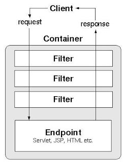

# Servlet API. Фильтры и цепочка фильтров. Модификация запроса и ответа

Сегодня мы будем разбираться с механизмом, который появляется в Servlet API, но остается актуальным и в Spring.
Кроме того, некоторые концепции, которые будут разобраны сегодня, находят широкое применение и за пределами самой
логики сервлетных фильтров.

Итак, речь пойдет о сервлетных фильтрах, паттерне **цепочка обязанностей** (**chain of responsibility**) и **сквозной
функциональности**.

## Актуальность фильтров

С базовым синтаксисов фильтров и способом их описания в `web.xml` мы уже встречались в предыдущих статьях. Также
была кратко затронута их область применения. Пришло время расширить представления о том, для чего фильтры могут
применяться в сервлетных приложениях.

### Сквозная функциональность

Для начала стоит понять их общее назначение. Несмотря на то, что фильтры могут быть применены практически для любой
функциональности, в т.ч. с жесткой привязкой к конкретному пути или сервлету, обычно их используют для сквозной
функциональности.

Более детально с этим термином мы познакомимся позже, при изучении концепции **аспектно-ориентированного
программирования** (**АОП**). На данном этапе сквозную функциональность можно описать как логику, оказывающую
влияние на различные части системы, но не имеющую отношения к предметной области системы. Определение настолько
распространенное, насколько и непонятное.

Примерами сквозной функциональности может быть управление транзакцией: вне зависмости от того, какие запросы происходят
внутри транзакции и как они влияют на систему в целом, в любом случае будет выполнена логика открытия транзакции и ее
коммита или отката.

Также сквозная функциональность может выражаться в логике авторизации, верхнеуровневой обработки ошибок (если
обработчики имеют некую общую логику реакции на наиболее абстрактные исключения и не зависят от того,
в какой части системы и почему упала конкретная ошибка, лишь обрабатывают ее с привязкой к типу исключения). Сюда же
можно отнести (де-) сериализацию HTTP-запросов и ответов, кэширование и многие другие вещи при условии, что они
реализованы как некое общее поведение, без привязки к конкретной бизнес-задаче.

> Осознание этой концепции сильно усложняется тем, что любые примеры относительны. В зависимости от способа
> имплементации той или иной функциональности, она может как быть сквозной, так и нет. И это будет справедливо
> практически для всех приведенных выше примеров.

Также стоит отметить, что о сквозной функциональности обычно говорят при высокоуровневом рассмотрении системы, вне
привязки к конкретным синтаксическим инструментам. Из-за этого спорным, но все еще достаточно близким по своей сути
примером могут послужить промежуточные операторы в `Stream` (Stream API). Каждый конкретный оператор в любой ситуации
делает одно и то же, вне зависимости от того, какие элементы обрабатывает этот конкретный `Stream`, что делает
лямбда-выражение переданное в этот оператор и т.д. Если эту идею (или функции высшего порядка в целом) масштабировать до
уровня архитектуры приложения, можно прийти к концепции сквозной функциональности.

Прикладной особенностью сквозной функциональности можно считать ее незаметность - зачастую отсутствует прямая связь
между кодом, выполняющим бизнес-логику, и кодом, обеспечивающим сквозную функциональность для этой бизнес-логики. Такая
связь может быть обнаружена на уровне кода, обеспечивающего эту сквозную функциональность, в какой-либо общей
конфигурации, проявить себя как аннотация над классом/методом бизнес-логики или иным косвенным образом. Но не зная,
куда смотреть, само наличие какого-либо кода, выполняющегося в привязке к бизнес-коду, окажется сюрпризом. Это
справедливо как для сервлетных фильтров, так и для многих других проявлений этой концепции, с которыми мы
познакомимся в дальнейшем.

### Сценарии использования фильтров

Итак, в каких прикладных ситуациях могут использоваться фильтры:

1. Аутентификация и авторизация. Фильтры актуальны для обоих процессов - используя их можно как запретить доступ
   неавторизованному пользователю или перенаправить его на страницу авторизации, так и просто сопоставить данные
   пользователя с имеющимися юзерами. Также возможна и более гибкая настройка - например, разрешение или запрет на
   доступ по конкретному пути, исходя из роли пользователя в системе;
2. Логирование. В случае с фильтрами - это, скорее всего, будут разного рода общие логи, вроде пришедшего запроса и
   его содержимого, возможно - исходящего ответа. Такого рода логи обычно дорого обходятся приложению - ведь при
   базовых настройках логгера на каждую запись требуется заблокировать ресурс и лишь затем записать сообщения. Если
   система обрабатывает множество запросов одновременно - это может сказать на производительности. Поэтому подобные логи
   обычно прописывают с низким уровнем логирования - `debug` или `trace` - и включают данный уровень лишь при
   необходимости получить больше деталей по конкретной проблеме. Альтернативным решением является асинхронное
   логирование, но оно также имеет ряд своих ограничений и недостатков. В современных системах подобное вообще исключают
   из самого приложения, оставляя ответственность логирования каждого запроса и ответа прокси-серверу, который находится
   между клиентом и самим приложением;
3. Мониторинг. Концепт схож с логированием, но направлен на сбор какой-либо детальной информации, в зависимости от
   метрики, за которую отвечает фильтр. Простейшими примерами таких метрик можно считать примеры из статьи с `web.
   xml`, в которой отдельные фильтры отвечали за подсчет общего числа запросов к системе*, числа запросов по
   валидным и невалидным путям. Единственные различия с реальной системой кроется в способе сохранения и
   предоставления доступа к данным подобных счетчиков. Еще одним хорошим примером метрики может служить информация о 
   времени обработки запроса - ниже мы рассмотрим, как это можно сделать. В целом, метрики могут быть 
   крайне разнообразны, в том числе быть специфичными для конкретной системы;
4. Кэширование. Достаточно спорный пункт при современных подходах к разработке и обслуживанию серверных приложений,
   но хорошо бьется с примерами сквозной функциональности - скажем, зачем нам полноценно обрабатывать GET-запрос
   каждый раз, если мы только что обработали запрос с тем же путем и теми же параметрами - т.е. вернем клиенту те же
   данные, что и ранее. Гораздо дешевле может быть сохранение ответа в кэше и возвращение его клиенту еще до того,
   как такой запрос будет обработан сервером. Такой подход имеет множество нюансов - как непосредственных
   недостатков, так и просто распространенных практик, в которых кэши располагаются на иных этапах обработки запроса
   или кэшируют часть данных ответа, а не весь ответ целиком. Время от времени мы будем затрагивать тему кэширования в
   разных статьях, но развивать ее дальше в этом пункте точно нецелесообразно;
5. Валидация данных. Конечно, на уровне фильтров она тяжело реализуема в том виде, в котором мы описывали ее ранее,
   но некоторые подходы позволяют ее применять как сквозную функциональность. Например, это возможно с
   использованием спецификации [Jakarta Validation](https://jakarta.ee/specifications/bean-validation/);
6. Изменение запросов и ответов. Этот пункт описывает множество реальных вариантов использования - от добавления
   заголовков до фактических преобразований тел запросов и ответов. Но последнее имеет несколько серьезных
   ограничений. Во-первых, API ответа не дает возможности прочесть тело ответа - лишь записать, причем сделать это
   можно лишь единожды для объекта. Во-вторых, представление тела запроса как `InputStream` не дает возможности читать
   его многократно - лишь единожды. В целом, сам подход по работе с телами через I/O Stream накладывает массу 
   неудобств в практическом смысле. Чем этот подход обусловлен и как обойти описанные ограничения рассмотрим в одном 
   из пунктов ниже.

> *Если быть более точным, обычно подобные замеры производятся с привязкой ко времени. Например, количество запросов 
> в секунду - см. [RPS](https://en.wikipedia.org/wiki/Web_server#Performance_metrics).

Безусловно, применение фильтров не ограничено пунктами выше - это лишь наиболее распространенные или очевидные 
сценарии использования. Фактически, область применения в конкретном проекте ограничена лишь фантазией разработчика и 
потребностями конкретной системы.

## Паттерн цепочка обязанностей

Чтобы успешно работать с фильтрами стоит понимать, какой паттерн лежит в их основе. Кроме того, сам паттерн может 
быть полезен в конкретных прикладных задачах, что может потребовать его реализации вручную. Данный пункт совмещает в 
себе как описания самого паттерна, так и раскрывает некоторые детали его реализации в фильтрах Servlet API.

Chain of responsibility - один из
[поведенческих](https://ru.wikipedia.org/wiki/%D0%9F%D0%BE%D0%B2%D0%B5%D0%B4%D0%B5%D0%BD%D1%87%D0%B5%D1%81%D0%BA%D0%B8%D0%B5_%D1%88%D0%B0%D0%B1%D0%BB%D0%BE%D0%BD%D1%8B_%D0%BF%D1%80%D0%BE%D0%B5%D0%BA%D1%82%D0%B8%D1%80%D0%BE%D0%B2%D0%B0%D0%BD%D0%B8%D1%8F)
паттернов проектирования. Суть паттерна заключается в обработке определенного объекта* упорядоченным набором классов 
логики (обработчиков), при этом каждый отдельный класс логики** работает по принципу "обработай сам и/или отправь 
следующему". В такой парадигме обрабатываемый объект как будто проходит по цепочке обработчиков, в которой каждый может
совершить какие-либо действия и/или передать объект следующему обработчику.

> *Обрабатываемый объект. В случае с фильтрами их сразу два: `HttpServletRequest` и `HttpServletResponse`. 
> 
> **Классы логики. В нашем случае - это сами фильтры - наследники `Filter` или, чаще, одной из имплементаций этого 
> интерфейса. На практике наследование чаще всего происходит от `HttpFilter`.

Цепочка фильтров - не совсем типовая реализация цепочки обязанностей. Чтобы разобраться и с паттерном, и с 
реализацией для фильтров, я предлагаю рассмотреть паттерн на базе следующих компонентов:

1. Обрабатываемый объект;
2. Интерфейс обработчика;
3. Конкретный обработчик;
4. Цепочка обработчиков.

Обрабатываемый объект - любой объект, который мы хотим пропустить через обработчики. Как правило, он будет 
передаваться в качестве параметра в основной метод обработчика. Как было сказано выше, в случае с фильтрами таких 
объектов сразу два - `HttpServletRequest` и `HttpServletResponse`. В фильтр они передаются вместе. 

Интерфейс обработчика. Обработчиков может быть много, но они должны иметь общий API - методы, которые позволят 
работать с ними, не зная, какой у обработчика конечный тип. Для фильтров интерфейсом обработчика выступает `Filter`, 
его основной метод - `Filter#doFilter()`. Параметры этого метода разберем чуть позже;

Конкретный обработчик - любая конечная реализация интерфейса обработчика. Т.е. любой наследник интерфейса, не 
являющийся абстрактным классом или другим интерфейсом. В нашем случае - любой созданный нами класс-фильтр. Примеры 
промежуточных классов между конечным фильтром и интерфейсом `Filter` - `GenericFilter` и `HttpFilter`. Промежуточные 
классы могут добавлять какую-то логику для конфигурации конечного обработчика или даже дополнительные эффекты к 
основному методу обработчика. В целом, ничего принципиально нового, если вы знакомы с наследованием. Единственный 
интересный момент с фильтрами - в своей иерархии они используют паттерн
[шаблонный метод](https://ru.wikipedia.org/wiki/%D0%A8%D0%B0%D0%B1%D0%BB%D0%BE%D0%BD%D0%BD%D1%8B%D0%B9_%D0%BC%D0%B5%D1%82%D0%BE%D0%B4_(%D1%88%D0%B0%D0%B1%D0%BB%D0%BE%D0%BD_%D0%BF%D1%80%D0%BE%D0%B5%D0%BA%D1%82%D0%B8%D1%80%D0%BE%D0%B2%D0%B0%D0%BD%D0%B8%D1%8F)).
Но этот же паттерн применен в схожей иерархии у сервлетов*. Специфику именно для фильтров рассмотрим ниже.

> *На самом деле, у сервлетов и фильтров очень много схожего именно в использованных технических подходах: схожее 
> наименование интерфейсов и классов в иерархии, однотипный подход с конфигурацией (`FilterConfig` и `ServletConfig`) и
> доступом к контексту. Общий принцип именования публичных методов и симметричный жизненный цикл.

Цепочка обработчиков. Ключевой элемент рассматриваемого шаблона. В классической реализации сама цепочка - скорее 
абстрактная конструкция, не имеющая отражения в виде реального класса или объекта. Вместо этого каждый обработчик 
содержит в себе ссылку на следующий обработчик. Таким образом, сами классы обработчики представляют собой 
реализацию односвязного списка, где каждый из них - отдельное звено цепи.

Альтернативная реализация - примененная для фильтров и более гибкая в целом - заключается в выделении цепочки в 
отдельный объект, который берет на себя ответственность по хранению упорядоченных обработчиков и логику перехода от 
одного обработчика к другому. В целом, такой подход лучше укладывается в принцип единой ответственности у класса, 
нежели классическая реализация. Репрезентация цепочки обработчиков для фильтров - интерфейс `FilterChain`. 
Реализация интерфейса и описание его фактического поведения - ответственность контейнера сервлетов, в котором 
будет работать приложение.

Важный нюанс применения цепочки обязанностей заключается в том, что каждый обработчик должен выполнять только одну 
бизнес-функцию. Т.е. если, скажем, обработчик уже отвечает за авторизацию, он не должен также отвечать и за 
логирование запроса. С одной стороны, это может привести к большому количеству имплементаций самих обработчиков, с 
другой - это повышает гибкость механизма и облегчает его поддержку - каждый обработчик легко модернизировать, между 
двумя существующими обработчиками легко добавить третий и так далее.

Второй нюанс заключается в контроле порядка обработчиков в цепочке. Он, безусловно, имеет значение - странно 
пытаться выполнить действие над модернизированным объектом до того, как он был модернизирован. В случае с фильтрами -
странно выполнять какую-то логику, привязанную к авторизованным пользователям до вызова фильтра, ответственного за 
авторизации.

Сам подход к формированию последовательности обработчиков может сильно отличаться от имплементации и способа
формирования самой цепочки. При наиболее простой реализации объекты-обработчиков создаются вручную и каждому явно 
устанавливается следующий обработчик в цепочке - через параметр конструктора или специально определенный для этого 
метод вроде `setNext()`. В более продвинутых решениях сам процесс построения цепочки автоматизирован и остается 
использовать API для указания порядка, которое такая автоматизация предоставит - порядок определения обработчиков в 
конфигурации (как в фильтрах и `web.xml`), специальная аннотация или атрибут аннотации. Или иные способы - само API 
вторично, главное его изучить и понимать важность порядка в конкретных ситуациях.

Скажем, если посмотреть на фильтры и их описание в `web.xml`, порядок будет определяться следующим образом:

1. Фильтры, для которых маппинг определен по URL. Если таких фильтров несколько - они будут применены в порядке, 
   определенном в `web.xml`;
2. Фильтры, для которых маппинг определен по имени сервлета. Если таких фильтров несколько - они будут применены в 
   порядке,определенном в `web.xml`.

## Работа с Filter и FilterChain. Wrapper'ы для запроса и ответа

Чтобы лучше понять специфику работы паттерна именно в реализации для фильтров, рекомендую рассмотреть следующую схему. 



Похожая схема уже демонстрировалась ранее, как был описан и сам механизм вызовов. Но считаю нужным продублировать 
эту информацию.

Ключевой момент в схеме выше - то, как вызываются фильтры в цепочке. В каждом фильтре может быть описана логика, 
которая будет выполнена до вызова следующего фильтра. Так, фильтр за фильтром, будет пройдена вся цепочка. Когда в 
ней больше не окажется фильтров - запрос поступит на целевой ресурс. Мы обычно в качестве ресурса рассматриваем 
сервлет, но это может быть и HTML или JSP страница, какая-то иная статика - картинка или другой медиафайл. 

Но важно то, что после получения целевого ресурса (страницы, мультимедия, результата работы сервлета) процесс 
обработки пойдет по цепочке фильтров в обратном направлении. И если в фильтрах есть логика, расположенная после 
строки с передачей запроса далее по цепочке, эта логика будет выполняться уже после формирования ответа на запрос 
сервлетом (или помещения в ответ статического ресурса).

Эта концепция может отдаленно напомнить рекурсию, хоть ей и не является. В целом, если попытаться сложить код 
нескольких фильтров и целевого сервлета в один метод, станет очевидно, почему все работает именно так.

Подобное поведения не является типовым для цепочки обязанностей в классической реализации, но широко применяется для 
фильтров, потому что позволяет:

1. Работать с запросом до его обработки сервлетом. Обычно это связано с процессами авторизации, валидации запроса, 
   десериализации запросов, подготовки запроса или ответа к дальнейшему изменению - о последнем будет ниже. В данном 
   случае под запросом зачастую (но не всегда) понимают объект `HttpServletRequest`, а не HTTP-запрос в широком смысле;
2. Работать с ответом после его обработки сервлетом. Добавить в ответ дополнительные заголовки, сериализовать тело 
   ответа, обработать ошибки (никто не запрещает вызвать следующий фильтр в try-catch) и др.
3. Работать с запросом и до, и после его обработки сервлетом. Здесь обычно речь будет идти именно о HTTP-запросе, а 
   не взаимодействии с `HttpServletRequest`. Данный подход распространен не так сильно, как остальные, но ряд задач 
   удобнее решить только им - логирование запроса и ответа, ряд метрик для мониторинга - то же время обработки 
   запроса и т.д. 

### API FilterChain и Filter

Наконец, мы дошли до наиболее приближенного к практике пункта - API фильтров.

С `FilterChain` все предельно просто - этот интерфейс предоставляет единственный метод:

```java
void doFilter(ServletRequest request, ServletResponse response) throws IOException, ServletException;
```

Т.е. мы можем вызвать метод фильтра - по сути, вызвать следующий фильтр в цепочке. Имплементация этого и вся остальная 
логика: наполнение цепочки фильтрами, определение порядка фильтров, вся остальная конфигурация и информационные методы - 
ответственность имплементации, которая должна быть описана в коде контейнера сервлетов.

С API самих фильтров будем разбираться на базе `HttpFilter` - остальные классы иерархии не так показательны. Часть 
из них мы уже встречали ранее.

Методы жизненного цикла:

- `init()`. Метод инициализации. По назначения идентичен одноименному методу сервлета;
- `doFilter(HttpServletRequest req, HttpServletResponse res, FilterChain chain)`. Ключевой метод, в котором 
  размещается логика фильтра. С объектами запроса и ответа мы знакомы. Третий параметр - `FilterChain` необходим для 
  передачи управления далее по цепочке. Именно доступ к данному объекту позволяет расположить логику текущего 
  фильтра до, после или "вокруг" логики сервлета - все зависит от того, расположим мы `FilterChain#doFilter()` в 
  начале, конце или середине кода `HttpFilter#doFilter()`;
- `destroy()`. Метод, позволяющий описать действия, которые необходимо выполнить перед завершением жизненного 
  цикла фильтра. Обычно бесполезен.

Вспомогательные и информационные методы:

- `getServletContext()`. Метод, аналогичный одноименному методу сервлета. Но если в сервлете этот метод восходит к 
  `ServletConfig`, здесь он берет начало от `FilterConfig`. На этом разница заканчивается;
- `getFilterConfig()`. Метод получения конфига. Подобен `GenericServlet#getServletConfig()`;
- `getFilterName()`. Полагаю, комментарии излишни;
- `getInitParameter(String name)` и `getInitParameterNames()`. Методы для работы с параметрами инициализации. С 
  идентичными мы уже знакомились в API сервлетов.

### Изменение запросов и ответов в фильтре

Как было неоднократно упомянуто выше, в фильтрах может происходить изменение объектов запроса и ответа, включая их тела.

Также было упомянуто, что работа с телами строится на I/O Stream - `InputStream` для запроса и `OutputStream` - для 
ответа. В силу этого нет возможности прочесть содержимое тела ответа - лишь записать в него что-то. А содержимое 
тела запроса нельзя изменить - лишь единоразово прочесть. При попытке повторного чтения будет выброшен `IOException`.

Данный подход используется в основном потому что заранее неизвестно, что будет передано в теле, в каком формате и в 
каком объеме. В принципе, если игнорировать последний факт, можно было бы обойтись массивом байт и работать с ним. 
Но проблема в том, что на сервер могут передаваться, например, файлы. В том числе соизмеримые с объемом heap. И в 
таком случае единоразовая загрузка в полном объеме одного или нескольких таких файлов параллельно будет грозить 
`OutOfMemoryError`. Вместо этого сервера могут использовать потоковую обработку данных, вычитывая содержимое запроса 
постепенно. Схожим способом можно работать и с телом ответа.

Проблема в том, что потоковая обработка не позволяет работать с массивом байт или иным низкоуровневым представлением 
информации - это набор дискретных данных. Соответственно приходится использовать I/O Stream для передачи данных - 
постепенного чтения или отправки по сети. Мы не будем углубляться в низкоуровневую реализацию этого механизма - для 
этого пришлось бы рассматривать протоколы, на базе которых работает сам HTTP. Сейчас же достаточно того факта, что 
подобный механизм существует.

Но проблема остается: даже если мы не передаем в запросе или ответе огромные объемы информации, на нас все равно 
действуют описанные выше ограничения на чтение и перезапись. Как их обходить?

Существует несколько вариантов, которые могут быть применены в зависимости от ситуации.

#### Сериализация тела ответа

Начнем с простого. Допустим, мы планируем отправлять ответы на различные запросы в виде JSON. Очевидно, что 
сериализовать Java-объект в JSON, записывать его в тело ответа и устанавливать соответствующий `Content-Type` в каждом 
do-методе каждого сервлета - не самый удачный вариант, поскольку это приведет к большому количеству однотипного кода.
Кажется логичным сделать это в фильтре.

В такой ситуации нет необходимости в принципе каким-либо образом записывать Java-объект в тело ответа. Вместо этого 
можно использовать функциональность атрибутов. Мы недавно познакомились с методами `setAttribute()` и `getAttribute()`
в `ServletContext`. Такие же методы есть для `ServletRequest`, с той лишь разницей, что доступны они будут в 
пределах одного HTTP-запроса. Обычно этот механизм используется контейнером, например, для размещения информации о 
сессии или иных системных данных. Но вполне возможно использовать его как внутренний контекст HTTP-запроса, в том 
числе для хранения промежуточных данных.

Порядок действий примерно следующий:

1. В сервлете Java-объект, на базе которого будет построен JSON для ответа, необходимо записать атрибуты запроса по 
   заранее определенному ключу через `ServletRequest#setAttribute()`;
2. В фильтре необходимо получить атрибут по ключу через `ServletRequest#getAttribute()`;
3. Сериализовать объект в строку или массив байт;
4. Записать полученную строку или массив байт в тело ответа.

С поправкой на необходимость определить целевой тип, описанное выше справедливо и для десериализации тела запроса. 
Разве что десериализация будет описана в фильтре, а получение объекта из атрибутов запроса - в сервлете и других 
фильтрах, если необходимо.

#### Обработка ошибок

Заранее стоит отметить, что ServletAPI предоставляет стандартные механизмы обработки ошибок, в том числе с 
автоматическим редиректом на отдельную страницу ошибки и другими опциями.

Но если по какой-то причине нам понадобился собственный обработчик ошибок на уровне фильтров, логика может быть 
примерно следующей:

1. Вызов `FilterChain#doFilter()` происходит внутри try-блока;
2. В catch-блоке (-ах) отлавливаются ожидаемые ошибки;
3. Внутри catch-блока сбрасывается содержимое ответа через `ServletResponse#reset()` - этот метод удаляет ранее 
   установленные заголовки ответа, статус-код и очищает тело ответа;
4. В ответ записываются нужные в данной ситуации код, заголовки и тело. Или же описывается логика перенаправления 
   запроса - об этом механизме мы поговорим в одной из следующих статей.

Важно правильно расположить такой фильтр в цепочке, ведь возможны, например, ошибки в других фильтрах - 
расположенных до или после него. Либо же наоборот, возможно какие-то фильтры (не) должны отработать, если данный 
фильтр отловил ошибку.

#### Необходимость многократного взаимодействия с телом запроса/ответа

Если по каким-то причинам нам требуется многократно обращаться к оригинальному телу запроса, вычитывать тело ответа, 
устанавливать в фильтрах заголовки запроса или требуются любые иные возможности, не предусмотренные базовым API
`HttpServletRequest` или `HttpServletResponse` - мы можем обратиться к классам оберткам.

Servlet API предоставляет классы `ServletRequestWrapper` и `ServletResponseWrapper`. А также их наследников - 
`HttpServletRequestWrapper` и `HttpServletResponseWrapper` соответственно. Создать экземпляры этих классов можно 
через конструктор, принимающий другой объект запроса или ответа.

По умолчанию, API данных классов практически идентично функциональности обычных `ServletRequest` (или 
`HttpServletRequest`) и `ServletResponse` (или `HttpServletResponse`), которые обертки также имплементируют. Сами 
обертки изначально умеют лишь проксировать обращения к методам оригинальных объектов запроса и ответа.

Вся их прелесть заключается в двух вещах.

Во-первых, можно наследоваться от классов оберток, переопределяя нужные методы. Зачастую это делается в виде 
вложенных или даже анонимных классов - обертка часто создается именно под конкретный фильтр. Так, можно в методы
получения запросов прямо на уровне класса-наследника подложить нужный заголовок. Или добавить логику, включая новые
методы, позволяющую добавлять новые заголовки и учитывать их в методах получения заголовков, добавляя их к тем, 
которые уже есть в оригинальном запросе.

Или же можно заменить базовый `OutputStream` для работы с телом ответа на собственный, который будет передавать 
все оригинальному потоку, но также будет копировать записываемые данные и обеспечивать доступ к ним. Таким образом 
может быть обеспечено чтение содержимого тела ответа - точнее, полной копии содержимого. Пример реализации можно 
увидеть, например, здесь: [ссылка](https://stackoverflow.com/a/75258430). В примере, формально, используется Spring, 
но никакого значимого влияния в данном случае он не оказывает и пример сложен скорее необходимостью понимать API I/O 
Stream.

Второй же момент заключается именно в том, что данные классы-обертки - реализуют `HttpServletRequest` и 
`HttpServletResponse` соответственно. А значит могут быть переданы цепочке фильтров вместо оригинальных объектов 
запроса или ответа. И ни цепочка фильтров, ни другие фильтры, ни сервлет не обратят внимания на подмену и будут 
работать с ними также, как если бы это были оригинальные ответы запроса и ответа.

Таким образом фильтр может выглядеть примерно так:

```java
@Override
protected void doFilter(HttpServletRequest req, HttpServletResponse res, FilterChain chain)
        throws IOException, ServletException {
    var requestWrapper = new HttpServletRequestWrapper(req) {
       // (Пере-)определение нужных методов  
    };

    var responseWrapper = new HttpServletResponseWrapper(res) {
       // (Пере-)определение нужных методов  
    };

    chain.doFilter(requestWrapper, responseWrapper);
}
```

Разумеется, в реальном фильтре скорее всего была бы дополнительная логика, связанная с созданными обертками. Или 
могла быть создана только одна обертка, а второй объект был бы передан в оригинальном виде, если данный фильтр с ним 
не взаимодействует вне базового API.

Плохая же новость заключается в том, что если далее по цепочке или в коде сервлета нам нужно будет обратиться к 
методам, определенным в обертке, но не существующим в оригинальном интерфейсе - придется либо делать собственную 
абстракцию для сервлета/фильтра, принимающих именно эту обертку, либо производить явное приведение типов в коде 
метода фильтра/сервлета.

Именно этот недостаток делает решение с обертками менее предпочтительным в ситуациях, когда можно обойтись без них -
например, в случае, когда нужно десериализовать тело запроса. Установка и получение значения атрибута выглядит проще и 
аккуратнее, чем создание обертки с дополнительными методами и каст к ней в каждом классе, где нужно значение тела в 
виде Java-объекта.

Тем не менее механизм оберток активно используется в том же Spring.

Для наглядности, рассмотрим несколько сценариев, когда этот механизм может потребоваться, хотя бы теоретически, в 
прикладных задачах:

1. Логирование тела запроса и/или тела ответа. Для того чтобы их залогировать, сначала стоит их вычитать и 
   представить в виде строк;
2. Кэширование ответов. Опять же, для этого нужно иметь возможность прочесть ответ;
3. Необходимо изменить формат даты и времени в параметрах запроса. Параметры - лишь строковые значения, передаваемые 
   вместе с путем. При этом существует масса различных форматов записи даты и времени в виде строки. Если мы по 
   каким-то причинам не можем согласовать с клиентом формат в контракте HTTP API - подмена этих значений в фильтре 
   может оказаться наиболее дешевым из решений. Особенно если альтернативой будет правка этих значений в множестве 
   сервлетов. Аналогичное возможно и для данных в теле запроса, но там подобное можно решить в настройках 
   десериализации;
4. Сам пример с датами высосан из пальца, но в этом же направлении могут быть и другие, более вероятные вариации. 
   Например, для обратной совместимости мы вынуждены поддерживать две версии HTTP API. Вместо поддержки 
   сервлетов под оба API мы можем попробовать адаптировать запрос, отправленный на устаревшее API, под новый формат, 
   а затем переадресовать его по пути для новой версии API. Таким образом вместо двух сервлетов под каждый запрос мы 
   можем обойтись одним фильтром и сервисом, ответственным за адаптацию запросов под новый формат. Провернуть такое 
   можно не всегда, но зачастую - вполне реально;
5. Некоторые механизмы проверки целостности данных (например, [HMAC](https://ru.wikipedia.org/wiki/HMAC)), 
   предполагают сравнение хэша, сформированного на базе содержимого тела запроса, с хэшем, который передан в 
   заголовках. Таким образом валидация хэша требует вычислить хэш самостоятельно, передав в хэш-функцию тело запроса.
   Как и в случае с логированием, это приводит к необходимости лишний раз вычитывать оригинальное содержимое тела
   запроса.

### Примеры

Рассмотрим возможные варианты расположения логики в фильтре относительно вызова `FilterChain#doFilter()`. Похожие 
примеры уже были приведены в статье о жизненном цикле сервлетного приложения, но здесь они могут быть более уместны 
и наглядны. Технические детали бизнес-логики сознательно опущены для сокращения кода примеров:

#### Десериализация тела ответа

```java
@Override
protected void doFilter(HttpServletRequest req, HttpServletResponse res, FilterChain chain) 
        throws IOException, ServletException {
    // Если в теле не JSON или тело пустое, то пропускаем данный фильтр
    if (!"application/json".equals(req.getContentType()) || req.getContentLength() == 0) {
        chain.doFilter(req, res);
        return;
    }
    
    // Получаем тело как массив байт. Jackson умеет работать и с InputStream,
    // но данный подход нагляднее для демонстарции
    byte[] jsonBody = req.getInputStream().readAllBytes();
    // Получаем целевой тип через отдельный метод. Как он работает на самом деле - не важно в рамках примера
    Class<?> targetType = getTargetType();

    // Десериализуем JSON. Допустим, что ObjectMapper представлен полем и инициализирован через init()
    Object pojoBody =  objectMapper.readValue(jsonBody, targetType);
    // Добавляем полученный Java-объект в атрибуты запроса для дальнейшего поулчения в сервлете
    req.setAttribute("pojoRequestBody", pojoBody);

    // Переходим далее по цепочке. Аналогичное поведение можно достигнуть, вызвав `super.doFilter(req, res, chain);`. 
    // Строка ниже описывает поведение данного метода по умолчанию (в HttpFilter)
    chain.doFilter(req, res);
    }
```

#### Определение времени обработки запроса

```java
@Override
protected void doFilter(HttpServletRequest req, HttpServletResponse res, FilterChain chain)
        throws IOException, ServletException {
    // Получаем текущее количество миллисекунд от начала UNIX-эпохи
    long startTime = System.currentTimeMillis();

    // Выполняет дальнейшую обработку запроса
    super.doFilter(req, res, chain);

    // Еще раз получаем количество миллисекунд от начала UNIX-эпохи и рассчитываем количество миллисекунд, 
    // затраченных на обработку запроса
    long endTime = System.currentTimeMillis();
    long executionTime = endTime - startTime;

    // Отправляем результаты в некий сервис, обрабатывающий метрики. Дополнительно в качестве некого идентификатора
    // указываем путь запроса - информация о времени выполнения непонятно какого именно запроса выглядела бы совсем 
    // странно:)
    metricService.sendRequestExecutionTime(req.getRequestURI(), executionTime);
}
```

#### Сериализация тела ответа

```java
@Override
protected void doFilter(HttpServletRequest req, HttpServletResponse res, FilterChain chain)
        throws IOException, ServletException {
    // Сначала выполняем следующие фильтры и логику сервлета
    chain.doFilter(req, res);

    // Получаем объект будущего тела ответа. Он должен был быть установлен в сервлете
    Object pojoBody = req.getAttribute("pojoResponseBody");
    
    // Если атрибута нет - вероятно, запрос возвращает не JSON. Так или иначе, сериализовать нечего
    if (pojoBody == null) {
       return;
    }
    
    // Сериализуем объект в JSON, представленный в виден массива байт
    byte[] jsonBody = objectMapper.writeValueAsBytes(pojoBody);
    
    // Можно сбросить состояние ответа. Но вдруг предыдущие фильтры или сам сервлет в нашей системе записывают 
    // какие-то специфические заголовки?
    
    // Устанавливаем тип ответа
    res.setContentType("application/json");
    // Устанавливаем размер ответа. Больше для демонстрации, обычно это происходит автоматически по факту коммита ответа
    res.setContentLength(jsonBody.length);
    // Записываем JSON в тело ответа
    res.getOutputStream().write(jsonBody);
}
```

## Направления развития фильтров

Данный пункт скорее ознакомительный и подсвечивает некоторые способы сделать фильтры еще гибче, чем это позволяет 
Servlet API само по себе. В том или ином виде это реализовано, например, в Spring MVC и Spring Security. В отдельных 
случаях может быть полезным и самостоятельная кастомизация в описанных ниже направлениях, но это достаточно редкие
случаи, к тому же, требующие глубокой экспертизы - иначе слишком высок шанс заново изобрести велосипед.  

Один спектр потенциального улучшения логики фильтров лежит во введении дополнительных цепочек фильтров, которые 
будут вложены в основную - по сути, конкретный фильтр в качестве собственной логики может вызывать такую 
дополнительную цепочку. При этом новая цепочка даже не обязана быть иерархически связана с `FilterChain` - в этом 
нет прямой необходимости, поскольку управлять ей будет не контейнер сервлетов.

Связано это с тем, что при большом количестве фильтров одна "плоская" цепочка может стать неудобной. Скажем, зачем 
мне располагать десяток фильтров, связанных с авторизацией и безопасностью рядом с другими фильтрами, если этот 
десяток в любом случае сгруппирован в одном месте и будет вызван до всех остальных фильтров? Вполне логично 
определить некий `SecurityFilter`, который будет вызывать отдельную цепочку фильтров безопасности и лишь затем 
передавать управление дальше по основной цепочке. Так, я могу и обеспечить более удобный API именно для фильтров, 
связанных с безопасностью, так и выделить такие фильтры на уровне кодовой базы. 

Второй большой набор возможных доработок лежит в определении собственных абстрактных фильтров. Это позволяет 
определить более удобный API по работе с самими фильтрами, не отходя слишком далеко от базовой концепции.

В принципе, пример таких доработок есть даже в самом Servlet API. Если изучить, чем `HttpFilter` отличается от 
прямого предка - `GenericFilter`, окажется, что все сводится к переопределению базового метода `doFilter()`: он 
валидирует и кастит `ServletRequest` и `ServletResponse` к `HttpServletRequest` и `HttpServletResponse` 
соответственно, после чего передает управление объявленной здесь же перегрузке `doFilter()`. Последний имеет 
поведение по умолчанию, но в целевой схеме переопределяется конечным фильтром.

Суть подобной доработки и заключается в том, чтобы избавить разработчика от необходимости самостоятельно приводить 
типы в каждом конечном фильтре. Если разработчик фреймворка или вы в рамках своего проекта можете еще больше 
облегчить жизнь себе и коллегам - почему бы не добавить своего наследника, сделав API еще более комфортным для 
использования. Пусть даже в пределах отдельно взятого проекта.

#### С теорией на сегодня все!


Переходим к практике:

## Задача

Доработайте задачу из
[предыдущей статьи](https://github.com/KFalcon2022/lessons/blob/master/lessons/web-and-java-ee/147/Servlet%20API.%20ServletConfig.%20ServletContext.%20Listeners.md),
реализовав сериализацию для тел ответов в фильтрах.

Опциональное усложнение: обеспечьте в фильтре и десериализацию для тел запросов в возможном формате - в `Map` или
целевые объекты. Последнее, в зависимости от имплементации, может потребовать большего погружения в Jackson, нежели
в посвященной ему
[статье](https://github.com/KFalcon2022/lessons/blob/master/lessons/libraries-and-build-systems/145/FasterXML%20Jackson.md).

Ветка для PR: [for-pr](https://github.com/KFalcon2022/car-servlet-practical-task/tree/for-pr/filter).

**Разбор практики для этого урока**:
[ссылка](https://github.com/KFalcon2022/car-servlet-practical-task/tree/solution/filter)

> Если что-то непонятно или не получается – welcome в комменты к посту или в лс:)
>
> Канал: https://t.me/ViamSupervadetVadens
>
> Мой тг: https://t.me/ironicMotherfucker
>
> **Дорогу осилит идущий!**
